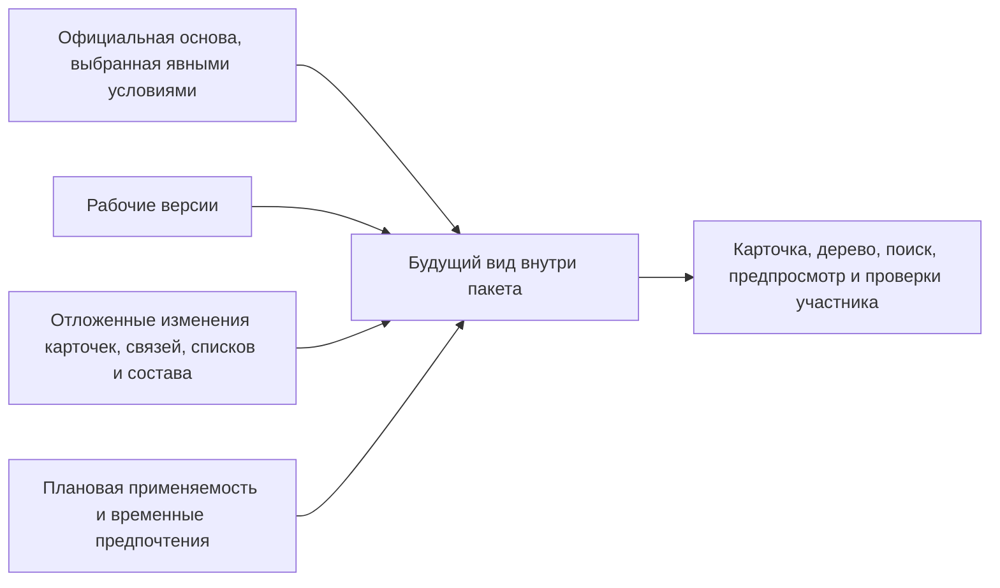

# Рабочие данные, видимость и параллельность

## Три состояния, которые нельзя смешивать

Один и тот же объект может участвовать в трёх разных представлениях:

1. **Живое официальное состояние** — проведённые версии и данные, которые система подбирает по явным условиям текущей задачи: назначенной основной версии, точному номеру, правилам выпуска, серии, дате и другим условиям. «Официальное» не означает «самое новое», а основная версия может вообще не быть назначена.
2. **Будущее состояние пакета** — официальная основа плюс рабочие версии и отложенные операции конкретного изменения.
3. **Опубликованный исторический состав** — неизменяемый базовый снимок или снимок заказа, который читается напрямую и вообще не пересчитывается.

Пользователь должен всегда видеть, в каком из трёх режимов он находится. Скрытое глобальное переключение контекста считается недостаточным: выбранный пакет, серия, дата и правило должны быть видны в рабочем месте и передаваться в каждое чтение.

Техническая проекция состава не является четвёртым деловым состоянием. Это заменяемое средство ускорения чтения; оно всегда имеет собственную отметку готовности и никогда не подтверждает выпуск или передачу заказа.

> **Состояние реализации.** Описанное ниже — целевые обязательные правила полного пакета. Законченные пользовательские экраны, резервирование объектов, точки возврата, временные предпочтения и управляемое вытеснение ещё не реализованы как единый сквозной путь.

## Как строится будущее состояние

Будущий вид пакета не является второй независимой копией базы. Это собранное системой представление того, что получится после проведения: официальная основа соединяется с полным набором рабочих изменений. Одни и те же правила построения будущего вида используются карточкой, деревом, поиском и предпросмотром.

## Рабочая версия

Зафиксированная версия никогда не становится изменяемой снова. **Версионное содержание** — это те данные объекта, изменение которых требует выпуска следующей версии, например геометрия корпуса, размеры и содержание чертежа. Для такой правки создаётся одна рабочая версия от актуальной вершины линейной истории, то есть от последней версии в единой последовательной цепочке без параллельных ответвлений.

Постоянная карточка объекта, самостоятельные связи, метки, применяемость, назначение основной версии и действия над уже выпущенными версиями остаются отдельными операциями пакета и сами по себе не требуют нового поколения. **Точная фиксация** — это прямое закрепление конкретной версии за конкретной позицией состава. Она принадлежит позиции в версии родительской сборки, поэтому для изменения такой фиксации создаётся рабочая версия родителя. Например, чтобы в составе редуктора заменить закреплённый двигатель версии 04 на версию 05, изменяют следующую версию состава редуктора, а не сам двигатель 04.

Если пользователь хочет восстановить содержимое старой версии насоса, система не создаёт ветвь истории от прошлого. Она создаёт рабочую версию от актуальной вершины и явно копирует в неё выбранное старое содержимое. В результате новый выпуск остаётся следующим состоянием объекта, а происхождение копирования видно в истории.

Новый объект до первого проведения существует только как предварительный объект и первая рабочая версия своего пакета. При отмене обе незавершённые части удаляются. Уже опубликованный объект так удалить нельзя.

## Видимость участникам и остальным

### Участник пакета

Прикладная, или принимающая, система, например Alvatune, открывает данные с точными условиями пакета. При прямом открытии собственной рабочей карточки участник видит рабочее версионное содержание и отдельные будущие операции так, как они будут выглядеть после проведения. Если пользователь открыл опубликованный базовый снимок или снимок заказа, система читает записанные в нём версии напрямую и ничего не подбирает заново. При подборе версии в будущем составе рабочая версия не имеет безусловного преимущества: точная фиксация конкретной позиции сильнее рабочей версии пакета. Например, если в пакете уже готовится двигатель версии 05, но позиция состава редуктора прямо закреплена за версией 04, предпросмотр не должен молча подменять 04 рабочей версией 05. Рабочая версия выбирается только там, где нет более сильного точного основания.

### Обычный пользователь

Продолжает читать официальное состояние. Он может получить отметку «объект находится в изменении», имя ответственного и ожидаемую дату, если это разрешено политикой, но не видит закрытые значения автоматически.

### Согласующий

Получает доступ к точному предпросмотру только при двух выполненных условиях: принимающая система разрешила это процессом, а предметные полномочия допускают чтение затронутых данных. Процессное задание не превращает весь пакет в общедоступный.

### Агент

Видит только тот контекст и те данные, которые предоставлены его запуску и разрешены предметной политикой. Агент другого процесса не получает рабочие версии лишь потому, что знает номер пакета.

Принимающая система устанавливает личность пользователя, определяет его роли, проверяет полномочия, срок, подпись и однократность разрешения. Interlink отдельно проверяет привязку разрешения к текущему контрольному отпечатку — вычисленной метке именно того содержания, которое было проверено и согласовано, — а также к модели, применимым настройкам и фактически использованным правилам. Затем Interlink проверяет предметные ограничения самих данных. Interlink не решает, имеет ли конкретный человек право выполнить действие; ни одна из двух групп проверок не заменяет другую.

## Почему один объект нельзя менять в двух пакетах

Резервирование, разрешённое вытеснение и точки возврата ниже описывают целевое поведение полного пакета. Полный исполняемый путь и пользовательские экраны для этих действий ещё не реализованы.

Два конструктора могут независимо открыть один редуктор для чтения, но не должны одновременно подготовить два несовместимых будущих состава без заранее заданных деловых правил безопасного объединения двух изменений.

При первой правке Interlink помечает затрагиваемый объект занятым для изменения данным пакетом — не только при создании рабочей версии, но и при изменении постоянного признака, связи или состояния версии. Такое резервирование действует до проведения или отмены.

Это даёт простое правило пользователю:

> Если объект уже участвует в открытом изменении, новую правку нужно включить в существующую работу, отложить либо завершить предыдущую работу явным управляемым способом.

Очередь независимых ветвей и автоматическое слияние сознательно не выбраны как базовая модель. Для состава, технологии и применяемости «последний записавший победил» неприемлем.

## Что происходит при конфликте занятости

Рабочее место показывает:

- какой пакет удерживает объект;
- его вид и основание;
- ответственного;
- какие действия доступны текущей роли;
- можно ли попросить включение в работу;
- допускается ли административное вытеснение.

Обычные варианты:

1. присоединить новую потребность к существующему пакету;
2. дождаться проведения или отмены;
3. разделить предметные области так, чтобы они не затрагивали один объект;
4. с обязательным основанием вытеснить весь пакет.

Частичное вытеснение одного объекта из многообъектного пакета не допускается: оставшийся набор мог бы потерять смысл.

## Вытеснение

Вытеснение — не техническое снятие замка. Оно означает полную отмену чужого незавершённого пакета с явным основанием, автором и уведомлением владельца со стороны принимающей системы.

Перед решением уполномоченный пользователь может посмотреть предпросмотр вытесняемой работы, если имеет право. После вытеснения удаляются её рабочие версии и операции, освобождаются все объекты, а официальные данные остаются прежними.

## Точки возврата

Точка возврата сохраняет весь рабочий набор пакета. Например, конструктор создаёт точку «Вариант с отечественным двигателем», затем пробует импортный двигатель и связанные изменения муфты. Возврат должен восстановить не только двигатель, но и состав, количества, применяемость и временные предпочтения.

Объекты, которые когда-либо были заняты пакетом после точки возврата, могут оставаться зарезервированными до завершения пакета. Это предотвращает конфликт одновременных изменений: другой пакет не сможет занять объект, который первый пакет может снова вернуть в своё рабочее состояние.

Пользователь должен видеть различие между:

- объектом, который реально входит в текущий будущий результат;
- объектом, который только продолжает удерживаться для безопасного восстановления.

## Временное предпочтение версии

Внутри пакета можно сказать: «для текущей проработки показывать двигатель версии 04». Это не создаёт рабочую версию двигателя и не меняет позиции состава навсегда.

Перед проведением каждое временное предпочтение обязательно удаляется. Если выбор должен стать постоянным, решение готовится отдельно: для конкретных позиций создаются точные фиксации либо оформляется применяемость или штатное правило. После проверки постоянного решения исходное временное предпочтение всё равно удаляется. При преобразовании в точные фиксации это означает создание фиксаций для нужных позиций и удаление исходного предпочтения, а не сохранение двух конкурирующих механизмов.

Автоматически закреплять временный выбор во всех местах нельзя: одно предпочтение по объекту может затронуть несколько позиций с разным смыслом.

Точная фиксация принадлежит конкретной позиции в конкретной версии родительского состава и хранится бессрочно вместе с этой исторической версией. При создании новой версии родителя фиксация может быть явно унаследована и продолжает действовать, пока её не изменят или не удалят отдельной правкой нового состава. Она не снимается автоматически по окончании задания или по календарной дате.

## Пример 1. Два изменения корпуса насоса

Конструктор начал снижение массы корпуса насоса НЦ-80. Позже служба качества требует срочно изменить материал того же корпуса из-за дефекта поставки. Второй пакет получает конфликт занятости.

Если материал влияет на расчёт толщины, две работы объединяются. Если срочность требует вытеснения, уполномоченный руководитель сначала оценивает незавершённый вариант, затем отменяет его целиком с основанием. Новый пакет начинается от актуальной вершины линейной истории, выбранной как основа редактирования, а не от скрытого фрагмента отменённой работы.

## Пример 2. Одновременная работа над сборкой и независимым документом

Пакет изменения редуктора занимает сборку и спецификацию. Другой специалист может независимо менять инструкцию по упаковке, если она является отдельным объектом и первый пакет её не затрагивает. Сам факт общей связи с редуктором не блокирует весь граф без необходимости.

Если первый пакет позднее пытается изменить эту инструкцию, он получает конфликт и должен согласовать границу работ.

## Пример 3. Возврат варианта электрошкафа

Проектировщик сохранил точку с преобразователем российского поставщика, затем заменил его импортным и добавил сетевой фильтр. После отказа заказчика он возвращается к точке. Импортный преобразователь и фильтр исчезают из будущего результата, но удержание затронутых объектов может сохраняться до закрытия пакета. В интерфейсе это объясняется отдельно, чтобы пользователь не считал невидимую правку потерянной ошибкой.

## Открытые продуктовые вопросы

- Достаточно ли правила «один изменяемый объект — один открытый пакет» для реальных процессов IPS, или некоторые настройки конкретного предприятия требуют более узкой области резервирования?
- Какие сведения о чужом пакете видят смежники без права на его содержание?
- Нужно ли пользователю видеть точки возврата как привычные итерации IPS?
- Кто и при каких условиях может вытеснить формальное извещение?
- Как долго допускается удерживать объект без активности и кто отвечает за разбор зависших работ?

## Состояние реализации

Исключительное резервирование изменяемого объекта за одним пакетом, собранный будущий вид всех правок, точки возврата, временные предпочтения и вытеснение описаны целевыми обязательными правилами полного пакета. Их полное исполняемое поведение и пользовательские экраны относятся к последующим этапам.

Связанные документы: [[жизненный цикл|Change-package-lifecycle]], [[фиксация и восстановление|Change-package-commit]], [[открытые вопросы|Change-package-status]].
