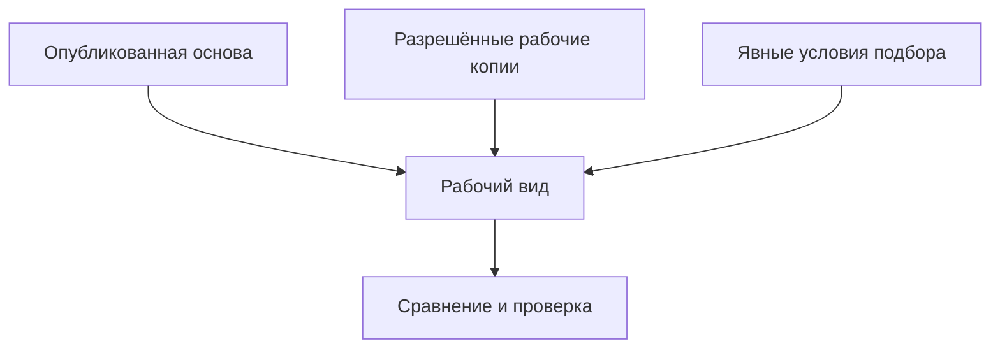
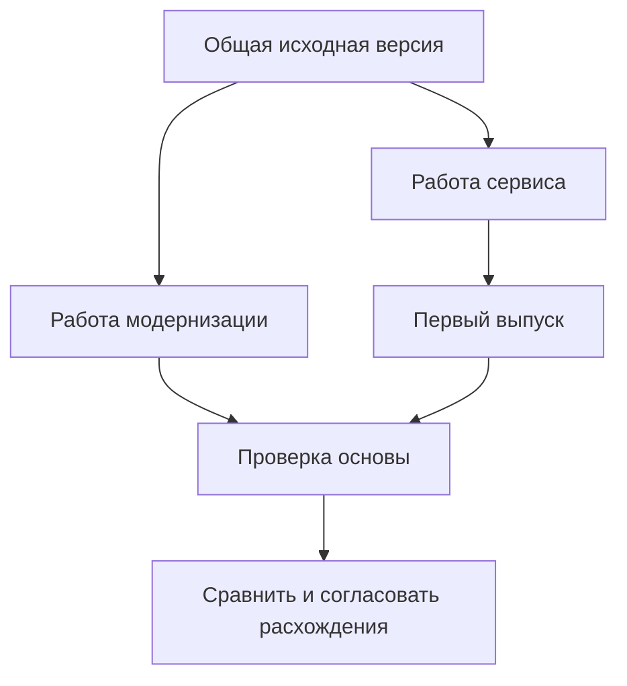

# Рабочие данные, видимость и параллельность

## Главное изменение: работа больше не заперта внутри одного пакета

Конструктор может несколько недель разрабатывать исполнение насоса, ежедневно сохранять работу, показывать промежуточные результаты технологу и выпускать готовые части в разные дни. Поэтому Interlink разделяет **рабочую область**, **контекст подбора** и **пакет изменения**. Эти понятия связаны, но отвечают на разные вопросы.

Рабочая область хранит незавершённые правки команды или задачи. Контекст подбора определяет, какие версии и какое их содержание использовать при совместном просмотре. Пакет выбирает только те правки, которые сейчас должны стать официальными вместе. Завершение одного пакета не обязано закрывать рабочую область, прекращать другие работы или уничтожать контекст технолога.

Это целевая модель, а не описание уже готовых экранов. Она сохраняет возможность привычного для IPS исключительного взятия версии на изменение, но не делает такое ограничение единственным способом работы всей системы.

## Четыре понятия вокруг одной детали

| Понятие | Пример и смысл |
|---|---|
| Объект | Корпус насоса НЦ-80 как один предмет разработки |
| Инженерная версия | Версия «Б», по которой предприятие различает инженерные решения |
| Опубликованное состояние | Точное содержание версии «Б» после конкретного завершения редактирования: размеры, состав и предусмотренные моделью ссылки |
| Рабочая копия | Ещё изменяемое содержание версии «Б» в рабочей области команды |

Обычное сохранение меняет рабочую копию. Завершение редактирования с публикацией создаёт новое неизменяемое состояние той же версии «Б». Новая версия «В» появляется только по отдельному инженерному решению. Поэтому можно исправить содержание «Б», сохранив возможность открыть прежнее состояние «Б», использованное в старом заказе.

В одной рабочей области допускается по одной активной рабочей копии каждой инженерной версии. При этом версии «Б» и «В» одного корпуса могут разрабатываться независимо. Другая команда может иметь свою копию «Б», если предприятие разрешило режим параллельной работы.

## Три режима просмотра

1. **Опубликованные данные.** Система выбирает инженерную версию и её содержание по явным условиям: основная версия, серия, дата, готовность и другие предметные правила. Опубликованное не обязательно означает самое новое или пригодное для любого заказа.
2. **Рабочий вид.** К выбранной основе добавляются разрешённые рабочие копии и подготовленные изменения. Пользователь видит, что ещё не опубликовано и к какой работе относится.
3. **Точный исторический комплект.** Читается сохранённое содержание снимка, без нового подбора по сегодняшним правилам. Доступность нужных файлов и срок их хранения зависят от объявленного назначения комплекта и политики сохранности.

Схема показывает только рабочий просмотр. Исторический снимок не строится заново из этих входов: он уже содержит зафиксированный результат. Карточка, дерево и проверка должны использовать одинаковые явные условия, а не скрытый переключатель, меняющий смысл соседнего окна.

## Что именно задаёт контекст подбора

Для выбранного корпуса недостаточно сказать «версия Б». Можно запросить её опубликованное содержание, конкретное историческое состояние либо определённую рабочую копию. У каждой привязки сохраняется происхождение: назначил конструктор вручную, назначение возникло при взятии на изменение или пришло из строки извещения.

Из этого следуют два важных правила. Во-первых, контекст может содержать версии, которые никто сейчас не редактирует. Во-вторых, две команды, выбравшие одну и ту же версию «Б», не обязательно согласовали одинаковое содержание. Если у одной указано состояние до испытания, а у другой — рабочая копия после перерасчёта, совместный просмотр должен показать конфликт, а не объявлять назначения одинаковыми.

Связь нескольких контекстов нужна для совместного чтения. Она не означает обязательный одновременный выпуск всех работ. После публикации судьба ссылок на рабочую копию определяется явно: например, они переводятся на полученное опубликованное состояние. Нельзя просто удалить копию и незаметно заменить её сегодняшней основной версией.

## Кто что видит

**Участник работы** получает рабочий вид только в разрешённой области. Знание номера пакета или рабочей области не даёт доступа к закрытым чертежам. Если он непосредственно открыл свою рабочую карточку, он видит её содержание; если собирает состав, продолжают действовать правила конкретизации каждой позиции.

**Обычный пользователь** читает опубликованные данные. При наличии права он может видеть сведения о ведущемся изменении и ответственном, но не обязательно незавершённые размеры или закрытый текст причины.

**Согласующий** получает доступ к заявленному предмету решения. Одобрение правок корпуса и одобрение точного состава всей насосной станции — разные решения. Второе должно сохранять также выбранные состояния зависимых компонентов и необходимые основания проверки.

**Агент** действует с собственной установленной идентичностью и ограничениями запуска. Его контекст не превращает все найденные сведения в доступные. Для воспроизведения решения сохраняются разрешённые точные входы, а не только ссылка на живую рабочую копию, которая завтра изменится.

Принимающий продукт отвечает за пользователей, полномочия и процесс. Interlink обеспечивает проверяемую связь разрешения с конкретным действием и действующие предметные ограничения. Ни прежнее согласование, ни сохранённый снимок не отменяют сегодняшнего запрета доступа или использования.

## Как параллельная работа остаётся безопасной

### Исключительное взятие версии

Предприятие может разрешать изменение выбранной инженерной версии только одной работе. Другой пользователь получает объяснение занятости в пределах своих прав. Это удобно для регламентированных процессов IPS и для данных, которые трудно согласовывать параллельно.

Ограничение относится к выбранной версии и правилам предприятия. Оно не означает, что любой комментарий, независимая версия или вся связанная с объектом документация автоматически блокируются на месяц.

### Независимые рабочие копии

В параллельном режиме две команды могут начать от одного опубликованного состояния версии «Б». Каждая сохраняет собственные правки. Первая согласованная публикация проходит; вторая обнаруживает, что её основа уже изменилась, и получает конфликт без потери своей рабочей копии.

Система не выбирает победителем последнее сохранение. Второй инженер сравнивает исходное содержание, свои изменения и результат коллеги. Он может осознанно перенести правки, подготовить совместное решение либо начать другую инженерную версию. Автоматическое объединение допустимо только там, где для него отдельно определены безопасные предметные правила; универсального обещания слияния любых составов нет.

Даже исключительное взятие не отменяет проверку основы при публикации: административное действие, импорт или другой разрешённый процесс мог изменить значимые данные.

## Отзыв доступа и прекращение работы

Отзыв права редактировать прекращает новые записи, но сам по себе не стирает уже сделанную работу. Принудительная передача права другому исполнителю должна отсечь прежнего редактора и оставить понятную историю основания.

Отмена пакета, удаление отдельной рабочей копии и закрытие всей рабочей области — разные действия. Пакет выбирает результат публикации, а не владеет безусловно всеми черновиками команды. Перед отменой пользователь видит, что именно прекращается и какие контексты, итерации или другие работы зависят от этих данных.

Удалить только что созданный неопубликованный объект простым действием можно лишь в узком случае: у него одна начальная работа и нет других зависимых версий, рабочих областей или сохраняемых свидетельств. Если такие зависимости уже появились, простая отмена отказывает. Отсутствие опубликованного состояния не разрешает уничтожить чужую работу или сохранённую итерацию.

## Итерации и восстановление

Именованная итерация сохраняет точное содержание выбранной рабочей области или комплекта. Это долговечная точка для сравнения и воспроизведения, а не только кнопка отмены последней правки. Обычный перезапуск приложения не должен её терять.

Восстановление сначала показывает источник и адресатов: что из прежней итерации переносится в какую сегодняшнюю рабочую копию. Пользователь может восстановить только выбранный участок. Новая работа, сделанная после подготовки плана, не затирается: возникает конфликт и требуется новое решение.

Восстановить рабочую копию не означает опубликовать её. После переноса можно продолжать редактирование. Публикация, если нужна, выполняется отдельным разрешённым шагом. Уже опубликованные промежуточные состояния и прежние подписи остаются в истории.

## Конкретизация не равна рабочей видимости

Позиция состава может жёстко закреплять инженерную версию компонента либо точно закреплять одно её неизменяемое состояние. Эти ограничения сильнее обычного предложения рабочего контекста: подготовка двигателя версии «В» не заменяет молча закреплённую «Б».

Отдельно существуют временное предпочтение для проработки и **мягкая конкретизация позиции** — сохраняемое предметное предпочтение с собственными условиями действия. Нельзя требовать удалить мягкую конкретизацию только потому, что закончился пакет. И нельзя автоматически превратить временный выбор двигателя для всей проработки в постоянные решения каждой позиции. Подробнее — [[мягкая конкретизация|Selection-soft-concretion]].

## Пример 1. Исправление дефекта и снижение массы корпуса

Сервисная команда исправляет отверстие корпуса НЦ-80 версии «Б». Команда будущей серии одновременно снижает массу. Если будущая серия уже оформлена отдельной версией «В», работы не блокируют друг друга лишь из-за общего корпуса.

Если обе команды меняют «Б», предприятие выбирает исключительный или параллельный режим. Во втором случае сервис публикует первым. Модернизация получает конфликт, но её расчёт и модель сохраняются. При сравнении видно, что облегчение стенки пересекается с исправленным отверстием; требуется инженерное согласование, а не автоматическое принятие последнего файла.

## Пример 2. Конструкторы закончили, технологи продолжают

Конструкторы завершили раму насосной станции, а технологи ещё проверяют сварочный маршрут. Их контексты объединены для совместного просмотра. Конструктор выпускает только готовые состояния рамы и чертежа; технологические рабочие копии остаются открытыми.

Контекст технолога явно переводится на выпущенную раму или сохраняет выбранное точное основание по правилам процесса. Он не перескакивает на другую версию станции. Общий выпуск рамы и оснастки потребуется лишь тогда, когда конкретное изменение действительно нельзя вводить по частям.

## Пример 3. Возврат варианта электрошкафа

Проектировщик сохранил итерацию с отечественным преобразователем, затем испытал импортный и добавил фильтр. Заказчик отверг импортный вариант. Инженер выбирает восстановление силовой части: преобразователь, фильтр, кабели и настройки защиты, но не более позднее исправление маркировки дверцы.

Система показывает этот поднабор до применения. После подтверждения изменяется рабочая копия, а не опубликованный электрошкаф. Предыдущие итерации остаются доступны. Перед будущим выпуском проверяется совместимость всего получившегося сочетания и действующие ограничения на оборудование.

## Что проверить с продуктовым специалистом

- Какие категории данных требуют исключительного взятия, а где пользователям полезны независимые рабочие копии?
- Какие сведения о занятой версии можно раскрывать смежнику без доступа к её содержанию?
- Какой объём итерации нужен для повторения расчёта и какие файлы должны сохраняться вместе с ней?
- Как предприятие ожидает переводить контекст на опубликованное состояние после завершения выбранной части работы?

## Состояние реализации и приёмка

Описаны принятые целевые границы. Полный путь работы с областями, параллельными копиями, итерациями, конкретизацией и пользовательскими экранами ещё должен быть реализован и испытан.

Приёмка должна показать сохранность обеих работ при конфликте, выпуск только выбранного поднабора, точное историческое чтение, отказ от скрытой подмены версии и безопасную отмену при зависимостях. Одной демонстрации кнопки «Сохранить» для этого недостаточно.

Связанные документы: [[рабочие области|Workspaces-and-parallel-work]], [[контексты подбора|Selection-contexts]], [[итерации|Selection-iterations]], [[проведение и восстановление|Change-package-commit]], [[агенты и прослеживаемость|Agents-and-traceability]].
