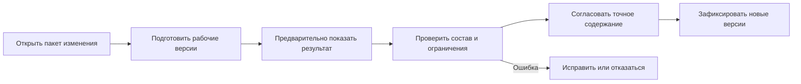

# Изменения и доказуемая история

## Проблема, которую решает контур изменений

Инженер должен изменять изделие, не переписывая выпущенное состояние. Несколько деталей, сборка, документы и состав часто меняются как единый согласованный комплект. При этом другим пользователям нельзя преждевременно показать незавершённый результат.

## Пакет изменения

Interlink объединяет рабочие версии и ожидающие операции в пакет изменения. Он отвечает на вопросы:

- что именно меняется;
- от какого состояния началась работа;
- кто участвует;
- какие проверки должны пройти;
- какой точный результат согласован;
- что будет зафиксировано одновременно.

## Рабочая версия не равна официальной версии

Промежуточное сохранение помогает восстановить работу, но не обязано становиться новой инженерной версией. Официальная версия появляется после проведения согласованного пакета.

Это уменьшает шум в истории и сохраняет ясное различие между «пробовали» и «выпустили».

## Один объект — одно активное изменение по умолчанию

Неограниченное параллельное редактирование инженерного объекта создаёт вопрос слияния, на который часто нет безопасного автоматического ответа. Поэтому базовое направление Interlink ограничивает одновременное владение изменением.

Срочное изменение должно иметь явную процедуру вытеснения, связи или завершения предыдущей работы. Если реальная практика IPS требует более сложной модели, она должна быть подтверждена примером.

## Жизненный цикл и процесс — не одно и то же

Степень готовности версии описывает инженерное состояние: рабочая, проверенная, выпущенная, аннулированная. Маршрут согласования описывает действия людей и заданий.

Alvatune или другой принимающий продукт управляет процессом, но не изменяет предметные данные напрямую. Он разрешает выполнение команд Interlink и связывает процесс с точным пакетом изменения.

## Предварительный просмотр

До фиксации пользователь должен видеть:

- какие версии будут созданы;
- как изменится состав;
- какие позиции потеряли подходящую версию;
- какие правила и применяемость участвовали;
- какие документы и заказы затронуты;
- какие предупреждения требуют решения.

Согласование относится к точному содержанию. Если после согласования содержание изменилось, продуктовый процесс определяет, какие решения нужно получить повторно.

## Неизменяемые снимки

Версии отдельных объектов не всегда достаточны для доказательства полного результата. Большая структура могла быть сформирована динамически. Поэтому значимая публикация создаёт снимок — точный набор выбранных версий и данных позиций.

Снимок нужен для:

- выпуска комплекта;
- производственного заказа;
- передачи во внешнюю систему;
- архивного доказательства;
- воспроизводимого расчёта;
- контекста важного решения агента.

## Что значит доказуемая история

Через годы должно быть возможно установить:

- какое исходное состояние использовалось;
- кто и на каком основании изменил данные;
- какое содержание согласовали;
- какие правила и условия действовали;
- какие файлы относились к версии;
- какой точный состав был опубликован;
- не изменилось ли защищённое содержание после подписи.

История не означает бесконечное хранение всего. Сроки хранения, юридическая блокировка и право удаления задаются профилем предприятия.

Связанные вопросы: [[Объекты, версии и изменения|Questions-versions-and-changes]] и [[Документы и инженерные службы|Questions-documents]].
