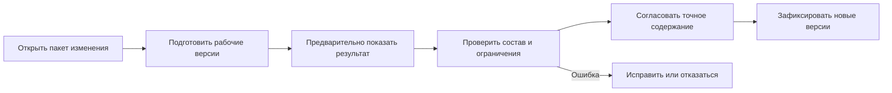

# Изменения и доказуемая история

## Проблема, которую решает контур изменений

Инженер должен изменять изделие, не переписывая выпущенное состояние. Несколько деталей, сборка, документы и состав часто меняются как единый согласованный комплект. При этом другим пользователям нельзя преждевременно показать незавершённый результат.

## Пакет изменения

Interlink объединяет рабочие версии и ожидающие операции в пакет изменения. Он отвечает на вопросы:

- что именно меняется;
- от какого состояния началась работа;
- кто участвует;
- какие проверки должны пройти;
- какой точный результат согласован;
- что будет зафиксировано одновременно.

Полный эксплуатационный путь — от создания карточки изменения и взятия объектов в работу до согласования точного содержания, проведения, отмены и восстановления — собран в [[путеводителе по пакету изменения|Change-package-guide]].

## Рабочая версия не равна официальной версии

Промежуточное сохранение помогает восстановить работу, но не обязано становиться новой инженерной версией. Рабочая версия хранит только изменяемое между поколениями содержание; связи, применяемость и точные фиксации остаются отдельными операциями пакета. Официальная версия появляется после проведения согласованного пакета, но не становится основной автоматически: такое назначение является отдельной явной операцией по политике предприятия.

Это уменьшает шум в истории и сохраняет ясное различие между «пробовали» и «выпустили».

## Один объект — одно активное изменение по умолчанию

Неограниченное параллельное редактирование инженерного объекта создаёт вопрос слияния, на который часто нет безопасного автоматического ответа. Поэтому базовое направление Interlink ограничивает одновременное владение изменением.

Срочное изменение должно иметь явную процедуру вытеснения, связи или завершения предыдущей работы. Если реальная практика IPS требует более сложной модели, она должна быть подтверждена примером.

## Жизненный цикл и процесс — не одно и то же

Степень готовности версии описывает инженерное состояние: рабочая, проверенная, выпущенная, аннулированная. Маршрут согласования описывает действия людей и заданий.

Принимающий продукт аутентифицирует пользователя, ведёт роли, задания и маршрут и выдаёт устойчивое разрешение на точное содержание. Interlink отдельно проверяет привязку этого разрешения, заявленные предметные полномочия и инварианты данных. Закрытое задание процесса само по себе не даёт права изменить любой объект.

## Предварительный просмотр и нормативная проверка

До фиксации пользователь сначала видит информативный предпросмотр:

- какие версии будут созданы;
- как изменится состав;
- какие позиции потеряли подходящую версию;
- какие правила и применяемость участвовали;
- какие документы и заказы затронуты;
- какие предупреждения требуют решения.

Предпросмотр может устареть и не является доказательством готовности. Перед согласованием Interlink заново строит совокупное конечное состояние, применяет обязательные правила и вычисляет контрольный отпечаток предметного ядра. Согласование относится именно к этому проверенному содержанию. Если оно изменилось, продуктовый процесс определяет, какие решения нужно получить повторно.

## Неизменяемые снимки

Версии отдельных объектов не всегда достаточны для доказательства полного результата. Большая структура могла быть сформирована динамически. Поэтому значимая публикация создаёт снимок — неизменяемое дерево всех включённых позиций и точных версий для одного точного контекста выпуска или передачи.

Снимок нужен для:

- выпуска комплекта;
- производственного заказа;
- передачи во внешнюю систему;
- архивного доказательства;
- воспроизводимого расчёта;

Базовые и заказные снимки хранятся в Interlink и не удаляются обычной операцией. При открытии готового снимка система читает сохранённые позиции напрямую: точные фиксации, применяемость и живые правила повторно не запускаются. Право действует на артефакт целиком — снимок не строится из дерева, обрезанного построчной фильтрацией.

Ядро снимка содержит обязательный контрольный отпечаток. Файлы, подписи и юридические подтверждения образуют отдельную расширяемую оболочку принимающего продукта; они не меняют предметное ядро Interlink.
- контекста важного решения агента.

## Что значит доказуемая история

Через годы должно быть возможно установить:

- какое исходное состояние использовалось;
- кто и на каком основании изменил данные;
- какое содержание согласовали;
- какие правила и условия действовали;
- какие файлы относились к версии;
- какой точный состав был опубликован;
- не изменилось ли защищённое содержание после подписи.

Interlink сохраняет официальные версии, базовые и заказные снимки, а также архивные модель, правила, настройки и средства их чтения. Профиль предприятия определяет сроки хранения внешних файлов, подписей, отчётов и иных материалов доказательной оболочки, но не превращает неизменяемое ядро снимка в обычный удаляемый документ.

## Что именно увидит пользователь

Целевое рабочее место разделяет пять областей:

1. цель, основание, ответственные и процесс;
2. затронутые объекты и их рабочие версии;
3. будущий состав и сравнение «до/после»;
4. ошибки, предупреждения, решения и точный отпечаток;
5. проведённый результат, снимки и внешние передачи.

Участник изменения видит рабочее будущее, остальные — последнее официальное состояние. Любая правка после согласования лишает прежнее разрешение силы. При проведении применяется весь пакет либо официальные данные не меняются.

## Состояние реализации

Полный пакет изменения пока не является работающей функцией. Определены его нормативные инварианты и граница с принимающим приложением; существуют отдельные контрактные носители будущего согласования. Рабочие версии пакета, предпросмотр, проведение, комплекты и экраны относятся к последующим этапам. Подробное описание является целевой спецификацией и основой приёмки.

Связанные вопросы: [[Объекты, версии и изменения|Questions-versions-and-changes]] и [[Документы и инженерные службы|Questions-documents]].
