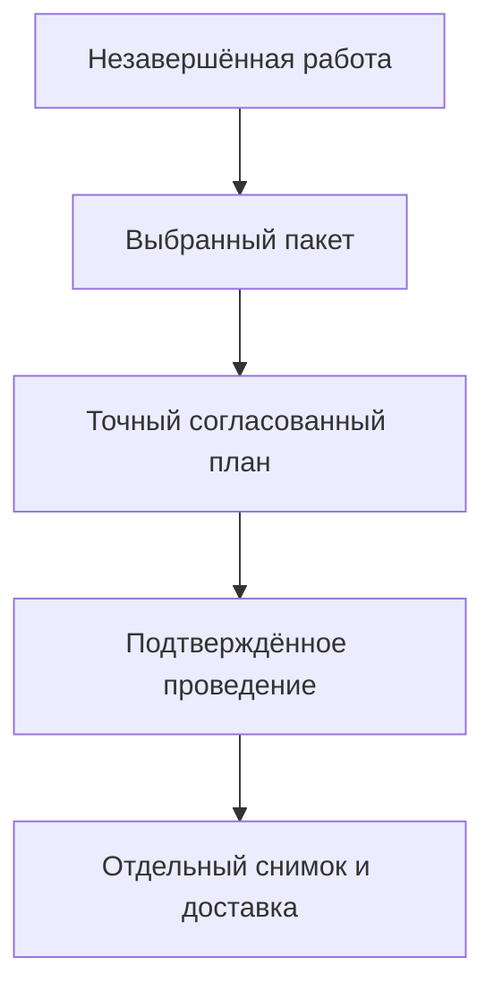

# Изменения и доказуемая история

## Какой результат нужен предприятию

Изделие должно развиваться, но выпущенное и переданное содержание не должно переписываться вслед за текущей работой. Через несколько лет нужно понять, какой корпус был согласован, какой файл видел технолог, какие нормы использовал расчёт и что в действительности получил цех.

Поэтому Interlink планируется не просто как хранилище последних карточек. Целевой фундамент разделяет незавершённую работу, пользовательскую инженерную версию, её точное опубликованное содержание, решение о проведении и факты дальнейшей передачи или исполнения.

Это архитектурный план, а не утверждение о готовом архиве или интерфейсе. Полный эксплуатационный путь описан в [[путеводителе по пакету изменения|Change-package-guide]].

## Работа не обязана целиком совпадать с выпуском

Рабочая область хранит незавершённые правки команды. Контекст подбора задаёт версии и содержание для совместного просмотра. Пакет изменения выбирает то, что необходимо провести одновременно. Рабочая область и контекст могут продолжать существовать после проведения отдельного пакета.

Такое разделение позволяет одновременно исправлять действующее изделие и разрабатывать его будущее исполнение. Предприятие может потребовать исключительного взятия версии на изменение либо разрешить независимую подготовку. Во втором случае конкурирующая публикация обнаруживает изменившееся основание и не перезаписывает чужой результат. Проигравшая рабочая копия сохраняется.

Схема показывает разные границы. Сохранённая работа ещё не согласована; согласование ещё не проведение; проведённый результат ещё не получен внешней системой. Каждая стадия должна иметь собственное подтверждение, а не выводиться из одного общего статуса «готово».

## Одна инженерная версия — несколько точных состояний

«Чертёж корпуса, версия Б» — устойчивое пользовательское обозначение. Его рабочая копия меняется при сохранении. Разрешённое завершение редактирования может опубликовать новое неизменяемое состояние той же Б. Новая версия В создаётся отдельным предметным действием.

При новом проведении старое опубликованное состояние не удаляется и не исправляется новым содержимым. Поэтому прежняя подпись остаётся доказательством прежнего чертежа, но не становится подписью последующего исправления. Жёстко закрепить версию Б и закрепить точное содержание Б — не одно и то же: только второй выбор сам по себе исключает переход на новое опубликованное состояние этой версии.

Промежуточная итерация также не равна выпуску. Она сохраняет точный рабочий результат, чтобы к нему можно было вернуться. Возврат в рабочую копию не создаёт официального состояния автоматически; последующее проведение требует обычных проверок. См. [[итерации и восстановление|Selection-iterations]].

## Что именно должно быть согласовано

Согласующий может рассматривать только набор изменений или полный точный результат с существенными зависимостями. Например, разрешение исправить посадочный диаметр корпуса не доказывает, что вся насосная станция с конкретным двигателем и прошивкой проверена.

Для согласования конфигурации нужны точные состояния участников и необходимые основания: файлы, правила, нормы, выбранные замены, существенные значения справочников. Простая ссылка «двигатель версии Б» недостаточна, если содержание Б может получить новое опубликованное состояние.

Подготовка сохраняет точный предмет решения. Если после неё изменена включённая рабочая копия, нужен новый план. Но появление в библиотеке новой, не использованной в этом решении нормы не переписывает историческое согласование. Отдельно определяется, обязан ли новый выпуск оставаться актуальным относительно перечисленных живых зависимостей.

Например, для повторной поставки можно потребовать именно прежнюю согласованную комплектацию. Для новой серии — дополнительно проверить, что основная версия двигателя и действующий диапазон применяемости не изменились. В обоих случаях сегодняшний запрет использования и отзыв полномочий проверяются заново.

## Неизменяемый состав и доказательный комплект

Снимок состава сохраняет полный выбранный результат в объявленной области: позиции, точное содержание включённых версионных объектов и необходимые объяснения выбора. Он не превращает всякую связь в обход всего предприятия. Передача отдельного узла сначала должна получить собственную явно определённую область выпуска.

При чтении готового снимка версии не подбираются заново. Новый основной двигатель не попадёт в старый заказ. Отсутствие необходимой позиции, повреждение или недоступность обязательного содержания нельзя скрыть незаметным сокращением состава.

Самого перечня точных состояний не всегда достаточно. Если доказательство опирается на чертёж, расчёт или таблицу норм, нужно сохранить точные ресурсы, их происхождение и условия чтения. Адрес файла не гарантирует, что через год по нему будут те же байты. Контрольное значение помогает проверить неизменность, но не восстанавливает потерянный файл.

Сроки хранения задаются назначением и обязательными удержаниями. Подтверждённый производственный комплект нельзя удалить обычным закрытием рабочей области. При этом нет общего требования вечно хранить каждый временный просмотр или диагностический лог. Если обязательный материал утрачен, система должна честно обозначить ограничение воспроизводимости.

## Действие, разрешение и физический факт

Разрешённая замена описывает, что допустимо. Выбор замены показывает, какое решение принято для конкретного заказа. Проведённый план меняет соответствующие инженерные или плановые данные. Установка на реальном экземпляре — следующий отдельный факт.

Аналогично согласование чертежа не означает выдачу в цех, отправка не означает предметный приём, а приём задания не означает изготовление. История связывает эти факты, но не подменяет один другим. Это особенно важно для обслуживания цифровых двойников и для агентов: намерение автоматического исполнителя нельзя выдать за успешно совершённое действие.

## Пример 1. Подпись чертежа после исправления

Нормоконтролёр подписал точное состояние версии Б корпуса. На следующий день конструктор получил разрешение исправить монтажное примечание и выпустил новое состояние той же Б.

При открытии прежней подписи пользователь видит прежнее примечание и прежний файл. При обычном чтении актуального содержания Б — исправленный вариант. В истории видно, кто провёл исправление и почему новая редакция не покрывается старой подписью. Если новое содержание требует повторной подписи, рабочее место показывает это требование.

## Пример 2. Модернизация с возвращением к итерации

Команда сохранила итерацию «Перед заменой уплотнения» для корпуса, крышки и спецификации гидроцилиндра. Затем изменила материал уплотнения и монтажные размеры. Испытание показало, что прежнее примечание следует вернуть, а размеры сохранить.

Инженер выбирает точную итерацию и только нужное содержание для восстановления. Система показывает затрагиваемые рабочие копии, проверяет текущие основания и права. Восстановление возвращает выбранное содержание в работу, а не отменяет промежуточную историю. После проверки новый пакет может опубликовать следующий результат. Остальные объекты не откатываются «за компанию».

## Пример 3. Агент готовит замену привода

Агент предложил моноблочный привод вместо двигателя и муфты. Для объяснения решения сохраняются увиденные им состояния объектов, нужные файлы и нормы, сведения о разрешённой замене и итоговой совместимости. Если допуск принадлежал определённой исходной версии двигателя, фиксируется именно это основание.

Инженер одобряет конкретный подготовленный результат. Вместе с проведением фиксируется обязательное намерение передачи в производственную систему; после подтверждения отправляется соответствующее сообщение. Если ответ потерялся, система сверяет исход прежней операции, а не поручает агенту выполнить её заново как новую. Успешная передача ещё не записывает монтаж: мастер позже подтверждает установку на конкретной насосной станции.

## Как история защищается при сбое

Предметный результат и обязательное свидетельство о нём должны сохраняться совместно. Нельзя считать проведение успешным, если его обязательная история не записана. Когда передача входит в обязательства операции, её устойчивое намерение также сохраняется в той же фиксации. Сам внешний вызов происходит отдельным шагом после подтверждённого успеха.

При потерянном ответе возможен неопределённый исход: данные уже зафиксированы, но пользователь этого ещё не знает. Допустимый путь — найти подтверждение той же операции и её прежнего намерения. Новый номер операции не используется для обхода неопределённости. После доказанного успеха продолжается доставка; после доказанного отказа можно подготовить допустимую новую попытку.

Подробные варианты — в [[проведении и восстановлении|Change-package-commit]] и [[истории, снимках и доказательствах|Change-package-snapshots]].

## Состояние реализации и вопросы приёмки

Описаны принятые требования архитектуры по состоянию на 6 сентября 2026 года. Полный пользовательский цикл, файловый архив, подписи, интеграции, восстановление и агентские доказательства ещё требуют реализации и совместных испытаний.

Для приёмки нужно уметь открыть старый согласованный результат после нескольких новых публикаций; воспроизвести значимое решение по сохранённым входам; отличить историческую истинность от сегодняшнего допуска; пережить потерю ответа без повторного эффекта. Наличие журналов или контрольных значений само по себе этого не доказывает.

Связанные страницы: [[рабочие области|Workspaces-and-parallel-work]], [[предпросмотр и согласование|Change-package-preview]], [[агенты и прослеживаемость|Agents-and-traceability]], [[заказы и производство|Orders-guide]], [[вопросы об объектах и изменениях|Questions-versions-and-changes]], [[вопросы о документах|Questions-documents]].
