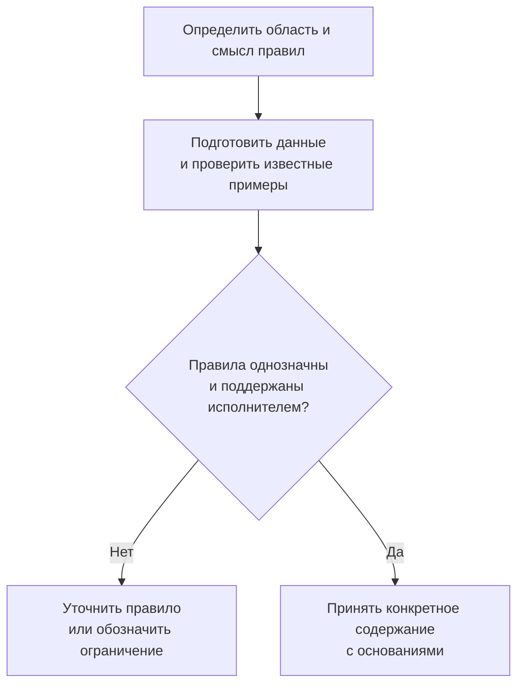
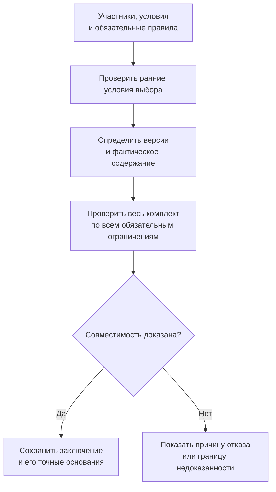

# Матрицы совместимости: проверка целого сочетания

## Какой вопрос решает совместимость

Два изделия могут не заменять друг друга, но должны работать вместе: двигатель и преобразователь, плата и прошивка, материал и покрытие. Для такого вопроса недостаточно списка аналогов. Нужно проверить сочетание участников в конкретных условиях.

В Interlink совместимость планируется как явный набор предметных ограничений с известными основаниями и областью проверки. Матрица — один из удобных способов показать и редактировать эти ограничения. Она не является отдельной волшебной таблицей, которая автоматически разрешает любое найденное сочетание.

**Статус: принятый целевой договор и план реализации.** Проверка простых отношений, обязательные сценарии IPS и дальнейший сложный поиск решений имеют разные этапы. Наличие схемы хранения или текста правила ещё не доказывает, что его исполнитель уже готов.

## Что может означать клетка

| Смысл данных | Пример | Какой вывод допустим |
|---|---|---|
| Перечень разрешённых сочетаний | Привод, напряжение и способ охлаждения | Сочетание разрешено указанным правилом в его области |
| Перечень запретов | Плата, прошивка и режим работы | Найденный набор нарушает конкретный запрет |
| Подтверждение испытанием | Материал, среда, температура и протокол | Есть основание с определёнными условиями и методом |
| Перечень кандидатов | Материал основания и накладки → марки клея | Найдены варианты для дальнейшего выбора |
| Логическое условие | При опции требуется ровно один из двух узлов | Проверяются состав и количество выбранных участников |

Предприятию может быть достаточно разрешить сочетание признаков до создания конкретной карточки изделия. Например, допустимые «напряжение, охлаждение, исполнение» существуют раньше оформленных вариантов станка. Не нужно создавать фиктивный объект на каждое сочетание ради самой проверки.

Если табличный редактор показывает сложное правило, он должен сохранять его смысл. Нельзя потерять часть условия при переходе из текстового представления в матрицу или считать скрытый столбец исключённым из проверки. Перестановка строк не меняет приоритетов; если порядок важен для переноса исходного правила, он должен быть явно сохранён.

## Пустота, отсутствие запрета и разрешение различаются

Обычная [[карта сопоставлений|Coordinate-maps]] не считает пустую клетку ни разрешением, ни запретом. Более сильный вывод возможен только тогда, когда объявлен полный перечень для известной области и проверено всё его авторитетное содержание.

В полном перечне разрешений отсутствие означает: данное сочетание не разрешено этим перечнем. В полном перечне запретов отсутствие означает лишь: **это ограничение не запрещает сочетание**. Оно ещё не доказывает выполнения остальных требований изделия, квалификации или права на производство.

Список только известных запретов не обязательно является полным. Нельзя заключить «остальное можно» по неполной странице, устаревшей копии, скрытым данным или прерванной проверке. Полная сетка хранения также не гарантирует полноту знаний: клетка может содержать честное «не исследовано».

## Проверять нужно больше, чем пары

Преобразователь может подходить к двигателю, а система охлаждения — к преобразователю. Из двух положительных пар ещё не следует, что вся тройка допускается в выбранном режиме. Например, у сочетания может оказаться недостаточный общий тепловой ресурс.

Поэтому ограничения могут связывать три и более роли, учитывать количества и суммарные ресурсы. Их нельзя без потерь разложить на независимые таблицы «да / нет» для пар. Роли сохраняют смысл: материал основания и материал накладки не становятся взаимозаменяемыми только потому, что обе оси содержат материалы.

Все применимые обязательные ограничения проверяются совместно. Локальный каталог разрешённых деталей не отменяет общий запрет применения в определённой среде. Это обычная несовместимость выбранного комплекта с обязательным требованием, а не повод случайно выбрать «более локальное» правило.

Если процесс допускает исключения, для них нужны отдельные основание, область, срок и полномочия. Требование, которое по установленному процессу не может быть отменено исключением, остаётся обязательным.

## Что означает допустимость частичного выбора

На раннем этапе инженер мог выбрать привод, но ещё не выбрать охлаждение и шкаф. Система может показать возможные значения следующего признака из определённой таблицы. Такой список полезен, однако он ещё не доказывает, что хотя бы один полный комплект удовлетворит всем требованиям изделия.

Есть существенная разница между тремя результатами:

1. «В этой таблице есть такие продолжения» — выполнен локальный отбор.
2. «Для вашего частичного выбора доказано хотя бы одно полное допустимое продолжение» — проверены все обязательные ограничения объявленной области.
3. «Пока не найдено препятствий, но полного продолжения не доказано» — положительного заключения ещё нет.

Будущий исполнитель может уметь проверить уже полный комплект, но не уметь искать все способы его достроить. Это допустимая граница возможностей, если она честно указана. Отсутствие такой функции не означает, что частичный выбор технически невозможен.

## Как будет организована проверка

Ответственный за правила задаёт область: какие роли, признаки, данные и назначения охватываются. Он вводит разрешения, запреты, квалификации или условия и указывает их происхождение. Рабочие правила могут быть незавершёнными; потребителям не следует незаметно выдавать их вместо принятого содержания.

Согласование относится к определённой редакции правил и их составу. Перенос нескольких исходных таблиц должен сохранять смысл их совместного действия, а не только каждую клетку по отдельности. Если данные изменились после проверки, для нового содержания нужны новые основания принятия.

Прикладной пользователь задаёт изделие, заказ или операцию, условия применения и выбранных участников. Система определяет обязательный набор ограничений, не ограничиваясь теми таблицами, которые пользователь открыл на экране.

Ранняя проверка помогает отсеять заведомо неверное напряжение. Но окончательное заключение может зависеть от конкретного содержания платы, прошивки, геометрии, файла испытаний или квалификации. Поэтому положительный подбор версий сам по себе не является подтверждением совместимости.

Неудачная финальная проверка не разрешает системе скрыто сменить версию, снять фиксацию или удалить проблемную позицию. Автоматизированный поиск может подготовить новое явное предложение с собственными основаниями. Применение предложения — отдельное действие по правилам [[изменений|Changes-and-evidence]] и [[допустимых замен|Allowed-replacements]].

## Что должен увидеть пользователь

| Результат | Понятное объяснение |
|---|---|
| Полный комплект допустим | Все обязательные условия проверенной области выполнены для указанных данных |
| Частичный выбор имеет допустимое продолжение | Существует доказанный полный вариант в указанной области |
| Несовместимо | Нарушено конкретное ограничение либо доказано отсутствие допустимого продолжения |
| Недостаточно сведений или доказательства | Нельзя сделать ни положительный, ни отрицательный вывод; названа причина |
| Проверка не поддерживается | Исполнитель не умеет применять обязательную форму правила или нужную операцию |
| Конфликт оснований | Предъявлены несовместимые исходные основания без принятого правила их выбора |

Недостаток времени на поддержанную проверку не равен технической несовместимости. Неподдержанное правило не считается выполненным. Ошибки доступа, отмена и сбой исполнения остаются отдельными ситуациями и не маскируются под инженерное «не исследовано».

Положительное заключение должно объяснять, какие участники и их содержания проверены, какие правила применены, какова область и какие ограничения остались за её пределами. Проверка интерфейса соединения не означает автоматически проверку всех файлов и всего изделия. Текст агента «всё совместимо» без системного основания также не является таким заключением.

## Пример 1. Материал уплотнения и рабочая среда

Инженер выбирает уплотнение для насоса. В каталоге размеров деталь найдена, но для применения нужны материал уплотнения, рабочая среда и температура. Принятая таблица содержит разрешённые сочетания для определённой области испытаний.

Для одного сочетания есть положительное основание. Для другого клетка отсутствует. Если это объявленный полный перечень разрешений в данной области, второе сочетание не получает допуска по нему. Если таблица содержит лишь проведённые испытания, правильный ответ — отсутствие достаточного основания, а не утверждение о доказанной непригодности материала.

Даже положительная строка не отменяет обязательное ограничение конкретного назначения. Пользователь видит, по какому правилу получен результат и что ещё необходимо. Эти сведения сохраняются с точным основанием выбора, а не только цветом клетки.

## Пример 2. Два потребителя и общий блок питания

Для электрошкафа подбираются два исполнительных устройства и режим их совместной работы. Каждое устройство по отдельности совместимо с блоком питания. Но в одновременном режиме суммарная потребность превышает установленный для проекта предел. Числа и пределы в учебном примере условны; реальный расчёт задаёт предметная методика предприятия.

Проверка пары «первое устройство — блок» и пары «второе устройство — блок» даст положительные результаты. Полная проверка с режимом и суммой ресурсов должна отклонить комплект. Нельзя превратить эти две пары в доказательство совместимости всей системы.

Инженер рассматривает более мощный блок либо иной разрешённый режим. Если он пока выбрал только первое устройство, список кандидатов второго из одной таблицы ещё не является гарантией достраиваемости: остаются ограничения шкафа, охлаждения и назначения. Доказанное продолжение должно учитывать их вместе.

## Пример 3. Прошивка, плата и ранее согласованный заказ

Заказ станции согласован с определёнными содержаниями платы и прошивки, а также с конкретной редакцией правил совместимости. Позднее в библиотеке появляется новая редакция этих правил, ещё не принятая для данного заказа. Само её появление не переписывает прежнее заключение и не обнуляет согласование точного содержания.

При подготовке нового применения система различает сохранённое основание и действующие ограничения. Если уполномоченный процесс ввёл обязательный запрет определённого режима из-за выявленного дефекта, это может остановить новую выдачу даже ранее согласованного комплекта. В истории останется, что было разрешено и использовано прежде, и почему новое действие остановлено сейчас.

Если инженер предлагает новую прошивку, обычный подбор версии ещё не доказывает её совместимости со старой платой. Проверяются фактические выбранные содержания и режим. При отказе система не откатывается молча к другой прошивке; она предлагает объяснённый пересмотр решения. По связям оснований можно определить затронутые заказы и экземпляры, но проверка влияния не выполняет их автоматический демонтаж или замену.

## Пример из одежды: допустимый ассортимент до карточек товаров

Производитель задаёт разрешённые сочетания модели, ткани, цвета, размера и рынка. Конкретные карточки товаров ещё созданы не для всех сочетаний. Само разрешённое сочетание может храниться без отдельного товара.

Матрица ткани и цвета не доказывает допустимости всего ассортимента: одновременно действуют ограничения размеров, рынка и маркировки. Пользователь может видеть локальные возможные цвета, но для обещания полной допустимой конфигурации требуется учесть весь объявленный набор условий. Это тот же принцип, что проверка инженерного комплекта, с другими предметными правилами.

## Что сохраняется из IPS и что добавляется

Обязательное покрытие включает несовместимость опций, исходные логические условия, направленное заполнение связанных значений и справочные процедуры: заменители материалов, подбор клеёв по материалам или группам, покрытия по материалу и условиям эксплуатации. Направленное заполнение — отдельное действие правила; чтение клетки само по себе не должно менять объект.

При переносе нельзя терять смысл «и / или», пустот, исходный порядок там, где он значим, или отличия конкретных версий IPS. Автоматическое использование членства материала в группах планируется как явная дополнительная возможность Interlink; его нельзя приписывать любому исходному алгоритму без проверки.

Расширение состоит в явной проверке многоместных отношений, общих ресурсов, конкретных содержаний и точных оснований. В дальнейшем можно подключать более сложные способы поиска и оптимизации. Их появление не требует менять смысл уже сохранённых допусков и не даёт права пропускать обязательное ограничение, которого новый исполнитель не понимает.

## Критерии приёмки и открытые вопросы

Приёмка должна включать тройку, допустимую попарно, но недопустимую целиком; неизвестный результат вместо ложного запрета; пустую клетку в разных смысловых профилях; недоступное правило; изменение содержания участника после проверки; новый обязательный запрет при сохранённом историческом согласовании. Все результаты должны быть объяснимыми без раскрытия закрытых данных.

С продуктовыми специалистами предстоит уточнить реальные правила композиции, полномочия исключений, источник дат, допустимость исторических оснований и характерные размеры задач. Производительность измеряется на этих сценариях, а не выводится из самого наличия индекса или матрицы.

Связанные материалы: [[карты сопоставлений|Coordinate-maps]], [[полные сетки|Multidimensional-tables]], [[допустимые замены|Allowed-replacements]], [[условия присутствия позиций|Selection-position-presence]], [[заказное конфигурирование|Order-configuration]].
