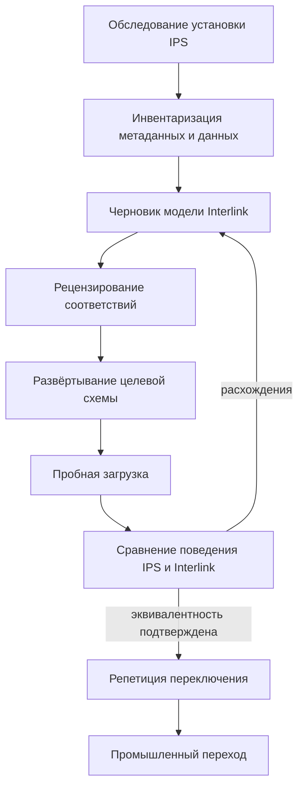

# Стратегия миграции базы IPS

## Миграция — не копирование таблиц

Физические модели IPS и Interlink различаются. Поэтому перенос строк «таблица в таблицу» не сохранит предметный смысл. Миграция должна начинаться с реконструкции модели конкретной установки: типов, атрибутов, связей, версий, правил, справочников, локальных расширений и обработчиков.

Цель перехода — не воспроизвести старый DDL, а доказуемо перенести:

- идентичность объектов и документов;
- историю версий;
- составы и связи;
- значения и их области;
- справочники и настройки предприятия;
- значимые состояния и применяемость;
- файлы и архивные свидетельства;
- происхождение и необходимые права;
- функциональные сценарии пользователей.

## Этап 1. Зафиксировать границы установки IPS

Нельзя мигрировать абстрактный IPS. Нужно зафиксировать версию продукта, СУБД, установленные модули, объём данных, локальные типы, конфигурацию жизненного цикла, интеграции и внешние обработчики.

Отдельно выявляются:

- метаданные, поставленные производителем;
- метаданные предприятия;
- атрибуты, вынесенные в пер-типовые срезы;
- произвольные расширения;
- формы и правила, содержащие предметную логику;
- данные, чья целостность держится только кодом;
- устаревшие или больше не используемые определения;
- отличия промышленной, испытательной и разработческой баз.

Результат — паспорт источника и список неопределённостей. Без него сравнение производительности и полноты не имеет смысла.

## Этап 2. Извлечь метамодель

Целевая возможность импорта должна читать каталог метаданных IPS и создавать черновик DSL. Это не автоматическая миграция и не новый источник истины. Черновик требует предметного рецензирования.

Для каждого определения фиксируются:

- глобальный идентификатор IPS, обозначаемый GUID, и локальный числовой идентификатор;
- наименование и иерархия;
- версионность;
- атрибуты, их типы, многозначность и область;
- допустимые связи и кардинальность;
- физические срезы и индексы;
- жизненный цикл и уровни;
- локальные формы, обработчики и правила;
- предполагаемый модуль и уровень владения Interlink.

## Этап 3. Построить карту соответствий

| IPS | Interlink | Особое решение |
|---|---|---|
| Тип объекта | Тип объекта DSL | Выбрать модуль, версионность и таблицу |
| Объект и версии | Устойчивая таблица + таблица версий | Разделить два уровня физически |
| Тип связи | Типизированная таблица связи | Уточнить области обоих концов |
| Структурная связь | Позиция состава | Сохранить «версия родителя → объект ребёнка» |
| Атрибут | Определение и привязка | Выбрать область и физический режим |
| Многозначный атрибут | Таблица значений типа | Сохранить порядок и дубликаты по правилам |
| Ссылка на объект/версию | Разные ссылочные типы | Восстановить правильную цель |
| Справочник | Список значений | Сохранить стабильный код и активность |
| Уровень продвижения | Степень готовности | Не смешивать с маршрутом согласования |
| Форма/обработчик | Принимающий продукт или предметный модуль | Не переносить исполняемую логику как данные |

Карта включает не только данные, но и решение «что не переносится». Устаревший тип может остаться в архивном контуре, а не становиться частью новой активной модели.

## Этап 4. Определить стратегию идентичности

Interlink использует один переносимый глобально уникальный идентификатор, обычно обозначаемый UUID, как основной ключ. При контролируемом принятии существующий глобальный идентификатор IPS может быть сохранён для публичной устойчивой идентичности объекта, связи или кортежа, если он соответствует требованиям и не конфликтует.

Для версий действует более строгая политика: они получают целевые идентификаторы Interlink, а соответствие со старым идентификатором сохраняется в миграционном реестре. Это предотвращает смешение объекта и версии и даёт проверяемую трассировку.

Локальные числовые идентификаторы IPS не становятся вторым постоянным ключом Interlink. Они сохраняются как исходная ссылка миграции или бизнес-атрибут только при реальной потребности.

## Этап 5. Очистить и классифицировать данные

Почти полное отсутствие физических внешних ключей в исторической схеме IPS означает, что до загрузки нужно выявить:

- ссылки на отсутствующие объекты;
- значения неизвестного типа;
- дубли устойчивых номеров;
- несовместимые пары объекта и версии;
- связи с недопустимыми концами;
- несколько текущих версий;
- значения вне справочника;
- расхождения универсального хранения и пер-типового среза;
- осиротевшие файлы и снимки.

Для каждого класса задаётся политика: исправить в IPS, преобразовать при переходе, загрузить в карантин или исключить с подписанным отчётом.

## Этап 6. Сформировать целевые модули

Рекомендуется разделить:

- базовые типы Interlink;
- паритетный модуль IPS;
- предметные модули предприятия;
- временный миграционный модуль соответствий;
- функции принимающего продукта: формы, права, процессы, интеграции;
- архивный модуль для истории, не участвующей в новых операциях.

Так локальная специфика не смешивается с ядром, а последующее обновление становится управляемым.

## Стратегии перехода

### Одномоментное переключение

IPS останавливается, выполняется финальный перенос, проверка и запуск Interlink. Подходит при допустимом окне обслуживания и ограниченном числе интеграций.

### Поэтапный переход по предметным областям

Сначала переводится, например, справочник материалов, затем документы и изделия. Для каждой области должен быть один авторитетный владелец. Двойная запись без строгого договора запрещена.

### Сопровождающий режим

IPS остаётся владельцем, Interlink хранит наблюдения или импортную проекцию для проверки новых функций. Это полезно для Alvatune и опытной эксплуатации, но не считается завершённой миграцией.

Если в сопровождающем режиме потребуется обратная запись в IPS, её выполняют принимающий продукт и специальный соединитель, а не фоновая логика Interlink. Принимающий продукт сначала проверяет личность и полномочия. Соединитель надёжно сохраняет намерение, внешний номер операции и точное содержание сообщения до отправки. Повтор без дубликата допустим только при явно согласованном договоре с IPS. Если ответ потерян, система сначала сверяет результат по внешнему номеру и запрещает слепой повтор. Полный рабочий договор сопровождающего режима описан на странице [Как продуктовые специалисты участвуют в переносе IPS](Data-migration-operating-model).

## Пример 1. Атрибут материала в двух путях IPS

Материал найден и в универсальной таблице значений, и в срезе типа. Перед переходом сравниваются значения. При расхождении владелец данных утверждает источник. В Interlink материал загружается в одну ссылочную колонку с внешним ключом.

## Пример 2. Объект и версия детали

У детали один устойчивый идентификатор и пять строк версий. Миграция создаёт одну строку объекта и пять версий, восстанавливает родительскую цепочку и сохраняет таблицу соответствия старых идентификаторов. Нельзя загрузить пять отдельных деталей.

## Пример 3. Пользовательский тип оснастки

Локальный тип IPS имеет свои поля, форму и обработчик нумерации. Тип и данные переходят в модуль предприятия. Поля становятся типизированными; форма и нумерация реализуются принимающим продуктом. Обработчик не копируется как непрозрачный скрипт.

## Пример 4. Исторические итерации

Старые снимочные таблицы содержат рабочие итерации. Продуктовая команда решает, какие из них являются значимыми свидетельствами, какие — точками восстановления незавершённой работы, а какие достаточно оставить в доступном архиве. Они не превращаются автоматически в версии или бизнес-снимки Interlink.

## Открытые вопросы

- Какая целевая версия и конфигурация IPS мигрируется первой?
- Какой глобальный идентификатор IPS можно принять как целевую идентичность без преобразования?
- Сколько локальных обработчиков содержит предметную логику?
- Какие итерации и журналы должны остаться оперативно читаемыми?
- Какое окно остановки допустимо?
- Возможен ли юридически значимый архив только для чтения?
- Какие интеграции должны переключиться одновременно?

## Критерии готовности стратегии

1. Зафиксирован паспорт источника.
2. Каждое активное определение IPS имеет решение о целевом месте.
3. Есть карта идентичностей и областей атрибутов.
4. Все классы дефектных данных имеют политику.
5. Выбран один владелец каждого набора данных на каждом этапе.
6. Формы и обработчики отделены от переносимой предметной модели.
7. Определены сценарии доказательства эквивалентности.

## Состояние реализации

Стратегия соответствует принятой архитектуре, но автоматический импорт каталога IPS запланирован после опытного этапа. Готового промышленного конвейера миграции пока нет. Первая миграция должна включать ручное предметное рецензирование и несколько репетиций.

## Связанные документы

- [Выполнение и доказательство миграции](Data-migration-execution)
- [Отличия от IPS](Data-differences-from-IPS)
- [DSL и устойчивые идентификаторы](Data-model-language)
