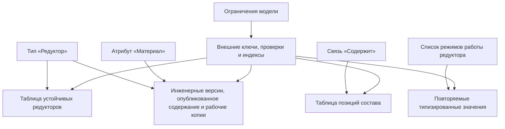
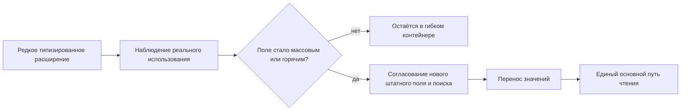

# Как типы материализуются в физическую базу данных

## Что означает «тип становится таблицей»

В целевой архитектуре Interlink описание типа определяет не только карточку, но и физическое хранение. Давление насоса, масса редуктора и мощность двигателя размещаются в полях подходящего типа. База данных использует эти сведения для поиска и проверки данных, вместо того чтобы каждый раз заново собирать карточку из универсального набора признаков.

В текущем коде уже есть построение физической схемы, создание её описания для PostgreSQL и планирование изменений. Однако эти строительные блоки ещё не означают готовую промышленную установку и реализацию всей пересмотренной модели хранения. Здесь описан принятый целевой результат по состоянию документации на 6 сентября 2026 года.

- неверсионируемый тип будет получать согласованное предметное хранение, обычно собственную таблицу;
- инженерный тип — отдельное хранение устойчивых данных, обозначенных инженерных версий, их неизменяемого опубликованного содержания и рабочих копий;
- тип связи — собственную таблицу;
- позиция состава — таблицу с концами, количеством, порядком и точной фиксацией версии;
- многозначный основной атрибут — таблицу значений своего типа;
- сочетание объектов — хранение, защищающее от повторного создания той же комбинации;
- штатный одиночный атрибут будет становиться типизированным столбцом, а повторяемые значения могут получать отдельное хранение;
- объявленные ограничения будут превращаться в ключи, проверки и индексы PostgreSQL.

Это и называется материализацией модели: предметные определения приобретают реальную физическую форму, понятную оптимизатору базы данных.

## Общий реестр не заменяет предметные таблицы

У Interlink планируется небольшой общий реестр адресуемых объектов и содержания. Он позволяет проверить, к какому типу относится объект, какой инженерной версии принадлежит опубликованное состояние и допустима ли такая ссылка. Например, протокол испытания сможет ссылаться на насос, редуктор или электродвигатель, если модель разрешает эти виды оборудования.

При этом общий реестр не хранит давление, массу, цену и текст документа как строки «имя признака — значение». Предметные характеристики остаются в собственном типизированном хранении. Общая адресация и реальные предметные таблицы дополняют друг друга: первая поддерживает согласованность ссылок, вторые — выразительность и оптимизацию.

## Физическое разделение объекта и версии

Устойчивый объект, например «Корпус насоса НЦ-80», сохраняет своё тождество во всей истории. Его инженерная версия Б — обозначенное поколение конструкции. Внутри этой версии различаются редактируемая рабочая копия и опубликованное неизменяемое содержание.

Если процесс разрешает редактирование версии Б без присвоения нового обозначения, у неё может появиться новое опубликованное состояние. Старое остаётся доступным для точного воспроизведения. Сохранение рабочей правки само по себе ничего не публикует. Поэтому «использовать версию Б» и «использовать именно содержание, согласованное 15 мая» — разные требования к ссылке.

Устойчивые признаки, например обозначение, не требуется повторять в каждом состоянии. Материал и масса относятся к содержанию. Принадлежность каждого признака определяется моделью, а не догадкой интерфейса.

Не все сведения нуждаются в инженерных версиях. Телефон склада можно изменять как обычную запись с защитой от потери чужой правки. Измерение температуры можно добавлять как неизменяемый факт и исправлять новым фактом. Оба способа используют тот же объектный фундамент, без фиктивных деталей и извещений.

Такое разделение даёт практические преимущества:

- уникальность обозначения выражается обычным правилом базы;
- ссылка на объект не зависит от количества версий;
- ссылка на точную версию физически отличается от плавающей ссылки;
- база не позволяет версии одного объекта быть выданной за версию другого;
- история и текущий выбор не смешиваются в одной строке.

Это устраняет характерную для старого физического среза IPS путаницу, где поле с названием «идентификатор объекта» могло адресовать версию, а устойчивый объект обозначался другим полем.

## Реальные ограничения вместо поздней проверки

Interlink стремится отдавать СУБД всё, что она умеет проверять надёжно:

- обязательность значения;
- уникальность номера;
- принадлежность ссылки допустимому объекту;
- принадлежность точно выбранной версии своему объекту;
- допустимый элемент справочника;
- корректность текущего указателя в объявленной области выбора;
- принадлежность рабочей копии её инженерной версии и рабочей области;
- верхнюю границу кардинальности связи;
- уникальность сочетания кортежа;
- непересечение периодов применяемости или будущих историзируемых фактов.

Проверки операции дают предметную диагностику раньше, а ограничения базы остаются последней линией защиты при конкуренции и сбое. Не каждое сложное правило выражается одним ограничением базы: полнота состава, совместимость комплекта и допустимость публикации проверяются для согласованного результата целиком.

Глобального запрета на две рабочие копии одного объекта в целевой модели нет. Разные рабочие области могут вести параллельную проработку; перед публикацией сравниваются основания и разбираются конфликты.

## Индексы создаются из смысла модели

Для предметных ссылок планируются согласованные средства быстрого поиска. Для составов отдельно предусмотрены пути:

- получить детей версии сборки в правильном порядке;
- найти все применения компонента;
- найти конкретную нить позиции;
- выбрать текущую или рабочую версию;
- загрузить полный снимок последовательным диапазонным чтением.

Дополнительные индексы могут быть объявлены в модели. Поэтому индексный набор отражает реальные запросы конкретного типа, а не пытается одной универсальной таблицей обслужить все возможные сценарии.

## Почему это быстрее универсального хранения

Архитектурное преимущество возникает из нескольких факторов:

1. Значение лежит в колонке правильного типа, а не в одной из нескольких универсальных колонок.
2. Для чтения карточки не нужно собирать каждое поле из набора строк «атрибут–значение».
3. Статистика PostgreSQL строится по конкретной предметной колонке.
4. Индекс создаётся для понятного профиля запросов.
5. Проверяемые ссылки защищают целостность данных; их влияние на скорость учитывается в испытаниях.
6. Для горячего типа нет обязательного выбора между универсальным хранилищем и дополнительным срезом.
7. Предсказуемая форма запроса может заранее сравниваться с эталонным планом.

Это даёт Interlink обоснованный потенциал для высокой параллельной нагрузки по сравнению с исследованным историческим физическим срезом IPS. Но современные установки IPS могут иметь иные оптимизации. Сравнивать нужно одинаковые модели, запросы, объёмы, права доступа и оборудование, включая стоимость общего реестра, истории, индексов и конкурирующей записи. Индекс тоже имеет цену: он занимает место и замедляет часть изменений.

## Как сохраняется гибкость редких полей

Не каждое редкое поле заслуживает немедленной колонки. Для расширяемых типов планируется локальный контейнер дополнительных значений. В отличие от безымянного универсального набора «признак — значение», каждое такое значение обязано иметь типизированное определение. До продвижения в штатное поле нельзя обещать ему те же физические ограничения и скорость поиска.

Если поле становится массовым или участвует в критичном поиске, владелец может принять решение перевести его в штатное поле. Это проверенный выпуск и перенос данных, а не автоматическая реакция на рост числа запросов:

Целевое правило Interlink: продвижение заменяет прежний путь текущего чтения, а не создаёт второй равноправный источник значения. Необходимая старая форма может сохраняться для удерживаемых исторических результатов.

## Отдельное место для табличных данных

Справочник типоразмеров не обязательно превращать в тысячи самостоятельных инженерных деталей. В план добавлены [[справочные таблицы|Reference-tables]], [[полные многомерные таблицы|Multidimensional-tables]] и [[координатные карты|Coordinate-maps]]. Их значения также должны иметь типизированное индексируемое хранение.

Одна установленная форма «коэффициенты теплоотдачи по материалу и температуре» сможет обслуживать несколько наборов и их точных редакций. Не требуется отдельная физическая таблица для каждого расчёта. При этом полнота всех клеток проверяется только для объявленной полной сетки; обычный справочник и разреженная карта не обязаны содержать все математически возможные сочетания.

## Пример 1. Поиск редуктора по обозначению

Конструктор ищет «Редуктор РЦ-250». Обозначение хранится как штатный признак и имеет согласованный быстрый поиск. Затем показывается содержание в выбранном режиме: официальное, рабочее или историческое. Нахождение объекта ещё не решает за пользователя, какую инженерную версию применять. Конкретный выпущенный комплект заказа открывается по точному снимку, а новый рабочий вариант заказа рассчитывается отдельно в явных условиях.

## Пример 2. Развёртка состава станка

Технолог раскрывает состав обрабатывающего центра с повторно применёнными гидроблоками. Позиции различают два места установки одного гидроблока, их количество и локальные условия. Средства прямого и обратного поиска помогают быстро найти нужные связи. Живой состав требует подбора содержания; уже переданный в производство состав читается по точному снимку. Новый выпуск гидроблока не меняет вчерашний заказ.

## Пример 3. Измеряемая масса корпуса

Поставщик указал массу корпуса в граммах, а предприятие работает в килограммах. Требуется не только числовое поле, но и согласованное правило единиц, точности и округления. Старый расчёт должен читаться по тому правилу, по которому он был зафиксирован. Наличие числового поля само по себе ещё не доказывает корректность всей цепочки.

## Пример 4. Редкое поле поставщика

Код покрытия используется у небольшой части деталей и первоначально ведётся как разрешённое расширение. Позднее служба закупок ежедневно отбирает по нему десятки тысяч позиций. Владелец модели готовит переход в штатное поле; пробное обновление выявляет пустые и неоднозначные значения. Промышленная база переключается только после их согласованной обработки.

## Признанная цена

- количество таблиц и индексов растёт вместе с моделью;
- изменение основной модели требует миграции;
- полиморфный запрос может объединять несколько таблиц;
- неверный выбор индексов всё равно способен создать плохой план;
- большие изменения требуют окна обслуживания и поэтапного переноса данных;
- преимущество над IPS должно подтверждаться испытаниями, а не только схемой.

## Критерии приёмки

1. Каждый конкретный тип имеет однозначное физическое отображение.
2. Основной атрибут читается одним авторитетным путём.
3. Все предметные ссылки имеют физическую целостность, где она выразима.
4. Состав и обратный поиск используют предсказуемые индексы.
5. Перевод расширения в колонку не оставляет параллельный источник значений.
6. Нагрузочные планы сравниваются с эталонными запросами на тех же данных.

## Состояние реализации

В текущем коде присутствуют построение физической схемы, создание её описания, метакаталог и планировщик миграций. Это не равнозначно завершённой новой модели хранения, промышленному исполнителю обновлений или готовой PLM. Пересмотренные версии, безопасная установка, полноценные команды и запросы, табличные семейства и нагрузочное доказательство ещё требуют реализации и приёмки.

## Связанные документы

- [[Расширяемость и настройка|Data-extensibility]]
- [[Производительность и агенты|Data-performance-and-agents]]
- [[Отличия от IPS|Data-differences-from-IPS]]
