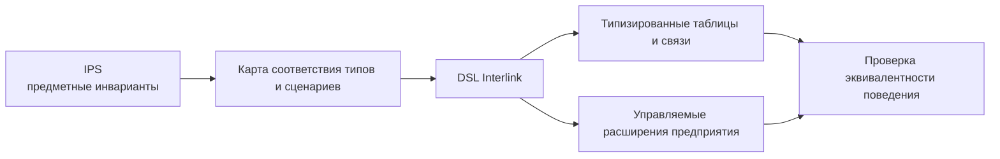

# Что меняется относительно архитектуры данных IPS

## Сохраняется предметная сила, меняется физический принцип

IPS является главным предметным прототипом Interlink. У него сохраняются сильные идеи: универсальная модель объектов и версий, самостоятельные связи, правильное направление структурного вхождения, ссылки на объект и точную версию, переносимые идентификаторы, применяемость, настройка предприятия и сложные PLM-сценарии.

Interlink не воспроизводит историческую физическую схему IPS. Он переносит предметную семантику в компилируемую модель и реальные ограничения PostgreSQL.

## Главные изменения

| Аспект | Исторический физический срез IPS | Целевой Interlink | Продуктовый эффект |
|---|---|---|---|
| Основное хранение атрибутов | Универсальные таблицы значений | Колонки и таблицы конкретного типа | Меньше сборки карточки из строк |
| Горячие атрибуты | Дополнительные срезы рядом с универсальным путём | Продвижение в единственный основной путь | Нет выбора между двумя источниками |
| Объект и версия | Различаются логически; смысл точного состояния зависит от механизма IPS | Разделены объект, инженерная версия, её опубликованное и рабочее содержание | Нельзя принять обозначение версии за доказательство точного содержания |
| Целостность | Значительная часть поддерживается ядром и процедурами | Внешние ключи, уникальность и проверки БД | Меньше висячих данных |
| Тип значения | Определяется метаданными и одной из универсальных колонок | Правильный физический тип | СУБД понимает домен и статистику |
| Основная модель | Редактируется конфигуратором базы | Версионируемый DSL и миграция | Воспроизводимость между средами |
| Дельта предприятия | Зависит от практики внедрения | Объявленный настраиваемый слой и трёхстороннее согласование | Обновление не затирает правки молча |
| Расширения | Метаданные и динамические срезы | Типизированный контейнер с продвижением | Быстрый старт и путь к высокой нагрузке |
| Идентификатор | Локальный числовой ключ плюс отдельный глобальный идентификатор | Один переносимый глобально уникальный идентификатор | Нет постоянной трансляции двух ключей |
| Поиск и обход | Универсальные индексы и собственные механизмы | Индексы по типам и предсказуемые планы PostgreSQL | Локальная оптимизация горячих областей |
| Состояние | Этап жизненного цикла и уровень продвижения могут пересекаться | Степень готовности отделена от процесса и допуска для конкретного назначения | Согласование чертежа не становится автоматически разрешением применять изделие в любой среде |
| Исторические комплекты | В исследованном физическом срезе есть зеркальные таблицы; поведение конкретных механизмов требует проверки | Фиксация точного раскрытого результата и его существенных оснований | Воспроизводится именно сохранённый состав, а не сегодняшний пересчёт |

## Что берётся из IPS почти без изменения

### Структурное вхождение

Состав принадлежит содержанию родителя, а обычная позиция указывает на устойчивый объект ребёнка с явно заданным способом выбора. Новая версия компонента не переписывает все родительские составы. Этот полезный результат IPS сохраняется, но в Interlink отдельно названы инженерная версия родителя и конкретное опубликованное содержание, которому принадлежат исторические позиции.

### Ссылки на объект и версию

Ссылка на объект, жёсткая конкретизация инженерной версии и точная ссылка на опубликованное содержание имеют разный смысл. Interlink сохраняет пользовательскую потребность IPS «не переключаться на другую версию», но не выдаёт её за более сильную гарантию «читать неизменные байты и значения». Для исторического комплекта нужна именно последняя гарантия. Подробнее — [[версии и состав|Versions-and-composition]].

### Переносимые идентификаторы метаданных

Глобальные идентификаторы определений IPS, обозначаемые GUID, доказывают важность устойчивой идентичности между базами. Interlink применяет тот же принцип к типам, модулям и начальным данным.

### Применяемость как данные

Условия действия версии не зашиваются в отдельный обработчик. Они остаются явными данными и контекстом подбора.

## Почему не переносится универсальный EAV

EAV — модель «сущность–атрибут–значение», где значения разных полей хранятся строками общей таблицы. Для ранних PLM она была мощным способом добавлять атрибуты без изменения схемы.

На зрелой установке возникают системные цены:

- тип значения известен метаданным, но не самой колонке;
- обязательность и диапазон проверяются главным образом приложением;
- карточка собирается из множества строк;
- универсальная таблица требует индексов для разных типов нагрузки;
- оптимизированный срез образует второй путь к тем же данным;
- производительность зависит от истории настройки конкретной базы.

Interlink оставляет гибкое хранение как ограниченный типизированный контур расширений. Основная модель получает настоящую схему. Общий реестр объектов при этом допустим и необходим для ссылок, но он хранит принадлежность и адрес, а не универсальную массу, материал и телефон в виде произвольных свойств.

## Что теперь намеренно не считается инженерной версией

Неизменяемый акт измерения, запись о передаче контейнера и текущий адрес склада могут быть типизированными объектами без конструкторских версий. Для адреса нужна безопасная правка; для акта — новое исправляющее утверждение; для конструкции — инженерная версия с отдельным рабочим и опубликованным содержанием. Это расширяет область применения, не ослабляя правила PLM там, где они действительно нужны.

То же относится к табличным справочникам. Редакция таблицы значений сохраняется как точное целое, но каждая цифра не становится отдельной инженерной версией. Сетка измерений обязана покрывать заданные точки; карта выбора хранит только заданные соответствия. Разрешение замен и проверка совместимости добавляют собственные предметные правила, а не возникают автоматически из любой таблицы. См. [[табличные данные|Tabular-data]] и [[совместимость|Compatibility-matrices]].

## Пример 1. Уникальное обозначение детали

В универсальной модели уникальность предметного обозначения требует знания типа и правил метаданных. В целевом Interlink владелец модели объявляет нужную область уникальности: например, тип детали и каталог предприятия. Проверка действует и при конкурентной записи. Это не означает, что один и тот же заводской код запрещён у любых двух поставщиков во всём мире: такие области должны быть явно различены.

## Пример 2. Ссылочный атрибут материала

IPS различает ссылку на объект и версию отдельными механизмами — это сохраняется. В Interlink колонка также имеет внешний ключ к правильной таблице. Ссылка на несуществующий материал физически отклоняется.

## Пример 3. Оптимизация массы изделия

В IPS горячий атрибут мог попасть в пер-типовой срез, сохраняя универсальное представление рядом. В Interlink массовая масса изначально является числовой колонкой. Если она началась как локальное расширение, миграция переводит её в колонку и закрывает прежний путь.

## Пример 4. Новая версия модели предприятия

Администратор IPS меняет тип и формы в конфигураторе. Для переноса нужно собрать зависимую конфигурацию и убедиться, что среды не разошлись. В Interlink изменение сначала существует как сравнимая версия модели; база принимает его только через план перехода и проверку.

## Пример 5. Точный производственный состав

Зеркальная копия строк сама по себе ещё не объясняет, какие версии выбрал алгоритм. В целевом Interlink для конкретного согласования или отдельной передачи заказа формируется точный комплект: раскрытый состав, причины и значимые условия. Сам живой заказ при этом не становится одним навсегда замороженным снимком. Для насоса комплект может включать выбранное содержание версии двигателя, редакцию правила замены и использованную таблицу совместимости.

Если позже появилась новая версия двигателя или новая, ещё не применявшаяся таблица, прежний переданный комплект не пересчитывается и его согласование не отменяется автоматически. Новая работа с живым заказом и следующая передача проверяются по своим действующим условиям. Если объявлен отзыв допуска или новое обязательное ограничение, оно оценивается явно для нового действия; его нельзя путать с самим фактом появления новой редакции.

## Что Interlink сознательно теряет

- мгновенное свободное изменение основной метамодели в рабочей базе;
- возможность поддерживать много диалектов СУБД уже на первом этапе;
- простоту универсального обработчика, который ничего не знает о конкретных таблицах;
- зрелые готовые рабочие места, формы и ЕСКД-модули IPS.

Эта цена компенсируется управляемостью, целостностью и потенциалом масштабирования, но не должна скрываться при планировании миграции.

## Критерии эквивалентности

1. Для каждого типа IPS определён целевой тип, модуль и владелец данных.
2. Объект, версия, связь и атрибут сохраняют предметный смысл.
3. Составы и подбор версий дают эквивалентный пользовательский результат.
4. Настройки предприятия либо перенесены, либо явно отклонены с причиной.
5. Производительность сравнивается на одинаковом профиле.
6. Функция IPS не считается потерянной только из-за отсутствия одноимённой таблицы.
7. Целевая функция не считается готовой только потому, что для неё создан тип.

## Состояние реализации

Архитектурные различия закреплены нормативно, а модель IPS подробно реконструирована. Полная миграция и сравнительные испытания ещё не выполнены. Историческое описание физической схемы IPS используется как свидетельство происхождения решений, но актуальная установка должна быть обследована отдельно.

## Связанные документы

- [[Стратегия миграции IPS|Data-IPS-migration-strategy]]
- [[Материализация в БД|Data-database-materialization]]
- [[Проверка миграции|Data-migration-execution]]
