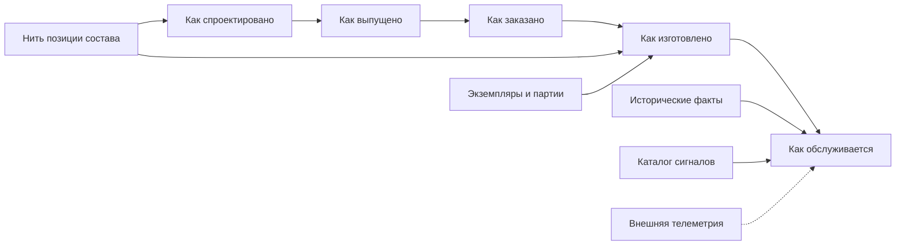

# Развитие в сторону цифровых двойников

## Почему система типов уже создаёт правильный фундамент

Цифровой двойник — это не ещё одна карточка оборудования. Для промышленного изделия нужно связать:

- как оно спроектировано;
- какая конфигурация выпущена;
- что было заказано;
- что фактически изготовлено;
- какие экземпляры и партии установлены;
- что менялось при эксплуатации;
- какие сигналы и наблюдения относятся к конкретной единице.

Interlink уже строится вокруг устойчивых идентичностей, версий, позиций состава, точных снимков и происхождения решений. Поэтому система типов способна стать структурным хребтом двойника, не создавая второе объектное ядро.

## Целевой первый вид двойника

Принято направление **экземплярного двойника**: цифровое представление конкретной физической единицы с серийным номером и связью между проектным, изготовленным и обслуживаемым составом.

Эксплуатационный двойник с массовой телеметрией рассматривается как возможное дальнейшее развитие, но отдельный трек пока не открыт. Процессный двойник для управления работой людей и агентов также является целевым направлением: в дальнейшем он сможет опираться на версионируемые определения процессов, происхождение действий и точные контексты Interlink. Готовой функции процессного двойника сейчас нет.

## Что уже заложено

### Устойчивая идентичность

Один переносимый идентификатор позволяет связывать данные между PLM, производством, сервисом и внешними платформами.

### Нить позиции состава

Строка состава принадлежит конкретной версии и исчезает вместе с ней. Нить позиции переживает версии и отвечает на вопрос «это то же место в изделии?». К ней можно привязать фактически установленный экземпляр и сравнить составы разных выпусков.

### Точные снимки

Снимок сохраняет не сегодняшнее вычисление, а доказуемую конфигурацию. Он становится основанием для сравнения «как выпущено», «как заказано» и «как изготовлено».

### Происхождение людей и агентов

Каждая операция знает, выполнена ли она человеком, агентом или системой, от чьего имени и в рамках какого запуска. Для аудируемого двойника это не дополнительный журнал, а часть доверия к данным.

### Ссылки на определения

Стабильные определения типов и сигналов могут адресоваться из данных и внешних хранилищ одинаково во всех развёртываниях.

## Что предстоит добавить

### Экземпляры, партии и родословная

Нужна общая предметная модель физических единиц, производственных и поставочных партий, установок и снятий компонентов. Она будет использоваться и заказным контуром, и цифровым двойником.

### Историзируемые факты

Факты с периодом действия получат отдельный профиль хранения: установка на площадке, принадлежность, состояние, наработка. Инженерные версии не будут засоряться эксплуатационными изменениями.

### Расширенная форма снимка

Снимок «как изготовлено» должен хранить фактическую цель позиции: конкретный экземпляр, партию, разрешённое отклонение и происхождение.

### Каталог сигналов

Тип сигнала, размерность, единица, диапазон и носитель должны определяться в общей модели. Сами высокочастотные выборки остаются во внешнем хранилище временных рядов.

### Массовая загрузка

Для эксплуатационных данных потребуются пакетные команды, многоузловая координация и при необходимости секционирование крупнейших таблиц.

## Почему не нужно хранить всю телеметрию в Interlink

PLM-семантика сильна там, где нужны версии, конфигурация, происхождение и точная история. Миллионы измерений в секунду требуют специализированного хранилища рядов. Правильная граница:

- Interlink определяет, какие сигналы существуют и к чему относятся;
- внешняя платформа хранит измерения;
- стабильный идентификатор сигнала, экземпляра или нити связывает два мира;
- конфигурационно значимые события возвращаются как исторические факты.

Так Interlink не превращается в систему диспетчерского управления и сбора данных оборудования, обычно обозначаемую SCADA, а телеметрическая платформа не становится вторым источником истины о конструкции.

## Пример 1. Насосная станция с серийным номером

Экземпляр станции связан с заказным и выпущенным снимком. Для каждого двигателя и уплотнения известен фактически установленный экземпляр или партия. При рекламации можно пройти от серийного номера до версии чертежа и разрешения замены.

## Пример 2. Замена двигателя при обслуживании

Состояние «как изготовлено» сохраняет исходный двигатель. Сервисное событие закрывает период его установки и открывает период нового. История на любую дату восстанавливается без создания новой конструкторской версии станции.

## Пример 3. Вибрация подшипникового узла

В модели объявлен сигнал вибрации с размерностью и допустимым диапазоном, привязанный к нити позиции подшипникового узла. Внешнее хранилище получает значения. Агент Alvatune анализирует ряд и создаёт предложение осмотра, сохраняя точный контекст экземпляра и конфигурации.

## Пример 4. Отзыв партии подшипников

Партия поставщика связана с фактическими экземплярами редукторов. После уведомления поставщика система находит все затронутые машины, их текущие места установки и обслуживающие организации.

## Этапы развития

1. Завершить базовый вертикальный срез типов, таблиц, запросов и миграций.
2. Реализовать реестр нитей и точную адресацию позиции.
3. Ввести общий фундамент физических единиц и партий.
4. Добавить форму снимка «как изготовлено» и родословную.
5. Реализовать историзируемые факты.
6. Добавить каталог сигналов и внешнюю привязку телеметрии.
7. Провести нагрузочный сценарий миллиона единиц и десяти миллионов фактов.
8. Только после отдельного решения открыть потоковую эксплуатационную платформу.

## Критерии приёмки первого двойника

1. Экземпляр связан с точным проектным и заказным основанием.
2. Позиция фактического состава адресуется устойчиво между версиями.
3. «Как спроектировано», «как изготовлено» и «как обслуживается» не перезаписывают друг друга.
4. Замена имеет период, причину и автора.
5. Партия поставщика прослеживается до всех экземпляров.
6. Телеметрия не дублируется в предметных таблицах Interlink.
7. Агентское решение восстанавливается по точному контексту и происхождению.

## Состояние реализации

Направление экземплярного двойника принято. Нить позиции закреплена архитектурно; контракты историзируемых фактов, осей и сигналов описаны. Полная модель физических единиц, партий, снимка «как изготовлено», пакетной загрузки и телеметрической интеграции относится к этапам после основного опытного подтверждения.

## Связанные документы

- [Развитие к цифровым двойникам](Digital-twins)
- [Экземпляры, партии и фактический состав](Order-units-lots-as-built)
- [Производительность и агенты](Data-performance-and-agents)
