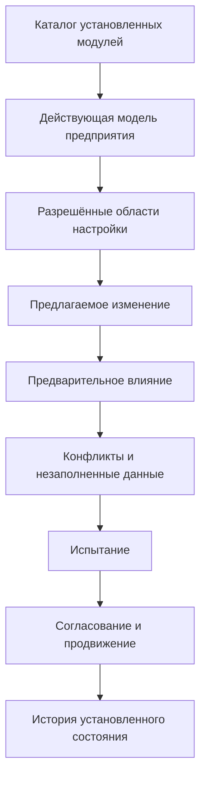

# Настройки предприятия и разрешение конфликтов

## Почему нужны разные режимы настройки

Предприятия должны развивать модель без постоянной доработки ядра. Но одинаковая кнопка «добавить поле» для любого изменения приводит либо к жёсткости, либо к неуправляемому набору метаданных.

Целевая архитектура Interlink разделяет три режима по цене и ответственности. Сейчас реализованы язык модели, композиция модулей и минимальная модель поставляемых списков значений. Каталога эксплуатационных настроек, хранения локальных изменений, административного рабочего места и команд для оперативных расширений пока нет.

## Режим 1. Разрешённая настройка

Применяется там, где семантическая рамка уже определена. Например:

- добавить значение в корпоративный справочник;
- настроить отображаемое название;
- определить профиль выбора версии;
- настроить разрешённую степень готовности;
- включить модуль для организационной единицы.

В будущем настройка должна проверяться, связываться с точной редакцией установленной модели и не менять фундаментальный тип хранения. Область применения, выпуск и полномочия задаёт принимающий продукт.

## Режим 2. Дополнительный типизированный признак

В целевом режиме предприятие сможет добавлять редкое локальное свойство в разрешённой области. Для него будут задаваться название, тип, единица, допустимые значения, владельцы и доступность в поиске.

Такой признак не должен быть произвольным текстовым мешком. Будущий контур будет знать его тип и проверять команды, но массовые запросы по нему могут стоить дороже, чем по штатному физическому столбцу. Хранение и команды эксплуатационных расширений ещё не реализованы.

## Режим 3. Новая редакция модели

Нужна, когда появляется новый предметный тип, связь, обязательное ограничение, часто используемое поле или изменение, влияющее на физическую схему и контракты.

В целевом процессе редакция будет проходить полный выпуск, миграцию и установку. Генератор физической схемы и исполнитель миграций ещё не готовы.

## Рабочее место администратора модели

Ниже описано целевое рабочее место принимающего продукта, а не текущий экран Interlink.

Администратор должен видеть не только локальные изменения, но и их происхождение: штатная поставка, отраслевой модуль, корпоративная настройка или оперативное расширение.

## Как создаётся дополнительный признак

1. Пользовательская служба формулирует смысл и примеры.
2. Администратор выбирает разрешенный тип объектов и принадлежность объекту либо версии.
3. Задаёт тип значения, единицу, обязательность и справочник.
4. Текущая проверка модели сможет проверить само определение и структурный конфликт.
5. Будущий анализатор установки покажет влияние на существующие данные и поиск.
6. Проводится испытание на копии.
7. Уполномоченный владелец выпускает настройку.
8. Принимающее приложение показывает признак в предусмотренной универсальной области либо получает отдельное обновление формы.

## Когда локальный признак следует продвигать

В целевом контуре принимающий продукт сможет собирать признаки востребованности:

- заполнен у большой доли объектов;
- участвует в частом поиске;
- нужен нескольким модулям или предприятиям;
- влияет на подбор, состав или обязательное ограничение;
- требует отдельного индекса;
- его смысл стабилизировался.

Решение о продвижении будет принимать владелец продукта. После этого выпускается новая редакция модели, а будущий исполнитель миграций создаёт штатное поле, переносит значения и закрывает старую форму расширения после предусмотренного периода совместимости. Автоматического продвижения сейчас нет.

## Конфликт с новой поставкой

### Совпадение имени

Поставщик добавляет штатный признак «Класс покрытия», а предприятие уже имеет локальный признак с таким названием. Имя само по себе не доказывает одинаковый смысл. Система показывает определения, типы, единицы и использования.

Варианты:

- подтвердить одинаковую семантику и мигрировать в штатное поле;
- сохранить два понятия с различёнными названиями;
- отказаться от поставки до переработки;
- создать явное преобразование.

### Совпадение идентичности

Два модуля используют один устойчивый идентификатор для разных определений. Сборка блокируется: автоматическое разрешение невозможно.

### Несовместимое ограничение

Новая модель делает поле обязательным или сужает диапазон, а локальные данные не соответствуют. Установка показывает точные записи и требует миграционного решения.

### Конфликт интерфейса

Локальная форма ожидает старое свойство, которое устаревает. Пакет выпуска показывает несовместимый потребитель и не объявляет обновление полностью готовым без плана перехода.

## Начальные справочники и локальные значения

Штатный модуль уже может описывать базовый список значений: машинный код, порядок, локализованную подпись, не более одного значения по умолчанию и признак разрешённой настройки. Возможность предприятия фактически добавлять локальные значения, а также владелец, область, период действия, активность и замещение относятся к будущему каталогу настроек принимающего продукта.

Обновление модуля не должно стирать локальные значения. Если новое штатное значение дублирует локальное, требуется сопоставление и сохранение ссылок.

## Настройки и несколько предприятий

В многопредприятной установке область настройки должна быть явной: вся группа, юридическое лицо, завод, проект или другое утверждённое измерение. Пользователь видит, почему значение доступно на одной площадке и недоступно на другой.

Область не должна подменять права. Сначала определяется предметная применимость настройки, затем принимающий продукт проверяет полномочия пользователя.

## Целевые примеры

Следующие примеры показывают ожидаемое поведение будущего контура настроек и расширений.

### Пример 1. Марки термообработки

Завод добавляет значение «низкотемпературное азотирование» в разрешённый технологический справочник. Оно проходит проверку на дубликат, получает ссылку на стандарт и область завода. Карточка операции и поиск используют значение без новой физической таблицы.

### Пример 2. Протокол вихретокового контроля

Локальный признак «номер протокола вихретокового контроля» добавляется версии детали. Сначала он редок и хранится как типизированное расширение. После распространения контроля на всю линейку признак становится обязательным, часто ищется и включается в отчёт. Продуктовая команда переводит его в штатную модель с физическим столбцом и миграцией.

### Пример 3. Модуль цифрового паспорта оборудования

Предприятие подключает модуль фактических экземпляров, измерений и обслуживания. Это не набор полей основной детали, а новая предметная область со связями и жизненным циклом. Модуль устанавливается как отдельная зависимость, а его дальнейшее развитие создаёт основу цифрового двойника.

## Ошибки и восстановление

Изменение настройки до выпуска остаётся черновиком администратора. После публикации оно имеет редакцию и историю. Ошибочное выпущенное значение не переписывается незаметно: создаётся следующая редакция, а затронутые данные проходят предусмотренное преобразование.

При конфликте промышленная система продолжает использовать последнюю совместимую активную редакцию. Новая поставка не становится частично активной.

## Состояние реализации

Уровни расширяемости и их ограничения описаны как целевая архитектура. Полноценного каталога корпоративных настроек, административного рабочего места, автоматического анализа конфликтов и продвижения расширений пока нет. Эти возможности должны развиваться после подтверждения основного контура модели и миграций.

Связанные документы: [[расширяемость|Data-extensibility]], [[жизненный цикл модели|Data-model-lifecycle]], [[выпуск и установка|Data-release-and-installation]], [[цифровые двойники|Data-digital-twins]].
