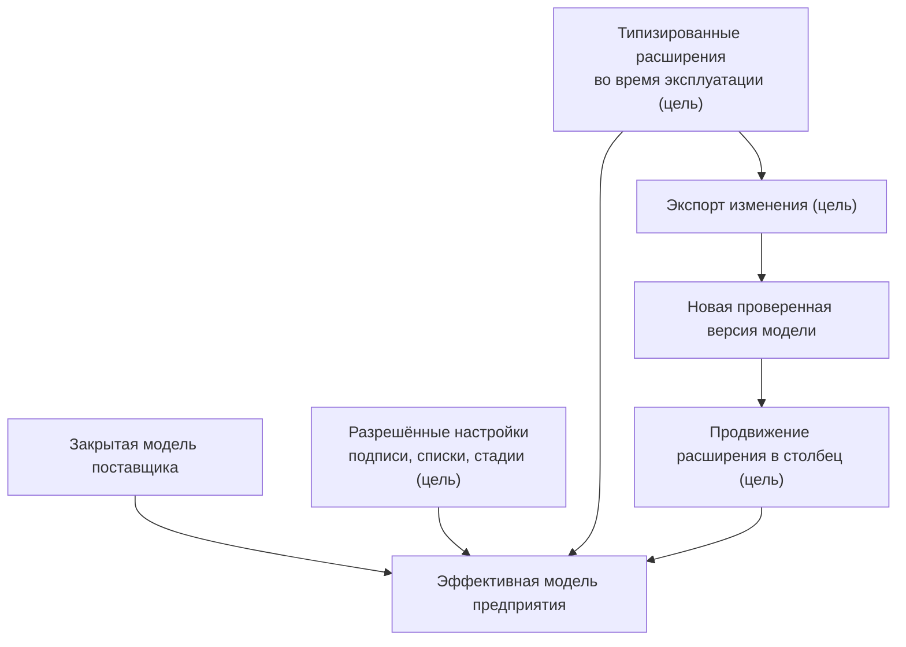

# Расширяемость, настройка предприятия и развитие модели

## Гибкость без превращения установки в отдельный продукт

PLM-система обязана учитывать особенности предприятия. Но если любое определение можно свободно менять непосредственно в рабочей базе, каждое внедрение постепенно становится уникальным, трудно обновляемым продуктом.

Целевая архитектура Interlink разделяет изменения по трём скоростям. Сейчас реализованы язык, пространства имён и композиция модулей. Каталога эксплуатационных настроек, типизированных расширений времени работы, трёхстороннего согласования, экспорта и продвижения в физический столбец пока нет.

## Уровень 1. Закрытая модель

Типы, ключевые связи, области атрибутов, физические отображения и основные ограничения по умолчанию закрыты для произвольного изменения. Их развитие проходит через новую версию DSL, рецензирование и миграцию.

Это не ограничение ради ограничения. Изменение конца связи или области версионного атрибута способно изменить смысл миллионов строк. Оно должно быть таким же контролируемым, как выпуск новой версии прикладного продукта.

## Уровень 2. Настраиваемые элементы

Поставщик может явно разрешить предприятию изменять:

- подписи и переводы;
- иконки;
- элементы списков значений;
- значения по умолчанию;
- стадии внутри зафиксированных зон зрелости;
- другие специально объявленные измерения.

В будущем при обновлении должно действовать трёхстороннее согласование: будут сравниваться прежняя поставка, новая поставка и локальное изменение. Нетронутое сможет обновиться, локальная правка — сохраниться, а конкурирующее изменение станет явным конфликтом. Такой эксплуатационный механизм ещё не реализован.

## Уровень 3. Расширения во время работы

В целевом контуре для заранее разрешённых типов администратор сможет создать новое типизированное определение без немедленного изменения таблицы. Например, предприятие добавит «код участка термообработки» или «категорию консервации».

У расширения сохраняются:

- стабильное имя в пространстве предприятия;
- логический тип;
- допустимый список или диапазон;
- область применения;
- автор и время;
- возможность фильтрации и индексирования;
- возможность экспорта обратно в модель.

Нельзя создать просто произвольную пару ключ–значение. Это предотвращает появление неописанных полей с разными смыслами.

## Продвижение горячего расширения

Если расширение станет важной частью продукта, владелец сможет принять решение перевести его в основную модель. В целевом процессе будет выпущена новая редакция модели, а будущий исполнитель миграций перенесёт значения в штатный столбец, включит ограничения и переключит основной путь чтения. Автоматического продвижения сейчас нет.

Так сохраняются одновременно скорость первого внедрения и производительность зрелого сценария.

## Модули как масштаб организационного развития

Отдельные предметные области поставляются модулями: конструкторская часть, технология, требования, заказы, качество, цифровой двойник. Модуль имеет версию, зависимости и физический префикс.

Преимущества:

- команды могут развивать области независимо;
- принимающий продукт точно фиксирует проверенный состав продукта;
- одинаковые локальные имена в разных модулях не обязаны конфликтовать;
- обновление одного модуля становится видимой новой версией составленной модели;
- Alvatune может добавлять свои долговечные типы, не меняя ядро Interlink.

## Сравнение подходов

| Подход | Сильная сторона | Риск | Решение Interlink |
|---|---|---|---|
| IPS Database Configurator | Богатая настройка предприятия | Расхождение сред и скрытые зависимости | Поставляемая модель плюс объявленная дельта |
| Aras / ServiceNow | Быстрое изменение в работающей системе | Изменение схемы из приложения и трудное обновление | Быстрые расширения в контролируемом контейнере |
| Salesforce | Массовая многопользовательская настройка полей | Универсальные физические слоты и специальные индексы | Локальное гибкое хранение с продвижением в колонку |
| SAP | Пространства имён заказчика | Транспортная сложность | Префикс предприятия и экспортируемый патч |
| Teamcenter BMIDE | Управляемая поставка модели | Тяжёлый цикл и богатая серверная платформа | Более лёгкий компилируемый конвейер |

## Целевые примеры

Все примеры ниже показывают ожидаемое поведение ещё не реализованного эксплуатационного контура.

### Пример 1. Новый статус материала

Предприятие добавляет в разрешённый список состояние «Допущен только для ремонта». Поставщик позднее добавляет состояние «Запрещён к новым заказам». Оба значения сохраняются. Если обе стороны переименовали одно базовое значение по-разному, система показывает конфликт вместо выбора случайного победителя.

### Пример 2. Поле климатического исполнения

На первом внедрении поле добавляется как типизированное расширение насосов. Через год оно участвует в конфигурации большинства заказов. Поле включается в предметный модуль, переносится в колонку и индексируется, а пользовательские формы продолжают показывать тот же признак.

### Пример 3. Модуль техобслуживания станков

Сервисная команда поставляет модуль с типами «Регламент обслуживания» и «Сервисное событие». Модуль зависит от базового типа оборудования, но имеет собственную версию. Обновление PLM-основы заранее проверяет совместимость.

### Пример 4. Локализованные названия операций

Поставщик исправляет английский перевод, предприятие добавляет польский и меняет русскую подпись. Согласование выполняется отдельно по языкам: новая английская строка применяется, польская сохраняется, русское расхождение фиксируется.

## Цена управляемости

Закрытую структуру нельзя изменить мгновенно на рабочей базе. Требуется выпуск и миграция. Это медленнее свободного конфигуратора, но даёт повторяемость между разработкой, испытанием и эксплуатацией. Для срочных локальных полей предназначен третий уровень.

## Критерии приёмки целевого механизма

1. Закрытый инвариант нельзя изменить через административную карточку.
2. Разрешённая настройка переживает обновление поставщика.
3. Конфликт поставщика и предприятия сопровождается точным отчётом.
4. Расширение имеет тип и домен до появления первого значения.
5. Расширение экспортируется в патч и переводится в основную модель.
6. После продвижения существует один канонический путь чтения.
7. Состав модулей и их версии воспроизводимы в чистой среде.

## Состояние реализации

Приняты уровни владения и модульная организация; композиция модулей и пространства имён реализованы в компиляторе. Каталог эксплуатационных настроек, согласование с действующей базой, экспорт, физическое продвижение и миграция отсутствуют и остаются будущими возможностями.

## Связанные документы

- [DSL и модули](Data-model-language)
- [Материализация в БД](Data-database-materialization)
- [Выполнение миграций](Data-migration-execution)
