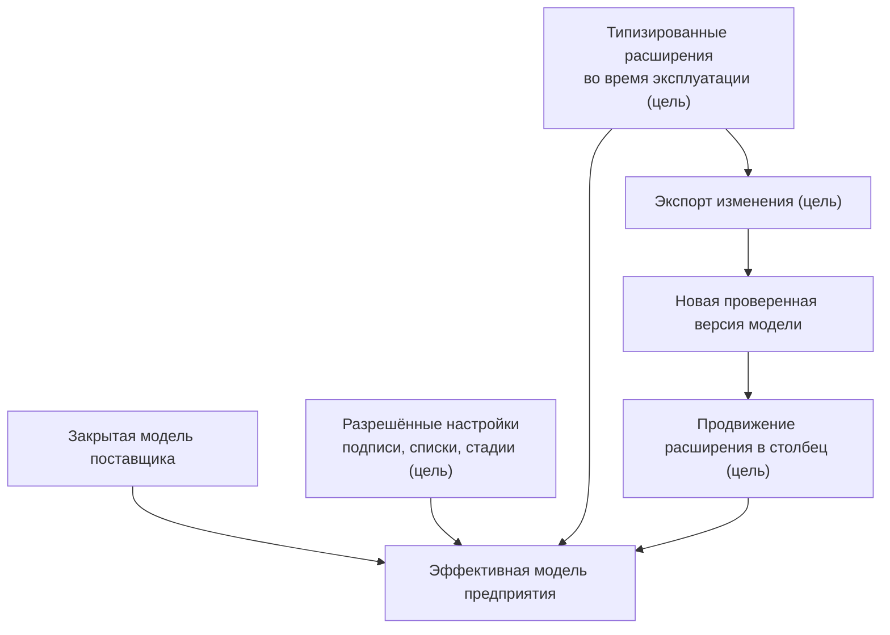

# Расширяемость, настройка предприятия и развитие модели

## Гибкость без превращения установки в отдельный продукт

PLM-система обязана учитывать особенности предприятия. Но если любое определение можно свободно менять непосредственно в рабочей базе, каждое внедрение постепенно становится уникальным, трудно обновляемым продуктом.

Целевая архитектура Interlink разделяет изменения по трём скоростям. Сейчас реализованы язык, области имён и композиция модулей; в коде также есть основы физической схемы, метакаталога и планирования миграций. Однако готового эксплуатационного контура локальных настроек, их согласования, экспорта и продвижения в штатные поля пока нет. Наличие каталога определений ещё не даёт администратору безопасный конфигуратор работающего предприятия.

## Уровень 1. Закрытая модель

Типы, ключевые связи, области атрибутов, физическое хранение и основные ограничения по умолчанию закрыты для произвольного изменения. Их развитие проходит через новую редакцию модели, рецензирование и управляемое обновление. При этом язык описания модели не обязательно меняет собственную версию: обычное добавление типа предприятия использует уже поддержанный язык.

Это не ограничение ради ограничения. Изменение конца связи или области версионного атрибута способно изменить смысл миллионов строк. Оно должно быть таким же контролируемым, как выпуск новой версии прикладного продукта.

## Уровень 2. Настраиваемые элементы

Поставщик может явно разрешить предприятию изменять:

- подписи и переводы;
- иконки;
- элементы списков значений;
- значения по умолчанию;
- стадии внутри зафиксированных зон зрелости;
- другие специально объявленные измерения.

В будущем при обновлении должно действовать трёхстороннее согласование: сравниваются прежняя поставка, новая поставка и локальное изменение. Нетронутое обновляется, локальная правка сохраняется, а конкурирующее изменение становится явным конфликтом. Это допустимо только в заранее открытой области настройки. Локальное разрешение не может без специального полномочия отменить обязательное ограничение поставки. Такой эксплуатационный механизм ещё не реализован целиком.

## Уровень 3. Расширения во время работы

В целевом контуре для заранее разрешённых типов администратор сможет создать новое типизированное определение без немедленного изменения таблицы. Например, предприятие добавит «код участка термообработки» или «категорию консервации».

У расширения сохраняются:

- стабильное имя в пространстве предприятия;
- логический тип;
- допустимый список или диапазон;
- область применения;
- автор и время;
- возможность фильтрации и индексирования;
- возможность экспорта обратно в модель.

Нельзя создать просто произвольную пару ключ–значение. Это предотвращает появление неописанных полей с разными смыслами. Разрешённое дополнительное поле также не получает автоматически ту же скорость поиска и те же физические проверки ссылок, что штатное поле. В отдельных случаях проверку выполняет контролируемая операция записи; эту разницу нужно учитывать при выборе способа хранения.

## Продвижение горячего расширения

Если расширение станет важной частью продукта, владелец сможет перевести его в основную модель. В целевом процессе выпускается новая редакция модели, а исполнитель обновления переносит значения в штатное хранение, включает ограничения и переключает основной путь чтения. Само решение не принимается автоматически по частоте использования: сначала проверяются смысл, качество данных и последствия для приложений.

Например, обнаруженные при переносе два разных толкования «климатического исполнения» нельзя механически объединить в один код. Ответственный уточняет соответствие, разбирает неоднозначные записи и проверяет поиск. Старые точные результаты продолжают читаться по сохранённому договору. После переключения не должно существовать двух равноправных источников текущего значения.

Смысл признака и соответствие прежних и новых данных должны сохраняться. Будет ли при продвижении сохранён внутренний идентификатор локального определения или создано новое штатное определение с явным соответствием, ещё требует отдельного решения. Это не следует смешивать с обычным переименованием уже существующего типа.

Так сохраняются одновременно скорость первого внедрения и возможность оптимизировать зрелый сценарий.

## Модули как масштаб организационного развития

Отдельные предметные области поставляются модулями: конструкторская часть, технология, требования, заказы, качество, цифровой двойник. Модуль имеет выпуск, зависимости и собственную область определений. Он может добавлять обычные записи и неизменяемые факты, а не только типы инженерных объектов.

Преимущества:

- команды могут развивать области независимо;
- принимающий продукт точно фиксирует проверенный состав продукта;
- одинаковые локальные имена в разных модулях не обязаны конфликтовать;
- обновление одного модуля становится видимой новой версией составленной модели;
- Alvatune может добавлять свои долговечные типы, не меняя ядро Interlink.

## Сравнение подходов

| Подход | Сильная сторона | Что необходимо контролировать | Решение Interlink |
|---|---|---|---|
| Богатый конфигуратор предприятия, знакомый специалистам IPS | Быстрое отражение местных понятий и правил | Зависимости, перенос между средами и воспроизводимость | Поставляемая модель и явно разрешённые изменения предприятия |
| Настройка прямо во время эксплуатации | Быстрое добавление редких данных | Смысл значений, права, качество поиска и цена обновления | Типизированные расширения в заранее разрешённых границах |
| Управляемые отраслевые пакеты | Повторяемый состав продукта | Совместимость модулей и сохранение локальных изменений | Точные выпуски, пробное обновление и явные конфликты |
| Собственные области определений предприятия | Независимая разработка расширений | Столкновения понятий и владение ими | Устойчивые определения с известным владельцем и зависимостями |

Таблица сравнивает архитектурные приёмы, а не ранжирует продукты. Разные PLM сочетают их по-разному; наличие конфигуратора само по себе не означает отсутствие управляемой поставки. Interlink заимствует полезные практики, но должен доказать удобство и обновляемость собственного сочетания на реальных сценариях.

## Новые таблицы тоже являются развитием модели

Планируемый пользовательский редактор справочников не должен создавать произвольную структуру в обход проверки модели. Если предприятие меняет форму таблицы — добавляет ось «вид охлаждения», меняет единицы или результат карты с объекта на точное содержание, — требуется анализ старых данных и потребителей.

Ввод очередной строки в уже установленную форму обычно является работой с данными, а не выпуском нового типа. Способ сохранения определяется назначением: инженерный справочник может проходить рабочую копию и публикацию; оперативный справочник меняется контролируемой записью; результат лабораторного измерения добавляется новым фактом. Обычное сохранение не обязано создавать точный архив каждой нажатой клавиши.

Когда таблица используется как основание расчёта или выпуска, отдельно фиксируется необходимое точное содержание. Изменение оси или добавление значения не расширяет старую редакцию задним числом. Подробнее — [[табличные данные|Tabular-data]].

## Целевые примеры

Все примеры ниже показывают ожидаемое поведение ещё не завершённого эксплуатационного контура. Ответственный за предметную область задаёт смысл изменения, администратор подготавливает разрешённую настройку, а установка поставляемой модели проходит отдельную проверку совместимости.

### Пример 1. Новый статус материала

Предприятие добавляет в разрешённый список состояние «Допущен только для ремонта». Одной подписи недостаточно: нужно определить, какие операции разрешены и как состояние соотносится с общей шкалой допуска. Поставщик позднее добавляет состояние «Запрещён к новым заказам». Совместимые самостоятельные значения сохраняются; если обе стороны по-разному изменили один базовый смысл, система показывает конфликт. Старые решения о выпуске не пересчитываются только из-за нового элемента списка.

### Пример 2. Поле климатического исполнения

На первом внедрении поле добавляется как типизированное расширение насосов. Через год оно участвует в конфигурации большинства заказов. Поле включается в предметный модуль, переносится в колонку и индексируется, а пользовательские формы продолжают показывать тот же признак.

### Пример 3. Модуль техобслуживания станков

Сервисная команда поставляет модуль с типами «Регламент обслуживания» и «Сервисное событие». Модуль зависит от базового типа оборудования, но имеет собственную версию. Обновление PLM-основы заранее проверяет совместимость.

### Пример 4. Локализованные названия операций

Поставщик исправляет английский перевод, предприятие добавляет польский и меняет русскую подпись. В разрешённой области переводы сопоставляются отдельно: непересекающиеся изменения сохраняются, а две правки одной подписи становятся явным конфликтом. При этом подписанный ранее технологический документ должен сохранять своё первоначальное представление. Современный перевод не переписывает его доказательную историю.

## Цена управляемости

Закрытую структуру нельзя изменить мгновенно на рабочей базе. Требуется выпуск и миграция. Это медленнее свободного конфигуратора, но даёт повторяемость между разработкой, испытанием и эксплуатацией. Для срочных локальных полей предназначен третий уровень.

## Критерии приёмки целевого механизма

1. Закрытый инвариант нельзя изменить через административную карточку.
2. Разрешённая настройка переживает обновление поставщика.
3. Конфликт поставщика и предприятия сопровождается точным отчётом.
4. Расширение имеет тип и домен до появления первого значения.
5. Расширение экспортируется в патч и переводится в основную модель.
6. После продвижения существует один канонический путь чтения.
7. Состав модулей и их версии воспроизводимы в чистой среде.

## Состояние реализации

Приняты уровни владения и модульная организация; композиция модулей и области имён реализованы. Метакаталог, физическая схема и планирование миграций уже имеют строительные блоки. Но согласование эксплуатационных настроек с действующей базой, экспорт, продвижение расширений, безопасная установка и конечный конфигуратор ещё не приняты как единый работающий процесс.

## Связанные документы

- [[DSL и модули|Data-model-language]]
- [[Материализация в БД|Data-database-materialization]]
- [[Выполнение миграций|Data-migration-execution]]
