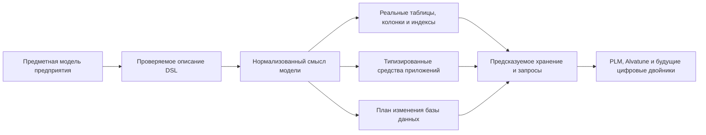

# Система типов и структура данных Interlink

## Назначение пакета

Этот комплект объясняет, как Interlink превращает предметную модель предприятия в расширяемую, проверяемую и производительную систему хранения инженерных данных. Он предназначен для продуктовых специалистов IPS, архитекторов PLM/CAx, руководителей внедрения и специалистов, которым нужно оценить не синтаксис программы, а возможности будущей платформы.

Главная идея проста:

> В IPS гибкость в значительной степени достигается универсальным объектным ядром и метаданными, которые интерпретируются во время работы. В Interlink модель предприятия заранее проверяется и компилируется: известные типы становятся настоящими таблицами PostgreSQL, атрибуты — типизированными колонками или специализированными таблицами значений, связи — самостоятельными таблицами с ограничениями и индексами.

Такой подход сохраняет богатство PLM-моделирования, но переносит значительную часть проверки из позднего выполнения в момент выпуска модели и в саму базу данных. Это создаёт основу для предсказуемых запросов, управляемых обновлений и более высокой параллельной нагрузки — особенно важной при появлении большого числа фоновых процессов и агентов Alvatune.

## Короткий ответ: что получает предприятие

- богатую систему типов для изделий, документов, требований, техпроцессов, заказов, связей и других предметных сущностей;
- отдельное представление устойчивого объекта и его версий;
- наследование типов, типизированные связи, составы, кортежи, справочники, ссылки, вычисляемые и измеряемые атрибуты;
- предметный язык описания модели — DSL, то есть специализированный язык, понятный как единая декларация модели;
- физические таблицы, ограничения целостности и индексы, создаваемые из этой модели;
- три управляемых уровня расширения: версия поставляемой модели, разрешённая настройка предприятия и типизированное расширение во время работы;
- семантическое сравнение версий модели и управляемую миграцию базы данных;
- проверку расхождения между моделью, кодом и базой;
- возможность собирать единую модель из версионированных предметных модулей;
- фундамент для цифровой нити и экземплярных цифровых двойников.

Главный смысл схемы: таблицы, программные контракты и миграции не проектируются независимо друг от друга. Они являются согласованными результатами одной предметной модели.

## В чём основное отличие от IPS

Историческая схема IPS решала чрезвычайно сложную задачу своего времени: дать предприятию возможность создавать новые типы и атрибуты без постоянной переделки прикладного ядра. Цена этой универсальности — значения многих атрибутов хранятся в общих таблицах, тип и ограничения приходится восстанавливать через метаданные, а оптимизированные пер-типовые срезы образуют дополнительный путь к тем же данным.

Interlink развивает сильные стороны IPS, но меняет физический принцип:

| Вопрос | IPS | Interlink |
|---|---|---|
| Где живёт основная модель | В метаданных эксплуатационной системы | В версионируемом DSL и его проверенной поставке |
| Как хранится известный тип | В универсальном ядре, при необходимости — в дополнительном срезе | В собственной типизированной таблице или согласованной группе таблиц |
| Как проверяется тип значения | Главным образом ядром и метаданными | Компилятором, командным слоем и ограничениями БД |
| Как расширяется предприятие | Через конфигуратор, модули и локальные настройки | Через модули, разрешённые настройки и типизированные расширения |
| Как сравниваются среды | Требуется инвентаризация конфигурации | По версии, отпечатку модели, составу модулей и отчёту расхождений |
| Как ускоряются горячие атрибуты | Дополнительные пер-типовые срезы рядом с универсальным хранением | Управляемый перевод расширения в основную колонку вместо параллельного пути |

Interlink не заявляет, что уже доказал численное превосходство над промышленными установками IPS. Он устраняет конкретные структурные причины лишних соединений, слабой ссылочной целостности и непредсказуемости планов. Численные границы будут подтверждаться нагрузочными испытаниями на миллионах объектов и до десяти миллионов вхождений.

## Состав пакета

### Замысел и возможности

- [Почему система типов является основой продукта](Data-type-system-vision)
- [Какие предметные конструкции поддерживает модель](Data-type-system-capabilities)
- [DSL как язык модели предприятия](Data-model-language)
- [Как типы материализуются в физическую базу данных](Data-database-materialization)
- [Расширяемость, настройка предприятия и развитие модели](Data-extensibility)

### Масштаб и переход с IPS

- [Производительность, высокая нагрузка и оркестрация агентов](Data-performance-and-agents)
- [Что меняется относительно архитектуры данных IPS](Data-differences-from-IPS)
- [Стратегия миграции базы IPS](Data-IPS-migration-strategy)
- [Выполнение миграции и доказательство эквивалентности](Data-migration-execution)

### Рынок и развитие

- [Сравнение с PLM-, бизнес- и инструментальными платформами](Data-other-systems)
- [Развитие в сторону цифровых двойников](Data-digital-twins)
- [Сквозные машиностроительные примеры](Data-engineering-examples)
- [Состояние реализации, риски и критерии приёмки](Data-status-risks-acceptance)

## Как читать пакет

Продуктовому специалисту IPS рекомендуется начать с документов 01, 07 и 08: они дают замысел, сравнение и путь перехода. Архитектору данных полезнее последовательность 02–06. Для обсуждения Alvatune и дальнейшего развития важны 06 и 11. Документы 12 и 13 превращают идеи в проверяемые прикладные истории.

## Важная граница готовности

На 31 августа 2026 года компилятор DSL, нормализация, отпечаток модели, композиция модулей и значительная часть генерации типов реализованы. Локальная фаза 2 дошла до выполненного этапа 8, но итоговая приёмка этапа 9 не начата. Физическое создание предметных таблиц, промышленный механизм миграций, команды записи, структурные запросы, эксплуатационные расширения и нагрузочный прогон относятся к последующим фазам.

Поэтому пакет описывает одновременно реализованный фундамент, принятый целевой контракт и продуктовые преимущества, которые должны быть подтверждены сквозным опытным образцом. В каждом документе статус отделён от целевого обещания.

## Основные источники

- [Зачем создаётся Interlink](Why-Interlink)
- [Предметный язык модели](Model-language)
- [Система объектов и данных](Object-model-and-data)
- [Расширяемость и миграция](Extensibility-and-migration)
- [Отраслевые прецеденты](Industry-precedents)
- [Состояние и дорожная карта](Current-state-and-roadmap)
- [Как проверяются основания и статусы](Trust-and-sources)

