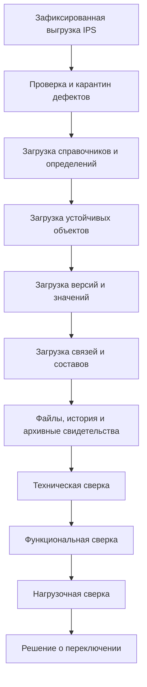

# Выполнение миграции и доказательство эквивалентности

## Два разных вида миграции

Важно различать:

1. **Первичный переход с IPS** — перенос метамодели, данных и поведения между разными архитектурами.
2. **Дальнейшее развитие Interlink** — управляемый переход базы между версиями одной DSL-модели.

Первичный переход требует карты соответствий и предметной проверки. Последующие миграции уже выводятся из семантической разницы версий Interlink.

## Последовательность промышленного перехода

Порядок важен: ссылка не должна загружаться раньше цели, а производственный сценарий не проверяется до подтверждения структуры и версий.

## Пробная загрузка

Первая загрузка выполняется в изолированную базу. Она должна быть повторяемой: одинаковая выгрузка и правила преобразования дают тот же результат. Каждая строка получает происхождение и связь с источником.

Ошибки не исправляются незаметно. Они попадают в отчёт:

- исходная сущность;
- нарушенное правило;
- выбранное действие;
- ответственное лицо;
- результат повторной проверки.

## Техническая сверка

Проверяются:

- количество объектов, версий, связей и значений по типам;
- сохранность глобальных идентификаторов IPS и таблицы соответствий;
- отсутствие висячих ссылок;
- единственность текущей и рабочей версии;
- цепочки версий;
- допустимость концов связей;
- справочники и единицы измерения;
- контрольные суммы файлов;
- полный список исключённых и карантинных данных.

Простое совпадение числа строк недостаточно: одна универсальная строка IPS может разложиться на несколько предметных строк Interlink или, наоборот, несколько технических записей объединиться в один объект.

## Функциональная сверка

Одни и те же пользовательские сценарии исполняются в IPS и целевом контуре:

- поиск по обозначению и атрибутам;
- открытие карточки и истории версий;
- состав на выбранных условиях;
- обратное применение;
- точная фиксация версии;
- применяемость;
- документы и ссылки;
- изменение объекта;
- заказ и производственный состав;
- права и доступные действия.

Сравнивается не внутреннее число таблиц, а пользовательский результат и объяснение расхождения.

## Дифференциальная проверка составов

Для набора эталонных изделий формируются составы в обеих системах с одинаковыми исходными условиями. Сравниваются:

- присутствующие позиции;
- выбранные объекты и версии;
- количества;
- порядок;
- причины выбора;
- ошибки и неоднозначности;
- документы и производственные данные.

Известное расхождение исторических источников IPS по порядку применяемости и конкретизации нельзя закрыть предположением. Оно проверяется на целевой установке и фиксируется в профиле миграции.

## Нагрузочная сверка

Проверяются одинаковые профили:

- точечное чтение;
- карточка с типовыми атрибутами;
- широкая выборка;
- раскрытие состава разной глубины;
- обратное применение компонента;
- параллельная работа пользователей и агентов;
- запись и конфликт изменения;
- массовый импорт;
- чтение опубликованного снимка.

Результат включает задержки, пропускную способность, потребление памяти, планы запросов и размер индексов. Только такой протокол позволяет обоснованно сказать, где Interlink быстрее IPS и какова цена новой схемы.

## Репетиция переключения

До промышленного перехода выполняются минимум две полные репетиции на свежей копии данных. Измеряются:

- время остановки;
- время выгрузки, загрузки и проверки;
- объём карантина;
- длительность переключения интеграций;
- процедура возврата до точки необратимости;
- способность пользователей выполнить критические операции.

Текущая миграционная модель Interlink предполагает остановку приложений на время изменения основной схемы. Переход без остановки не обещается.

## Последующие миграции Interlink

После перехода новая версия DSL сравнивается со старой по устойчивым идентификаторам. Изменения делятся на:

- безопасные — новый необязательный атрибут или индекс;
- условно совместимые — обязательное поле с заполнением, ужесточение ограничения, перевод расширения в колонку;
- разрушающие — удаление, сужение домена, смена области ссылки или стратегии хранения.

Переименование распознаётся отдельно. Большие изменения проходят этапы «расширить → перенести → проверить → переключить → удалить старое». Специальные преобразования выполняются проверяемыми шагами с контрольными суммами и возможностью продолжить прерванную обработку.

## Защита истории

Разрушающая миграция не должна уничтожить:

- зафиксированные версии;
- содержание их составов;
- опубликованные заказы и базовые снимки;
- точный контекст и происхождение снимков;
- возможность прочитать старый формат свидетельства.

Если новое представление не сохраняет историю, миграция должна создать версионируемый архив и оставить совместимый читатель. Без доказательства сохранности удаление блокируется.

## Пример 1. Переименование типа документа

Стабильный идентификатор остаётся прежним. План показывает переименование таблицы и представлений, данные не переносятся как новые. Проверка подтверждает те же документы и версии.

## Пример 2. Обязательный класс точности

Новое поле нельзя сразу объявить обязательным для миллиона деталей. Сначала добавляется допускающее пустое значение поле, значения заполняются партиями, проверяется полнота, затем включается обязательность.

## Пример 3. Перевод расширения насоса

Параметр «содержание абразива» переносится из гибкого контейнера в числовую колонку. Проверка сравнивает каждое значение, единицы и диапазон. После переключения старый путь очищается, чтобы не возникли два источника истины.

## Пример 4. Сужение допустимых типов связи

Связь раньше разрешала любой документ, теперь только чертёж и инструкцию. До изменения схема находит все существующие связи с протоколами и паспортами. Владелец данных переносит их в другой тип связи или отклоняет сужение.

## Решение о переключении

Переход разрешается, когда:

- критические технические расхождения отсутствуют;
- функциональные эталоны подтверждены владельцами;
- объём карантина принят;
- нагрузочный профиль соответствует ожиданиям;
- интеграции прошли репетицию;
- архив и возврат проверены;
- назначен единственный владелец данных после переключения.

## Критерии приёмки

1. Загрузка повторяема и трассируема до исходной записи.
2. Все исключения перечислены, а не потеряны.
3. Эталонные составы совпадают по предметному результату.
4. История версий и файлов проверена контрольными суммами.
5. Две репетиции укладываются в согласованное окно.
6. Сравнительный нагрузочный отчёт воспроизводим.
7. После переключения нет двойной авторитетной записи.
8. Разрушающая миграция не проходит без доказательства сохранности истории.

## Состояние реализации

Семантическая модель миграций, классификация риска, проверка расхождений и защита истории зафиксированы нормативно. Исполняемый планировщик миграций, импортёр IPS и промышленный инструментарий сверки относятся к следующим фазам. Описанный процесс является целевым регламентом первой миграции.

## Связанные документы

- [Стратегия миграции IPS](Data-IPS-migration-strategy)
- [DSL и версии модели](Data-model-language)
- [Статусы и риски](Data-status-risks-acceptance)

