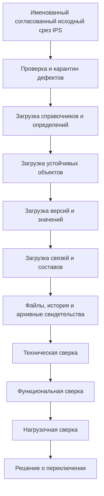

# Выполнение миграции и доказательство эквивалентности

## Перенос адресов частей и словарного смысла

Введение [элементов и понятий](Elements-and-concepts) не разрешает переосмыслить старые ссылки под прежним обозначением. План перехода должен сохранять проверяемое соответствие старых и новых адресов, область владельца и возможность чтения прежней истории. Неизвестный формат или недоступное содержание дают явное ограничение, а не подбор похожего объекта.

При переносе маршрутов две обработки по одной инструкции остаются двумя применениями. При переносе классификатора положение в дереве не принимается автоматически за идентичность понятия. На приёмке нужны примеры перестановки, копирования, разделения частей и уточнения словаря: прежние замечания, выполнения и основания правил не должны перейти к другим целям.

## Три разных процесса, которые нельзя смешивать

Важно различать:

1. **Подготовку модели по описаниям IPS** — получение черновика типов, свойств и связей для проверки специалистами. Сами изделия и заказы при этом ещё не перенесены.
2. **Первичный переход с IPS** — перенос предметных данных и проверку пользовательского поведения между разными архитектурами.
3. **Дальнейшее развитие Interlink** — управляемый переход базы между редакциями её предметной модели.

Первичный переход требует карты соответствий и предметной проверки. Для последующих миграций сравниваются смысловые изменения модели и необходимые преобразования установленной базы. Часть плана можно получить автоматически, но перенос значения с изменением его предметного смысла требует явно заданного правила.

Обычная инженерная правка — отдельная работа: изменение давления насоса не является миграцией модели. Сохранение её черновика не меняет схему базы и не публикует содержание версии. Публикация согласованного результата также не означает установку новой модели.

## Последовательность промышленного перехода

Схема показывает смысловые зависимости, а не универсальный порядок отдельных записей. Целевой план загрузки должен учитывать взаимные ссылки: необходимые адреса и их принадлежность подготавливаются согласованно, после чего проверяется полнота данных. Производственный сценарий не считается проверенным, пока не подтверждены структура, пользовательские версии и точные состояния, на которые он опирается.

## Пробная загрузка

Первая загрузка выполняется в изолированную базу. Целевой договор повторяемости относится только к тому же именованному исходному срезу, точной редакции модели, правилам и версии средства преобразования. Для каждой исходной записи должен сохраняться один итог — перенесена, утверждённо пропущена, помещена в карантин, ожидает безопасного повтора или завершилась окончательной ошибкой; предупреждения прилагаются отдельно.

Ошибки не исправляются незаметно. Они попадают в отчёт:

- исходная сущность;
- нарушенное правило;
- выбранное действие;
- ответственное лицо;
- результат повторной проверки.

Целевая база открывается для такой загрузки только после проверки установленного пакета модели. Пакет фиксирует точные определения, зависимости, правила перехода и чтения истории. Совпадения номера выпуска или названий полей недостаточно. При расхождении с фактической базой перенос останавливается до выяснения причины.

## Техническая сверка

Проверяются:

- количество объектов, пользовательских версий, опубликованных состояний, рабочих копий, связей и значений по согласованным категориям;
- сохранность глобальных идентификаторов IPS и таблицы соответствий;
- отсутствие висячих ссылок;
- правильность назначенных основных версий и ссылок на опубликованное содержание;
- отсутствие лишних активных черновиков одной версии внутри одной рабочей области; параллельные области не считаются дубликатами автоматически;
- происхождение версий и состояний, включая ветви, копирование и сохранённые основания изменений;
- допустимость концов связей;
- справочники и единицы измерения;
- контрольные суммы файлов;
- полный список исключённых и карантинных данных.

Простое совпадение числа строк недостаточно: одна универсальная строка IPS может разложиться на несколько предметных строк Interlink или, наоборот, несколько технических записей объединиться в один объект.

## Функциональная сверка

Одни и те же пользовательские сценарии исполняются в IPS и целевом контуре:

- поиск по обозначению и атрибутам;
- открытие карточки и истории версий;
- состав на выбранных условиях;
- обратное применение;
- жёсткая конкретизация пользовательской версии и отдельная фиксация точного опубликованного состояния;
- мягкая конкретизация отдельных позиций, её снятие и восстановление по жизненному циклу;
- применяемость;
- документы и ссылки;
- изменение объекта;
- заказ и производственный состав;
- табличные справочники, формулы, допустимые замены и матрицы совместимости;
- права и доступные действия.

Сравнивается не внутреннее число таблиц, а пользовательский результат и объяснение расхождения. Например, мало получить одинаковое дерево сегодня: нужно проверить, что после изменения одной и той же версии жёсткая конкретизация ведёт себя ожидаемо, а историческая передача заказа остаётся прежней.

## Дифференциальная проверка составов

Для набора эталонных изделий обе системы получают один сохранённый набор условий: идентичность исходного среза, редакцию модели, головное изделие, площадку, серию или заказ, момент действия, политику и явный контекст подбора. Сравниваются:

- присутствующие позиции;
- выбранные объекты, пользовательские версии и точное содержимое там, где оно обязательно;
- количества;
- порядок;
- причины выбора;
- ошибки и неоднозначности;
- документы и производственные данные.

Известное расхождение исторических источников IPS по порядку применяемости и конкретизации нельзя закрыть предположением. Оно проверяется на целевой установке и фиксируется в профиле миграции.

Для замен проверяется весь комплект: какие позиции исключены и включены, с какими количествами и по чьему решению. Если аналоги настроены для конкретной исходной версии, сначала нужно установить именно эту версию и относящиеся к ней правила, а не читать единственный общий список аналогов объекта. Совместимость проверяется не только по названиям вариантов, но и по фактически выбранному содержимому: новый материал или мощность могут изменить допустимость сочетания.

Для табличного справочника сравниваются реальные строки, единицы, правила вычисления и смысл пустых значений. Полнота всех сочетаний осей проверяется лишь для набора, который действительно заявлен полной сеткой. Отсутствие винта диаметром 8 мм и длиной 175 мм в каталоге стандартных изделий не является само по себе дефектом переноса.

## Нагрузочная сверка

Проверяются одинаковые профили:

- точечное чтение;
- карточка с типовыми атрибутами;
- широкая выборка;
- раскрытие состава разной глубины;
- обратное применение компонента;
- параллельная работа пользователей и агентов;
- запись и конфликт изменения;
- массовый импорт;
- чтение опубликованного снимка.

Результат включает время ожидания пользователя, число обслуживаемых операций, поведение при пиках и потребление ресурсов. Техническая команда прикладывает подробные измерения. Только такой протокол позволяет обоснованно сказать, где Interlink быстрее IPS и какова эксплуатационная цена новой модели.

## Репетиция переключения

До промышленного перехода выполняются минимум две полные репетиции на свежей копии данных. Измеряются:

- время остановки;
- время выгрузки, загрузки и проверки;
- объём карантина;
- длительность переключения интеграций;
- процедура возврата до точки необратимости;
- способность пользователей выполнить критические операции.

Первоначальный целевой порядок обновления схемы предполагает окно обслуживания: новые операции не допускаются, начатые завершаются, затем меняется база. Переход без остановки не обещается. Если установка прервана после частично выполненных преобразований, приложение остаётся закрытым до проверенного восстановления; нельзя просто включить прежнюю модель поверх уже изменённой базы.

Для перехода с IPS отдельно проверяются последние изменения после исходного среза и передача единственного права записи. План возврата должен учитывать данные, которые пользователи успели создать в Interlink. Простое включение старой копии IPS их не восстановит: нужен доказанный обратный перенос, запрет новых записей в контрольный период либо заранее согласованная точка, после которой применяется другой способ исправления.

## Последующие миграции Interlink

После перехода новая редакция предметного описания сравнивается со старой по устойчивому смыслу определений, а не только по названиям. Изменения делятся на:

- обычно совместимые по данным — новый необязательный атрибут или средство ускорения поиска; длительность установки всё равно проверяется;
- условно совместимые — обязательное поле с заполнением, ужесточение ограничения, перевод расширения в колонку;
- разрушающие — удаление, сужение домена, смена области ссылки или стратегии хранения.

Переименование распознаётся отдельно по устойчивой идентичности и явному описанию перехода. Большие изменения в целевом процессе проходят этапы «расширить → перенести → проверить → переключить → удалить старое». Это последовательность преобразования, а не обещание непрерывной работы приложения. Только длительный шаг, специально спроектированный для порций, сможет продолжиться от подтверждённой контрольной точки; базовый договор не обещает возобновление любого шага, общий процент или универсальную кнопку повтора.

Оператор должен различать начатую попытку, подтверждённую успешную установку и модель, разрешённую для работы сейчас. Ошибка не делает попытку успешной, а потеря ответа не доказывает неуспех. В последнем случае сначала устанавливается фактический результат. Новый допуск приложений открывается лишь после проверки преобразованных данных, истории и соответствия всего установленного пакета.

## Защита истории

Разрушающая миграция не должна уничтожить:

- неизменяемое опубликованное содержание пользовательских версий;
- содержание их составов;
- точные неизменяемые снимки каждой передачи заказа и базовые снимки;
- точный контекст и происхождение снимков;
- возможность прочитать старый формат свидетельства и правильно истолковать его значения.

Для истории нужны не только сохранённые идентификаторы. Необходимо удержать точную старую модель, правила чтения чисел, единиц и справочных значений, а также сами файлы. Контрольная сумма файла подтверждает соответствие найденных байтов, но не заменяет файл. Если новое представление не сохраняет смысл, миграция оставляет прежнее представление со средствами чтения либо выполняет доказанный перенос без потерь. Без этого удаление обязательных данных блокируется.

Историческая публикация не пересобирается по текущему справочнику и шаблону отчёта. При этом право открыть её проверяется по действующим полномочиям пользователя: сохранённое когда-то право доступа не становится бессрочным разрешением.

## Пример 1. Переименование типа документа

Предприятие переименовывает тип «Паспорт покупного оборудования» в «Паспорт комплектующего». Смысл типа и устойчивые адреса документов сохраняются. Специалист утверждает именно переименование, а не создание нового вида с повторной загрузкой. После установки поиск использует новое название, старые ссылки и история заказов продолжают открываться. Если одновременно изменились обязательные реквизиты, это отдельная часть плана с собственной проверкой данных.

## Пример 2. Обязательный класс точности

Для миллиона зубчатых колёс вводится обязательный класс точности. Часть старых карточек содержит его только в чертежах. Сначала появляется допускающее пустое значение свойство; для дальнейшей работы технолог заполняет подтверждённые значения и разбирает неясные случаи. Затем проверяется готовность рабочих данных, а обязательность вводится для последующих публикаций по согласованному переходу. Прежние опубликованные состояния не дополняются задним числом: они читаются по старой модели, а более позднее уточнение имеет отдельное основание. Система не подставляет класс «по умолчанию» ради успешного окончания переноса.

## Пример 3. Перевод расширения насоса

Параметр «Содержание абразива» сначала вели как местное расширение карточек насосов. Теперь по нему регулярно подбирают уплотнения, и он становится штатным числовым свойством модели. Значения «2 %», «0,02 доли» и «по опросному листу» нельзя перенести одним механическим правилом. Первые два можно привести к согласованной единице лишь после подтверждения одинакового основания: оба выражают, например, массовую долю. Если одно значение означает массовую, а другое объёмную долю, такого пересчёта недостаточно. Третье требует предметного решения. После проверки текущая работа использует один путь значения; старые публикации сохраняют прежнюю интерпретацию и не переименовываются задним числом.

## Пример 4. Сужение допустимых типов связи

Для станочной оснастки связь «Рабочая документация» раньше разрешала любой документ, а теперь только чертёж и инструкцию. Проверка находит также протоколы испытаний и паспорта. Владелец данных решает, как представить эти отношения в новой модели, или отклоняет сужение. При этом связи в уже утверждённом комплекте документов должны оставаться читаемыми: исправление активной модели не разрешает удалить историческое основание выпуска.

## Решение о переключении

Переход разрешается, когда:

- критические технические расхождения отсутствуют;
- функциональные эталоны подтверждены владельцами;
- объём карантина принят;
- нагрузочный профиль соответствует ожиданиям;
- интеграции прошли репетицию;
- архив и возврат проверены;
- назначен единственный владелец данных после переключения.

## Критерии приёмки

1. Загрузка того же среза при тех же версиях модели, правил и средства преобразования повторяема и трассируема до исходной записи.
2. Все исключения перечислены, а не потеряны.
3. Эталонные составы совпадают по предметному результату.
4. Проверены принадлежность и смысл исторических состояний, а для файлов — наличие содержимого и соответствие контрольным суммам.
5. Две репетиции укладываются в согласованное окно.
6. Сравнительный нагрузочный отчёт воспроизводим.
7. После переключения нет двойной авторитетной записи.
8. Разрушающая миграция не проходит без доказательства сохранности истории.
9. Сбой установки и потерянный ответ не открывают приложение на частично преобразованной базе.
10. Проверка точного состояния, мягкой конкретизации, комплектов замен и табличной НСИ входит в применимый набор эталонов, а не откладывается как необязательное улучшение.

## Состояние реализации

По документированному срезу сентября 2026 года уже существуют проверка модели, смысловое сравнение, классификация риска и планировщик, формирующий описание перехода без применения к действующей базе. Есть основа каталога модели; создание предметных таблиц развивается отдельно. Полный исполнитель установки, безопасная активация, промышленный загрузчик IPS и инструментарий сравнительной приёмки пока не образуют готового сквозного механизма. Описанный процесс — целевой регламент, по которому предстоит доказать готовность первой миграции.

## Связанные документы

- [[Стратегия миграции IPS|Data-IPS-migration-strategy]]
- [[Предметный язык и редакции модели|Data-model-language]]
- [[Выпуск и установка проверенной модели|Data-release-and-installation]]
- [[Статусы и риски|Data-status-risks-acceptance]]
- [[Многомерные таблицы|Multidimensional-tables]]
- [[Соответствия по нескольким осям|Coordinate-maps]]
- [[Матрицы совместимости|Compatibility-matrices]]
