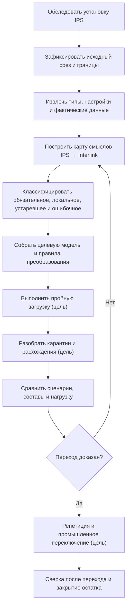

# Как продуктовые специалисты участвуют в переносе IPS

## Миграция — совместная предметная работа

Автоматическая загрузка может перенести строки, но не способна сама решить, что в конкретной установке IPS является обязательной бизнес-семантикой, историческим исключением или ошибкой данных. Поэтому миграция строится как совместная работа специалистов IPS, владельцев предметных областей, архитектора Interlink, внедрения и эксплуатации.

Цель — не только получить одинаковое число записей. Нужно доказать, что пользователи выполняют обязательные сценарии и получают объяснимо эквивалентный результат там, где поведение должно сохраниться.

## Основные участники

| Участник | Основная ответственность |
|---|---|
| Продуктовый специалист IPS | Объяснить реальную семантику, варианты настройки и пользовательские ожидания |
| Ключевые пользователи | Подтвердить рабочие сценарии и исключения |
| Владелец предметной области | Принять целевые термины, очистку и допустимые отличия |
| Архитектор модели Interlink | Построить целевую типизированную модель |
| Специалист миграции | Извлечь, сопоставить, преобразовать и доказать происхождение |
| Эксплуатация | Подготовить среды, окно, повтор, переключение и наблюдение |
| Владелец интеграции | Управлять временным сосуществованием и внешними идентификаторами |

## Полный путь перехода

Схема описывает требуемый проектный процесс. Средства пробной загрузки, происхождения, карантина, обратной записи и переключения пока не образуют готового продукта.

## Шаг 1. Обследование конкретной установки

Нельзя мигрировать «IPS вообще». Нужно зафиксировать:

- версии и установленные модули;
- пользовательские типы, атрибуты и справочники;
- жизненные циклы и права;
- механизмы подбора версий;
- структуры, производственные ведомости и заказы;
- интеграции, файлы и архивы;
- объёмы, глубину составов и рабочую нагрузку;
- известные обходные процессы пользователей;
- требования хранения и юридической значимости.

Результат обследования имеет владельца и дату. Если установка продолжает изменяться, отклонения управляются отдельно.

## Шаг 2. Исходный неизменяемый срез

Для повторяемой миграции нужен именованный исходный срез с доказанной согласованностью и точными границами. Предпочтителен согласованный транзакционный снимок источника. Если IPS нельзя получить целиком одним снимком, фиксируются начало и конец захвата, исходная и конечная отметки журнала изменений, порядок событий и правило сведения дельты. Одной отметки времени недостаточно. Формирование такого среза является задачей проекта переноса и пока не готовой функцией Interlink.

Если IPS продолжает работу до переключения, изменения после среза попадают в отдельный журнал дельты. Нельзя незаметно смешивать данные разных моментов и объявлять результат полным.

## Шаг 3. Карта смыслов

Для каждого значимого понятия фиксируется:

- термин и описание IPS;
- физические источники и варианты хранения;
- фактические пользовательские правила;
- целевой тип, свойство или связь Interlink;
- правило идентичности и версий;
- преобразование значений;
- допустимые потери или изменение поведения;
- контрольный пример;
- владелец решения.

Внешне одинаковые столбцы могут иметь разный смысл, а один смысл IPS может храниться в нескольких путях. Карта опирается на работу системы и пользователей, не только на имя таблицы.

## Шаг 4. Классификация наследия

Каждый элемент относится к одной из групп:

- обязательная функция, которую нужно воспроизвести;
- локальное требование предприятия;
- исторический артефакт, который сохраняется только для чтения;
- ошибочные или неполные данные, требующие очистки;
- реализационная особенность IPS, которую не следует переносить буквально;
- открытый вопрос без достаточного доказательства.

Решение не удалять устаревший механизм из нового продукта должно быть таким же явным, как решение его перенести.

## Шаг 5. Черновик целевой модели

По карте собираются модули Interlink. Специалист IPS проверяет не предметный язык модели, а понятный предметный отчёт:

- какие типы и версии появятся;
- как представлены состав и позиции;
- что станет точной фиксацией, применяемостью или правилом;
- как сохранятся итерации и история;
- какие справочники объединяются или разделяются;
- где поведение сознательно изменено.

## Шаг 6. Пробная загрузка

Целевое средство загрузки должно работать порциями с устойчивыми исходными идентификаторами. Продолжение возможно только для специально спроектированного длительного шага, от подтверждённой контрольной точки и при неизменных исходном срезе, редакции модели, правилах и версии средства преобразования. Универсальный безопасный повтор любого шага не обещается.

Для каждой исходной записи назначается ровно один взаимоисключающий итог:

- перенесена;
- пропущена по утверждённому правилу;
- помещена в карантин;
- ожидает безопасного повтора;
- завершилась окончательной ошибкой.

Предупреждения и диагностика прилагаются к итогу и не образуют второй итог. Цепочка происхождения должна связывать исходный срез и запись, запуск и порцию, отпечаток целевой модели, редакцию правила, версию средства преобразования, решение и автора.

## Целевое рабочее место разбора карантина

Будущее рабочее место принимающего продукта должно показывать продуктовому специалисту предметный случай. Задания, владельцев, сроки, полномочия и решения хранит принимающий продукт; миграционный контур связывает их с исходной и целевой идентичностями.

- исходный объект IPS и его контекст;
- причину, по которой автоматическое правило не сработало;
- предлагаемые целевые варианты;
- количество похожих записей;
- влияние решения;
- образцы документов и составов;
- владельца и срок.

Решение уполномоченного владельца может применяться к одному объекту, доказанной группе или стать новой версией общего правила преобразования. Массовое правило сначала проверяется на выборке. Каждое исправление сохраняет автора, основание, исходный срез и редакцию правила и не переписывает происхождение задним числом.

### Пример

В IPS поле «Материал» иногда содержит марку стали, иногда ссылку на справочник, а иногда текст «по чертежу». Миграция не помещает всё в одно строковое поле Interlink. Ссылки сопоставляются справочнику, марки нормализуются, а «по чертежу» переводится в отдельный признак неопределённости с заданием владельцу, если материал обязателен.

## Доказательство технической полноты

Сверяются:

- количество исходных и целевых объектов по классам;
- идентичности и версии;
- связи и позиции;
- файлы и контрольные отпечатки;
- справочники и значения;
- карантин, ошибки и исключения;
- покрытие всего исходного среза.

Утверждение «очередь обработана» недостаточно. Нужно доказать, что каждая запись источника либо перенесена, либо находится в известном принятом состоянии.

## Доказательство функциональной эквивалентности

Ключевые пользователи выполняют одинаковые деловые сценарии при одном сохранённом наборе условий: исходном срезе IPS, точной редакции модели, площадке, моменте действия, политике и явном контексте подбора версий:

- найти объект и его версию;
- открыть карточку и историю;
- развернуть состав;
- подобрать версии в известных режимах IPS;
- начать и провести изменение;
- сформировать производственную ведомость и заказ;
- открыть точную историческую публикацию;
- выполнить обмен и проверить результат.

Сравниваются не только экраны, а выбранные объекты, версии, причины, ошибки и дальнейшие действия.

## Дифференциальная проверка составов

Для набора контрольных изделий IPS и Interlink получают один сохранённый контекст: идентичность исходного среза, точную редакцию модели, головное изделие, площадку, серию или заказ, момент действия, политику и явные условия подбора. Сравниваются:

- присутствующие позиции;
- выбранные объекты и замены;
- точные версии;
- количество и единицы;
- глубина и повторные вхождения;
- применяемость;
- причины различий.

Любое отличие классифицируется как ошибка переноса, принятая новая семантика, дефект исходных данных или открытый вопрос. Оно не теряется в общей статистике.

## Нагрузочная проверка

На объёме, близком к предприятию, измеряются поиск, карточка, обратная применяемость, глубокий состав, пакет изменения, массовая загрузка и агентские запросы. Сравнение с IPS учитывает инфраструктуру и сценарий, а не только среднее время одной операции.

## Стратегии переключения

### Одномоментный переход

Подходит при ясной границе, приемлемом окне остановки и полной готовности интеграций. После финального среза запись в IPS прекращается, выполняется дельта и пользователи переходят.

### Поэтапный переход по предметным областям

Области переходят последовательно. Для каждой заранее определён источник истины и допустимые направления ссылок. Нельзя позволять двум системам независимо менять один объект.

### Сопровождающий режим поверх IPS

IPS остаётся авторитетной, а новая система читает точные внешние объекты, анализирует и координирует работу. Обратная запись — целевой механизм принимающего продукта и отдельного соединителя, а не готовая функция Interlink. Принимающий продукт должен проверить полномочия, надёжно сохранить намерение и внешний идентификатор операции, защищать от дубля только по явно согласованному договору и сверять результат с IPS. При потерянном ответе фиксируется «исход неизвестен»: сначала запрашивается состояние в IPS, а слепой повтор запрещён.

## Репетиция переключения

Команда полностью повторяет:

- финальный срез;
- дельту;
- длительность каждой операции;
- переключение приложений и интеграций;
- контрольные сценарии;
- решение остановиться или продолжить;
- восстановление;
- коммуникацию пользователям.

План промышленного окна основывается на измеренной репетиции.

## Что происходит после перехода

В течение согласованного периода работают усиленные сверки. Открытые расхождения имеют владельцев. Исходный срез IPS и средства чтения сохраняются по политике доказательности.

Старая система не уничтожается автоматически после первого успешного дня. Условия архивирования и отключения определяются отдельно.

## Пример 1. История детали и итерации

У детали IPS есть базовая версия, несколько версий и промежуточные итерации рабочей копии. Специалист IPS определяет, какие итерации имеют внешние ссылки или юридическое значение. Значимые состояния сохраняются как исторические артефакты либо версии; чисто пользовательские точки возврата могут не становиться официальными версиями Interlink. Решение проверяется на реальных расследованиях и отчётах.

## Пример 2. Производственная ведомость и заказ

Миграция должна разделить самостоятельную версионную производственную ведомость, живой производственный заказ и точный неизменяемый снимок **каждой** передачи заказа в исполнение. Их нельзя слить в один объект только потому, что в отдельных процессах IPS они идут последовательно. Уже переданный заказ читается по своему снимку без живого переподбора; перепланирование создаёт следующую редакцию заказа и новый снимок, не меняя прежнюю передачу.

Контрольный сценарий проверяет создание ведомости, согласование, формирование заказа, перепланирование и сохранение прежней передачи.

## Пример 3. Пользовательская оснастка

На одном заводе в IPS создан локальный тип оснастки с собственными атрибутами и файлами. Архитектор решает, становится ли он локальным модулем Interlink или общим модулем технологии. Пробная миграция проверяет связи с операциями, версии файлов, поиск и права, а не только карточки.

## Критерии решения о переходе

Переход разрешается, когда:

- границы источника и дельты доказаны;
- обязательные сценарии пройдены;
- различия утверждены владельцами;
- карантин находится в допустимом согласованном состоянии;
- для каждого перенесённого объекта доказана связь с исходной записью и срезом, а решение по карантину сохраняет автора и основание;
- интеграции и внешние идентификаторы проверены;
- для сопровождающего режима проверены потерянный ответ, договор безопасного повтора и последующая сверка с IPS;
- нагрузка укладывается в цели;
- репетиция подтверждает окно;
- восстановление проверено;
- пользователи обучены на новых механизмах;
- статус реализации Interlink соответствует выбранному объёму, а недостающие функции не замаскированы ручными обещаниями.

## Состояние реализации

Стратегия и доказательные требования описаны. Готовых средств полного извлечения IPS, автоматического построения модели, промышленного исполнителя миграций, хранения происхождения, карантинного рабочего места, обратной записи и дифференциального стенда пока нет. Реальный проект перехода должен начинаться с обследования и опытного контура, а не с обещания автоматической конвертации всей базы.

Связанные документы: [[стратегия миграции|Data-IPS-migration-strategy]], [[выполнение и доказательство|Data-migration-execution]], [[жизненный цикл модели|Data-model-lifecycle]], [[выпуск и установка|Data-release-and-installation]], [[открытые вопросы миграции|Questions-migration]].
