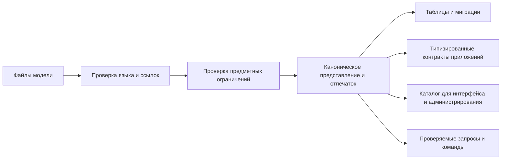

# DSL как язык модели предприятия

## Что такое DSL

DSL — Domain-Specific Language, то есть специализированный предметный язык. В Interlink это текстовый язык описания модели инженерных данных. Его задача — не заставить продуктового специалиста программировать, а дать единую, однозначную и проверяемую форму для того, что в обычной PLM-системе распределено между конфигуратором, таблицами метаданных, установочными сценариями и прикладным кодом.

DSL является авторитетным источником закрытой модели и границ настройки. База данных хранит развёрнутый результат и локальные разрешённые изменения предприятия, но не может незаметно переопределить смысл поставляемых типов.

## Что описывается в языке

Язык охватывает:

- модель, её стабильный идентификатор и версию;
- предметные модули и зависимости между ними;
- типы объектов, наследование и версионность;
- типы связей, допустимые концы, кардинальность и формулировки;
- позиции состава и политику циклов;
- кортежи;
- определения и привязки атрибутов;
- списки допустимых значений;
- вычисляемые представления и правила отображения экземпляра;
- стратегии физического хранения, колонки и индексы;
- уровни владения и разрешённого расширения;
- начальные системные экземпляры;
- именованные запросы и схемы обхода;
- переходы между версиями модели и специальные шаги обработки данных.

Не все конструкции уже исполняются в текущей фазе. Язык развивается по версиям, а незнакомая или ещё не поддержанная форма должна быть явно отвергнута, а не молча пропущена.

## Почему язык лучше набора экранов конфигуратора

Экран удобен для ввода, но сам по себе плохо отвечает на вопросы: что изменилось, кто проверил зависимость, как повторить изменение в другой среде и какая версия модели соответствует данным.

Текстовая модель даёт:

- сравнимую историю изменений;
- совместное рецензирование предметного и технического смысла;
- автоматическую проверку ссылок, наследования и ограничений;
- воспроизводимую сборку для нескольких сред;
- точный отпечаток активной модели;
- возможность создать поверх языка удобный визуальный редактор без превращения редактора в второй источник истины.

Будущий административный интерфейс должен редактировать модель или формировать проверяемый патч, показывать последствия и только затем запускать управляемую поставку.

## Стабильные идентификаторы и переименования

Имя типа удобно человеку, но не должно определять его историческую идентичность. Поэтому каждое публичное определение имеет стабильный идентификатор. Если «Покупное изделие» переименовано в «Закупаемый компонент», миграция распознаёт переименование, сохраняет данные и меняет представления. Новый идентификатор означал бы другой тип.

Этот механизм особенно важен при миграции IPS: переносимый глобальный идентификатор исходного определения, обозначаемый GUID, можно сопоставить с устойчивым идентификатором целевой модели и сохранить таблицу соответствия как доказательство перехода.

## Модули и сборка продукта

Модель делится на предметные модули. Например:

- основа инженерных объектов;
- конструкторская документация;
- технологическая подготовка;
- заказы;
- требования Alvatune;
- отраслевое расширение предприятия.

Модуль имеет версию, зависимости, собственное пространство имён и префикс физических объектов. Принимающее приложение выбирает точные версии модулей, Interlink проверяет, что зависимости замкнуты и совместимы, после чего компилирует одну согласованную модель.

Это позволяет нескольким командам поставлять предметные области независимо, не создавая отдельные объектные ядра или конфликтующие таблицы.

## Пять уровней проверки

Продуктово проверки можно представить так:

1. Текст языка читается однозначно.
2. Все названные типы, атрибуты и модули существуют.
3. Наследование, области атрибутов и концы связей совместимы.
4. Физическое отображение не создаёт коллизий таблиц, колонок и индексов.
5. Модель можно безопасно превратить в требуемые артефакты текущей версии инструментария.

Ошибка раннего уровня закрывает зависимые выводы. Некорректная модель не должна публиковать частично обновлённые результаты.

## Начальные данные

Язык может поставлять не только определения, но и системные экземпляры: обязательные стадии, типовые справочники, базовые теги или предметные шаблоны. Они получают одинаковые переносимые идентификаторы во всех установках.

Уровень защиты задаёт, может ли предприятие менять такой экземпляр. Обновление сравнивает прежнее значение поставщика, новое значение и локальную правку. Пользовательское изменение сохраняется либо попадает в явный конфликт, но не исчезает молча.

## Пример 1. Новая разновидность редуктора

Продуктовая команда добавляет тип «Планетарный редуктор» как потомок редуктора, определяет передаточное отношение, число сателлитов и допустимые связи. До появления таблиц компилятор проверяет наследование, имена, диапазоны и физическое отображение.

После рецензирования новая версия модели создаёт таблицу и программные контракты одним согласованным выпуском.

## Пример 2. Переименование технологической операции

Тип «Операция мехобработки» получает более точное имя «Операция механической обработки». Стабильный идентификатор не меняется. Семантическое сравнение показывает переименование, а не удаление с потерей данных.

## Пример 3. Отраслевой модуль насосного оборудования

Поставщик PLM выпускает основной модуль изделий, а предприятие — отдельный модуль насосных характеристик. Предприятие точно фиксирует совместимую версию основы. При обновлении несовместимость обнаруживается до изменения рабочей базы.

## Пример 4. Справочник материалов предприятия

Поставщик добавляет новый стандартный материал, а предприятие ранее добавило собственную марку и изменило русскую подпись существующей. При повторной поставке новый материал появляется, локальная марка сохраняется, а конфликт подписи показывается ответственному.

## Ограничения

DSL не является языком произвольных программ, сценариев интерфейса или скрытых обработчиков. Он намеренно декларативен. Сложная предметная обработка выполняется типизированными модулями хоста, а специальное преобразование данных при миграции — проверяемым шагом перехода.

## Критерии приёмки

1. Изменение порядка файлов не меняет смысл модели.
2. Одинаковый полный вход и версия инструментария дают одинаковый результат.
3. Переименование по стабильному идентификатору не теряет данные.
4. Некорректная модель не публикует частичные артефакты.
5. Несовместимая зависимость модулей обнаруживается до развёртывания.
6. Локальные настройки и начальные данные согласуются без молчаливого затирания.

## Состояние реализации

Разбор, связывание, нормализация, отпечаток, модули и манифест реализованы. Генерация основных типизированных форм дошла до локально выполненного этапа 8 фазы 2; финальная приёмка открыта. Семантические миграции, полный каталог БД и эксплуатационные расширения относятся к следующим фазам.

## Связанные документы

- [Возможности системы типов](Data-type-system-capabilities)
- [Расширяемость и настройка](Data-extensibility)
- [Миграция базы IPS](Data-IPS-migration-strategy)

