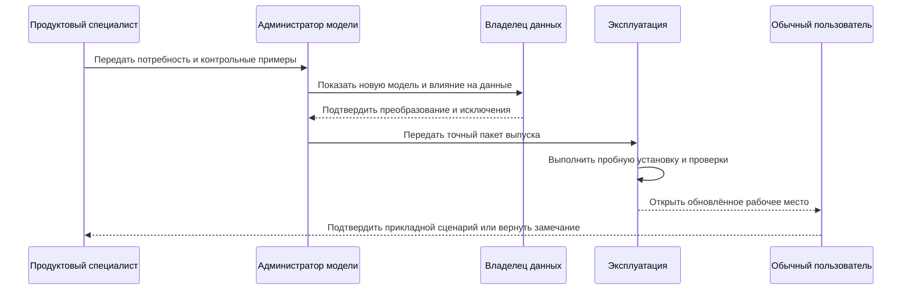
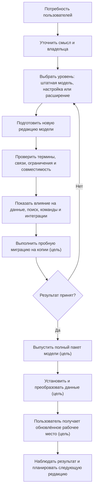

# Как изменяется модель предприятия

## Главное для продуктового специалиста

Обычный конструктор, технолог или планировщик не работает с предметным языком модели напрямую. Он формулирует потребность: добавить характеристику, новый тип документа, связь, справочник или правило. Подготовкой модели занимаются назначенные специалисты, а пользователь получает уже проверенную карточку, поиск, команды и ограничения.

Изменение модели — это управляемая поставка продукта внутри предприятия, а не редактирование таблицы администратором «на ходу».

Ниже описан **целевой промышленный процесс**. Уже реализованный компилятор читает, связывает, проверяет и нормализует модель и формирует часть типизированных прикладных представлений. Анализ действующей базы, физический план PostgreSQL, пробная и промышленная миграция и административное рабочее место пока отсутствуют.

## Участники и ответственность

### Продуктовый специалист предметной области

Описывает деловую потребность, термин, примеры, обязательность, правила заполнения и ожидаемые пользовательские сценарии. Он отвечает за смысл, но не обязан знать устройство базы.

### Архитектор предметной модели

Определяет, является ли потребность новым типом, признаком, связью, справочником, состоянием или расширением. Проверяет повторное использование и не создаёт второй термин для уже существующего смысла.

### Администратор модели предприятия

Готовит изменение на предметном языке описания модели, собирает модули и управляет локальными настройками. Он видит техническую диагностику, но работает в рамках разрешённых конструкций.

### Владелец данных и миграции

Определяет, как заполнить новый обязательный признак для существующих записей, как сопоставить старые значения и что делать с неоднозначностями.

### Эксплуатационный специалист

Проводит пробную установку, измеряет время, блокировки и нагрузку, готовит переключение, наблюдение и восстановление.

### Разработчик принимающего приложения

Использует опубликованную модель и типизированные контракты для карточек, процессов и интеграций. Не должен обходить модель прямой записью.

### Обычный пользователь

Проверяет, что новая возможность понятна в реальной работе: поле находится в правильной группе, поиск его использует, ошибка объяснима, старые объекты открываются корректно.

## Полный путь от потребности до рабочего места

Пометка «цель» означает, что сквозной выпуск, миграция, установка и обновление рабочего места ещё не реализованы. Уже работающий компилятор модели является основанием этого пути, но не заменяет его.

## Шаг 1. Формулировка потребности

Хорошее требование отвечает не только «какое поле добавить», но и:

- кто его заполняет;
- для каких объектов;
- является ли значение общим для объекта или меняется между версиями;
- обязательно ли оно;
- кто имеет право менять;
- участвует ли оно в поиске, составе, подборе версий, отчёте или интеграции;
- что происходит со старыми данными;
- какие реальные примеры и исключения существуют.

### Пример

Фраза «добавить климатическое исполнение» недостаточна. Для электродвигателя оно может относиться к конкретной версии, влиять на допустимость аналога и комплектацию заказа. Для типоразмера корпуса это может быть общее классификационное свойство. Эти варианты требуют разной модели.

## Шаг 2. Выбор уровня расширения

### Штатная закрытая модель

Используется для фундаментальных понятий, от которых зависят гарантии системы: идентичность, версия, типизированная связь, пакет изменения, снимок. Предприятие не может произвольно переопределить их смысл.

### Настраиваемая часть

Предназначена для разрешённых списков, степеней готовности, наименований, профилей правил и других параметров в заранее установленной семантической рамке.

### Расширение предприятия

Используется для локального признака или дополнительного предметного типа, который не должен сразу становиться частью общего продукта. Расширение имеет владельца, область и ограничения.

### Новый штатный модуль

Если локальная потребность повторяется, влияет на несколько контуров и получила устойчивую семантику, её можно перевести в версионируемый модуль общей модели. Это отдельное решение, а не автоматическое повышение любого поля заказчика.

## Шаг 3. Подготовка редакции модели

Администратор модели описывает типы, свойства, связи, единицы измерения, ограничения, индексы и начальные справочники на предметном языке DSL — языке описания модели предприятия.

Стабильные внутренние идентификаторы позволяют переименовать пользовательский термин без потери истории. Видимое название может измениться с «Марка материала» на «Обозначение материала», а данные и интеграции продолжают ссылаться на тот же смысл.

Редакция состоит из модулей. Например, общая инженерная основа, модуль технологии, модуль насосного оборудования и локальное расширение предприятия собираются как один согласованный продукт.

## Шаг 4. Проверка модели и будущая проверка базы данных

Уже реализованный компилятор проверяет само описание модели ещё до установки:

- нет ли дублирующихся или конфликтующих идентификаторов;
- существуют ли все ссылочные типы и свойства;
- допустимы ли наследование и связи;
- согласованы ли единицы и диапазоны;
- совместимы ли модули;
- однозначно ли описаны поддерживаемые языком переходы и переименования.

Компилятор не подключается к промышленной базе, не считает затронутые записи, не определяет опасность удаления используемого элемента и не строит физический план PostgreSQL. В будущем отдельный анализатор установки сможет сообщить, например: «свойство становится обязательным, но для 18 420 существующих деталей нет значения».

## Шаг 5. Анализ влияния

**Целевой механизм.** До выпуска должны показываться последствия по нескольким слоям. Сейчас полного автоматического анализа действующей базы, рабочих мест и интеграций нет.

### Данные

Какие записи требуют заполнения, преобразования или разбора исключений? Какие значения не укладываются в новый список или диапазон?

### Хранение и производительность

Какие реальные таблицы, столбцы, ограничения и индексы будут созданы или изменены? Насколько вырастет объём и время установки?

### Пользовательские рабочие места

Какие карточки, формы поиска, деревья, отчёты и объяснения должны отобразить новый признак? Что произойдёт со старым сохранённым фильтром?

### Команды и интеграции

Какие операции должны передавать новое значение? Какие внешние контракты требуют новой редакции и периода совместимости?

### Правила и агенты

Участвует ли признак в подборе версий, применяемости или решениях агента? Получит ли агент точное описание поля, единицы и допустимых значений?

## Шаг 6. Пробная миграция

**Целевой механизм.** После появления физической схемы и исполнителя миграций новая модель должна устанавливаться на контролируемую копию реальных данных. Процесс будет измерять:

- сколько объектов преобразовано;
- какие записи не сопоставлены;
- какие ограничения нарушены;
- сколько времени занимают преобразование и индексация;
- какие блокировки возникают;
- работают ли ключевые карточки, поиски, составы и интеграции;
- совпадает ли результат с ожидаемыми примерами IPS.

Неоднозначные случаи образуют управляемый перечень очистки с владельцами. Они не подменяются случайным значением ради красивой статистики завершения.

## Шаг 7. Рецензирование и решение о выпуске

**Целевой процесс принимающего продукта.** Решение должно приниматься по полному пакету:

- текст потребности;
- новая редакция модели;
- анализ влияния;
- план преобразования;
- результаты пробной миграции;
- пользовательские примеры;
- нагрузочные измерения;
- план установки и восстановления;
- список известных ограничений.

Изменение после рецензирования требует повторной проверки затронутых частей. Выпуск модели должен ссылаться на точное содержание, как и предметное изменение.

## Шаг 8. Установка

**Целевой механизм.** После реализации физической схемы и миграций эксплуатационный контур должен:

1. Проверяет исходную редакцию и готовность среды.
2. Делает предусмотренное резервное и доказательное сохранение.
3. Применяет план физических изменений базы.
4. Преобразует и проверяет существующие данные.
5. Устанавливает соответствующие контракты и принимающее приложение.
6. Выполняет контрольные сценарии.
7. Переключает пользователей либо останавливает выпуск при несоответствии.

Некоторые безопасные добавления могут устанавливаться с минимальным перерывом. Сложное разделение типа, удаление столбца или массовое заполнение требует отдельного окна и репетиции.

## Шаг 9. Что получает обычный пользователь

После будущего полного выпуска пользователь должен видеть не язык модели и не таблицу базы, а предметный результат:

- новое поле в понятной группе карточки;
- единицу измерения и допустимые значения;
- поиск и фильтр;
- новое правило обязательности;
- понятную ошибку при неверном вводе;
- использование признака в составе, отчёте или интеграции;
- историю изменения значения в правильной версии объекта.

Если принимающее приложение ещё не поддерживает новый признак, выпуск модели нельзя объявлять полностью завершённым для пользователя. Модель и интерфейс могут поставляться раздельно технически, но продуктовый план должен показывать обе части.

## Как работает локальный признак предприятия

### Пример. Код внутреннего покрытия

Одному заводу нужен признак «код внутреннего покрытия» для корпусов насосов. Он не является общим свойством всех изделий Interlink.

1. Продуктовый специалист определяет справочник покрытий, обязательность и связь с технологией.
2. Архитектор выбирает локальное расширение версии корпуса насоса.
3. Анализ показывает 4 800 существующих версий без значения.
4. Для действующих изделий значения загружаются из технологических карт; архивные версии остаются без обязательного заполнения по явному правилу.
5. Пробная миграция проверяет карточку, поиск, отчёт и передачу в систему управления производством (MES).
6. После выпуска пользователи получают поле, а агенты — типизированное описание, не произвольный текст.

Если позднее несколько предприятий используют один смысл, расширение может стать штатным модулем с отдельной миграцией и сохранением идентичности данных.

## Пример 2. Новый тип оснастки

Завод внедряет сменные захваты робота как самостоятельные объекты. Требуются версии, файлы, связь с операцией, ресурс и фактические экземпляры.

Это не одно дополнительное поле. Архитектор моделирует тип, его версии, связи с оборудованием и технологической операцией. Анализ влияния включает карточку, дерево оснастки, поиск по грузоподъёмности, обслуживание и интеграцию с MES. Пилот сначала проводится на одной линии, затем модуль расширяется.

## Пример 3. Обязательный класс точности

Для зубчатых колёс класс точности становится обязательным. В базе есть исторические версии без значения.

Политика миграции различает:

- действующие рабочие и выпущенные версии, которые должны быть классифицированы;
- архивные версии, для которых допустима явно отмеченная неизвестность;
- новые версии, которые нельзя провести без значения.

Так сохраняется история и одновременно повышается качество новых данных.

## Конфликт локальных модулей

Текущий компилятор останавливает механически обнаружимый конфликт, например одинаковый устойчивый идентификатор с несовместимыми определениями. Он не умеет по названиям распознать, совпадает ли смысл двух разных идентификаторов. Нельзя без решения человека слить «Климатическое исполнение двигателя» и «Категорию размещения изделия» только потому, что оба поля имеют одинаковый список.

Будущее рабочее место администратора должно показывать владельцев модулей, области использования и варианты разрешения: переиспользовать общий термин, сохранить независимые понятия или разработать новую общую конструкцию.

## Откат и последующее исправление

Простое выключение приложения не отменяет уже выполненное преобразование базы. Поэтому план восстановления зависит от вида изменения:

- до переключения можно вернуть прежнюю копию среды;
- после начала промышленной записи часто требуется следующая исправляющая миграция;
- удаляющие изменения предваряются периодом устаревания и резервным сохранением;
- история опубликованных данных не переписывается задним числом.

В целевом полном процессе принимающий продукт должен хранить происхождение, план, фактический результат и контрольные измерения каждого выпуска. Текущий манифест компиляции содержит более узкий набор сведений и не является полным паспортом установки.

## Как это отличается от IPS

В IPS значительная часть расширяемости связана с метаданными и исторически сложившимися физическими представлениями. Interlink уже делает предметную модель проверяемой версионируемой поставкой; в целевой системе часто используемые типы должны материализоваться в реальные таблицы, а чтение и изменение — использовать согласованные прикладные способы.

Преимущество не в том, что изменение становится безусловно мгновенным. Оно становится объяснимым, воспроизводимым и проверяемым до воздействия на промышленную базу.

## Состояние реализации

Язык модели, его проверка, правила идентичности, манифест и часть типизированных прикладных представлений реализованы в основной версии. Поставка генератора через командную строку и эталонный сквозной пример ещё не завершили приёмку. Генератор физической схемы, планировщик и установщик миграций, автоматизированный анализ всех влияний, административное рабочее место и продвижение между средами ещё не являются готовым продуктом. Документ задаёт целевой процесс поставки.

Связанные документы: [[язык модели|Data-model-language]], [[материализация|Data-database-materialization]], [[расширяемость|Data-extensibility]], [[установка и работа системы|Data-model-runtime]], [[миграция IPS|Data-IPS-migration-strategy]].
