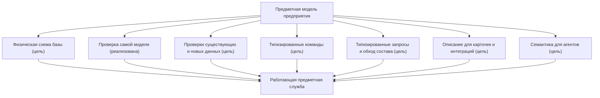
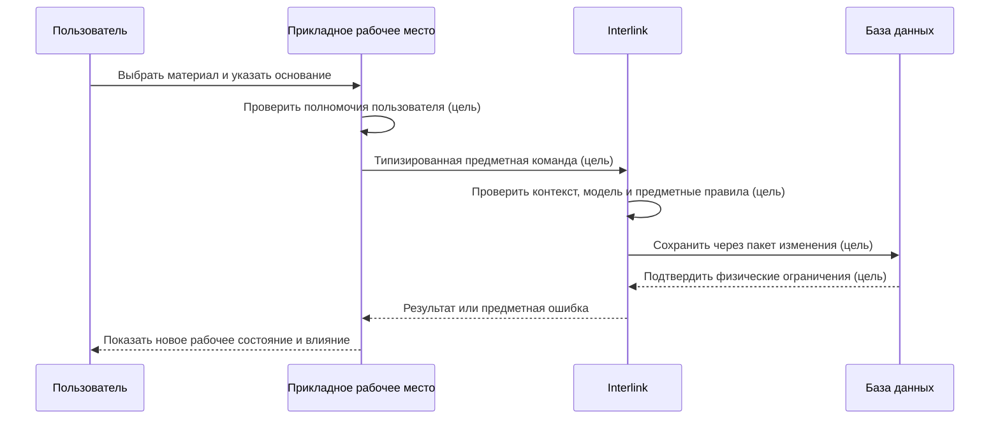

# Как модель превращается в работающую систему

## Зачем объяснять внутренний путь продуктовым языком

Фраза «тип материализуется в таблицу» описывает только часть результата. Продуктовому специалисту важно понимать всю цепочку: как одно определение модели одновременно влияет на хранение, проверку, поиск, команды, интерфейс и работу агентов.

Цель Interlink — не заставить разные команды повторно программировать один и тот же смысл в шести местах.

Сейчас Interlink уже читает, проверяет и нормализует саму модель, собирает модули и формирует часть типизированных прикладных представлений. Физические таблицы PostgreSQL, проверки существующих данных, команды записи, выполнение запросов, эксплуатационные расширения и полный пользовательский путь ниже являются будущими возможностями.

## Одна модель — несколько согласованных поверхностей

Модель является источником согласования, но это не означает, что любой экран возникает полностью автоматически. Принимающее приложение использует описания и контракты, добавляет удобный предметный интерфейс, процессы и проверку полномочий. Пометка «цель» на схеме означает, что этот сквозной результат ещё не реализован.

## Что происходит при сборке модели

### Разрешение модулей

Система соединяет основную модель, отраслевые модули и разрешённые расширения предприятия. Зависимости должны быть явными. Если модуль технологии использует тип «Материал», его точная совместимая редакция известна заранее.

### Семантическая проверка

Проверяются типы, свойства, связи, единицы, ограничения, наследование, индексы и стабильные идентификаторы. Ошибка блокирует выпуск до создания физической базы.

### Построение плана хранения

**Будущая возможность.** Генератор физической схемы должен будет определить для каждого горячего предметного типа реальную таблицу и физические столбцы. Для версии объекта будет отдельно храниться изменяемое между поколениями содержимое. Связи с собственными свойствами получат предметно подходящее хранение и ограничения.

### Создание индексов и ограничений

**Будущая возможность.** Из смысла модели будут строиться индексы для типовых поисков и соединений, а также обязательность, уникальность, ссылочная целостность и допустимые диапазоны. После реализации база данных сможет предотвращать часть ошибок в момент записи, а не обнаруживать их ночным отчётом.

### Создание типизированной поверхности

Часть типизированных представлений уже реализована: идентификаторы, записи, связи и преобразование уже полученных строк результата в предметные записи. Типизированные команды записи и выполнение запросов к PostgreSQL остаются будущими возможностями.

## Как пользовательская запись проходит систему

Рассмотрим изменение материала корпуса насоса.

Пользователь не знает имя таблицы. Целевая физическая материализация позволит быстро найти материал, проверить ссылку и использовать обычные механизмы базы под высокой нагрузкой. Сейчас схема показывает требуемый будущий путь, а не уже готовую запись в PostgreSQL.

## Как в будущем будет выполняться чтение

1. Прикладное рабочее место передаёт цель и явный режим чтения.
2. Если требуется **подобрать** версию, приложение дополнительно передаёт явный контекст подбора. Для чтения уже указанной точной версии, истории всех версий, неверсионного объекта или готового снимка такой контекст не нужен.
3. Interlink строит разрешённый типизированный запрос.
4. База использует физические таблицы и индексы.
5. Версионный слой либо выполняет требуемый подбор, либо читает точное указанное состояние без пересчёта.
6. Результат возвращается с достаточным происхождением и продолжением для больших списков.

В целевом контуре одинаковый предметный запрос будет доступен интерфейсу, интеграции и агенту через контролируемую поверхность. Это должно снизить расхождения между каналами.

## Почему реальные таблицы дают производительность

В универсальном хранилище каждое поле часто записано как отдельная строка «объект — имя свойства — значение». Для поиска редукторов по обозначению, типоразмеру и массе приходится многократно соединять одну большую таблицу и преобразовывать значения.

В целевой физической схеме Interlink часто используемые свойства будут лежать в столбцах своего типа. База будет заранее знать, что масса — число с единицей, обозначение — строка с правилом уникальности, а ссылка на материал ведёт к допустимому типу.

Это позволяет:

- строить узкие предметные индексы;
- использовать статистику базы для планирования запросов;
- разделять очень большие таблицы по выбранной стратегии;
- применять ограничения без дополнительного обхода;
- предсказуемо обслуживать горячие типы;
- масштабировать чтения и фоновые расчёты.

Обещание превосходства должно подтверждаться нагрузочными испытаниями на данных, похожих на установку IPS. Архитектурное преимущество создаёт потенциал, но не заменяет измерение.

## Как сохраняется расширяемость

Не каждый редкий локальный признак требует перестройки горячей таблицы. Модель различает:

- штатные свойства с физическими столбцами;
- настраиваемые значения в разрешённой рамке;
- ограниченные расширения времени работы для редких данных.

В будущем, если расширение станет массовым, будет участвовать в частом поиске или важном ограничении, владелец сможет продвинуть его в штатную модель. Тогда целевой исполнитель создаст столбец и индекс и проведёт управляемую миграцию. Этот эксплуатационный контур ещё не реализован.

Так Interlink сочетает гибкость пилота с производительностью промышленного контура, но не обещает «любое поле в любой момент без цены».

## Как модель влияет на карточку пользователя

Сейчас приложение может использовать проверенные определения типов, свойств, списков и связей и часть типизированных записей. На следующих этапах оно должно получать более полное описание для рабочих мест:

- названия и пояснения;
- тип значения и единицу;
- обязательность;
- допустимые значения;
- принадлежность объекту или его версии;
- доступные операции;
- признаки поиска и сортировки;
- диагностические сообщения.

На этой основе можно построить согласованную форму. Продуктовая команда дополнительно определяет группировку, подсказки, массовые операции и специализированное представление. Для сложного редактора состава или технологии одной автоматической формы недостаточно.

## Как модель влияет на интеграции

В целевом контуре внешняя система будет получать версионируемый контракт. Совместимость каждого потребителя должна подтверждаться принимающим продуктом; неизвестному приложению она автоматически не обещается.

Прикладное приложение и интеграция не должны читать или писать предметные данные напрямую через физические таблицы как через поддерживаемый деловой интерфейс: так теряются версионный режим, правила подбора, история и проверки. Прямая запись запрещена. Диагностическое чтение администратором базы может использоваться для эксплуатации, но не является контрактом приложения и не должно самостоятельно трактовать предметный смысл.

## Как модель в будущем поможет агентам

Агент должен будет получать не неструктурированную выгрузку базы, а предметные типы, свойства, связи, единицы, ограничения и разрешённые команды. Это уменьшит вероятность перепутать массу и длину, объект и версию, рабочее и официальное состояние.

Агенты существенно увеличат число чтений, сравнений и предложений. В целевой системе физические таблицы и индексы должны помогать выдерживать нагрузку, а принимающая платформа отдельно должна закрывать прямой доступ к базе полномочиями, учётными данными и сетевыми ограничениями.

Предложение агента всё равно проходит пакет, предпросмотр, проверку и предусмотренное решение человека или политики.

## Как обрабатываются ошибки

### Ошибка модели

Ошибка самой модели уже обнаруживается при сборке и блокирует выпуск манифеста. Проверка ошибки установки относится к будущему исполнителю миграций.

### Ошибка пользовательских данных — целевое поведение записи

Команда отвергается до проведения: отсутствует обязательное значение, неверна единица, ссылка ведёт к недопустимому типу. Пользователь получает предметное объяснение.

### Конкурентное изменение — целевое поведение записи

Система обнаруживает, что официальная основа или запись изменилась, и не теряет чужую работу. Пользователь обновляет контекст либо разбирает конфликт пакета.

### Ошибка установки — целевое поведение миграций

План миграции прекращается по контролируемой границе. Эксплуатация видит, какие шаги выполнены, какие нет и какой предусмотрен способ восстановления.

### Медленный запрос — целевое поведение исполнения и наблюдения

Наблюдение связывает задержку с типом, запросом, объёмом и редакцией модели. Решение может включать индекс, изменение модели, проекцию или ограничение сценария, но не скрытое изменение предметного результата.

## Пример 1. Поиск подшипников

После реализации физической схемы и запросов конструктор сможет искать радиальные подшипники по внутреннему диаметру, грузоподъёмности и производителю. Эти характеристики будут типизированы и индексированы, а поиск будет возвращать порции результатов с единицами и применёнными условиями.

После добавления часто используемого признака «класс зазора» анализ влияния предлагает физический столбец и индекс. Пробная миграция заполняет значение по справочнику, а неполные записи попадают владельцу нормативно-справочной информации (НСИ).

## Пример 2. Многоуровневый состав станка

Планировщик разворачивает большой состав обрабатывающего центра. Физические таблицы связей и точные определения направлений позволяют базе эффективно проходить дерево. Версионный подбор применяет один контекст на всех уровнях и сохраняет причину выбора каждой версии.

Для повторяющегося массового чтения в будущем может использоваться техническая проекция — заменяемое ускоряющее представление. Она способна отставать от источника истины, поэтому должна сообщать редакцию и свежесть, может быть перестроена или удалена и не служит основанием выпуска либо аудита без проверки актуальности. Выпуск заказа всё равно строит и проверяет всё дерево точных версий.

## Пример 3. Массовые предложения агентов

В целевом сценарии сотни агентских задач анализируют устаревающие комплектующие. Они используют ограниченные запросы с продолжением, общий кэш и наблюдаемую очередь, а не выгружают всю базу. Каждое предложение должно содержать точные исходные версии и создавать изменение только через разрешённую команду.

Нагрузочные ограничения и приоритеты принадлежат принимающей платформе; Interlink обеспечивает предсказуемую предметную поверхность.

## Что отличается от IPS

Целевая архитектура Interlink должна уменьшить разрыв между метаданными и физической схемой: горячие типы будут материализоваться в оптимизируемые таблицы, а из одной модели будут выводиться согласованные ограничения и контракты. Это создаёт потенциал для обычной оптимизации PostgreSQL и строгой проверки, который ещё предстоит подтвердить.

Взамен требуется дисциплина выпуска модели и явная миграция. Нельзя бесконтрольно добавить любое поле в промышленную установку и одновременно гарантировать прежнюю производительность.

## Состояние реализации

Проверка модели, манифест и часть типизированных прикладных представлений — идентификаторы, записи, связи и преобразователи строк результата — реализованы в основной версии. Преобразователь строк не создаёт таблицы. Поставка генератора через командную строку и эталонный сквозной пример ещё не приняты. Генератор и установщик промышленной схемы, средства записи, запросы, проекции, интерфейсы и агентская оркестрация остаются целевыми возможностями. Преимущества высокой нагрузки являются архитектурно обоснованной гипотезой, которую нужно подтвердить измерениями.

Связанные документы: [[жизненный цикл модели|Data-model-lifecycle]], [[физическая материализация|Data-database-materialization]], [[производительность и агенты|Data-performance-and-agents]], [[поиск и запросы|Data-search-and-queries]].
