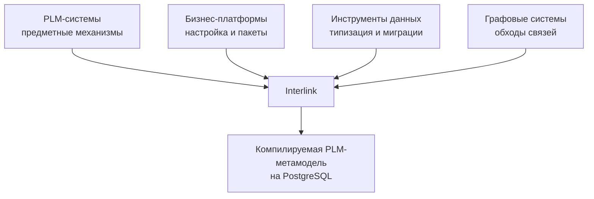

# Сравнение с PLM-, бизнес- и инструментальными платформами

## Как правильно читать сравнение

Interlink не пытается быть шире Teamcenter, гибче Salesforce, зрелее Hibernate или проще Prisma одновременно. Каталог `Analogs` показывает другое: почти у каждого ключевого решения есть работающий промышленный прецедент. Новизна Interlink заключается в их композиции вокруг инженерной семантики.

## Сравнение с PLM-системами

| Система | Что подтверждает | Что берёт Interlink | Существенное отличие |
|---|---|---|---|
| IPS | Богатую объектно-версионную семантику, составы, применяемость и конфигурацию | Предметные инварианты и пользовательские сценарии | Основная модель превращается в типизированную схему вместо универсальных таблиц значений |
| Aras Innovator | Тип объекта может соответствовать таблице, связь может быть самостоятельной записью | «Тип → таблица», устойчивый объект и версия, слои поставщика и заказчика | Типы не редактируются через обычный объектный интерфейс; модель живёт в репозитории |
| Teamcenter BMIDE | Управляемое моделирование вне эксплуатации и поставку шаблонов | Модульный выпуск модели, типизированные прикладные контракты, схемы обхода | Interlink стремится к более лёгкому встраиваемому ядру и более глубокой общей генерации |
| Windchill | Базовая линия как точный набор версий | Неизменяемые снимки структур | Физическая форма снимка оптимизирована для диапазонного чтения и общего механизма подбора |
| 3DEXPERIENCE | Работа над выпущенными данными в контексте изменения | Управляемый пакет изменения и явный контекст чтения | Один поддерживаемый путь записи для обычных и быстрых изменений |
| Agile PLM | Изменения с наглядным представлением «до/после» | Предпросмотр и осведомлённость о незавершённых изменениях | Один рабочий вариант объекта проще нескольких параллельных ожидающих изменений |

Interlink сознательно не конкурирует с готовыми приложениями этих платформ: интеграциями САПР, рабочими местами, маршрутами согласования и отраслевыми пакетами. Его цель — более чистое и встраиваемое объектное основание.

## Сравнение с бизнес-платформами

### SAP

SAP подтверждает ценность словаря данных, пространств имён заказчика, версионных изменений и контекстных кортежей вроде «материал × завод». Interlink заимствует отдельное пространство расширений и структурно уникальные кортежи, но стремится к единой системе инженерных атрибутов вместо параллельных характеристик и табличных полей.

### Salesforce

Salesforce показывает масштабируемость управляемых полей и пакетов в огромной многопользовательской платформе. Его универсальные физические слоты и специальные индексы оптимальны для другой задачи. Interlink использует типизированный гибкий контейнер только для локальных расширений, а массовые поля переводит в обычные колонки.

### ServiceNow

ServiceNow показывает ценность изменения словаря в работающей системе и одновременно риск широкого влияния таких изменений. Interlink сохраняет быструю настройку в ограниченном контуре, но запрещает приложению свободно перестраивать закрытую схему.

### Odoo

Odoo даёт зрелые прецеденты модулей, внешних идентификаторов, начальных данных, ссылок и иерархических категорий. Interlink усиливает защиту начальных данных, использует детерминированные идентификаторы и добавляет инженерную версионность.

## Сравнение с инструментами данных

| Система | Полезная практика | Развитие в Interlink |
|---|---|---|
| Prisma | Файл модели → миграции → типизированный клиент | Тот же конвейер дополняется PLM-версиями, связями и структурными запросами |
| Entity Framework Core | Миграции, внедрение зависимостей, подготовленные запросы | Нет отслеживания загруженного графа и скрытого контекста; запись выполняется командами |
| jOOQ | Типизированные описатели полей и явное потоковое чтение | Запросы строятся поверх предметной модели, а не непосредственно поверх готовой схемы |
| sqlc | Предварительная проверка запросов и генерация функций | Исходна объектная модель, а не вручную написанный запрос |
| SQLAlchemy | Композиция проверяемых предикатов | Статическая типизация операндов и PLM-контекст |
| Hibernate | Сессионная память и кэш с инвалидацией по затронутым таблицам | Более полный ключ учитывает модель, типы, настройки, политику и доступ |
| Flyway / Liquibase | Цепочки переходов, контрольные суммы, журнал применения | План строится из смысловой разницы моделей; ручными остаются только особые преобразования |

Interlink не стремится покрыть весь язык запросов jOOQ, все способы объектно-реляционного отображения данных или десятки разновидностей баз данных. Ограниченная поверхность является способом сохранить проверяемый предметный смысл.

## Сравнение с Neo4j

Neo4j естественно выражает обход нескольких типов рёбер. Interlink заимствует идею именованной схемы обхода, но выполняет её в PostgreSQL. Это позволяет хранить инженерный граф рядом с транзакционными данными, версиями и ограничениями, не вводя вторую базу и синхронизацию.

Цена — Interlink не является системой произвольной графовой аналитики. Обходы ограничены объявленными связями, направлением и глубиной. Для PLM это сознательная ставка на предсказуемость.

## Где Interlink предлагает более сильную композицию

### Один источник смысла

Prisma компилирует модель, Aras материализует типы в таблицы, Flyway ведёт миграции, Hibernate умеет инвалидацию, Windchill фиксирует базовые линии. Interlink соединяет эти подходы вокруг одного нормализованного смысла инженерной модели.

### Гибкость с путём взросления

Salesforce и ServiceNow сильны быстрыми расширениями, Teamcenter — управляемой поставкой. Interlink соединяет оба режима: расширение можно создать быстро, измерить его использование и затем перевести в строгую модель.

### Инженерная семантика как часть платформы

Обычный инструмент данных не понимает разницу объекта и версии, позиции состава и простой ссылки, текущей и точной версии, живого расчёта и опубликованного снимка. В Interlink эти различия входят в фундамент.

## Пример 1. Добавление типа гидроцилиндра

Подход Prisma подтверждает, что файл-модель способен породить схему и клиент. Подход Aras подтверждает таблицу на тип. Interlink добавляет версии гидроцилиндра, позиции состава, точные ссылки и миграционную сохранность истории.

## Пример 2. Расширение карточки станка

Как Salesforce, предприятие может добавить локальное поле. Как Teamcenter, зрелая модель поставляется управляемой версией. Interlink связывает эти этапы штатным продвижением расширения в колонку.

## Пример 3. Миллион повторных агентских чтений

Из Hibernate берётся дисциплина кэша и известные риски устаревания. Из jOOQ — явные запросы и потоковое чтение. Interlink добавляет типы, права, контекст подбора и происхождение агентского запуска в ключ корректности.

## Пример 4. Обход структуры линии

Neo4j подтверждает удобство объединения типов связей. Teamcenter подтверждает именованные правила замыкания. Interlink компилирует ограниченную схему обхода в реляционный план и сохраняет версионную семантику каждого ребра.

## Честные границы

- зрелость отдельных аналогов измеряется десятилетиями;
- Interlink не имеет их готовых интерфейсов и экосистем;
- уникальная композиция механизмов ещё требует опытного доказательства;
- поддерживается один диалект PostgreSQL;
- свободная настройка эксплуатационной схемы намеренно ограничена;
- мультитенантность Salesforce-класса не заявлена текущим этапом.

## Критерии продуктовой проверки

1. Каждый ключевой механизм имеет понятный промышленный прецедент.
2. Заимствование не переносит известный отказный режим аналога.
3. Сильная сторона аналога, которой нет в Interlink, названа явно.
4. Композиция проверяется сквозным сценарием, а не ссылкой на отдельный продукт.
5. Сравнение не выдаёт план или контракт за готовую функцию.

## Состояние реализации

Каталог аналогов и прецеденты решений сформированы. Они снижают риск отдельных архитектурных выборов, но не доказывают совместную производительность Interlink. Такое доказательство является задачей опытного вертикального среза.

## Связанные документы

- [Отраслевые прецеденты и заимствованные практики](Industry-precedents)
- [Замысел системы типов](Data-type-system-vision)
- [Статус и риски](Data-status-risks-acceptance)

