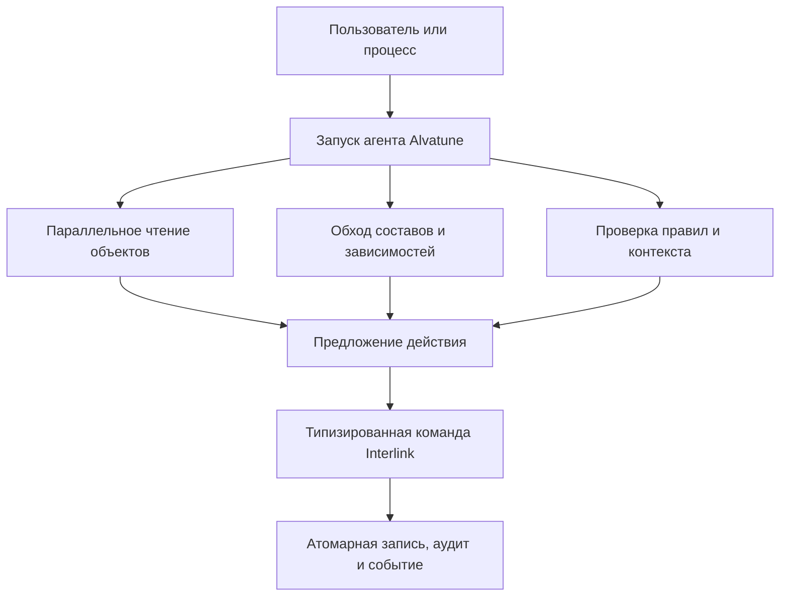

# Производительность, высокая нагрузка и оркестрация агентов

## Почему профиль нагрузки изменится

Обычная PLM-система в основном обслуживает действия людей: открыть карточку, раскрыть состав, выполнить поиск, провести изменение. Alvatune добавляет управляемые агентские процессы. Один пользовательский запрос способен породить несколько параллельных чтений контекста, сравнение вариантов, проверку ограничений, подготовку предложений и повторную сверку результата.

Агенты не должны получать обходной путь к данным, но они значительно увеличат:

- число точечных чтений объектов и версий;
- частоту обходов составов и обратного поиска;
- объём повторных запросов одинаковых справочников;
- число проверок модели и полномочий;
- количество коротких конкурирующих попыток изменений;
- поток аудита, событий и корреляционных записей;
- потребность в снимках точного контекста каждого запуска.

Поэтому Interlink проектируется не только для интерактивной карточки, но и для машинной оркестрации с высокой параллельностью.

## Архитектурные источники масштабируемости

### Типизированные таблицы

Горячий запрос работает с колонками конкретных типов, для которых PostgreSQL имеет статистику и специализированные индексы. Это уменьшает зависимость от универсальных соединений «объект–атрибут–тип атрибута».

### Предсказуемые формы запросов

Запросы строятся из проверяемой объектной алгебры. Имена таблиц и колонок берутся из манифеста, значения передаются параметрами. Формы планов можно сохранять как эталон и сравнивать при изменении компилятора.

### Индексы из предметного смысла

Внешние ключи, текущие версии, рабочие версии, дети состава, обратное применение и снимки получают заранее определённые индексы. Индексная нагрузка распределяется по типам вместо накопления десятков разнородных индексов на одной универсальной таблице.

### Потоковое чтение

Большой состав не обязан полностью загружаться в память процесса. Серверные курсоры позволяют обрабатывать результат последовательно с ограниченным потреблением памяти.

### Материализованные снимки

Повторно используемая большая структура может быть сохранена как последовательный набор записей. Полная загрузка выполняется диапазонным чтением вместо повторного рекурсивного расчёта. Бизнес-снимок остаётся неизменяемым, а техническая проекция может перестраиваться.

### Управляемое кэширование

Кэш включается только там, где полезен. Ключ учитывает модель, хранилище, полномочия, политику и версии затронутых типов. Запись через штатную команду продвигает соответствующие счётчики и не позволяет вернуть устаревший результат как свежий.

### Оптимистическая конкурентность

Короткие изменения не требуют долгой блокировки карточки. Версия строки обнаруживает потерянное обновление. Сложные графовые изменения выполняются в транзакции с повторной проверкой инвариантов.

### Единый путь записи

Человек, системная операция и агент используют одни типизированные команды. Это важно не только для безопасности: один путь позволяет согласованно обновлять аудит, версии кэша и события, а также избегает конкурирующих трактовок данных.

## Почему ожидается преимущество над старым физическим срезом IPS

Реконструированная схема IPS имеет универсальные таблицы значений, четыре возможные колонки значения, почти не использует внешние ключи и добавляет оптимизированные пер-типовые срезы как второй путь к тем же данным. Универсальные таблицы вынуждены поддерживать большое число индексов для разных сценариев.

Interlink переносит горячую типовую семантику непосредственно в схему. Поэтому для известных типов ожидаются:

- меньше соединений при чтении карточек и фильтрации;
- точнее статистика распределения значений;
- меньше ветвлений «читать универсальный путь или срез»;
- меньше глобальной конкуренции за одни и те же таблицы и индексы;
- возможность оптимизировать один тип, не перегружая все остальные;
- более предсказуемое поведение при росте числа агентов.

Это архитектурное преимущество, а не готовый сравнительный протокол. Современная установка IPS могла получить иные оптимизации. Превосходство подтверждается только одинаковыми сценариями, объёмами и оборудованием.

## Нагрузочная программа

Принятый план предусматривает:

- 10 тысяч, 100 тысяч и 1 миллион объектов;
- 100 тысяч, 1 миллион и 10 миллионов позиций состава;
- глубину структур 5, 25 и 100 уровней;
- широкие сборки и повторное применение компонентов;
- различную долю точных фиксаций версий и расширений;
- точечное чтение, состав, обратное применение и свёртку количеств;
- сравнение рекурсивного расчёта с материализованным снимком;
- проверку постоянства памяти при потоковом чтении;
- оценку размера индексов;
- сценарий миллиона физических единиц и десяти миллионов исторических фактов для будущего цифрового двойника.

Целевой критерий: планы структурных запросов не должны проигрывать эквивалентным вручную оптимизированным запросам более чем в 1,5 раза. Это критерий пересмотра архитектуры, а не уже полученный результат.

## Пример 1. Десять агентов анализируют один станок

Агенты параллельно проверяют состав, документы, поставщиков и изменения. Повторные чтения неизменных справочников используют безопасный кэш, а состав читается по типизированным индексам. Ни один агент не меняет объект напрямую: предложения проходят единый контур команды и согласования.

## Пример 2. Массовая проверка применяемости редукторов

Фоновая операция проверяет сто тысяч применений компонента. Обратный индекс позиции состава сразу находит владельцев. Результат обрабатывается потоком, поэтому память процесса не растёт пропорционально числу строк.

## Пример 3. Повторное чтение выпущенной конфигурации

Несколько агентов строят отчёты по одной утверждённой линии. Вместо повторной развёртки графа они читают неизменяемый снимок. Это снижает стоимость одинаковой сложной конфигурации и обеспечивает одинаковый результат.

## Пример 4. Конкурирующие предложения изменения насоса

Два агента предлагают изменить материал корпуса. Оба читают одну версию строки, но первая утверждённая команда изменяет её номер конкурентного состояния. Вторая команда получает понятный конфликт и обязана перечитать данные, а не затирает изменение.

## Пример 5. Поток фактов будущего двойника

Миллионы эксплуатационных наблюдений не должны обнулять кэш всех конструкторских типов. Зависимости кэша разделены по типам. При этом высокочастотная телеметрия остаётся во внешнем хранилище рядов; Interlink хранит определения сигналов и конфигурационно значимые факты.

## Границы обещания

- кластерная инвалидация кэша ещё требует отдельного решения;
- секционирование крупнейших таблиц оставлено после опытного этапа;
- массовая пакетная запись для эксплуатационных фактов не реализована;
- PostgreSQL является единственным целевым диалектом текущего этапа;
- результат зависит от качества модели, запросов и индексов;
- сравнение с IPS требует промышленного профиля целевой установки.

## Критерии приёмки

1. Нагрузочный прогон выполняется на заявленных объёмах и публикует планы и память.
2. Типовые запросы сравниваются с вручную оптимизированным эталоном.
3. Параллельная запись не теряет изменения и не возвращает устаревший кэш.
4. Потоковое чтение сохраняет ограниченное потребление памяти.
5. Снимок крупных структур быстрее повторной рекурсии в целевом профиле.
6. Агент не получает отдельный путь записи или обход прав.
7. Сравнение с IPS использует одинаковые данные и явно фиксирует конфигурацию продукта.

## Состояние реализации

Нагрузочные объёмы и критерии зафиксированы в плане. Типизированные контракты и часть генерации существуют; физическое исполнение запросов, кэш, команды, снимки и сам нагрузочный прогон относятся к последующим фазам. Утверждение о более высокой нагрузке пока является сильной архитектурной гипотезой, а не опубликованным результатом испытаний.

## Связанные документы

- [Физическая материализация](Data-database-materialization)
- [Сравнение с IPS](Data-differences-from-IPS)
- [Цифровые двойники](Data-digital-twins)

