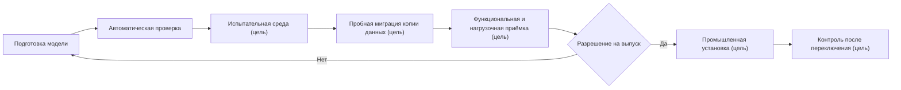

# Пакет выпуска модели, установка и обновление

## Что именно поставляется

Нужно различать три понятия:

- **модуль модели** — самостоятельная поставляемая часть, например инженерная основа или технология;
- **редакция модели предприятия** — согласованный набор точных редакций всех модулей и настроек;
- **пакет выпуска модели** — полный комплект, по которому новую редакцию можно проверить, установить и доказать результат.

Пакет инженерного изменения изделий не заменяет пакет выпуска модели. Первый организует работу над содержанием предметных объектов и его согласованную публикацию; второй меняет определения типов, свойств, связей и правил. Инженерная версия, например «Насос НЦ-80, версия 03», при этом отличается от её точного опубликованного состояния. Сохранение рабочего содержания не является ни его публикацией, ни выпуском новой модели.

Модель может описывать и данные без инженерных версий: изменяемую запись о назначении транспорта, неизменяемый факт приёмки, справочную таблицу. Установка модели задаёт правила их хранения и изменения, но не требует проводить каждое назначение или измерение через инженерный пакет.

## Состав пакета выпуска

Целевой полный комплект состоит из неизменяемого поставляемого содержания и добавляемых к нему свидетельств конкретной среды. Все свидетельства ссылаются на отпечаток одного поставляемого содержания. В комплект должны входить:

1. исходная и целевая редакции модели;
2. точный перечень модулей и зависимостей;
3. устойчивый отпечаток нормализованной модели;
4. смысловое сравнение для продуктового специалиста;
5. технический план физических изменений базы;
6. правила преобразования существующих данных;
7. начальные справочники и их происхождение;
8. правила сведения настроек предприятия с новой поставкой и известные ограничения;
9. влияние на команды, запросы, карточки, отчёты и интеграции;
10. контрольные изделия и ожидаемые результаты;
11. результаты пробной миграции и нагрузки;
12. решения ответственных;
13. порядок установки, условия остановки и восстановления;
14. отчёт о фактически установленном состоянии;
15. точные описания прежних форм данных, правила их прочтения и проверенные преобразования, необходимые для сохранения обязательной истории.

Части 1–10, 13 и 15 образуют неизменяемое поставляемое содержание: модель, план, правила, историческая совместимость и ожидаемые результаты. Части 11, 12 и 14 — неизменяемые записи испытания, решения и фактической установки в конкретной среде. Реально обнаруженные местные конфликты также входят в свидетельства среды. Эти записи добавляются к досье выпуска, но не переписывают поставляемое содержание. Если точный физический план строится отдельно для конкретной среды, его зафиксированная редакция связывается с исходной установкой и проверенным пакетом; это не разрешение придумывать преобразование во время выполнения.

Сейчас существуют отдельные основания — проверенная модель, её отпечаток, паспорт компиляции, смысловое сравнение редакций и исходный план перехода. Полное досье и машинно устанавливаемый комплект ещё не являются готовым промышленным механизмом. Этот перечень задаёт границу будущей готовности.

Совпадение названия и номера редакции недостаточно. Два комплекта могут иметь одинаковую форму карточек, но разные начальные справочники, правила переноса или способы прочтения чисел. Поэтому сравниваются отдельно смысл модели, полный поставляемый комплект и реально установленное хранилище. Контрольный отпечаток помогает обнаружить подмену содержания, но не заменяет разрешение ответственного на установку и доверие к поставщику.

## Среды и продвижение

Между средами продвигается одно и то же точное поставляемое содержание. Каждая среда добавляет собственные свидетельства испытания, решения и установки, связанные с его отпечатком. Нельзя вручную «доправить» промышленную модель после испытания и всё равно считать результат проверенным.

## Чистая установка

**Целевой механизм.** При создании новой площадки специалист должен будет:

1. Подготовить поддерживаемую среду хранения и проверить принадлежность места установки.
2. Подключить точный проверенный пакет, разрешённый для данной площадки. Произвольный файл описания модели не заменяет такой пакет.
3. Выполнить принятый план создания структуры, ограничений, индексов и начальных данных.
4. Подготовить совместимое принимающее приложение и средства чтения требуемых форматов.
5. Сверить фактическое хранилище с ожидаемым и выполнить контрольные предметные сценарии, включая отказ при неверных данных.
6. Сохранить подтверждённый факт успешной установки и сделать её действующей.
7. Открыть работу только приложениям, соответствие которых этой установке подтверждено.

Если любой обязательный шаг не завершён, площадка не объявляется готовой.

## Обновление существующей установки

Весь раздел ниже описывает будущий полный исполнитель и эксплуатационный процесс. Уже существующие сравнение редакций и планировщик — его строительные блоки, а не подтверждение, что переход выполняется в действующей базе.

### Предварительная проверка

Целевой исполнитель будет сравнивать установленную и целевую редакции, проверять фактическое состояние хранилища, свободное место, длительные операции, несовместимые настройки и состояние приложений. Для первого промышленного профиля принимающий продукт останавливает допуск новых операций и дожидается завершения уже начатых. После этого значимые проверки выполняются повторно: данные могли измениться после предварительного обследования. Обновление без остановки — отдельная будущая возможность с собственной приёмкой, а не общее обещание.

### Проверка данных

До изменения схемы будущий исполнитель должен выполнять запросы-предусловия: заполнены ли значения, существуют ли дубликаты, можно ли сузить диапазон, не используются ли удаляемые элементы. Пакет фиксирует точку или интервал проверки, а перед переключением повторно подтверждает, что запрещённые изменения не появились.

### Преобразование

Будущий план должен выполнять только предусмотренные шаги в известном порядке. Для длительных преобразований реализация может предусмотреть контролируемые порции и безопасное продолжение. Базовый контракт не обещает точный процент или возобновление любого шага: это определяется отдельно для каждой операции.

### Переключение

Принимающий продукт должен согласованно переключить модель и совместимое приложение. В Interlink одновременно фиксируются неизменяемый факт точной успешной установки и выбор этой установки как действующей. Это разные сведения с согласованным моментом изменения; предыдущий успешный выпуск остаётся в истории. Старые открытые сессии и задания повторно проходят допуск и не продолжают запись по устаревшей форме.

Согласованность внутри Interlink не означает мгновенного переключения внешней PLM, системы управления производством и всех интеграций. Для них нужен общий эксплуатационный план, остановка соответствующих операций либо отдельно испытанный период совместимости.

### Проверка результата

После установки должны сверяться точный пакет, физическое устройство базы, ограничения, начальные данные, критичные запросы и прикладные сценарии. Ожидания связываются с точной моделью, настройками предприятия, площадкой, моментом действия и областью доступа; для состава сохраняются явные условия подбора либо снимок. Отдельно открывается удерживаемая история: опубликованные состояния, файлы, табличные редакции и свидетельства принятых решений. Номер старой редакции без её читаемого содержания не проходит эту проверку. Отчёт сохраняет фактическое время и отклонения.

## Что видит продуктовый специалист

Не перечень команд установки, а понятный паспорт:

- что добавлено, изменено, устарело и удаляется;
- какие пользователи и процессы затронуты;
- сколько записей просмотрено, изменено, пропущено, завершилось ошибкой и помещено в карантин — только для операций, которые надёжно считают эти итоги;
- какие исключения остались;
- какие контрольные сценарии пройдены;
- как изменились время поиска и обхода состава;
- какая редакция действительно активна;
- технически ли готова среда и какие ограничения известны; разрешение продолжать работу отдельно выдаёт принимающий продукт.

## Что видит администратор эксплуатации

Целевое рабочее место принимающего продукта должно показывать известные контрольные данные: выполненные шаги, блокировки, объём, диагностические записи и разрешённые действия. Прогресс и ожидаемая длительность отображаются только тогда, когда конкретная операция умеет их надёжно оценить. Кнопка «повторить» доступна только для специально спроектированных безопасно повторяемых шагов.

## Ошибка до переключения

**Целевое поведение.** Если проблема обнаружена до изменения промышленной базы, она остаётся неизменной. Пакет возвращается владельцу со структурированной причиной. Несовместимые записи прикладываются только когда они действительно найдены; сбой доступа, связи, времени ожидания или ресурсов описывается отдельно и не маскируется под ошибку данных.

### Пример

Новое правило требует уникального обозначения оснастки в пределах завода. Проверка находит 74 дубликата. Установка не создаёт ограничение поверх неверных данных. Ответственные разбирают список, а затем повторяют пробу.

## Ошибка во время установки

В целевом плане для каждого шага должна быть заранее указана стратегия:

- операция спроектирована так, что неуспешный шаг отменяется целиком;
- длительный шаг, если он специально так спроектирован, работает порциями и может продолжить от подтверждённой точки;
- в первом промышленном профиле обычная работа остаётся остановленной до подтверждения результата; возможное продолжение старой записи относится к отдельно испытанному будущему режиму;
- если обратный путь опаснее, выпуск останавливается для управляемого исправления вперёд.

Фраза «откатить миграцию» не должна быть общим обещанием. Удаление данных, переписывание большого объёма и начало новой промышленной записи имеют разную обратимость.

При потере связи отдельно рассматривается ситуация «результат пока неизвестен». Сообщение об ошибке не доказывает, что последний шаг не состоялся. Сначала проверяются сохранённые подтверждения и фактическое состояние; только затем разрешаются продолжение или безопасный повтор. После частичного изменения отсутствие работающего установщика не открывает обычным пользователям доступ к базе.

## Ошибка после переключения

**Целевое поведение.** Если пользователи уже создали данные по новой модели, возврат старой базы может потерять работу. Обычно потребуется исправляющая редакция. Принимающий продукт сможет временно отключить проблемную команду, сохранив совместимые функции.

Будущая история установленной модели должна показывать обе редакции и причину исправления.

## Совместимость приложений и интеграций

Целевой полный пакет будет классифицировать изменения:

- совместимое добавление;
- изменение, требующее обновления потребителя;
- устаревание с переходным периодом;
- разрушающее изменение новой крупной редакции.

Для каждого потребителя, зарегистрированного принимающим продуктом в точном снимке инвентаризации, должна указываться поддерживаемая редакция. Незарегистрированного потребителя нельзя считать автоматически проверенным. Совместимость не обещается для любого неизвестного приложения.

## Пример 1. Добавление класса точности

В модель зубчатого колеса добавляется обязательный класс точности. Пробная проверка разделяет рабочее содержание и уже опубликованную историю. Рабочие данные заполняются перед следующей публикацией. Старые утверждённые состояния сохраняют то, что действительно было известно при выпуске; поздняя классификация оформляется отдельно и не подменяет прежнее содержание. Новые публикации нельзя разрешить без значения.

После установки карточка и поиск используют поле, а контрольный состав проверяет, что правила выбора не изменились неожиданно.

Специалист открывает прежний заказ и видит исходное состояние колеса без вымышленного исторического значения. В текущей проработке он видит заполненный класс точности. Разница объяснена, а не скрыта единым «текущим» отображением.

## Пример 2. Разделение типа документа

Общий тип «Протокол испытаний» разделяется на гидравлический и электрический. Анализ показывает, что часть старых документов можно классифицировать по шаблону, а 320 требуют решения специалиста. Пока карантин не разобран либо не принята явная политика истории, выпуск не считается полностью подтверждённым.

## Пример 3. Индекс для агентской нагрузки

После пилота агенты часто ищут компоненты по признаку прекращения поставки. Поле уже существует, но не индексировано. Новая редакция добавляет физический индекс без изменения предметного смысла. Пробная установка измеряет время построения и ускорение запросов; промышленное окно выбирается по реальному объёму.

## Пример 4. Развитие справочной таблицы

Таблица допустимых нагрузок подшипника раньше зависела от диаметра и температуры. Инженеры добавляют третью ось — частоту вращения. Это изменение формы, а не просто ещё одна строка. План определяет, как трактовать прежние двухмерные значения: сохранить старую редакцию для старых расчётов, подготовить новые испытанные данные и не размножать неизвестные значения по всем частотам автоматически.

После установки новый расчёт использует трёхмерную таблицу, а расчёт ранее выпущенного редуктора продолжает открывать прежние оси, единицы и ячейки. Если средств чтения старой формы нет, выпуск блокируется. Аналогично новые правила совместимости не должны задним числом заменять основание, по которому был принят прежний заказ.

## Состояние реализации

По состоянию актуализации книги 6 сентября 2026 года реализованы проверка модели, паспорт компиляции, производные прикладные представления, смысловое сравнение редакций, исходный планировщик миграций и каталог определений. Создание предметных таблиц — отдельно проверяемая локальная работа. Полное исполнение переходов, активация, проверка допуска приложения, промышленное рабочее место и сквозная приёмка установки ещё не завершены. Поэтому полный пакет выпуска и процесс установки на этой странице являются целевым эксплуатационным контрактом, а не инструкцией к готовому установщику.

Связанные документы: [[жизненный цикл модели|Data-model-lifecycle]], [[миграция и доказательство|Data-migration-execution]], [[настройки предприятия|Data-enterprise-settings]], [[состояние и риски|Data-status-risks-acceptance]], [[многомерные таблицы|Multidimensional-tables]], [[действия агентов и прослеживаемость|Agents-and-traceability]].
