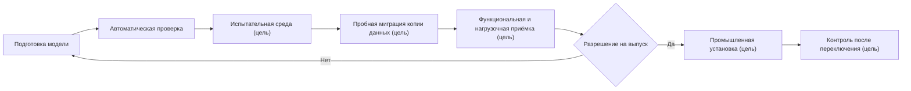

# Пакет выпуска модели, установка и обновление

## Что именно поставляется

Нужно различать три понятия:

- **модуль модели** — самостоятельная поставляемая часть, например инженерная основа или технология;
- **редакция модели предприятия** — согласованный набор точных редакций всех модулей и настроек;
- **пакет выпуска модели** — полный комплект, по которому новую редакцию можно проверить, установить и доказать результат.

Пакет инженерного изменения изделий не заменяет пакет выпуска модели. Первый меняет экземпляры и версии предметных объектов; второй меняет определения типов, свойств, связей и правил.

## Состав пакета выпуска

Целевой полный комплект состоит из неизменяемого поставляемого содержания и добавляемых к нему свидетельств конкретной среды. Все свидетельства ссылаются на отпечаток одного поставляемого содержания. В комплект должны входить:

1. исходную и целевую редакции модели;
2. точный перечень модулей и зависимостей;
3. устойчивый отпечаток нормализованной модели;
4. смысловое сравнение для продуктового специалиста;
5. технический план физических изменений базы;
6. правила преобразования существующих данных;
7. начальные справочники и их происхождение;
8. обнаруженные конфликты настроек предприятия;
9. влияние на команды, запросы, карточки, отчёты и интеграции;
10. контрольные изделия и ожидаемые результаты;
11. результаты пробной миграции и нагрузки;
12. решения ответственных;
13. порядок установки, условия остановки и восстановления;
14. отчёт о фактически установленном состоянии.

Части 1–10 и 13 образуют неизменяемое поставляемое содержание: модель, план, правила и ожидаемые результаты. Части 11, 12 и 14 — неизменяемые записи испытания, решения и фактической установки в конкретной среде. Они добавляются к досье выпуска, но не переписывают поставляемое содержание.

Сейчас автоматически формируются лишь отдельные основания — нормализованная модель, её отпечаток и манифест. Полный пакет из четырнадцати пунктов ещё не существует как готовый артефакт. Этот перечень задаёт промышленную границу будущей готовности.

## Среды и продвижение

Между средами продвигается одно и то же точное поставляемое содержание. Каждая среда добавляет собственные свидетельства испытания, решения и установки, связанные с его отпечатком. Нельзя вручную «доправить» промышленную модель после испытания и всё равно считать результат проверенным.

## Чистая установка

**Целевой механизм.** После появления генератора физической схемы при создании новой площадки специалист должен будет:

1. подготавливает поддерживаемую версию PostgreSQL и необходимые расширения;
2. проверяет пустоту и принадлежность целевых схем;
3. устанавливает управляющую часть Interlink;
4. загружает пакет модели;
5. создаёт предметные таблицы, ограничения, индексы и начальные данные;
6. устанавливает согласованное принимающее приложение;
7. проверяет отпечаток модели и базы;
8. выполняет контрольное создание, чтение, состав и отказ при неверных данных;
9. записывает паспорт установленного состояния.

Если любой обязательный шаг не завершён, площадка не объявляется готовой.

## Обновление существующей установки

Весь раздел ниже описывает будущий исполнитель миграций; в текущей версии его нет.

### Предварительная проверка

Целевой исполнитель будет сравнивать установленную и целевую редакции, проверять исходный отпечаток, свободное место, длительные операции, несовместимые настройки и состояние приложений. Принимающий продукт должен либо остановить запись, либо обеспечить доказанное совместимое окно, чтобы данные не изменились после проверки.

### Проверка данных

До изменения схемы будущий исполнитель должен выполнять запросы-предусловия: заполнены ли значения, существуют ли дубликаты, можно ли сузить диапазон, не используются ли удаляемые элементы. Пакет фиксирует точку или интервал проверки, а перед переключением повторно подтверждает, что запрещённые изменения не появились.

### Преобразование

Будущий план должен выполнять только предусмотренные шаги в известном порядке. Для длительных преобразований реализация может предусмотреть контролируемые порции и безопасное продолжение. Базовый контракт не обещает точный процент или возобновление любого шага: это определяется отдельно для каждой операции.

### Переключение

Принимающий продукт должен согласованно оркестрировать переключение модели и совместимого приложения. Это не обещание мгновенной атомарной операции между разными системами: потребуется остановка записи, барьер развёртывания либо заранее испытанное окно совместимости.

### Проверка результата

После установки должны сверяться отпечаток, физические объекты базы, ограничения, начальные данные, критичные запросы и прикладные сценарии. Ожидания связываются с точной моделью, настройками предприятия, площадкой, моментом действия и областью доступа; для состава сохраняется явный контекст подбора либо снимок. Отчёт сохраняет фактическое время и отклонения.

## Что видит продуктовый специалист

Не перечень команд установки, а понятный паспорт:

- что добавлено, изменено, устарело и удаляется;
- какие пользователи и процессы затронуты;
- сколько записей просмотрено, изменено, пропущено, завершилось ошибкой и помещено в карантин — только для операций, которые надёжно считают эти итоги;
- какие исключения остались;
- какие контрольные сценарии пройдены;
- как изменились время поиска и обхода состава;
- какая редакция действительно активна;
- технически ли готова среда и какие ограничения известны; разрешение продолжать работу отдельно выдаёт принимающий продукт.

## Что видит администратор эксплуатации

Целевое рабочее место принимающего продукта должно показывать известные контрольные данные: выполненные шаги, блокировки, объём, диагностические записи и разрешённые действия. Прогресс и ожидаемая длительность отображаются только тогда, когда конкретная операция умеет их надёжно оценить. Кнопка «повторить» доступна только для специально спроектированных безопасно повторяемых шагов.

## Ошибка до переключения

**Целевое поведение.** Если проблема обнаружена до изменения промышленной базы, она остаётся неизменной. Пакет возвращается владельцу со структурированной причиной. Несовместимые записи прикладываются только когда они действительно найдены; сбой доступа, связи, времени ожидания или ресурсов описывается отдельно и не маскируется под ошибку данных.

### Пример

Новое правило требует уникального обозначения оснастки в пределах завода. Проверка находит 74 дубликата. Установка не создаёт ограничение поверх неверных данных. Ответственные разбирают список, а затем повторяют пробу.

## Ошибка во время установки

В целевом пакете для каждого шага должна быть заранее указана стратегия:

- операция находится внутри безопасной транзакции и откатывается;
- длительный шаг, если он специально так спроектирован, работает порциями и может продолжить от подтверждённой точки;
- до переключения старые пользователи продолжают запись только при доказанной обратной совместимости уже выполненных изменений; иначе запись остаётся остановленной;
- если обратный путь опаснее, выпуск останавливается для управляемого исправления вперёд.

Фраза «откатить миграцию» не должна быть общим обещанием. Удаление данных, переписывание большого объёма и начало новой промышленной записи имеют разную обратимость.

## Ошибка после переключения

**Целевое поведение.** Если пользователи уже создали данные по новой модели, возврат старой базы может потерять работу. Обычно потребуется исправляющая редакция. Принимающий продукт сможет временно отключить проблемную команду, сохранив совместимые функции.

Будущая история установленной модели должна показывать обе редакции и причину исправления.

## Совместимость приложений и интеграций

Целевой полный пакет будет классифицировать изменения:

- совместимое добавление;
- изменение, требующее обновления потребителя;
- устаревание с переходным периодом;
- разрушающее изменение новой крупной редакции.

Для каждого потребителя, зарегистрированного принимающим продуктом в точном снимке инвентаризации, должна указываться поддерживаемая редакция. Незарегистрированного потребителя нельзя считать автоматически проверенным. Совместимость не обещается для любого неизвестного приложения.

## Пример 1. Добавление класса точности

В модель зубчатого колеса добавляется обязательный класс точности. Пробная проверка разделяет действующие и архивные версии. Действующие классифицируются, архивные получают разрешённое состояние «не установлено исторически», новые нельзя провести без значения.

После установки карточка и поиск используют поле, а контрольный состав проверяет, что правила выбора не изменились неожиданно.

## Пример 2. Разделение типа документа

Общий тип «Протокол испытаний» разделяется на гидравлический и электрический. Анализ показывает, что часть старых документов можно классифицировать по шаблону, а 320 требуют решения специалиста. Пока карантин не разобран либо не принята явная политика истории, выпуск не считается полностью подтверждённым.

## Пример 3. Индекс для агентской нагрузки

После пилота агенты часто ищут компоненты по признаку прекращения поставки. Поле уже существует, но не индексировано. Новая редакция добавляет физический индекс без изменения предметного смысла. Пробная установка измеряет время построения и ускорение запросов; промышленное окно выбирается по реальному объёму.

## Состояние реализации

Сегодня реализованы проверка и нормализация модели, её отпечаток, манифест поставки и часть типизированных прикладных представлений. Поставка генератора через командную строку и эталонный сквозной пример ещё не приняты. Генератор физических таблиц PostgreSQL, планировщик и установщик миграций, средство записи, исполнитель запросов, проверка расхождения модели и базы и промышленное рабочее место установки остаются будущими возможностями. Поэтому полный пакет выпуска и процесс установки на этой странице являются целевым эксплуатационным контрактом.

Связанные документы: [[жизненный цикл модели|Data-model-lifecycle]], [[миграция и доказательство|Data-migration-execution]], [[настройки предприятия|Data-enterprise-settings]], [[состояние и риски|Data-status-risks-acceptance]].
