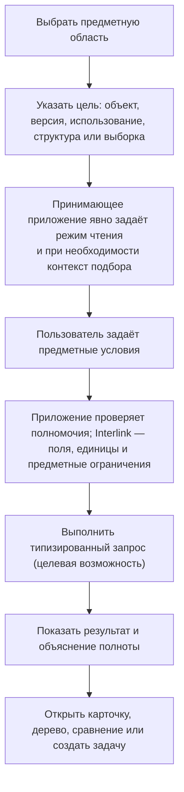

# Поиск, выборки и обход связей глазами пользователя

## Почему поиск является частью модели данных

В PLM недостаточно найти карточку по обозначению. Пользователь ищет:

- устойчивый объект или конкретную его версию;
- все изделия, где применяется деталь;
- документы определённой степени готовности;
- позиции состава, удовлетворяющие инженерному условию;
- объекты, изменяемые в конкретном пакете;
- точный состав заказа или выпуска;
- данные с дополнительным признаком предприятия.

Чтобы такие ответы были одинаковыми в интерфейсе, отчёте, интеграции и работе агента, поиск должен использовать ту же типизированную модель и явно указанный режим чтения. Контекст подбора версий обязателен только тогда, когда система должна выбрать версию. Для чтения точной известной версии, истории, неверсионных данных или готового снимка он не требуется.

## Пять разных задач пользователя

### Найти объект

Пользователь ищет деталь, документ, материал, процесс или заказ как устойчивый предмет независимо от числа его версий.

### Найти версию

Нужно открыть точное поколение: выпущенное, рабочее в пакете, историческое или указанное в снимке.

### Найти по связям

Например: «в каких редукторах применяется этот подшипник», «какие операции используют эту оснастку», «какие требования покрывает испытание».

### Развернуть структуру

Нужно пройти состав, маршрут, трассировку требований или другую именованную структуру в определённом направлении и контексте.

### Выполнить именованную выборку

Предприятие может опубликовать именованную выборку: «выпущенные детали без назначенного материала», «заказы с резервным подбором», «оснастка с истекающим ресурсом».

Эти задачи имеют разные результаты и не должны скрываться за одним неясным полем «поиск везде».

## Как пользователь начинает поиск

Рабочее место может заранее заполнить контекст подбора из текущей задачи, но при выборе версии обязано показать и передать его явно. При открытии производственного заказа принимающее приложение передаёт идентификатор его неизменяемого снимка. Interlink возвращает зафиксированные в нём версии и не выполняет новый подбор по текущей дате, площадке или изменившимся правилам. Дата и площадка могут показываться как сохранённые условия публикации, но не становятся поводом пересчитать уже переданный заказ. При поиске внутри пакета изменение может показывать рабочие версии.

## Устойчивый объект и конкретная версия

Результат «Деталь ВАЛ-250» должен ясно отличаться от «версия 04 детали ВАЛ-250».

В списке объектов показываются:

- обозначение и наименование;
- тип;
- показанная версия и режим, в котором она получена;
- степень готовности;
- наличие открытого изменения;
- возможность отдельно запросить объяснение выбора версии.

В списке версий дополнительно показываются поколение, даты, автор, происхождение, состояние и сравнение. Историческая версия не становится текущей только потому, что пользователь нашёл и открыл её.

## Явный режим чтения и контекст подбора

Каждый запрос явно сообщает требуемый режим чтения:

- официальное состояние с подбором версий по переданному контексту;
- будущее состояние конкретного пакета с подбором версий по переданному контексту;
- точная известная версия;
- точный неизменяемый снимок основы или заказа;
- история всех версий;
- неверсионные справочные данные.

Если принимающее приложение не передало явный контекст подбора версии, Interlink отказывает до выполнения запроса. Скрытого «безопасного режима по умолчанию» нет. Сам пользователь может видеть заранее заполненную форму, но отправляемая операция всё равно содержит точную цель, политику и нужные условия.

Контекст подбора не требуется там, где никакого выбора версии нет: при чтении уже указанной точной версии, истории всех версий, неверсионируемого объекта или готового снимка. Готовый снимок читается напрямую и не пересчитывается по сегодняшним правилам.

## Предметные условия вместо технических выражений

Пользователь выбирает доступные свойства из модели:

- диаметр от 40 до 50 мм;
- материал входит в группу коррозионностойких сталей;
- степень готовности не ниже «допущено в производство»;
- используется в изделии РЦ-250;
- применимо для серии 145 на заданную дату.

Рабочее место проверяет единицы, тип значения и совместимость условий до выполнения. Массу нельзя сравнивать с длиной, а дату — с обозначением.

## Поиск по связям и обратная применяемость

### Прямой обход

От сборки к компонентам, от технологического процесса к операциям, от требования к подтверждающим испытаниям.

### Обратный обход

От детали к верхним изделиям, от оснастки к операциям, от документа к использующим его процессам.

Пользователь выбирает заранее определённый предметный маршрут, а не произвольное соединение таблиц. Определение маршрута задаёт допустимые типы связей, направление, глубину и форму результата.

### Пример

Служба качества ищет все выпущенные насосы, где применяется уплотнение определённой партии. Обратный обход поднимается от уплотнения к узлам и насосам, учитывает точные версии опубликованных составов и показывает путь каждого использования. Результат для фактически изготовленных экземпляров может потребовать отдельного контура «как изготовлено».

## Именованные выборки

Именованная выборка — многократно используемое определение запроса с понятным названием и устойчивым идентификатором. Её содержание входит в точную редакцию всей модели; отдельной независимой версии выборки Interlink не обещает. Принимающий продукт при необходимости добавляет владельца, согласование, доступность пользователям и расписание выполнения. Типизированное выполнение и весь сквозной пользовательский контур пока не реализованы.

При подготовке новой редакции модели продуктовая команда определяет:

- деловой смысл;
- допустимые параметры;
- тип результата;
- версионный контекст;
- сортировку и продолжение;
- правила полноты и доступа;
- контрольные примеры;
- ожидаемый масштаб.

Изменение условий выборки входит в новую редакцию модели. Два отчёта с одинаковым названием не должны незаметно использовать разные условия: они сохраняют ссылку на устойчивый идентификатор выборки и точную редакцию модели.

## Большие результаты

Целевой запрос не должен требовать загрузки миллиона строк одним ответом. Базовый контракт предполагает ограниченную страницу или продолжение с сохранением порядка и контекста. Обычный запрос с продолжением не гарантирует единый момент чтения для всех порций: между ними данные могут измениться. Если результат должен воспроизводиться позднее, сначала создаётся подходящий неизменяемый снимок и последующее чтение выполняется по нему. Техническая проекция для ускорения поиска не является доказательным снимком: её можно пересоздать или удалить.

Общий объём может быть дорог или неизвестен; обещание всегда показывать точное число строк, процент выполнения, фоновое задание и кнопку остановки пока не принято.

Если предприятию нужна длительная выгрузка, принимающий продукт может организовать её как собственное задание и зафиксировать условия, редакцию модели и момент чтения. Конкретные средства прогресса, отмены и расписания должны быть спроектированы и испытаны отдельно.

## Полнота и права доступа

Права не должны менять предметную истину незаметно. Возможны три явных результата:

1. Пользователь имеет право на полный результат.
2. Пользователь получает безопасный ограниченный список с указанием, что он неполон.
3. Операция, требующая полного графа — например публикация снимка, — запрещается целиком.

Нельзя назвать дерево полным, если отдельные ветви скрыты политикой доступа. Для чувствительного бизнес-снимка применяется право на весь артефакт.

## Что сохраняется в объяснении

Для обычного результата доступны краткие сведения, необходимые пользователю:

- цель запроса;
- тип и версия модели;
- предметные условия и единицы;
- версионный контекст;
- применённая именованная выборка и её редакция;
- сортировка и продолжение;
- путь связей;
- причина выбора версии, если объяснение было запрошено;
- предупреждения о неполноте;
- время и происхождение, если результат зафиксирован как отчёт.

Обычный просмотр не обязан вычислять подробную цепочку причин или сохранять всех рассмотренных кандидатов. Объяснение запрашивается отдельно, когда оно нужно пользователю, проверке или решению агента; его полный формат остаётся целевой возможностью. Обычный просмотр не архивирует каждое нажатие пользователя. Но опубликованный отчёт, решение агента или доказательный комплект должны сохранять достаточное происхождение.

## Как дополнительный признак входит в поиск

В целевом контуре, если дополнительный признак разрешён для поиска, будут публиковаться его тип, единица и область применения. Первоначально такой поиск может быть менее эффективным, а принимающий продукт сможет наблюдать его частоту и стоимость.

Если признак станет массовым, владелец сможет решить перевести его в штатное физическое поле с индексом и миграцией. Это управляемое развитие модели, а не автоматическое действие уже работающего ядра. Пользовательское имя и смысл должны сохраниться.

## Что делает агент

Агент использует те же разрешённые выборки и типизированные запросы, но принимающий продукт задаёт ограничения объёма, времени и полномочий. Для решения по производственному заказу агент читает опубликованный снимок, а не заново строит состав по текущим правилам. Продолжение больших результатов является целевым контрактом, а не уже доступной функцией.

В ответе агента должны сохраняться точные исходные объекты и версии. Если данных недостаточно, агент обращается к человеку через механизм заданий принимающей платформы, а не додумывает отсутствующую ветвь. Это целевой сценарий, а не готовая функция текущего ядра.

## Ошибки и действия пользователя

| Ситуация | Понятное сообщение | Следующее действие |
|---|---|---|
| Не передан контекст операции подбора | Нельзя однозначно выбрать версии без явной цели и политики | Принимающее приложение должно сформировать и показать контекст; скрытое значение по умолчанию не используется |
| Неизвестное поле | Признак не входит в установленную модель | Выбрать доступный признак или запросить расширение |
| Неверная единица | Условие задано в несовместимой величине | Исправить единицу |
| Рабочий пакет недоступен | Пользователь не является участником или пакет закрыт | Открыть официальное состояние либо запросить доступ |
| Слишком широкий запрос | Ожидается чрезмерный объём | Уточнить условия; длительную выгрузку организует принимающий продукт, если она поддерживается |
| Неполный результат из-за прав | Часть данных недоступна | Использовать разрешённое представление; не публиковать как полный состав |
| Нет версии в контексте | Объект найден, но допустимая версия отсутствует | Открыть объяснение подбора и создать задачу владельцу |
| Определение выборки устарело | Установленная модель несовместима с прежней редакцией | Исправить определение в следующей редакции модели или использовать совместимую редакцию модели |

## Пример 1. Конструктор ищет подшипник

Конструктор задаёт внутренний диаметр 50 мм, динамическую грузоподъёмность не ниже требуемой и климатическое исполнение. Поиск возвращает устойчивые объекты, а для каждого показывает версию, выбранную политикой проектирования. Один подшипник найден, но его последняя версия аннулирована; объяснение показывает, что выбрана предыдущая допустимая версия или результат остановлен — согласно явной политике.

Конструктор сравнивает кандидатов и создаёт точную фиксацию позиции через пакет изменения. Сам поиск состав не меняет.

## Пример 2. Технолог ищет использование оснастки

Перед списанием штампа технолог запускает обратную применяемость. Система показывает технологические операции, версии процессов, изделия и открытые заказы, где штамп требуется. Исторические процессы отделены от текущих, а рабочая версия открытого пакета видна только его участникам.

## Пример 3. Руководитель контролирует незаполненные материалы

В целевом решении принимающий продукт каждую ночь запускает именованную выборку «выпущенные детали без материала» и формирует рабочий список. После изменения модели определение проверяется заново. Планировщик заданий, владельцы, права и экран динамики принадлежат принимающему продукту; Interlink предоставляет идентифицированное определение запроса и целевой типизированный путь его выполнения.

## Как проверяем результат

Поиск и обходы можно считать подтверждёнными, если:

- запрос подбора без обязательного контекста отклоняется, а точное и неверсионное чтение не требует лишних условий;
- заказ открывается по снимку и не меняется после выпуска новых версий;
- продолжение выдачи не создаёт ложного обещания общего количества, процента выполнения или единого момента чтения;
- объяснение можно запросить отдельно, и оно соответствует фактическому результату;
- именованная выборка сохраняет устойчивый идентификатор и связь с точной редакцией модели;
- полный доказательный результат не строится из скрытых политикой доступа ветвей;
- поиск, обратная применяемость и многоуровневые обходы проходят контрольные сценарии IPS при одинаковых исходных условиях, а каждое различие получает понятную классификацию.

## Состояние реализации

В текущей реализации язык модели и его проверенное смысловое описание уже содержат определения запросов и обходов; часть типизированных прикладных представлений сформирована. Полноценного механизма выполнения запросов к PostgreSQL, промышленного поиска, отдельного пользовательского управления именованными выборками и конечного рабочего места пока нет. Явный контекст подбора, порционная выдача и объяснения описаны здесь как целевой пользовательский контракт, который предстоит подтвердить на данных и нагрузке масштаба IPS, включая агентские сценарии.

Связанные документы: [[как модель работает|Data-model-runtime]], [[подбор версий|Selection-user-work]], [[производительность|Data-performance-and-agents]], [[жизненный цикл модели|Data-model-lifecycle]].
