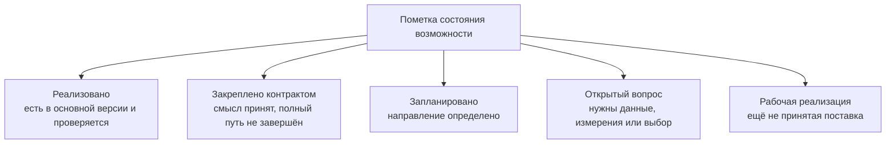

# Состояние, риски и программа подтверждения

## Зачем отделять замысел от готовой функции

Архитектура Interlink уже достаточно подробно описывает будущую систему данных, но разные её части находятся на разных стадиях. Для продуктового решения важно различать основные пометки:

- **реализовано** — функция присутствует в текущей основной версии и проверяется автоматически;
- **развивается в рабочем коде** — реализация уже есть в текущей работе, но её нельзя выдавать за принятую поставку;
- **закреплено контрактом** — поведение принято в архитектуре, но весь рабочий путь ещё не завершён;
- **запланировано** — определены направление и этап выполнения;
- **открытый вопрос** — решение требует опыта, измерений или продуктового выбора.

Такое разделение делает «продающее» описание сильнее, а не слабее: специалист видит не обещание без основания, а ясный путь от уже работающего ядра к промышленной эксплуатации.

Это не последовательные ступени, через которые обязана пройти каждая функция. Это независимые пометки для чтения таблиц и документов:

## Карта зрелости

Срез документации — 6 сентября 2026 года. Наличие отдельных проверенных компонентов не означает, что закончены пользовательский сценарий, обновление промышленной базы или переход на новые правила версий.

| Возможность | Текущее состояние | Что ещё требуется |
|---|---|---|
| Чтение и проверка языка описания модели | Реализовано в основном коде | Расширять проверки по мере появления новых конструкций |
| Объединение модулей и расчёт неизменяемого отпечатка модели | Реализовано в основном коде | Подтвердить на полном промышленном пакете |
| Типизированные средства приложений и их генерация | Реализация развивается; генерация доступна через командную строку | Пересогласовать зависимые средства с новой моделью версий и доказать полный предметный путь |
| Формирование реальных таблиц основных типов и связей | Представлено в текущей незавершённой работе над физической схемой | Завершить приёмку, новую версионную проекцию и согласование с установкой |
| Формирование ограничений и основных индексов | Часть развиваемой физической схемы и её проверок | Подтвердить новые правила принадлежности и целостности, затем измерить нагрузку |
| Планирование переходов между моделями | Есть реализация сравнения моделей и построения плана | Довести план до полного безопасного применения и новых архитектурных договоров |
| Применение изменений к действующей базе | Полный промышленный установщик и восстановление ещё не завершены | Повторяемая установка, журнал, проверка соответствия, безопасный отказ и восстановление |
| Команды создания и изменения предметных объектов | Целевая возможность; средства записи ещё нет | Единый путь проверок, полномочий принимающего продукта и аудита |
| Исполнение типизированных запросов | Контракты формы результата развиваются; исполнителя запросов к PostgreSQL ещё нет | Построитель и исполнитель запросов, измерения и пользовательский поиск |
| Управляемая настройка предприятия | Архитектурный контракт принят | Каталог установленных настроек и трёхстороннее обновление |
| Типизированные расширения времени выполнения | Архитектурный контракт принят | Хранение, проверка, поиск и перевод востребованных признаков в штатные поля |
| Инженерная версия, опубликованное и рабочее содержание | Новая архитектура принята; существующие компоненты требуют согласованной переработки | Раздельная адресация, конкурентная работа, публикация и историческое чтение |
| Изменяемые записи и неизменяемые факты без обязательных инженерных версий | Принят договор нейтрального фундамента | Сквозные примеры логистики, измерений и точного сохранения основания |
| Индексируемые таблицы, полные сетки и координатные карты | Приняты отдельные договоры и этапы работ | Проверки ключей, областей, полноты, исторических редакций, поиска и импорта |
| Допустимые замены и совместимость | Приняты предметные договоры поверх общей модели | Выбор в контексте, групповые замены, окончательная проверка содержания и сверка с IPS |
| Перенос метаданных и данных IPS | Стратегия описана | Средства извлечения, черновик модели, пробные прогоны и сверка |
| Работа под высокой нагрузкой агентов | Архитектурные средства предусмотрены | Нагрузочный стенд, профили запросов и подтверждение пределов |
| Экземплярный цифровой двойник | Направление принято; ранние проверки фактов, экземпляров и двух времён включены в архитектурный план | Исполняемые предметные модули, фактический состав и дальнейшая интеграция сигналов |

## Какие утверждения уже обоснованы

### Можно утверждать сейчас

- Interlink строит систему вокруг предметных типов и связей с подключаемыми правилами PLM, а не вокруг единого универсального хранилища признаков.
- Типы модели предназначены для материализации в реальные таблицы PostgreSQL с подходящими ограничениями и индексами.
- Изменение модели рассматривается как управляемая миграция, а не как скрытая правка метаданных.
- Архитектура предусматривает разные скорости развития: выпускаемую модель, настройку предприятия и типизированное оперативное расширение.
- Пользователи, интеграции и агенты должны использовать общие правила чтения, изменения, прав и аудита.
- Для цифрового двойника выбрано развитие от проектной модели к физическим единицам, партиям и историзируемым фактам.

### Можно утверждать как ожидаемое преимущество

Предметные таблицы, точные индексы и предсказуемые запросы устраняют ряд известных издержек универсального хранения IPS. Поэтому архитектура Interlink рассчитана на более устойчивую работу под интенсивными чтениями, обходами состава и параллельными действиями агентов. Это сильное техническое основание ожидать более высокую нагрузочную способность.

До завершения измерений нельзя обещать конкретное число одновременных агентов, фиксированное превосходство во всех запросах или гарантированное ускорение любой базы IPS. Итог зависит от объёма состава, распределения признаков, оборудования, настроек PostgreSQL, характера прав доступа и профиля операций.

### Что пока нельзя объявлять готовым

- автоматический перенос произвольной базы IPS без обследования;
- непрерывное изменение структуры промышленной базы без предусмотренного окна обслуживания;
- готовый цифровой двойник полного жизненного цикла;
- доказанная производительность на всех целевых масштабах;
- автоматическое обновление любых пользовательских настроек без конфликта.

## Главные риски и способы управления

| Риск | Как проявится | Как снижается |
|---|---|---|
| Предметная модель слишком рано закрепила неверные границы типов | Частые тяжёлые изменения таблиц | Опытный срез, анализ реальных данных IPS, устойчивые идентификаторы и дисциплина изменений |
| Гибкость вернётся к бесконтрольному универсальному контейнеру | Сложный поиск и непредсказуемое качество данных | Расширения ограничиваются конкретным типом, проверяются и переводятся в штатные поля при росте востребованности |
| При переносе потеряется скрытая семантика IPS | Формально полные, но неверно интерпретированные данные | Инвентаризация форм, обработчиков и практик; участие продуктовых специалистов; контрольные машиностроительные сценарии |
| Две системы одновременно меняют один набор данных | Расхождение редакций и составов | Один источник записи на каждом этапе, фиксированное окно переключения и повторяемый план возврата |
| Агенты обойдут проверки ради скорости | Массовое распространение ошибки | Единая командная граница, контекст действующего лица, связь операций и неизменяемый аудит |
| Массовые обходы состава перегрузят базу | Рост времени ответа и памяти | Индексы по направлениям связи, потоковая выдача, снимки, кэширование и измерения на целевых объёмах |
| Цифровой двойник превратит PLM в хранилище телеметрии | Неконтролируемый рост и конкуренция нагрузок | Сигналы и инженерный контекст в Interlink, высокочастотные ряды во внешнем специализированном хранилище |

## Программа нагрузочного подтверждения

### Масштабы испытаний

План предусматривает несколько ступеней данных, чтобы результат не зависел от маленького демонстрационного набора:

- десятки тысяч, сотни тысяч и миллионы предметных объектов;
- сотни тысяч, миллионы и десятки миллионов позиций состава;
- неглубокие и глубокие структуры, включая глубину до ста уровней;
- миллион физических единиц и до десяти миллионов историзируемых фактов для будущего экземплярного двойника.

### Какие операции измеряются

- открытие карточки и получение текущей редакции;
- выбор редакций по состоянию, дате и закреплённому выбору;
- раскрытие состава на несколько уровней;
- обратная применяемость;
- массовая проверка ограничений агентами;
- запись параллельных изменений с контролем конфликтов;
- чтение снимка заказа или контекста агента;
- восстановление фактического состава на дату.

Для каждой операции фиксируются обычное и замедленное время ответа, потребление памяти, план выполнения, число затронутых строк и поведение при росте параллельности. Сформированные системой структурные запросы сравниваются с тщательно подготовленными вручную запросами, возвращающими тот же результат с теми же правилами подбора и доступа. В плане опытного подтверждения заложен ориентир — не хуже чем в полтора раза для закреплённых структурных сценариев. Это критерий к исполнителю Interlink, а не обещание ускорить IPS в полтора раза.

## Программа подтверждения переноса IPS

Успешность переноса определяется не только совпадением числа строк. Приёмка включает:

1. Полноту типов, редакций, связей, значений и справочников.
2. Сохранение устойчивого соответствия исходной и новой сущности.
3. Совпадение контрольных составов и обратной применяемости.
4. Воспроизводимость выпущенной конфигурации на выбранную дату.
5. Проверку дополнительных признаков предприятия.
6. Отдельный разбор каждой записи в карантине.
7. Повторный пробный перенос с тем же результатом.
8. Проверенный возврат к исходной системе до окончательного переключения.

## Продуктовые вопросы, которые ещё нужно закрыть

### Границы первой промышленной версии

Нужно определить обязательный набор типов и операций для первого предприятия: какие виды изделий, документов, связей, справочников и состояний жизненного цикла входят в поставку, а какие остаются расширением.

### Допустимое окно изменения базы

Некоторые изменения больших таблиц нельзя безопасно выполнить мгновенно. Нужен согласованный продуктовый режим: плановое окно, поэтапное заполнение, временная совместимость версий приложения и правила возврата.

### Политика расширений предприятия

Следует закрепить, кто может создавать дополнительный признак, кто подтверждает его перевод в штатную модель, какие признаки разрешено искать и индексировать и как разрешаются конфликты при обновлении пакета.

### Профиль агентской нагрузки

Для честного измерения нужен прогноз Alvatune: число активных агентов, частота чтений и изменений, типичная глубина состава, размер контекстного снимка и доля параллельных операций над одним объектом.

### Граница цифрового двойника

Нужно уточнить первую коммерчески полезную цепочку: изготовление по заказу, гарантийное обслуживание, управление заменами, прослеживаемость партий или диагностика. Архитектура поддерживает общее направление, но первая поставка должна иметь ограниченный и измеримый результат.

## Условия перехода к промышленному обещанию

Interlink можно позиционировать как подтверждённую высоконагруженную основу после того, как одновременно выполнены следующие условия:

- полный вертикальный срез работает на реальной PostgreSQL;
- структура сформирована из предметной модели без ручного исправления;
- переход и предусмотренный для него способ восстановления проходят повторяемо: это может быть возврат к проверенной копии или управляемое исправление вперёд, а не обязательно обратная миграция;
- контрольный набор IPS перенесён с доказанным сохранением смысла;
- целевые сценарии состава и применяемости выдерживают согласованный объём;
- агентская нагрузка не обходит проверки и аудит;
- результаты измерений опубликованы вместе с конфигурацией стенда и ограничениями.

До этого момента корректная формулировка такова: **Interlink спроектирован для снижения конкретных издержек универсального хранения и роста параллельной нагрузки. Преимущество над конкретной установкой IPS, его величину и область применимости ещё предстоит доказать сопоставимыми измерениями.**

## Что проверяется прежде, чем закрепить новую архитектуру

Новые области нельзя отложить целиком до появления отраслевого продукта: иначе в ядре успеют закрепиться неудобные ограничения. Поэтому небольшие проверки должны заранее подтвердить, что адрес склада меняется без инженерной версии, акт измерения исправляется отдельным фактом, а таблица из миллиона чисел не создаёт миллион версионных объектов.

Для справочников отдельно проверяются полнота сетки и известность обязательных значений. Для карт — устойчивость координаты, явно заданный смысл отсутствия и точная редакция основания. Для совместимости — целое обязательное сочетание, а не только удачные пары; для групповой замены — весь комплект, а не частично применённая подстановка.

Для заказа и агента проверяется сохранение старого использованного основания после появления новых правил, а также отказ в новом действии при утраченном текущем допуске. Это не противоречие: воспроизводимость прошлого и разрешение выполнить действие сегодня отвечают на разные вопросы.

## Связанные документы

- [[Физическая структура базы|Data-database-materialization]]
- [[Производительность и агентская нагрузка|Data-performance-and-agents]]
- [[Выполнение и доказательство переноса|Data-migration-execution]]
- [[Сквозные машиностроительные примеры|Data-engineering-examples]]
