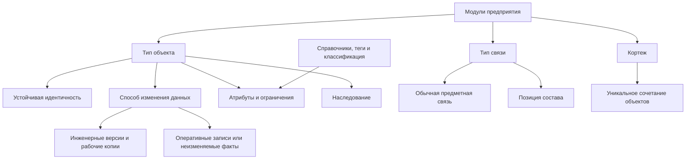

# Предметные возможности системы типов

## Из каких строительных блоков собирается модель

Система типов Interlink рассчитана не только на карточки изделий. Она должна выражать устойчивые объекты, инженерные версии и рабочее содержание, самостоятельные отношения, позиции состава, сочетания объектов, справочники, табличные данные и факты реального мира. PLM использует этот общий фундамент, но логистическое или лабораторное приложение не обязано имитировать инженерную работу там, где её нет.

На срезе документации от 6 сентября 2026 года работают описание и проверка модели, устойчивые определения и часть прикладных представлений. В текущем коде также есть построение физической схемы и планирование её изменений. Это не означает готовность всей пересмотренной архитектуры: полноценные команды и запросы, новые табличные формы и эксплуатационные расширения ещё требуют реализации и приёмки.

## Объект и версия

Для версионируемого типа Interlink различает:

- устойчивый объект — например, «Редуктор РЦ-250»;
- обозначенную инженерную версию — например, «версия Б»;
- рабочую копию этой версии, которая ещё изменяется в конкретной работе;
- опубликованное неизменяемое содержание этой версии, например состояние после согласования нового материала корпуса.

Атрибут заранее объявляет область. Обозначение может принадлежать объекту и не повторяться в каждом состоянии. Масса и материал относятся к содержанию. Если процесс допускает правку версии Б без нового обозначения, у неё может появиться следующее опубликованное состояние; предыдущее остаётся неизменным. Сохранение рабочей копии и публикация — разные действия.

Неверсионируемые типы уже выражаются в логической модели. Целевой фундамент подробнее разделяет оперативно изменяемые записи и факты, которые только добавляются. Например, контактный номер в карточке склада можно исправить с проверкой параллельных изменений этой карточки. Зарегистрированный результат измерения сохраняется неизменным; ошибку исправляют новым связанным фактом с указанием причины. Документ-протокол может иметь собственную версионность и согласование — его не следует смешивать с отдельным результатом измерения. Для карточки и измерительного факта инженерные версии не обязательны.

Для физического мира также нужны периоды действия и история исправлений: где был установлен насос, кому принадлежал экземпляр, когда произошло событие и когда о нём узнали. Это самостоятельная предметная семантика поверх общего хранения записей и фактов, а не обязательная инженерная версия каждого события. Подробности развития — [[цифровые двойники|Data-digital-twins]].

## Наследование типов

Типы могут образовывать одиночную иерархию. Общие признаки задаются один раз, а специализированный тип добавляет свои. Например:

- «Инженерный объект» задаёт номер и представление;
- «Изделие» добавляет массу и материал;
- «Редуктор» добавляет передаточное отношение;
- «Планетарный редуктор» добавляет число сателлитов.

Физическая схема допускает согласованный выбор хранения иерархии: отдельные уровни либо общую таблицу близких типов. Предметный смысл при этом одинаков: планетарный редуктор должен иметь все обязательные общие и специальные признаки, а не только числиться в общем реестре. Текущие средства построения схемы ещё нужно согласовать с пересмотренным хранением и безопасным обновлением.

## Связи как самостоятельные предметные факты

Связь уже имеет собственный тип, атрибуты и ограничения концов в логической модели. В целевой физической схеме ей будет соответствовать отдельная таблица с проверяемыми ограничениями. Связь может соединять устойчивые объекты, точные версии или комбинацию этих уровней.

Для состава используется специальная связь — позиция состава. Она входит в рабочее либо опубликованное содержание родителя и обычно указывает на устойчивый дочерний объект. Далее выбираются инженерная версия и её содержание. Можно закрепить инженерную версию, а можно потребовать строго определённое неизменяемое содержание — это разные уровни фиксации. Сохраняется сильный предметный принцип IPS: конкретное место использования имеет собственный смысл и не сводится к ссылке в карточке детали.

Каждая связь получает две человекочитаемые формулировки: «редуктор содержит вал» и «вал входит в редуктор». Благодаря этому дерево, обратный поиск, отчёт и объяснение агента говорят предметным языком.

## Атрибуты и ограничения

Модель предусматривает следующие основные классы данных; полнота их исполнения и чтения проверяется отдельно:

- строки, числа, даты, логические значения и идентификаторы;
- длинный текст и двоичные ссылки;
- списки допустимых значений;
- ссылки на объект или на точную версию;
- упорядоченные списки значений и ссылок;
- измеряемые величины с единицей и нормализованным значением;
- интервалы дат или чисел;
- локализованные строки;
- вычисляемые значения;
- ссылки из данных на определения типов.

В целевом контуре ограничения обязательности, уникальности, длины, диапазона, допустимого списка и принадлежности ссылки не должны оставаться только подсказкой интерфейсу. Там, где это возможно, они будут материализованы в правила базы данных и продублированы проверкой будущего командного слоя.

## Кортежи

Кортеж представляет уникальное сочетание нескольких объектов, у которого есть собственные атрибуты. Пример — «деталь × завод»: для одной детали на разных площадках различаются маршрут, код закупки и нормативный запас.

Целевая структурная уникальность должна гарантировать, что сочетание не будет случайно создано дважды. Например, производственные сведения одной детали для одного завода не требуют второго экземпляра самой детали и отдельной ручной нумерации пары.

Существующее сочетание объектов не является готовой поддержкой произвольных осей. Для сочетания материала, температуры и исполнения нужны новые правила типов, сравнения величин и области допустимых значений. Это часть следующего развития, а не скрытая возможность уже реализованного объектного сочетания.

## Справочные строки, полные сетки и карты соответствий

В план включены три формы с разными обещаниями пользователю.

| Форма | Прикладной пример | Основное правило |
|---|---|---|
| Справочник строк | Стандартные сочетания диаметра и длины винта | Хранятся предусмотренные записи; все математические сочетания не требуются |
| Полная многомерная сетка | Материал и температура в утверждённой программе испытания | Должна быть представлена каждая клетка объявленной конечной области |
| Разреженная карта соответствий | По среде, проходу и исполнению выбирается конструкция клапана | Сохраняются заданные соответствия; пустое место само по себе не является запретом |

Форма и содержание разделены. Добавить строку по уже принятой форме — работа с данными. Добавить новую ось — изменение формы с анализом последствий. Для точного расчёта сохраняются редакция содержания, использованные значения осей и правила интерпретации.

Полнота сетки не равна известности всех показателей: клетка может существовать, но измерение ещё не получено. Также запись допустимого сочетания не создаёт автоматически отдельное товарное исполнение и не доказывает совместимость всего изделия. Подробнее — [[табличные данные|Tabular-data]] и [[матрицы совместимости|Compatibility-matrices]].

## Справочники, теги и классификация

В уже реализованной модели элемент списка содержит минимальный набор: устойчивый машинный код, локализованную подпись и признак значения по умолчанию. Порядок следует декларации списка. Состояние «активно/неактивно», период действия, владелец локального элемента и история его эксплуатационного изменения не входят в этот минимальный контракт: это целевой управляемый каталог принимающего продукта. Предприятие сможет дополнять только те списки, для которых модель явно разрешает настройку.

Теги предназначены для лёгкой группировки. Они не подменяют атрибуты, состояния или классификацию.

Классификация с наборами характеристик запланирована как композиция дерева классов, единого пула типизированных атрибутов и механизма прикрепления значений. Это позволяет избежать второй параллельной системы свойств.

## Три режима атрибутов

| Режим | Предметный смысл | Целевой физический подход |
|---|---|---|
| Основной | Поле является штатной частью типа | Колонка или специализированная таблица значений |
| Прикрепляемый по необходимости | Поле известно модели, но требуется не каждому экземпляру | Типизированный контейнер расширений |
| Открытый | К экземпляру разрешено прикреплять определения из утверждённого пула | Тот же контейнер с обязательным определением каждого значения |

В целевом открытом режиме не должны допускаться безымянные пары «ключ–значение». У каждого значения требуется определение, тип, домен и авторство.

## Пример 1. Редуктор и его состав

Номер редуктора принадлежит устойчивому объекту, материал корпуса — его содержанию. Позиция «Выходной вал» имеет количество, порядок и выбранный способ конкретизации. Конструктор может закрепить инженерную версию вала; для контрольного испытания он использует точное проверенное содержание. Ограничения должны различать эти требования и не позволять выдать состояние чужого вала за нужное. Новая рабочая правка не меняет уже зафиксированный испытательный комплект.

## Пример 2. Технологический документ

Инструкция связана с операцией отношением «регламентирует». У связи есть область применения и признак обязательности. Это самостоятельный факт, поэтому его нельзя корректно заменить простым ссылочным полем на карточке операции.

## Пример 3. Параметр насоса по требованию заказчика

Поле «содержание абразива» требуется только для части насосов. В целевом контуре оно прикрепляется по необходимости, но остаётся числовой величиной с единицей и допустимым диапазоном. Контролируемая запись должна отклонить ошибочное текстовое значение. Для дополнительного поля не обещаются автоматически все физические ограничения штатного хранения; границу проверок задаёт выбранный профиль.

## Пример 4. Заводские данные детали

Для детали «Корпус насоса» завод А использует собственный маршрут и размер партии, завод Б — другой. В целевой схеме кортеж «деталь × завод» будет хранить эти различия без копирования самой детали.

## Что это даёт по сравнению с IPS

IPS доказал ценность универсальной предметной модели. Целевая архитектура Interlink усиливает её: известные типы и ограничения должны стать видимыми системе управления базой данных (СУБД), а приложение — получить единый согласованный контракт. Ожидается, что это уменьшит число ошибок, которые в универсальной схеме можно обнаружить только в прикладной логике или специальной проверкой целостности; преимущество ещё предстоит подтвердить сквозным опытным образцом.

## Критерии приёмки целевого механизма

1. Модель выражает версионируемые и неверсионируемые типы без параллельных ядер.
2. Объектные и версионные атрибуты физически различены.
3. Связь имеет атрибуты, ограничения концов и понятные формулировки.
4. Позиция состава сохраняет семантику «версия родителя → объект ребёнка».
5. Список ссылок и кортеж защищены реальными ограничениями целостности.
6. Расширенное значение невозможно сохранить без определения и проверки типа.

## Состояние реализации

Основная модель и значительная часть определений уже имеют реализацию, как и строительные блоки физической схемы и планирования изменений. Пересмотренные способы записи, точное историческое чтение, полные табличные формы, эксплуатационные расширения и прикладные процессы ещё требуется провести через исполняемую систему. Классификация, отраслевые факты и цифровые двойники развиваются поэтапно; наличие подходящих типов само по себе не доказывает готовый пользовательский сценарий.

## Связанные документы

- [[DSL как язык модели|Data-model-language]]
- [[Материализация в базе данных|Data-database-materialization]]
- [[Цифровые двойники|Data-digital-twins]]
