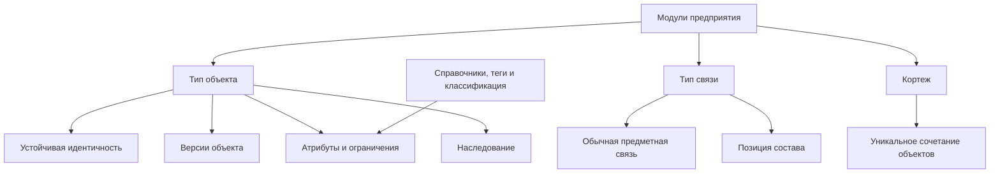

# Предметные возможности системы типов

## Из каких строительных блоков собирается модель

Система типов Interlink рассчитана не только на карточки изделий. Она должна выражать устойчивые объекты, их версии, самостоятельные связи, позиции состава, контекстные сочетания объектов, справочники, расширяемые свойства и будущие факты эксплуатации.

На текущем этапе уже работают описание и проверка логической модели, устойчивые идентификаторы и часть типизированных прикладных представлений. Физические таблицы, ограничения PostgreSQL, команды записи и эксплуатационные расширения ниже описаны как **целевой механизм**: генератора физической схемы и полного пути записи пока нет.

## Объект и версия

Для версионируемого типа Interlink различает:

- устойчивый объект — например, «Редуктор РЦ-250»;
- конкретную версию — например, состояние с новым материалом корпуса;
- рабочую версию, которая ещё изменяется;
- зафиксированную версию, содержание которой больше не переписывается.

Атрибут заранее объявляет область. Обозначение может принадлежать объекту и не повторяться в каждой версии. Масса, материал или наименование исполнения могут принадлежать версии. Предметное разделение уже выражено в модели; целевая физическая схема должна закрепить его в разных структурах хранения.

Неверсионируемые типы тоже поддерживаются логической моделью. В целевой физической схеме завод, единица измерения, справочная площадка или иной объект без инженерной истории версий будет храниться проще — в одной предметной таблице.

В будущем предусмотрен третий профиль — историзируемые факты. Он нужен для сведений физического мира с периодом действия: где был установлен насос, кому принадлежал экземпляр, какое состояние действовало на указанную дату. Такой факт не должен порождать инженерную версию изделия и не должен терять историю при перезаписи.

## Наследование типов

Типы могут образовывать одиночную иерархию. Общие признаки задаются один раз, а специализированный тип добавляет свои. Например:

- «Инженерный объект» задаёт номер и представление;
- «Изделие» добавляет массу и материал;
- «Редуктор» добавляет передаточное отношение;
- «Планетарный редуктор» добавляет число сателлитов.

Целевая физическая схема предусматривает две стратегии хранения иерархии. Обычная стратегия будет сохранять отдельные таблицы уровней с общим ключом. Для небольшой стабильной иерархии близких типов сможет использоваться одна таблица с признаком конкретного вида. Генерация схемы и проверяемая миграция этих вариантов ещё не реализованы.

## Связи как самостоятельные предметные факты

Связь уже имеет собственный тип, атрибуты и ограничения концов в логической модели. В целевой физической схеме ей будет соответствовать отдельная таблица с проверяемыми ограничениями. Связь может соединять устойчивые объекты, точные версии или комбинацию этих уровней.

Для состава используется специальная связь — позиция состава. Она принадлежит версии родителя, но обычно указывает на устойчивый дочерний объект. Точная версия ребёнка выбирается по условиям либо фиксируется отдельно. Это сильное решение IPS сохранено в Interlink.

Каждая связь получает две человекочитаемые формулировки: «редуктор содержит вал» и «вал входит в редуктор». Благодаря этому дерево, обратный поиск, отчёт и объяснение агента говорят предметным языком.

## Атрибуты и ограничения

Поддерживаются основные классы данных:

- строки, числа, даты, логические значения и идентификаторы;
- длинный текст и двоичные ссылки;
- списки допустимых значений;
- ссылки на объект или на точную версию;
- упорядоченные списки значений и ссылок;
- измеряемые величины с единицей и нормализованным значением;
- интервалы дат или чисел;
- локализованные строки;
- вычисляемые значения;
- ссылки из данных на определения типов.

В целевом контуре ограничения обязательности, уникальности, длины, диапазона, допустимого списка и принадлежности ссылки не должны оставаться только подсказкой интерфейсу. Там, где это возможно, они будут материализованы в правила базы данных и продублированы проверкой будущего командного слоя.

## Кортежи

Кортеж представляет уникальное сочетание нескольких объектов, у которого есть собственные атрибуты. Пример — «деталь × завод»: для одной детали на разных площадках различаются маршрут, код закупки и нормативный запас.

Целевая структурная уникальность должна гарантировать, что сочетание не будет случайно создано дважды. Это заимствует проверенный производственный образ SAP MARC, не превращая пару в искусственный объект с ручной нумерацией.

## Справочники, теги и классификация

В уже реализованной модели элемент списка содержит минимальный набор: устойчивый машинный код, локализованную подпись и признак значения по умолчанию. Порядок следует декларации списка. Состояние «активно/неактивно», период действия, владелец локального элемента и история его эксплуатационного изменения не входят в этот минимальный контракт: это целевой управляемый каталог принимающего продукта. Предприятие сможет дополнять только те списки, для которых модель явно разрешает настройку.

Теги предназначены для лёгкой группировки. Они не подменяют атрибуты, состояния или классификацию.

Классификация с наборами характеристик запланирована как композиция дерева классов, единого пула типизированных атрибутов и механизма прикрепления значений. Это позволяет избежать второй параллельной системы свойств.

## Три режима атрибутов

| Режим | Предметный смысл | Целевой физический подход |
|---|---|---|
| Основной | Поле является штатной частью типа | Колонка или специализированная таблица значений |
| Прикрепляемый по необходимости | Поле известно модели, но требуется не каждому экземпляру | Типизированный контейнер расширений |
| Открытый | К экземпляру разрешено прикреплять определения из утверждённого пула | Тот же контейнер с обязательным определением каждого значения |

В целевом открытом режиме не должны допускаться безымянные пары «ключ–значение». У каждого значения требуется определение, тип, домен и авторство.

## Пример 1. Редуктор и его состав

В целевой физической схеме номер редуктора хранится на устойчивом объекте, материал корпуса — на версии. Позиция «Выходной вал» имеет количество, порядок и при необходимости точную фиксацию версии. Ограничения базы должны различать все уровни и не позволять сослаться на версию чужого вала.

## Пример 2. Технологический документ

Инструкция связана с операцией отношением «регламентирует». У связи есть область применения и признак обязательности. Это самостоятельный факт, поэтому его нельзя корректно заменить простым ссылочным полем на карточке операции.

## Пример 3. Параметр насоса по требованию заказчика

Поле «содержание абразива» требуется только для части насосов. В целевом контуре оно прикрепляется по необходимости, но остаётся числовой величиной с единицей и допустимым диапазоном. Будущий командный слой и ограничение базы должны отклонить ошибочное текстовое значение.

## Пример 4. Заводские данные детали

Для детали «Корпус насоса» завод А использует собственный маршрут и размер партии, завод Б — другой. В целевой схеме кортеж «деталь × завод» будет хранить эти различия без копирования самой детали.

## Что это даёт по сравнению с IPS

IPS доказал ценность универсальной предметной модели. Целевая архитектура Interlink усиливает её: известные типы и ограничения должны стать видимыми системе управления базой данных (СУБД), а приложение — получить единый согласованный контракт. Ожидается, что это уменьшит число ошибок, которые в универсальной схеме можно обнаружить только в прикладной логике или специальной проверкой целостности; преимущество ещё предстоит подтвердить сквозным опытным образцом.

## Критерии приёмки целевого механизма

1. Модель выражает версионируемые и неверсионируемые типы без параллельных ядер.
2. Объектные и версионные атрибуты физически различены.
3. Связь имеет атрибуты, ограничения концов и понятные формулировки.
4. Позиция состава сохраняет семантику «версия родителя → объект ребёнка».
5. Список ссылок и кортеж защищены реальными ограничениями целостности.
6. Расширенное значение невозможно сохранить без определения и проверки типа.

## Состояние реализации

Основная метамодель и большая часть перечисленных определений уже входят в нормативный контракт и компилятор. Историзируемый профиль, классификационные схемы, сигналы и полный конфигуратор зафиксированы как развитие после опытного подтверждения. Физические таблицы и команды записи приходят в следующих фазах.

## Связанные документы

- [DSL как язык модели](Data-model-language)
- [Материализация в базе данных](Data-database-materialization)
- [Цифровые двойники](Data-digital-twins)
