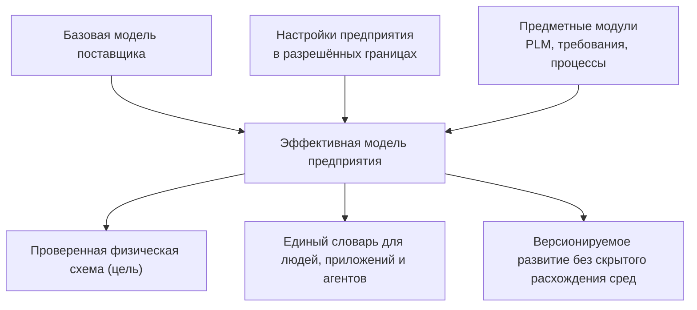

# Почему система типов является основой продукта

## Общая адресация поверх разных предметных ролей

Дополнение от 7 сентября вводит [элемент](Elements-and-concepts) как общий проверяемый адрес, а не новый универсальный объект. Тип инструкции, сама инструкция, её применение в маршруте и выполненная работа различаются. Типизированное хранение и собственные правила изменения сохраняются.

[Предметный словарь](Domain-concepts) объясняет смысл и помогает поиску. Он не заменяет структуру данных и не разрешает действие. Например, новая инструкция предусмотренной формы добавляется как данные, а новое обязательное поле вне разрешённой формы требует изменения модели. Подробная работа технолога раскрыта в [процессах и выполнении](Instructions-and-execution).

## Не просто справочник полей

Система типов Interlink — это не административный перечень карточек. Она описывает предметный мир предприятия: какие объекты существуют, какие состояния они проходят, как связаны, какие данные принадлежат объекту вообще, а какие — конкретной версии, какие ограничения должны выполняться и как структура может расширяться.

За счёт этого одна и та же платформа способна стать основанием для разных продуктов: PLM/PDM, управления требованиями, технологической подготовки, заказного контура, Alvatune и будущей системы цифровых двойников. Каждый продукт добавляет свои предметные модули, но не создаёт новое несовместимое объектное ядро.

Сейчас существуют компилятор модели, сборка модулей, генерация средств приложений и развиваемые средства формирования физической схемы и планирования переходов. Полный путь установки, предметной записи и чтения по новой архитектуре ещё требует завершения и приёмки. Описанные ниже пользовательские возможности следует читать как целевой договор, а не как перечень готовых экранов.

## Продуктовая формула

Interlink соединяет две традиционно конфликтующие ценности:

- **гибкость метамодели** — предприятие может развивать собственный словарь объектов, связей и атрибутов;
- **строгость прикладной системы** — известные типы проверяются заранее, а база данных знает их физическую структуру и ограничения.

В универсальных системах гибкость часто означает, что тип выясняется только при выполнении. В жёстких прикладных системах высокая скорость достигается ценой трудного расширения. Interlink предлагает промежуточную модель: основная предметная структура компилируется, разрешённые изменения предприятия сохраняются, а редкие расширения получают гибкий типизированный контур.

## Какие задачи решает тип

Тип одновременно отвечает на несколько продуктовых вопросов:

- как называется предмет и как его показать пользователю;
- является ли он версионируемым;
- какие атрибуты и связи допустимы;
- какие значения обязательны, уникальны или ограничены диапазоном;
- можно ли добавлять настройки предприятия во время работы;
- как данные физически хранятся и индексируются;
- какие команды и запросы получает прикладной модуль;
- как изменение определения переводится в изменение базы данных.

В IPS часть этих ответов распределена между метаданными, привязками атрибутов, формами, обработчиками типов и физическими срезами. В Interlink определения данных сводятся в один проверяемый смысл модели. Прикладные процессы, согласование и отраслевые правила используют этот смысл, но не выводятся автоматически из перечня полей: им нужны явно заданные правила и собственная приёмка.

### Не всем данным нужны инженерные версии

У конструкции редуктора есть обозначение, инженерная версия «Б», опубликованное содержание этой версии и рабочая правка в области конструктора. Сохранение правки не выпускает новую версию и не меняет содержание, которым пользуется производство. Когда публикация разрешена, система сохраняет новое неизменяемое содержание; прежнее остаётся основанием уже выданных комплектов.

Адрес склада устроен иначе: его можно изменять с проверкой полномочий и конфликтов, не выпуская инженерную версию склада. Результат измерения диаметра устроен иначе ещё раз: его нельзя тихо переписать, ошибку исправляют новой связанной записью. Для исторического решения по адресу склада сохраняют точное использованное значение. Это осознанная фиксация основания, а не обязательное архивирование каждого нажатия клавиши.

Такой выбор формы записи позволяет использовать Interlink в логистике, управлении качеством и других областях без искусственных конструкторских процедур. Подробнее — [[объектный фундамент|Object-foundation]].

## Почему реальные таблицы не уменьшают гибкость

На первый взгляд собственная таблица для каждого конкретного типа кажется возвращением к жёсткой схеме. На практике гибкость переносится на управляемый уровень:

1. Новый тип добавляется декларацией модели, а не ручным программированием ядра.
2. Компилятор создаёт согласованные физические и прикладные артефакты.
3. Миграция переводит существующую базу в новую версию.
4. Предприятие сохраняет разрешённые локальные настройки.
5. Редкие дополнительные поля могут появляться в типизированном расширении без немедленной перестройки таблицы.
6. Если поле становится массовым, оно переводится в основную колонку штатной миграцией.

Таким образом, система остаётся расширяемой, но изменение перестаёт быть невидимым и случайным.

## Ценность для разных участников

### Для продуктового специалиста IPS

Знакомые конструкции — объект, версия, связь, состав, ссылочный атрибут, список, применяемость и конфигурация — сохраняются. Меняется способ обеспечения надёжности: меньше правил остаётся только в памяти ядра и локальной настройке базы.

### Для администратора модели

Изменение получает версию, понятную разницу, проверку зависимостей и предсказуемый путь между средами. Настройки заказчика не должны исчезать при обновлении поставщика.

### Для разработчика продукта

Известный объект перестаёт быть универсальной записью с поиском свойства по строковому имени. Ошибки несовместимости обнаруживаются раньше, а запросы строятся из согласованной модели.

### Для эксплуатации

Схема базы, индексы и ограничения известны заранее. Расхождение между поставкой и базой обнаруживается при развёртывании или запуске. Горячие места можно измерять и оптимизировать без появления второго авторитетного пути хранения.

### Для агентов Alvatune

Агент получает тот же типовой словарь, что человек и приложение. Его действия связаны с точным типом, версией модели и происхождением запуска. Это снижает риск, что два агента будут по-разному трактовать одно поле или обходить объектные ограничения.

## Пример 1. Семейство редукторов

Предприятие создаёт базовый тип «Изделие», а от него — «Редуктор», «Вал» и «Зубчатое колесо». Обозначение редуктора относится к устойчивому объекту, масса и материал входят в содержание инженерной версии, а состав хранится типизированными позициями. Внутри версии «Б» могут последовательно публиковаться разные состояния содержания: для ранее выданного заказа важно точное состояние, а не только буква «Б».

При добавлении нового признака «класс точности» меняется модель редуктора. В целевом процессе ответственный выпускает определение, проверяет допустимые значения и переход для существующих данных. После установки модель не позволяет записать посторонний код класса. Если же конструктор выбирает другой уже допустимый класс для конкретного редуктора, это изменение предметных данных, а не новый выпуск модели предприятия.

## Пример 2. Документ и его назначение

Чертёж и технологическая инструкция являются разными типами документов, но наследуют общие реквизиты. Связь «описывает изделие» имеет собственные атрибуты: назначение документа и область применения.

Это не безликая ссылка. База знает допустимые типы обоих концов, а пользователь получает понятную прямую и обратную формулировку связи.

## Пример 3. Оборудование разных заводов

Одна модель станка применяется на заводах А и Б с разными локальными обозначениями, ответственными службами и нормами обслуживания. Комбинация «модель станка × завод» получает собственные контекстные данные с уникальностью этого сочетания, а не набор дублирующихся строк. Серийные станки и их инвентарные номера при этом остаются отдельными физическими экземплярами.

Такие контекстные данные можно расширить новыми производственными атрибутами, не меняя идентичность модели станка. Если норма была основанием плана обслуживания, важно сохранить использованное содержание нормы, а не только сегодняшнюю связь с заводом.

## Пример 4. Расширение карточки насоса

Сервисное подразделение добавляет к отдельным насосам редкое поле «условие консервации». Сначала оно живёт как типизированное расширение только у нужных экземпляров. Когда поле начинает использоваться для большинства насосов и регулярных выборок, администратор переводит его в основную модель и отдельную колонку.

Пользовательский смысл остаётся тем же, а хранение можно лучше приспособить к массовым фильтрам и отчётам. Полученный выигрыш проверяется измерением, а не самим фактом появления отдельной колонки.

## Что заимствовано у других систем

- у IPS — предметная глубина универсальной модели и правильная асимметрия состава;
- у Aras — принцип «тип → таблица» и разделение устойчивого объекта и поколений;
- у Teamcenter BMIDE и Prisma — модель в файлах, из которой выводятся поставляемые артефакты;
- у SAP и Salesforce — пространства расширений заказчика;
- у Flyway и Liquibase — строгая цепочка миграций, контрольные суммы и журнал применения.

Interlink не копирует ни одну систему целиком. Его отличие — соединение этих практик с общей PLM-семантикой, типизированными запросами и единым путём записи.

## Критерии продуктовой приёмки

1. Реалистичная модель предприятия выражается без универсальных строковых обходов.
2. Новый предметный тип не требует изменения ядра Interlink.
3. Один смысл модели порождает согласованные таблицы, ограничения, программные контракты и миграцию.
4. Настройка предприятия переживает обновление поставщика или создаёт явный конфликт.
5. Массовое расширение можно перевести в основную колонку без изменения предметной семантики.
6. Пользователь и агент получают одинаковые определения типов и связей.

## Состояние реализации

Язык модели, его компилятор, наследование и сборка модулей имеют реализацию. Генерация прикладных средств, физической схемы и планирование переходов уже представлены в развиваемом коде. Это не доказывает завершённую поддержку всех описанных форм записи, обновление промышленной базы или работу прикладных процессов. Новые правила версий, нейтральные записи, табличные наборы и эксплуатационные расширения должны пройти отдельные сквозные проверки; нагрузочное преимущество пока не подтверждено сравнительными измерениями.

## Связанные документы

- [[Предметные возможности системы типов|Data-type-system-capabilities]]
- [[Физическая материализация|Data-database-materialization]]
- [[Расширяемость|Data-extensibility]]
