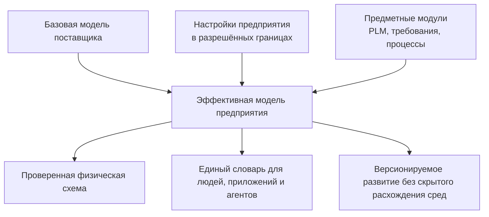

# Почему система типов является основой продукта

## Не просто справочник полей

Система типов Interlink — это не административный перечень карточек. Она описывает предметный мир предприятия: какие объекты существуют, какие состояния они проходят, как связаны, какие данные принадлежат объекту вообще, а какие — конкретной версии, какие ограничения должны выполняться и как структура может расширяться.

За счёт этого одна и та же платформа способна стать основанием для разных продуктов: PLM/PDM, управления требованиями, технологической подготовки, заказного контура, Alvatune и будущей системы цифровых двойников. Каждый продукт добавляет свои предметные модули, но не создаёт новое несовместимое объектное ядро.

## Продуктовая формула

Interlink соединяет две традиционно конфликтующие ценности:

- **гибкость метамодели** — предприятие может развивать собственный словарь объектов, связей и атрибутов;
- **строгость прикладной системы** — известные типы проверяются заранее, а база данных знает их физическую структуру и ограничения.

В универсальных системах гибкость часто означает, что тип выясняется только при выполнении. В жёстких прикладных системах высокая скорость достигается ценой трудного расширения. Interlink предлагает промежуточную модель: основная предметная структура компилируется, разрешённые изменения предприятия сохраняются, а редкие расширения получают гибкий типизированный контур.

## Какие задачи решает тип

Тип одновременно отвечает на несколько продуктовых вопросов:

- как называется предмет и как его показать пользователю;
- является ли он версионируемым;
- какие атрибуты и связи допустимы;
- какие значения обязательны, уникальны или ограничены диапазоном;
- можно ли добавлять настройки предприятия во время работы;
- как данные физически хранятся и индексируются;
- какие команды и запросы получает прикладной модуль;
- как изменение определения переводится в изменение базы данных.

В IPS часть этих ответов распределена между метаданными, привязками атрибутов, формами, обработчиками типов и физическими срезами. В Interlink они сводятся в один проверяемый смысл модели, из которого получаются все производные представления.

## Почему реальные таблицы не уменьшают гибкость

На первый взгляд собственная таблица для каждого конкретного типа кажется возвращением к жёсткой схеме. На практике гибкость переносится на управляемый уровень:

1. Новый тип добавляется декларацией модели, а не ручным программированием ядра.
2. Компилятор создаёт согласованные физические и прикладные артефакты.
3. Миграция переводит существующую базу в новую версию.
4. Предприятие сохраняет разрешённые локальные настройки.
5. Редкие дополнительные поля могут появляться в типизированном расширении без немедленной перестройки таблицы.
6. Если поле становится массовым, оно переводится в основную колонку штатной миграцией.

Таким образом, система остаётся расширяемой, но изменение перестаёт быть невидимым и случайным.

## Ценность для разных участников

### Для продуктового специалиста IPS

Знакомые конструкции — объект, версия, связь, состав, ссылочный атрибут, список, применяемость и конфигурация — сохраняются. Меняется способ обеспечения надёжности: меньше правил остаётся только в памяти ядра и локальной настройке базы.

### Для администратора модели

Изменение получает версию, понятную разницу, проверку зависимостей и предсказуемый путь между средами. Настройки заказчика не должны исчезать при обновлении поставщика.

### Для разработчика продукта

Известный объект перестаёт быть универсальной записью с поиском свойства по строковому имени. Ошибки несовместимости обнаруживаются раньше, а запросы строятся из согласованной модели.

### Для эксплуатации

Схема базы, индексы и ограничения известны заранее. Расхождение между поставкой и базой обнаруживается при развёртывании или запуске. Горячие места можно измерять и оптимизировать без появления второго авторитетного пути хранения.

### Для агентов Alvatune

Агент получает тот же типовой словарь, что человек и приложение. Его действия связаны с точным типом, версией модели и происхождением запуска. Это снижает риск, что два агента будут по-разному трактовать одно поле или обходить объектные ограничения.

## Пример 1. Семейство редукторов

Предприятие создаёт базовый тип «Изделие», а от него — «Редуктор», «Вал» и «Зубчатое колесо». Номер редуктора принадлежит устойчивому объекту, масса и материал — конкретной версии, а состав хранится типизированными позициями.

При добавлении нового признака «класс точности» меняется модель редуктора. Система заранее проверяет допустимые значения, создаёт физическое место хранения и не позволяет записать посторонний код класса.

## Пример 2. Документ и его назначение

Чертёж и технологическая инструкция являются разными типами документов, но наследуют общие реквизиты. Связь «описывает изделие» имеет собственные атрибуты: назначение документа и область применения.

Это не безликая ссылка. База знает допустимые типы обоих концов, а пользователь получает понятную прямую и обратную формулировку связи.

## Пример 3. Оборудование разных заводов

Один станок используется на заводах А и Б с разными инвентарными номерами, ответственными и нормами обслуживания. Комбинация «станок × завод» моделируется самостоятельным кортежем со структурной уникальностью, а не набором дублирующихся строк.

Такой кортеж можно расширить новыми производственными атрибутами, не меняя идентичность самого станка.

## Пример 4. Расширение карточки насоса

Сервисное подразделение добавляет к отдельным насосам редкое поле «условие консервации». Сначала оно живёт как типизированное расширение только у нужных экземпляров. Когда поле начинает использоваться для большинства насосов и регулярных выборок, администратор переводит его в основную модель и отдельную колонку.

Пользовательский смысл остаётся тем же, но хранение становится оптимальным для массовой работы.

## Что заимствовано у других систем

- у IPS — предметная глубина универсальной модели и правильная асимметрия состава;
- у Aras — принцип «тип → таблица» и разделение устойчивого объекта и поколений;
- у Teamcenter BMIDE и Prisma — модель в файлах, из которой выводятся поставляемые артефакты;
- у SAP и Salesforce — пространства расширений заказчика;
- у Flyway и Liquibase — строгая цепочка миграций, контрольные суммы и журнал применения.

Interlink не копирует ни одну систему целиком. Его отличие — соединение этих практик с общей PLM-семантикой, типизированными запросами и единым путём записи.

## Критерии продуктовой приёмки

1. Реалистичная модель предприятия выражается без универсальных строковых обходов.
2. Новый предметный тип не требует изменения ядра Interlink.
3. Один смысл модели порождает согласованные таблицы, ограничения, программные контракты и миграцию.
4. Настройка предприятия переживает обновление поставщика или создаёт явный конфликт.
5. Массовое расширение можно перевести в основную колонку без изменения предметной семантики.
6. Пользователь и агент получают одинаковые определения типов и связей.

## Состояние реализации

Метамодель, компилятор DSL, устойчивые идентификаторы, наследование, большая часть типов атрибутов, модули и генерация основных форм уже представлены в коде или принятом контракте. Полная физическая материализация, миграции, эксплуатационные расширения и нагрузочное доказательство относятся к последующим фазам.

## Связанные документы

- [Предметные возможности системы типов](Data-type-system-capabilities)
- [Физическая материализация](Data-database-materialization)
- [Расширяемость](Data-extensibility)
