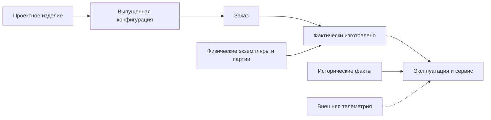

# Развитие к цифровым двойникам

## Цифровой двойник — не ещё одна карточка

Для промышленного изделия нужно связать несколько состояний:

- как спроектировано;
- как выпущено;
- как заказано;
- как изготовлено;
- что фактически установлено;
- как обслуживалось;
- какие сигналы относятся к конкретному узлу.

Interlink уже строится вокруг устойчивых объектов, версий, адресуемых позиций состава, точных снимков и происхождения решений. Это создаёт основу цифровой нити без второго объектного ядра.

## Первое направление — экземплярный двойник

Целью первого этапа является цифровое представление конкретной физической единицы с серийным номером и связью между проектным, изготовленным и обслуживаемым составом.

Например, компрессор имеет:

- проектный тип и версию;
- точный снимок производственного заказа;
- серийный экземпляр;
- фактически установленные двигатель и сепаратор;
- историю замен;
- связь с партиями поставщика;
- каталог контролируемых сигналов.

## Нить позиции состава

Обычная строка состава принадлежит конкретной версии и может исчезнуть в следующем выпуске. Для двойника нужна устойчивая нить позиции — ответ на вопрос «это то же место в изделии между версиями?»

К ней можно привязать фактически установленный экземпляр, замену и сигнал. Это позволяет сравнивать проектное и фактическое состояние без хрупкого сопоставления по номеру строки.

## Физические единицы и партии

Поштучно учитываемый двигатель имеет собственный серийный номер. Подшипники могут учитываться партией. Родословная связывает партию с изделиями, куда её компоненты фактически установлены.

Если поставщик сообщает о дефекте партии, система находит затронутые серийные экземпляры, места установки и обслуживающие организации.

## Исторические факты

Сервисная замена не создаёт новую конструкторскую версию. Она записывается как факт с периодом действия:

- какой экземпляр был установлен;
- на каком месте;
- с какого и до какого времени;
- почему заменён;
- кто подтвердил операцию.

Так можно восстановить фактический состав на дату аварии или гарантийного обращения.

## Граница телеметрии

Interlink определяет сигнал, размерность, допустимый диапазон и связь с экземпляром или позицией. Высокочастотные измерения остаются во внешнем специализированном хранилище.

В Interlink возвращаются конфигурационно значимые события и агрегаты. Это не превращает PLM в систему сбора миллионов измерений в секунду и не делает телеметрическую платформу вторым владельцем конструкции.

## Этапы развития

1. Завершить основной вертикальный срез типов, хранения, запросов и миграций.
2. Реализовать устойчивую адресацию позиции.
3. Ввести общую модель физических единиц и партий.
4. Добавить снимок «как изготовлено».
5. Реализовать историзируемые факты.
6. Связать каталог сигналов с внешней телеметрией.
7. Проверить масштаб на миллионах единиц и фактов.

## Открытый продуктовый выбор

Первый коммерчески полезный сценарий ещё нужно выбрать вместе с пользователями: прослеживаемость партий, гарантийный сервис, управление заменами, сравнение проектного и фактического состава или диагностика.

Вопросы для обсуждения: [[Агенты, испытания и будущее|Questions-agents]].

