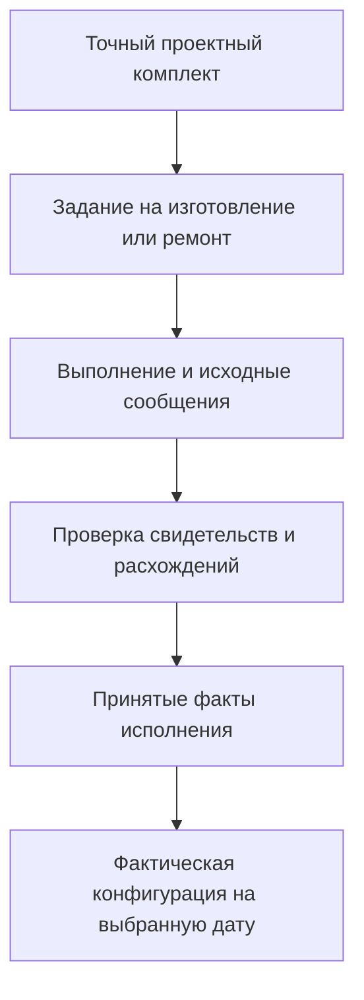
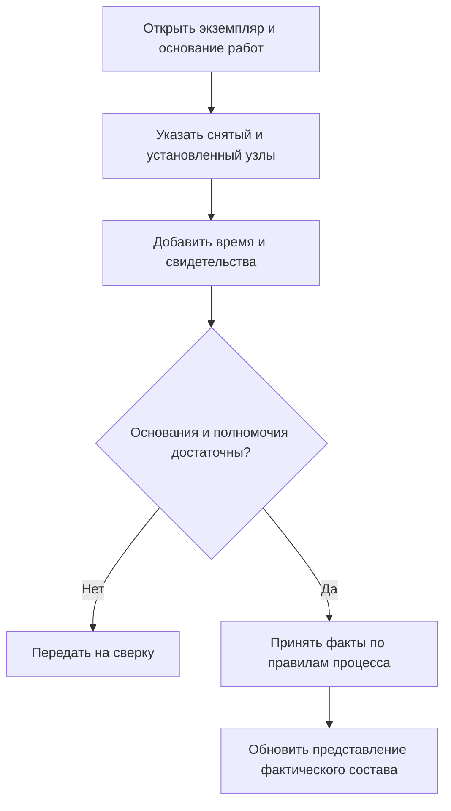

# Развитие к цифровым двойникам

Цифровой двойник в замысле Interlink — связанное представление конкретного изделия или объекта эксплуатации: его проекта, фактической комплектации, истории работ, измерений и расчётных моделей. Это не ещё одна карточка, куда копируются все сведения, и не обязательно трёхмерная модель.

Цель — ответить на практический вопрос: **что представляет собой именно этот экземпляр, почему мы так считаем и какие основания были доступны в момент решения?** Полная сервисная система и промышленный цифровой двойник пока не реализованы. Ниже описаны принятые границы фундамента и направление дальнейшего развития.

## Как связать инструкции и фактическую историю экземпляра

Для цифрового двойника [инструкция, применение и выполнение](Instructions-and-execution) особенно важны: конструкция насоса, программа его испытания, место проверки в заказе и фактический протокол не являются одним предметом. Новая программа не переписывает испытания изготовленного экземпляра.

[Адресуемые элементы](Elements-and-concepts) помогают связать эти данные, но не собирают полный двойник автоматически. Нужно сохранить точные основания, происхождение и необходимые измерения. [Понятия](Domain-concepts) могут согласовать терминологию разных источников, однако совпадение названий не доказывает тождество физических экземпляров и не заменяет проверку внешнего соответствия.

## Сначала разделяем проект, экземпляр и место установки

Проект насоса НЦ-80 описывает, каким насос должен быть. Насос с заводским номером «НЦ-80, изготовлен в 2026 году, № 0042» — конкретный изготовленный предмет. А «резервный насос второго контура охлаждения» — функция в установке. Сегодня её выполняет экземпляр № 0042, после ремонта — другой.

Эти предметы сохраняют самостоятельную историю. Нельзя заменить серийный номер в старой карточке и считать, что зарегистрирована установка нового насоса. Нельзя и создавать новую конструкторскую версию только потому, что агрегат переставили на соседнюю площадку.

| Что различается | На какой вопрос отвечает |
|---|---|
| Проектное определение и его инженерная версия | Какая конструкция предусмотрена? |
| Точный выпущенный комплект | Какое содержание было официально зафиксировано? |
| Конфигурация заказа | Что требовалось изготовить или поставить? |
| Физический экземпляр | Какой именно изготовленный предмет мы учитываем? |
| Партия материала или компонентов | Из какой физической партии происходят материал или компоненты? |
| Функциональное место | Какую роль должен выполнять установленный предмет? |
| Факт установки, ремонта или измерения | Что произошло, по чьим сведениям и на каком основании? |

Серийные обозначения и номера партий имеют область происхождения: одинаковая строка у двух изготовителей не означает один предмет. Помещение, функциональная роль и физическое оборудование тоже не объединяются в универсальное «место».

## «Как спроектировано», «как изготовлено» и «как обслужено»

Проектный состав описывает допустимое инженерное решение. Производственный заказ задаёт, какое решение нужно исполнить. Фактический состав выводится из принятых сведений об изготовлении, установках, снятиях и исправлениях. Для эксплуатации добавляется история обслуживания.

Публикация нового чертежа сама по себе не меняет уже изготовленный насос. Разрешение заменить подшипник не доказывает, что его заменили. Даже сообщение «работа выполнена» может требовать приёмки свидетельств, прежде чем станет основанием принятой фактической конфигурации.

Это переход между разными основаниями, а не автоматическое превращение плана в факт. Сведения об отступлении от проекта нужно сохранять, не одобряя отступление задним числом. Решение о дальнейшем использовании оборудования остаётся отдельным предметным решением с собственными полномочиями.

Для сопоставления составов сохраняется преемственность значимых позиций. Например, можно показать связь позиции «привод резервного насоса» с проектом и фактической установкой. Но одного названия или номера строки недостаточно: в комплексе могут быть два одинаковых узла. Точное свидетельство должно различать конкретное появление внутри зафиксированной структуры. Функциональное место при этом является отдельным эксплуатационным предметом, а не просто строкой конструкторского состава.

## Два времени: что произошло и что было известно

Ремонт может произойти раньше, чем о нём станет известно системе. Поэтому план различает **время события** и **время регистрации сведений**.

Подшипник заменили 3 сентября, акт поступил 8 сентября, а ошибочный номер партии исправили 9 сентября. Нужны два разных ответа:

- «Какой подшипник был установлен 5 сентября по нынешним сведениям?» — учитывает поздно поступивший акт и его исправление.
- «Какой подшипник диспетчер считал установленным 5 сентября, принимая решение тогда?» — не использует сведения, появившиеся только 8 и 9 сентября.

Оба ответа полезны и могут различаться без ошибки. Первый восстанавливает фактическую историю по нынешнему знанию. Второй объясняет прежнее решение без подмешивания информации из будущего.

Исправление создаёт новое связанное утверждение с причиной, а не переписывает первоначальный акт. Правила интерпретации определяют, какие сообщения приняты, какие исправлены и какие противоречат друг другу. Если оснований недостаточно, правильный результат — «неизвестно» или «требует сверки», а не произвольно выбранная последняя запись. Для точного исторического результата сохраняются использованные факты и правила их интерпретации.

## Как будет работать пользователь

Мастер начинает с конкретного экземпляра или функционального места и задания на обслуживание. Он видит проектное основание, принятую фактическую комплектацию, действующие ограничения и область работ. Если сведения неполны, это должно быть видно до принятия решения.

После работ мастер регистрирует, что снято и установлено, время события, исполнителя, серийные номера или партии, применённую процедуру и подтверждающие документы. В зависимости от процесса сведения либо принимаются уполномоченным исполнителем, либо направляются на проверку. Зафиксированный факт не становится незаметно редактируемой заметкой.

Неудачная проверка не оправдывает потерю сообщения: при наличии полномочий его сохраняют как исходное свидетельство или несоответствие. Но оно не должно молча получить статус принятой установки. Конкретный маршрут проверки задаёт сервисный или производственный модуль.

Если два исполнителя регистрируют разные насосы на место, рассчитанное на один агрегат, система должна обнаружить общий конфликт места. После потери ответа повтор не создаёт вторую установку: сначала выясняется исход первоначальной операции. Для внешнего подрядчика получение сообщения и принятие факта тоже различаются.

В целевом интерфейсе полезны состав на дату, лента событий и сравнение с проектом. Из расхождения пользователь должен переходить к акту, процедуре, точному комплекту, источнику и решению о принятии. Это требуемый опыт, а не утверждение о готовом экране.

## Три машиностроительных примера

### 1. Замена насоса и независимая история места

На насосной станции резервную функцию выполняет насос НЦ-80 № 0042. Его снимают для ремонта и устанавливают № 0078 допустимой конструкции. Мастер связывает снятие с прежней установкой, регистрирует новый экземпляр и указывает фактическое время.

История места теперь показывает два насоса последовательно. История № 0042 продолжает жить: демонтаж, ремонт, испытание и установка на другом месте. История № 0078 не наследует ремонты № 0042. Проект станции не получает новую инженерную версию только из-за смены физических экземпляров.

Если акт поступил поздно, система уточняет представление по нынешним сведениям, сохраняя возможность увидеть прежнее знание. Если подрядчик прислал несовместимую установку другого насоса, возникает сверка: два сообщения не становятся двумя «истинными» единственными насосами одного места.

### 2. Отзыв партии подшипников в серии редукторов

Поставщик сообщил о дефекте партии, использованной в редукторах РЦ-250 на двух площадках. Часть редукторов ещё на складе, другие поставлены заказчику, в некоторых подшипники уже заменили при сервисе.

Ответственный специалист начинает с партии поставщика. По фактам происхождения и установки система находит конкретные редукторы, документы поставки и места использования. Затем отдельно показывает историческое применение и предполагаемое текущее наличие. Снятый месяц назад подшипник не должен оставаться в текущем фактическом составе лишь потому, что был в исходном заказе.

Специалист готовит область проверки или отзыва; соответствующее действие проходит самостоятельное согласование. Сообщение поставщика не создаёт события демонтажа. Если по одному редуктору нет достоверного сервисного акта, он выделяется как требующий выяснения, а не исключается из риска молча.

Для плавок, заготовок и переработки дополнительно связываются входные и выходные партии, операции и количества. Разделение плавки — история физического происхождения, не ветка конструкторских версий. Быстрый индекс родословной помогает искать, но основаниями остаются факты и исправления.

### 3. Диагностика компрессора после изменения датчика

На компрессоре растёт вибрация. Агент получает определённый интервал измерений, калибровку, точный фактический состав и редакцию диагностической модели. Он предлагает внеплановый осмотр подшипникового узла.

Позже датчик заменяют, порог предупреждения уточняют, модель обновляют. Предложение должно по-прежнему открывать прежние основания, а не сегодняшний график с новыми коэффициентами. Сохраняются разрешённое представление интервала, происхождение, единицы, процедура обработки и ограничения полноты.

Прогноз «осталось около 300 часов ресурса» остаётся оценкой по определённой модели, а не фактом будущего отказа или автоматическим разрешением эксплуатации. Инженер рассматривает предложение и при необходимости выпускает задание на осмотр.

Если часть измерений потеряна или старый интервал больше недоступен, система указывает, какие основания вывода недоступны и что нельзя проверить повторным расчётом. Она не выдаёт новый расчёт за исходный. Полезность двойника здесь — возможность проверить основание решения, а не обещание безошибочной диагностики.

## Измерения и расчёты остаются специализированными системами

Высокочастотные измерения целесообразно хранить в специализированной системе временных рядов. Расчётные модели и симуляторы тоже могут оставаться внешними. Interlink планируется местом связи предметных оснований: какой экземпляр наблюдался, чем измеряли, какая калибровка действовала, какой интервал и модель использовались, какое заключение получено.

Ссылка на текущую страницу графика недостаточна для разбора прошлого решения. Если требуется доказательность, удерживается точный разрешённый интервал или его представление вместе со смыслом чтения. Не каждый поток нужно копировать целиком: глубина сохранения определяется назначением, правами и политикой предприятия.

Расчётная оценка, измерение, наблюдение человека и решение о допуске имеют разные основания. Наличие связей не доказывает правильность прогноза, соответствие отраслевому стандарту или сертификацию установки.

Interlink не обязан владеть всеми первичными сведениями. Внешняя PLM может владеть конструкцией, производственная система — фактом изготовления, сервисная — выполненной работой. Интеграция сохраняет происхождение и точность полученных данных. Нельзя обещать, что внешние системы зафиксировали изменения одновременно, если такого договора между ними нет.

## Что сохраняется от IPS и что добавляется

Экземпляры, партии, заказы, доработки и связанные документы входят в обязательную область воспроизведения сценариев IPS. Их нельзя отложить целиком под названием «будущий цифровой двойник». Результат проверяется на конкретных сценариях и данных установки IPS.

Расширение замысла — явное разделение проекта, экземпляра и функционального места; два времени исторического чтения; точные основания внешних наблюдений и агентских выводов; самостоятельная история физических преобразований и долгоживущих объектов. Это направление архитектуры, а не заявление, что никакая конфигурация IPS не обладает сходными функциями.

В строительстве та же основа связывает функциональную систему, помещение и сменяемое оборудование. В пищевом производстве — рецептуру, партии сырья, преобразование и испытание образца. В логистике — содержимое грузового места, переупаковку и движение. Измерение или перемещение груза не обязаны получать фиктивную инженерную версию. Подробнее — [[сценарии разных отраслей|Multidomain-scenarios]].

## Исторические факты и сохранность

Для многолетнего разбора мало сохранить файл. Нужны единицы, справочные коды, применённые правила преобразования и возможность прочитать прежний формат. Сохранность периодически проверяется, а не предполагается навсегда после первой записи.

Исторический просмотр проверяет действующие права проверяющего. Прежний допуск исполнителя или сохранённая подпись объясняют прошлое решение, но не открывают архив автоматически тому, кто сегодня не вправе его читать. Само наличие удержанного свидетельства тоже не даёт права передавать его внешнему получателю.

Неизменяемость истории не означает бессрочного хранения чувствительных данных. Предприятие задаёт сроки, запреты выбытия и полномочия удаления. Если обязательное содержание выведено из хранения по разрешённой процедуре, остаётся правдивая запись о границе доступности. Обещание прежней полной воспроизводимости после утраты необходимого файла было бы неверным.

Для медицинских изделий, атомной инфраструктуры и других регулируемых областей назначение, требования к свидетельствам и допуск системы определяются отдельными профилями и проверками. Этот план не устанавливает универсальные сроки хранения и не обещает сертификацию.

## Этапы развития

Ближайшие испытания должны подтвердить точные записи и ссылки, различие карточек и фактов, защиту общих ограничений, сохранение поздних исправлений и безопасное повторение операций. Узкий пример партии или сервисного акта проверяет пригодность фундамента до построения большого приложения.

Далее нужны предметные записи экземпляров и партий, интерпретация двух времён, воспроизводимые представления фактического состава, сервисные команды и интеграции. Полные диагностические модели, промышленная телеметрия и рабочее место двойника развиваются поверх этих оснований. Они не становятся обязательной частью каждого объекта Interlink.

Продуктовая приёмка должна показать, что:

- два экземпляра и одно место имеют независимые, связанные истории;
- поздний акт даёт разные объяснимые ответы о фактическом состоянии и прежнем знании;
- исправление сохраняет первоначальное свидетельство и причину;
- по дефектной партии находятся реальные экземпляры, а пробелы истории видны;
- разрешение замены не выдаётся за установку, выпуск проекта — за выполненную модернизацию;
- конфликтующие установки и повтор после потери ответа не повреждают историю;
- диагностика открывает прежние основания либо сообщает, какие исходные материалы недоступны и почему.

## Открытый продуктовый выбор и состояние реализации

Первый полноценный сценарий предстоит выбрать с пользователями: отзыв партии, гарантийный сервис, контроль ремонта или сравнение проекта с фактической установкой. Это определит полезный объём внедрения, но не отменит обязательного покрытия IPS.

Точные ссылки, история, экземпляры, партии, сервис и сохранность описаны как целевые договоры и планы модулей. Наличие схемы или небольшого испытания не означает готового промышленного двойника. Alvatune предполагается отдельным приложением управления агентской работой; он может использовать эти данные, но не заменяет производственную или сервисную систему автоматически.

Связанные страницы: [[экземпляры, партии и фактический состав заказа|Order-units-lots-as-built]], [[объектный фундамент|Object-foundation]], [[агенты и прослеживаемость|Agents-and-traceability]], [[производительность и агентская нагрузка|Performance-and-agents]], [[текущая готовность и план|Current-state-and-roadmap]], [[вопросы о дальнейшем развитии|Questions-agents]].
