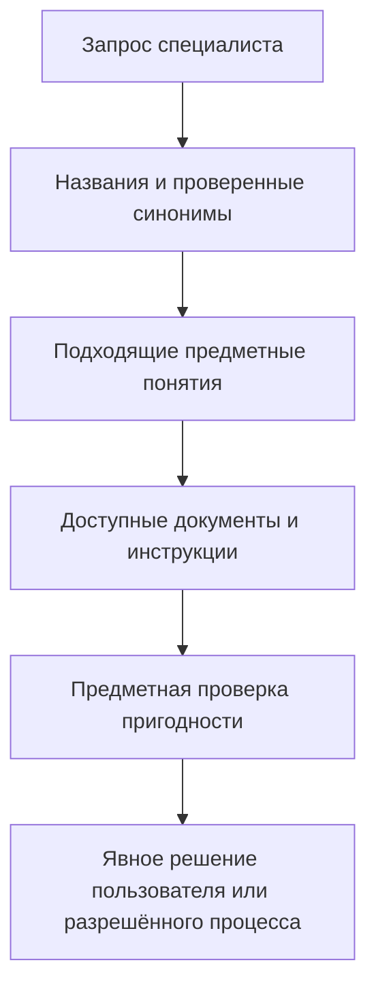
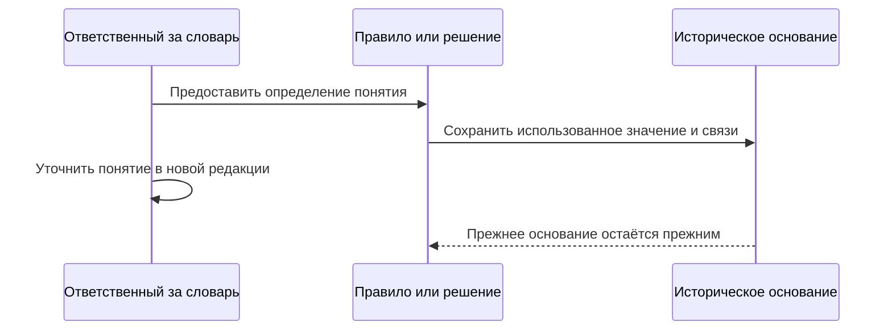

# Предметные понятия: общий смысл без подмены правил

**Статус на 7 сентября 2026 года:** предусмотрен подключаемый словарь и приняты его архитектурные границы. Полный редактор терминологии, многоязычный поиск и обмен отраслевыми словарями относятся к дальнейшему развитию. Они не объявляются существующими возможностями интерфейса.

## Для чего нужен словарь

Технолог, конструктор и поставщик могут описывать близкую работу разными словами. Поиск только по названию пропускает полезные материалы; совпадение слов, наоборот, иногда объединяет разные смыслы. Interlink должен позволять явно описывать предметные понятия, их названия, источники и связи, не превращая каждое слово в новый структурный тип.

**Предметное понятие (Concept)** — устойчиво различимый смысл в управляемом словаре. Например, «чистовое наружное точение» можно описать определением, допустимыми синонимами и переводами. У понятия должны быть ответственный источник и история. Исправление опечатки не создаёт новый тип инструкции, а изменение самого смысла не должно незаметно переопределить старое решение.

Словарь подключается там, где он нужен. Для обычной карточки поставщика не требуется сначала построить полную онтологию — формальную систему всех понятий и выводов предметной области.

## Понятие, тип и узел классификатора — не одно и то же

Структурный тип определяет допустимые поля, связи и обязательные проверки. Понятие объясняет значение. Узел классификатора задаёт место в конкретной схеме организации данных. Одно понятие может встречаться в разных схемах; папка «На проверку в этом месяце» вообще может быть только способом навигации.

Поэтому не требуется присвоить понятию и каждому его положению в классификаторах один идентификатор. Требуется другое: не заводить независимые противоречащие друг другу источники одного смысла. Развитие словаря должно согласовываться с существующей классификацией, а не создавать рядом второй несвязанный каталог.

| Связь с понятием | Что она объясняет | Чего не разрешает |
|---|---|---|
| Тип представляет определённый вид предметов | Для чего предназначена форма данных | Менять обязательную структуру через словарную запись |
| Документ описывает понятие | О чём документ и где его искать | Считать документ утверждённой инструкцией |
| Предмет классифицирован | К какой группе его отнесли и на каком основании | Автоматически выполнить действие классификатора |
| Два словаря сопоставлены | Как соотносятся явно указанные значения | Считать все одноимённые детали взаимозаменяемыми |

## Как будет работать поиск и уточнение смысла

Ответственный за терминологию описывает понятие и проверенные синонимы. Специалист связывает с ним подходящие инструкции или документы с указанием роли. Поиск получает дополнительный путь к сведениям, но показывает только то, что разрешено текущему пользователю. Найденный материал остаётся кандидатом для проверки.

Сходство названий, переводов или результата интеллектуального поиска не доказывает одинаковый смысл. Связь «более общее понятие» отличается от «связано по теме», а сопоставление между словарями может быть только приблизительным. Приложение не должно молча превращать такие связи в наследование свойств или разрешение замены.

## Три инженерных примера

### Инструкция нашлась, но станок ещё не выбран

Технолог ищет инструкцию чистового точения по принятому в его цехе синониму. Словарь помогает найти утверждённые материалы с другим названием. Однако метка на карточке станка «чистовое точение» не доказывает его пригодность для данного вала.

Для назначения оборудования нужны отдельные сведения: рабочий диапазон, точность, оснастка и условия допуска. Результат поиска помогает подготовить решение, но не подменяет проверку возможности выполнить работу.

### Поиск уплотнения не равен разрешённой замене

Снабженец нашёл манжету поставщика по сопоставленному термину. Совпадение назначения и близкие названия полезны для поиска кандидатов. Для установки в насос требуется отдельное разрешение замены с размерами, средой, температурой и областью действия.

Если сопоставление словарей позже уточнили, прежнее разрешение не начинает относиться к другому изделию. Исторически значимое решение хранит использованные определения и связи. Словарь не становится резервным способом скрыто выбрать другую версию детали.

### Классификация программы контроля

Специалист по качеству относит программу испытания к понятию «Проверка герметичности». Это помогает навигации и сопоставлению требований. Само назначение метки не запускает испытание, не утверждает программу и не переводит насос на следующую стадию готовности.

Если предприятие настроило действие классификатора, оно остаётся отдельной явной командой с правами, условиями и результатом. Пользователь должен видеть, что произошло: изменилось только описание предмета или было разрешено конкретное действие.

## Как меняется словарь и сохраняется прошлое

Названия и определения меняются как данные в предусмотренной форме. Структурные привязки, поставляемые вместе с моделью, входят в её управляемый выпуск. Прикладное замечание или классификация могут храниться отдельно даже для защищённого определения типа: такая запись не меняет поставленные обязательные правила.

Если понятие участвует в исполняемом правиле, сохраняется точный использованный смысл и необходимые зависимости. Переименование живой подписи не пересчитывает старое одобрение. Объединение или разделение понятий требует явного сопоставления; старые точные ссылки не перенаправляются на новый смысл.

Если исторический материал недоступен из-за правил хранения или доступа, система сообщает ограничение. Похожее современное понятие не восстанавливает утраченное основание.

## Развитие и критерии приёмки

Первая проверка должна показать, что добавление понятия и синонима не требует изменения структуры базы, два положения в классификаторах не создают два конкурирующих смысла, а назначение метки не запускает скрытую команду. Отдельно проверяются сохранение исторического основания правила и отсутствие раскрытия закрытых сведений через поиск.

Дальше могут появиться редакторы словарей, переводы и согласованные отраслевые сопоставления. Формальное соответствие внешним стандартам и автоматическое логическое выведение новых утверждений требуют отдельных решений и испытаний. Они не возникают из одного наличия словаря.

Далее: [общий адрес элемента](Elements-and-concepts), [применение инструкций](Instructions-and-execution), [допустимые замены](Allowed-replacements).
