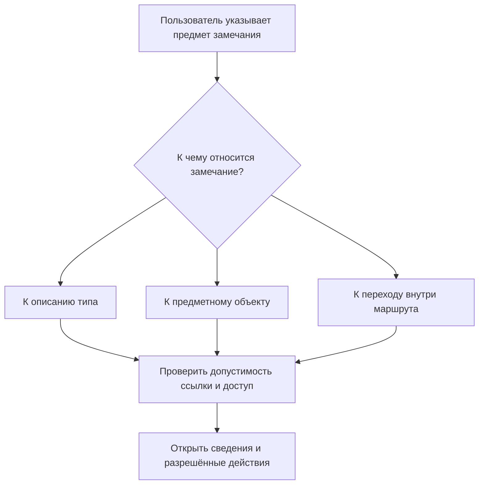
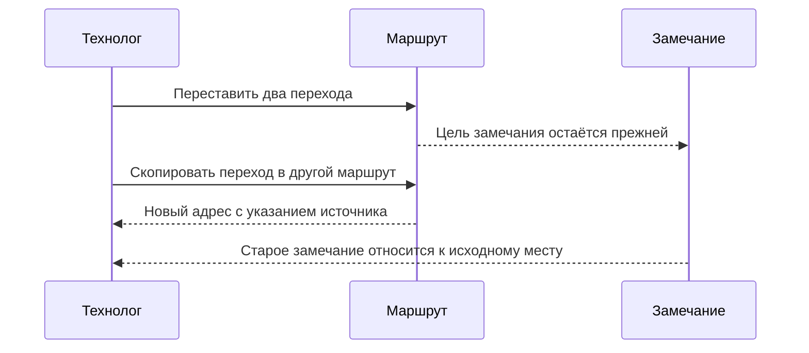

# Элемент: общий адрес без одинакового устройства данных

**Статус на 7 сентября 2026 года:** принятое направление архитектуры и запланированные проверки. Общая работа с элементами ещё не объявляется готовой функцией. Существующая основа типов и ссылок помогает её построить, но не подтверждает перечисленные ниже сценарии.

## Зачем вводится ещё одно слово

В обсуждении качества инженер может оставить замечание к детали, к конкретному переходу маршрута или к самому описанию типа «Результат измерения». Во всех случаях ему нужно точно указать предмет разговора и открыть доступные сведения. Но исправлять эти предметы одинаково нельзя: деталь меняют по инженерному процессу, переход — в составе его маршрута, а обязательные поля типа — через изменение установленной модели предприятия.

**Элемент (Element)** — общее название того, на что система поддерживает проверяемую ссылку. Оно объединяет возможность указать цель, узнать её вид и прочитать разрешённые сведения. Оно не означает, что все цели становятся одинаковыми карточками, получают инженерные версии или хранятся вместе. Слово «сущность» можно употреблять в обычном предметном смысле; отдельный обязательный универсальный вид данных с таким названием не вводится.

Пользователь не должен выбирать технический вид адреса вручную. Рабочее место предлагает допустимые цели: например, замечание можно отнести к инструкции или шагу, а фактическую обработку — только к подходящему производственному заданию. Возможность найти объект ещё не означает право изменить его.

## Что необходимо различать

| Что рассматриваем | Пример на производстве | Почему нельзя смешивать |
|---|---|---|
| Структурный тип | Форма инструкции с инструментом и параметрами обработки | Это правила устройства данных, а не инструкция для каждой детали |
| Предметное понятие | «Чистовое наружное точение» | Это значение термина, а не разрешение выполнить обработку |
| Предметное определение | Утверждённая инструкция обработки посадочных шеек | Её можно применить в нескольких маршрутах |
| Применение | Обработать вторую шейку в маршруте данного вала | У этого места свои параметры и положение в работе |
| Выполнение | Обработка конкретного вала на станке в смену | Это случившаяся работа, а не её план |
| Результат | Запись измерения диаметра после обработки | Новая инструкция не должна переписать старое измерение |

Это различия ролей, а не обязательный набор из шести новых карточек. Разовый переход может не иметь библиотечной инструкции. Физический экземпляр — например, изготовленный насос с заводским номером — также остаётся отдельным предметом: он может пройти несколько ремонтов и испытаний.

## Как пользователь работает с общей ссылкой

Инженер открывает замечание «Не определена допустимая шероховатость» и выбирает второй переход операции. Система должна сохранить не номер строки на экране, а устойчивый адрес этого перехода в маршруте. Если замечание относится к проверенной редакции, оно сохраняет именно её содержание. Позднее переход можно переставить, а маршрут — изменить: адрес старого основания не должен начать показывать другое действие.

Объединён последний путь чтения, но не путь исправления. Из окна замечания нельзя обойти согласование маршрута или получить право менять модель. Если сведения закрыты, поиск не должен раскрывать даже их запрещённые заголовки.

## Часть не обязана становиться самостоятельным объектом

Для двух переходов внутри одной операции может быть достаточно устойчивых локальных обозначений, принадлежащих этой операции и маршруту. Их историю хранит владелец. Самостоятельная карточка нужна, когда у предмета действительно есть независимое существование, ответственность или повторное использование, а не просто потому, что он показан строкой таблицы.

Перестановка переходов сохраняет их идентичность. Копирование в другой маршрут создаёт новые адреса и связь с источником копирования. При разделении одного перехода на два система должна явно показать преемственность; старое замечание не переносится на первый похожий текст. Удалённый локальный адрес нельзя отдать новому переходу и тем самым переадресовать историю.

Число, значение перечисления и каждая клетка таблицы не становятся элементами автоматически. Для ссылки на значение или фрагмент файла должен быть предусмотрен соответствующий способ адресации. Номер строки текущего отчёта сам по себе таким адресом не является.

## Три прикладных примера

### Замечание к форме контроля

Метролог обнаружил, что установленный тип результата контроля не предусматривает обязательную единицу измерения. Замечание относится к определению типа. Добавление отдельного измерения или словарной метки проблему не исправит: ответственному за модель требуется подготовить изменение структуры, оценить существующие данные и установить согласованную редакцию. Само замечание может вестись отдельно, не меняя поставленное определение.

### Две поверхности одного вала

В маршруте вала две шейки обрабатывают по одной инструкции. У первой свой размер, у второй — другой припуск. Замечание о припуске прикреплено ко второму применению, а не ко всей инструкции. После перестановки переходов оно остаётся у нужной поверхности. Если технолог исправит общую инструкцию, уже выполненная работа продолжит ссылаться на прежнее основание; будущий маршрут меняют отдельно.

### Разбор отказа насосного агрегата

Специалист по качеству собирает выпущенный чертёж, конкретную операцию сборки, результат испытания и запись установленного подшипника. Общая адресация позволяет связать их в одном разборе. Она не делает результат испытания новой версией чертежа и не позволяет переписать факт установки. Если нужный исторический материал недоступен, разбор показывает пробел в основании, а не подставляет сегодняшние сведения.

## Что означает «точно указать прошлое»

Ссылка на тот же предмет и ссылка на прежнее содержание — разные возможности. Для исторической части маршрута нужно удержать соответствующее содержание владельца и необходимую цепочку вложенности. Для оперативно изменяемых данных требуется согласованно сохранённое состояние, а не только отметка времени.

Устойчивый локальный ключ и точный адрес содержания различаются. При публикации новой редакции того же маршрута переход может сохранить свой ключ, но точный адрес его нового содержания уже включает другую редакцию владельца. Старое замечание к точному состоянию продолжает открывать прежнее основание; переход к новой редакции не происходит незаметно.

Для определения типа важны не только название и редакция поставляемой модели, но и использованные тогда настройки и расширения предприятия. Иначе старая карточка может открыться с новыми правилами и изменить смысл результата. Точные ссылки не снимают нынешние ограничения доступа и хранения. Недоступное прошлое должно быть обозначено честно.

## Что остаётся неизменным

Объекты и связи сохраняют типизированное хранение. Общий адрес не требует одной таблицы для всего и не является обещанием большей скорости сам по себе. Проверки производительности должны учитывать поиск, права, объём истории и чтение реальных данных.

Жёсткая и мягкая конкретизация, выбор инженерной версии, точный состав заказа и правила допустимой замены остаются самостоятельными предметными договорами. Ссылка на элемент или понятие не добавляет скрытого способа выбрать «похожую» версию.

Далее: [инструкции, применения и выполнение](Instructions-and-execution), [предметные понятия](Domain-concepts), [общий фундамент](Object-foundation).
