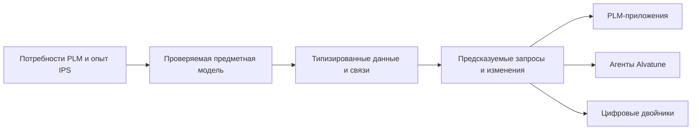

# Interlink: новая основа для инженерных систем

Добро пожаловать в публичную продуктовую книгу Interlink.

Interlink создаётся как объектное основание для PLM/CAx-систем нового поколения. Проект сохраняет сильные предметные идеи IPS, но стремится сделать правила работы с данными более явными, проверяемыми и пригодными для высокой автоматизированной нагрузки.

## Главная идея

В IPS одна из главных сильных сторон — способность предприятия описывать собственные типы объектов, атрибуты, связи, составы и правила. Исторически эта гибкость во многом достигается универсальным объектным ядром и метаданными, которые интерпретируются во время работы.

Interlink предлагает другой баланс:

> Предметная модель предприятия заранее проверяется и превращается в типизированные структуры хранения, ограничения, способы чтения и управляемые изменения базы.

При этом сохраняется возможность развивать модель, настраивать предприятие и добавлять редкие локальные признаки. Различие в том, что каждый вид расширения получает явные границы и понятный жизненный цикл.

## Какие задачи стоят перед проектом

- сохранить инженерно значимое различие объекта и его версий;
- воспроизводимо формировать состав с учётом применяемости, изменений, правил и замен;
- фиксировать точные состояния для выпуска, заказа, архива и обмена;
- дать предприятию управляемую расширяемость без бесконтрольного расхождения сред;
- обеспечить прослеживаемую миграцию существующих данных IPS;
- выдержать рост нагрузки от множества автоматизированных агентов;
- создать фундамент для связи проектного, изготовленного и эксплуатируемого изделия.

## Что эта книга не обещает

Interlink ещё не является готовой заменой промышленной установки IPS. Реализован и развивается фундамент: язык предметной модели, проверка её целостности и формирование типизированной поверхности. Полный путь записи, многоуровневый подбор, миграция реальной базы, заказы, цифровые двойники и нагрузочное подтверждение проходят последующие этапы.

Поэтому книга всегда различает готовую возможность, принятое решение, план и открытый вопрос.

## С чего начать

Если вы впервые знакомитесь с проектом, откройте [[Маршрут первого знакомства|Start-here]]. Он проведёт по ключевым главам примерно за 30–45 минут.

Если вы хорошо знаете IPS и хотите сразу проверить полноту понимания, начните с [[Что меняется после IPS|From-IPS-to-Interlink]] и [[Открытые вопросы|Open-questions]].

Если вы хотите оставить замечание или реальный пример, перейдите к странице [[Как присоединиться к диалогу|How-to-participate]].

