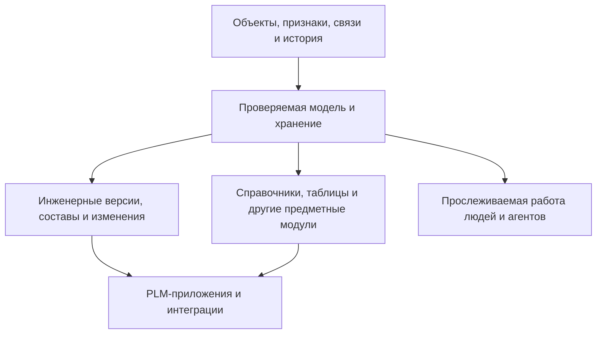

# Interlink: новое основание для инженерных и объектных систем

Добро пожаловать в публичную продуктовую книгу Interlink. Она объясняет замысел, принятые решения, будущую работу пользователей и вопросы, которые нам важно обсудить со специалистами IPS.

Материалы согласованы с обновлённой архитектурой **6 сентября 2026 года**. Если вы уже читали книгу, начните с [[Что изменилось в архитектурном замысле|Foundation-update]].

## Главная идея

Interlink создаётся как общее основание для систем, работающих с объектами, их признаками, связями, историей и управляемыми изменениями. Машиностроительная PLM — основная область проверки; полное покрытие обязательных пользовательских сценариев IPS остаётся требованием.

Для разных видов данных предусматриваются разные способы работы. Конструкция изделия требует инженерных версий и управления составом. Справочная карточка поставщика может изменяться с проверкой прав и сохранением истории реквизитов. Событие перевозки или результат измерения регистрируется как факт. Прикладная модель определяет необходимые механизмы; инженерная версионность не является обязательной для всех записей.

Предметная модель предприятия заранее проверяется и превращается в типизированные структуры хранения, ограничения и способы работы с данными. Известные типы материализуются в реальные таблицы базы данных. Это даёт основу для управляемого расширения и высокой нагрузки, но само по себе ещё не доказывает превосходство на промышленной базе.

Смысл схемы: предметные приложения используют общее основание, но не обязаны воспроизводить весь инженерный процесс. Прикладной продукт добавляет рабочие места, согласования и связь с внешними системами.

## Какие задачи стоят перед проектом

- Сохранить смысл объекта, инженерной версии, опубликованного состояния и незавершённой работы, не смешивая их.
- Полностью закрыть сценарии подбора IPS, включая жёсткую и мягкую конкретизацию, контексты, итерации, применяемость и замены.
- Разделить рабочую область, условия совместного просмотра и состав конкретного выпуска: длительная проработка не обязана завершаться одним огромным пакетом.
- Давать производству, архиву и интеграции точный воспроизводимый результат.
- Хранить индексируемые справочные таблицы, полные многомерные массивы и разреженные карты соответствий.
- Разделить допустимость замены, выбор варианта, его применение и факт установки.
- Подготовить безопасное основание для агентов: собственная идентичность, ограниченные полномочия, сохранение фактически показанного контекста и восстановление после ошибок.
- Сохранить путь к цифровым двойникам и другим областям: логистике, строительству, пищевому производству и не только.

## Что эта книга не обещает

Interlink пока не является готовой промышленной заменой IPS. Уже существуют и развиваются проверка предметной модели, формирование типизированных артефактов, сравнение редакций модели и подготовка миграций. Работы над физической схемой не означают, что полный пользовательский контур записи, подбора, выпуска и заказов готов.

Новые архитектурные обязательства включены в ранние проверки фундамента; полнофункциональные приложения будут появляться позднее. Ни нагрузочное превосходство, ни перенос любой установки IPS не объявляются доказанными заранее. Подробнее — [[Состояние и дорожная карта|Current-state-and-roadmap]].

## С чего начать

Для первого знакомства откройте [[Маршрут знакомства|Start-here]], затем [[Как работает система|How-system-works]]. Короткие ответы собраны в [[Частых вопросах|FAQ]]. Знающему IPS полезно сопоставить [[Изменения относительно IPS|From-IPS-to-Interlink]] с [[Открытыми вопросами|Open-questions]].

Для предметного изучения:

- [[Объектное основание без привязки к отрасли|Object-foundation]] и [[Система типов и данных|Data-guide]].
- [[Все сценарии подбора версий|Version-selection-guide]].
- [[Рабочие области и параллельная работа|Workspaces-and-parallel-work]], [[Контексты подбора|Selection-contexts]] и [[Пакет изменения|Change-package-guide]].
- [[Заказы и производство|Orders-guide]].
- [[Таблицы и многомерные данные|Tabular-data]].
- [[Допустимые замены|Allowed-replacements]] и [[Матрицы совместимости|Compatibility-matrices]].
- [[Агенты и прослеживаемость|Agents-and-traceability]], [[Безопасные действия агентов|Agent-safe-actions]] и [[Цифровые двойники|Digital-twins]].

Книга — начало диалога, а не окончательный ответ за пользователей. Как принести замечание или обезличенный пример, описано на странице [[Как участвовать|How-to-participate]].
