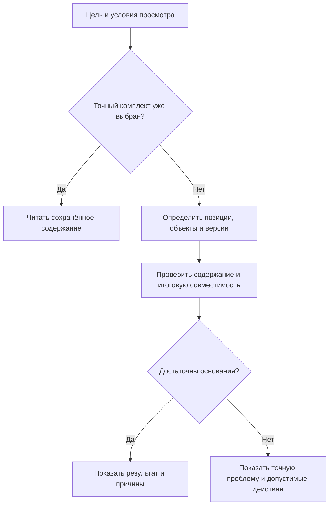
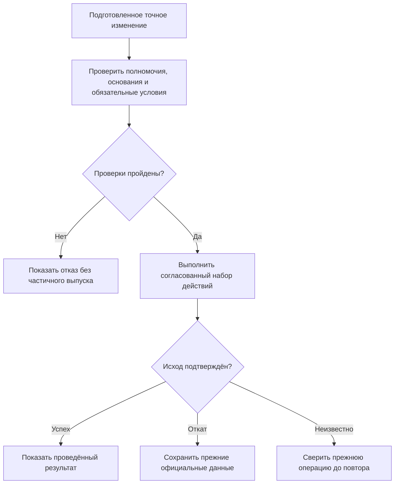

# Как пользователь будет работать в системе на основе Interlink

Эта глава связывает отдельные механизмы книги в рабочий день конструктора, технолога и специалиста по заказам. Она описывает **целевое поведение**, согласованное с обновлённой архитектурой 6 сентября 2026 года. Это не описание уже готового интерфейса.

Interlink предоставляет предметное основание. Принимающий продукт создаёт карточки, дерево, задания, согласования и интеграции. Alvatune рассматривается как будущая система управления агентской работой, а не как уже окончательно спроектированное рабочее место PLM.

## Элемент и понятие: что действительно становится общим

С 7 сентября 2026 года принят общий договор адресуемого элемента. Он позволяет указать тип, предметные данные или объявленную часть данных, но не навязывает им одинаковые версии, команды и хранение. Предметное понятие — отдельный подключаемый словарь смысла; оно не заменяет тип и не разрешает действие.

Инструкция обработки, её применение к поверхности и фактическая обработка вала различаются. Технолог меняет параметры применения в маршруте, а измерение относится к выполненной работе. Подробные примеры — в [элементах и адресации](Elements-and-concepts) и [инструкциях и выполнении](Instructions-and-execution). Ниже эти уточнения дополняют прежние механизмы, а не отменяют их.

## Где находится источник данных

При собственной предметной базе Interlink отвечает за объекты, их содержание и проверяемые изменения. Проведение может публиковать новое состояние существующей инженерной версии; новая инженерная версия создаётся отдельным явным решением. Точный комплект выпуска также оформляется отдельно.

При работе с IPS или другой внешней PLM авторитетный объект остаётся там. Прикладная система показывает источник, точность и свежесть наблюдения. Она может подготовить предложение и направить разрешённую операцию во внешнюю систему, но не должна незаметно создавать второй независимо изменяемый источник истины.

Это особенно важно для Alvatune: основной предполагаемый сценарий включает интеграции с внешними PLM. Собственная экспериментальная PLM на Interlink служит также площадкой проверки фундамента, а не единственным возможным режимом.

## Что видит пользователь

| Рабочее место | Главный вопрос |
|---|---|
| Поиск и карточка | Какой объект, инженерная версия и содержание сейчас открыты? |
| Дерево состава | Почему присутствует позиция, какой компонент выбран и на каком основании? |
| Рабочая область | Что ещё не завершено, кто работает и от каких исходных данных? |
| Контекст совместного просмотра | Какие варианты и рабочие данные сейчас включены в общий вид? |
| Пакет изменения | Что именно предлагается провести и какие зависимости нужны? |
| Сравнение и согласование | Какой точный результат проверен и одобрен? |
| Заказ и передача | Что планируется, что опубликовано, доставлено и реально выполнено? |
| История и контроль | Кто действовал, на основании каких данных и какой исход подтверждён? |

Это разные представления одного согласованного предметного смысла. Пользователь не обязан знать устройство базы, но должен понимать текущий режим и последствия действия.

## 1. Найти и открыть изделие

Конструктор ищет редуктор по обозначению и исполнению. Карточка показывает не просто «редуктор найден», а выбранную инженерную версию и способ чтения её содержания.

Для нового заказа могут требоваться выпущенные данные на заданную серию. Для ремонта — конфигурация конкретного старого экземпляра. Для проработки — рабочее содержание в выбранном контексте. Для архива — точное состояние прежней выдачи.

Рабочее место передаёт явные условия: корень, цель, контекст, серия или дата, правила и требуемая точность. «Официальная версия» не является синонимом «самая новая». При неизменных условиях живой результат всё же может измениться после появления новых данных; прежнее точное свидетельство не пересчитывается.

Подробнее — [[Как пользователь формирует состав|Selection-user-work]].

## 2. Получить состав с объяснением

Сначала различаются два режима. Точный сохранённый комплект читается по его основаниям без нового выбора «последнего». Живой состав вычисляется по текущим входам.

В живом расчёте отдельно решается, присутствует ли позиция, какой объект или структурный вариант используется, какая инженерная версия подходит и какое её содержание нужно прочитать. Для аналога, разрешённого определённой исходной версии, эту версию может понадобиться установить раньше чтения разрешения. Это явная зависимость, а не случайный резервный подбор.

Схема показывает границы этапов, а не заменяет полный порядок конкретизации и подбора. Подробный порядок и исключения описаны в [[Общем сценарии подбора|Selection-end-to-end]].

Для каждой позиции пользователь видит основание: закреплённая версия, точное содержание, мягкая конкретизация, выбор контекста, применяемость или разрешённое правило. Временное предпочтение отображается отдельно. Полный структурный вариант проверяется целиком; совпадение отдельных пар компонентов не доказывает совместимость всего изделия.

Если обязательная позиция не определена, рабочий просмотр помогает исследовать проблему. Но полный официальный комплект нельзя объявить готовым. Недостаток прав или недоступность источника также не маскируются под отсутствие компонента.

## 3. Начать проработку

Конструктор получает задачу модернизировать подшипниковый узел. Он открывает или создаёт рабочую область и берёт нужное содержание в работу от явного основания.

У редуктора остаются прежние опубликованные состояния. Рабочая правка не переписывает их. Если требуется новая инженерная версия, это отдельное предметное действие, а не побочный результат кнопки «Сохранить».

Занятость и допустимая параллельность проверяются по принятой модели работы. Нельзя обещать ни безусловный запрет всех двух правок одного объекта, ни автоматическое безопасное слияние любых черновиков. При конфликте показываются область, основание, владелец и допустимое продолжение в пределах прав.

Участник может получить предупреждение о занятости без раскрытия закрытого содержания чужой работы.

## 4. Собрать совместный вид

Механик готовит корпус, технолог — обработку, специалист по автоматике — датчик. Их контексты можно использовать для согласованного просмотра будущего агрегата.

Рабочая область, контекст и пакет не совпадают. В контексте могут быть сохранены выборы нужных версий и способ чтения содержания. Объединённый просмотр двух проработок не предписывает общий выпуск.

Даже одинаковая инженерная версия в двух контекстах не всегда означает согласие: один участник выбрал точное старое состояние, другой — рабочую правку. Такое расхождение должно быть явно разрешено, а не скрыто предпочтением последнего открытого окна.

Подробнее — [[Контексты подбора|Selection-contexts]] и [[Рабочие области|Workspaces-and-parallel-work]].

## 5. Сохранять, сравнивать и возвращаться

Промежуточное сохранение удерживает незавершённые изменения. Именованная итерация позволяет вернуться к точной точке проработки. Если инженер хочет восстановить состояние до неудачного опыта, система сначала защищает текущее рабочее содержание, затем готовит проверяемое восстановление.

Возврат не означает, что официальный выпуск отменён. Он меняет только предусмотренную рабочую область и показывает, какие данные восстановлены, какие внешние ресурсы доступны и какие связи требуют внимания. Публикация восстановленного результата — отдельное решение.

Это применимо не только к геометрии: важны позиции, параметры, файлы, выбранные нормы и другие зависимости, входящие в область восстановления. Подробнее — [[Итерации и восстановление|Selection-iterations]].

## 6. Выбрать состав конкретного изменения

В длительной модернизации защита готова раньше системы управления. В пакет включают подготовленные действия по защите и необходимые зависимости, а не всю рабочую область автоматически.

Пакет может менять содержание объектов, позиции, количества, связи, применяемость и другие разрешённые предметные данные. Набор действий должен иметь смысл целиком. Если две части могут завершаться независимо, их не требуется объединять. Если изменение корпуса без сопряжённой крышки недопустимо, зависимость должна быть видна и проверена.

Для нейтральных данных процесс может быть проще: исправление контактного номера в карточке поставщика может выполняться как изменение реквизита, без инженерного извещения. Общими остаются полномочия, ограничения, защита от потери чужой правки и обязательная история.

## 7. Проверить будущий результат

Предпросмотр показывает не только изменённые поля. Нужны итоговый состав, добавленные и удалённые позиции, обратное влияние на изделия, применяемость, документы, связанные заказы и обнаруженные конфликты.

Если заменяется один привод на комплект, система проверяет весь выбранный вариант, включая требуемые и сохраняемые элементы. Два решения могут конфликтовать даже при разных добавляемых позициях: одно удаляет то, что второму нужно оставить.

Если расчёт зависит от таблицы допускаемых нагрузок, используются точная редакция и конкретные исходные значения. Полная сетка не гарантирует, что в каждой ячейке есть проверенное измерение; неизвестное значение не считается нулём. Подробнее — [[Таблицы|Tabular-data]] и [[Допустимые замены|Allowed-replacements]].

## 8. Согласовать точное содержание

Согласующий получает подготовленный результат и его точные основания. Решение относится к этому содержанию, а не просто к номеру извещения.

Изменение количества болтов, выбранного материала или входящей редакции нормы требует новой подготовки и предусмотренного повторного решения. Но появление новой посторонней версии или библиотечного правила не обязано автоматически менять уже подготовленный точный план. Отдельно проверяются текущие обязательные запреты, действующие полномочия и явно установленное требование свежести.

Interlink обеспечивает связь проверенного содержания и предметного действия. Прикладной продукт отвечает за роли согласующих, маршрут, подписи и организационные правила. Подпись процесса не может разрешить нарушение обязательной целостности данных.

## 9. Провести изменение

Неделимость относится к выбранному подготовленному набору. Система не может успешно объявить весь пакет проведённым, опубликовав только часть его действий. Если Interlink участвует в общей операции принимающего продукта, окончательный успех зависит от подтверждённого завершения всей этой операции.

Обязательный предметный журнал, подтверждение операции и записи для последующей доставки должны быть согласованы с результатом. Обычная телеметрия сервиса не заменяет такой журнал.

Потерянный ответ означает неизвестный исход. Пользователь не должен выпускать изменение повторно под новым номером в надежде обойти проблему. Сначала устанавливается результат прежней операции.

После успеха появляется новое официальное содержание; новая инженерная версия возникает только там, где это было явной частью плана. Возможность продолжить рабочую область или удержать работу определяется выбранным режимом, а не безусловным удалением всех черновиков.

## 10. Опубликовать и передать точный комплект

Проведение предметного изменения и публикация полного состава — разные действия. Для конкретной выдачи создаётся точный комплект с определёнными корнем, содержанием, ресурсами и основаниями. Глубина окна или недоступность части структуры не должны породить урезанный комплект под видом полного.

Сам заказ при этом может оставаться рабочим, содержать варианты и позднее перепланироваться. Неизменна конкретная публикация, а не любой просмотр карточки заказа.

Далее отдельно учитываются доставка, приёмка и выполнение. Если внешняя система не подтвердила получение, уже состоявшаяся публикация не отменяется. Повтор или сверка выполняются по договору обмена для той же передачи, без нового инженерного проведения.

Подробнее — [[Работа с заказом|Order-user-operating-model]], [[Точная публикация|Order-exact-publication]].

## Три прикладных сценария

### Замена подшипника редуктора

Поставщик прекращает выпуск подшипника. В библиотеке есть разрешённый вариант, но он требует другой крышки и инструмента контроля. Конструктор готовит изменение редуктора и крышки; технолог подключает будущую операцию обработки.

Общий просмотр помогает проверить сопряжение. Предпросмотр показывает два затронутых исполнения. После согласования выясняется, что нужно восемь болтов вместо шести: содержание изменилось, поэтому требуется новая подготовка и решение.

После проведения публикуется комплект для конкретного выпуска. Старые сервисные комплекты не пересчитываются. Разрешённость нового подшипника ещё не является доказательством его установки на уже изготовленные экземпляры.

### Срочное исправление программы при долгой модернизации

Версия Б управляющей программы участвует в длительной проработке. Обнаружена срочная ошибка для действующего станка. Пользователь видит чужую занятость в допустимом объёме и выбирает разрешённый режим: согласовать работу с владельцем, использовать предусмотренную параллельную проработку либо перенести срочное действие в совместно управляемый план.

Нельзя молча вытеснить чужую работу или автоматически слить несовместимые программы. Исходные состояния и различия проверяются явно. Если срочный результат можно выпустить независимо, он получает отдельное проведение, а длительная модернизация продолжает работу после сверки оснований.

Если нужно отказаться от нового, ещё не опубликованного объекта, удаление также не безусловно: чужие работы, другие версии, точки возврата и удержанные доказательства могут не позволить узкую отмену.

### Насосная станция для северной площадки

Специалист задаёт исполнение станции, среду, температурный диапазон и объём поставки. Карта соответствий предлагает уплотнение; точная строка справочника задаёт материал, а таблица испытаний — допустимые нагрузки.

Для одного заказа выбран комплект из двух меньших насосов. Это не меняет библиотечный вариант для остальных заказов. Проверяются полный состав, подключения, количество, питание и совместимость всего решения. Если обязательное значение испытаний неизвестно, система не выдаёт предварительный расчёт за подтверждённый комплект.

После согласования публикуется отдельная передача. Позже производство сообщает фактические серийные номера и установленные компоненты. Если сообщение об установке потерялось, отсутствие подтверждения не доказывает, что физического действия не было: нужна сверка.

## Что меняется при участии агента

Агент может искать данные, анализировать влияние и предлагать правки, но не обходит предметные команды и текущие полномочия. Нужно различать его собственную идентичность, конкретный запуск и происхождение переданных прав: человек, самостоятельный цикл или другой агент.

Сохраняются не только ссылки на источники, но и фактически показанный контекст. Если агент видел выдержку из отчёта и часть таблицы, нельзя позднее утверждать, что он анализировал весь исходник. Обязательный доказательный режим отклоняется, если нужные основания нельзя законно сохранить; его нельзя незаметно заменить более слабым.

Планирование циклов, память рабочего процесса и взаимодействие с человеком остаются ответственностью принимающего продукта. [[Прослеживаемость|Agents-and-traceability]] и [[Безопасные действия|Agent-safe-actions]] описаны отдельно.

## Как проверяется правильность всего пути

Приёмка должна подтвердить различие сохранения и публикации; независимость рабочих областей, контекстов и пакетов; полное покрытие мягкой и жёсткой конкретизации; совместимость целого состава; точность оснований согласования и передачи.

Обязательны также отрицательные случаи: конфликт параллельной правки, недостающая версия, неизвестное значение таблицы, недоступный источник, отзыв полномочий, потерянный ответ и повтор доставки. Успешный обычный пример не заменяет эти проверки.

Полный пользовательский путь пока не реализован. [[Состояние и дорожная карта|Current-state-and-roadmap]] показывают, какие части уже существуют и какие границы доказываются рано. Углублённые маршруты: [[Изменения|Change-package-guide]], [[Подбор версий|Version-selection-guide]], [[Заказы|Orders-guide]], [[Система данных|Data-guide]].
