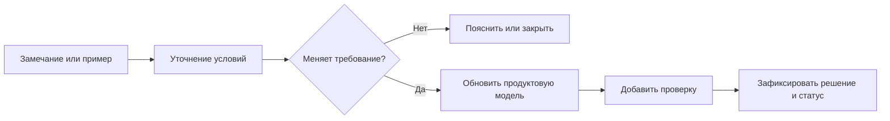

# Как присоединиться к диалогу

## Нам нужен не отзыв «нравится / не нравится»

Наиболее полезная обратная связь описывает конкретную задачу, ожидаемый результат и пример, на котором можно проверить решение.

Хорошее замечание отвечает хотя бы на несколько вопросов:

1. Кто выполняет задачу?
2. С каким изделием, документом или заказом?
3. Какие исходные условия существенны?
4. Что делает IPS?
5. Какое исключение встречается?
6. Что нельзя потерять в Interlink?
7. Как пользователь поймёт, что результат правильный?

## Пример полезного замечания

Слишком общее:

> В Interlink обязательно нужна применяемость.

Более полезно:

> На нашем предприятии версия уплотнения вводится с определённого заводского номера насосной станции. Дата извещения не определяет действие. При пересечении диапазонов публикация заказа блокируется, пока специалист по конфигурации не устранит конфликт. Нужен сценарий с двумя перекрывающимися диапазонами и заказом на граничный номер.

Такое замечание сразу влияет на модель, диагностику и приёмочное испытание.

Для новых тем полезны столь же конкретные примеры. Например: «Для одной среды используем разные уплотнения при одинаковой температуре, потому что важна концентрация; пустое пересечение означает не запрет, а отсутствие испытания». Здесь сразу видны недостающая ось таблицы и опасность двоякой трактовки пустоты.

Другой пример: «Замена одного насоса на два допустима только с новым коллектором; выбор действует для одного заказа и не должен менять остальные. Подтверждение фактической установки приходит позже». Такое описание помогает проверить целый комплект, независимость заказов и границу плана с фактом.

Для агентского сценария важно добавить, какие документы и данные можно показывать и удерживать, кто вправе разрешить действие и как установить результат при потере ответа. Начальные вопросы есть в [[Новом разделе таблиц и совместимости|Questions-tables-and-compatibility]] и [[Вопросах об агентах|Questions-agents]].

## Куда направить замечание сейчас

Используйте одну из подготовленных форм: [описать обязательный сценарий IPS](https://github.com/ZelAnton/Interlink-product-book/issues/new?template=ips-scenario.yml) или [оставить замечание и предложение](https://github.com/ZelAnton/Interlink-product-book/issues/new?template=product-feedback.yml).

Подходящие темы:

- ошибка в описании IPS;
- обязательный сценарий не учтён;
- механизм Interlink не даёт нужного результата;
- термин непонятен или трактуется иначе;
- нужен дополнительный отрицательный пример;
- функция не используется и не должна входить в первую область;
- есть идея следующего продуктового сценария.

## Что нельзя публиковать

- закрытые файлы и характеристики изделий;
- персональные данные;
- ключи доступа и адреса внутренних систем;
- сведения, ограниченные договором или режимом предприятия;
- полный снимок промышленной базы;
- конфиденциальные настройки заказчика.

Для обсуждения обычно достаточно обезличить обозначения и сохранить предметную структуру примера.

## Как обрабатывается замечание

## Следующий этап — ИИ-собеседник

Перед этим пояснение, требование и проверка должны оставаться согласованными: принятое замечание получает отражение в связанной главе и критерии приёмки, а отклонённое — понятное объяснение.

Планируется диалоговый помощник, который будет использовать эту книгу как проверяемую базу знаний.

Сначала он поможет:

- объяснить термин или решение;
- найти связанную главу;
- сравнить знакомый механизм IPS с Interlink;
- задать недостающие уточнения;
- сформировать обезличенный пример;
- подготовить структурированное замечание.

Позже он сможет сопровождать обсуждение предложения, но не будет самостоятельно менять продуктовые решения. Публикация, принятие требования и работа с конфиденциальными сведениями остаются под контролем человека.

## Каким должен быть хороший диалог с ИИ

ИИ не должен отвечать уверенно там, где книга содержит открытый вопрос. Он обязан:

- различать факт, принятое решение, план и гипотезу;
- указывать область действия ответа;
- просить реальный пример при неоднозначности;
- не переносить ответ одной установки на все предприятия;
- показывать связанные риски и критерии проверки;
- предлагать черновик, а не выдавать его за принятое решение.
