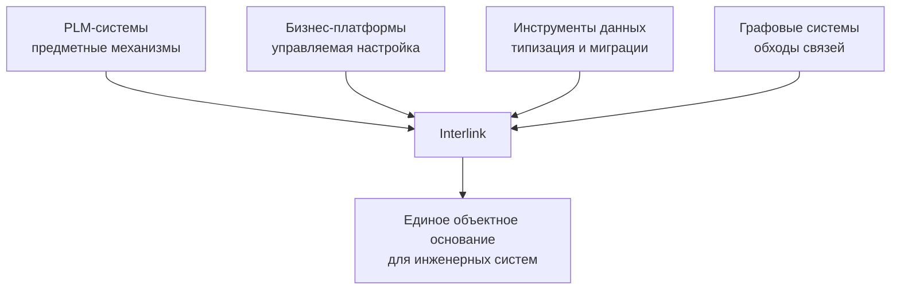

# Отраслевые прецеденты и заимствованные практики

## Interlink не создаётся в вакууме

Почти каждое ключевое решение проекта имеет работающий промышленный прецедент. Новизна Interlink заключается не в изобретении всех механизмов заново, а в их согласованном объединении вокруг инженерной семантики.

## Что дают PLM-платформы

### IPS

IPS задаёт исходную предметную планку: объект и версия, самостоятельная связь, позиция состава, применяемость, контексты изменения, точные конфигурации, документы, технологию и заказной контур.

Interlink берёт потребности и инженерные инварианты, но не копирует универсальную физическую модель хранения.

### Aras Innovator

Aras подтверждает жизнеспособность подхода, при котором тип объекта получает собственное табличное представление, а связь является самостоятельной записью. Также важны устойчивый объект, поколения версий и слои поставщика и заказчика.

Interlink усиливает разделение поставляемой модели и оперативных данных: запечатанные типы не изменяются через обычную карточку.

### Teamcenter

Teamcenter показывает ценность управляемого моделирования вне рабочей эксплуатации, поставки шаблонов и именованных правил обхода структуры.

Interlink заимствует дисциплину поставки модели, но стремится сделать объектное ядро более компактным и пригодным для встраивания.

### Windchill

Windchill даёт зрелый пример базовой линии — точного набора версий, который сохраняет конфигурацию. В Interlink неизменяемый снимок становится общим механизмом для выпуска, заказа, обмена и доказательства истории.

### 3DEXPERIENCE

Работа над выпущенными данными в контексте изменения подтверждает потребность видеть будущее состояние только участникам проработки. Interlink выражает это через пакет изменения и один поддерживаемый путь записи.

### Agile PLM

Наглядное сравнение «до / после» показывает, насколько важен предварительный просмотр изменения. Interlink должен объяснять не только изменённые поля, но и итоговый состав, предупреждения и затронутые объекты.

## Что дают бизнес-платформы

### SAP

Полезны словарь данных, пространства имён заказчика, управляемые изменения и контекстные значения вроде «материал на заводе». Interlink применяет похожие идеи к инженерной модели и составным значениям.

### Salesforce

Salesforce подтверждает ценность управляемых полей и пакетов в большой многопользовательской системе. Interlink использует быстрые расширения как ограниченный слой, а массовые поля переводит в строгую предметную модель.

### ServiceNow

Изменяемый словарь во время работы даёт высокую скорость настройки, но широкое изменение может иметь неожиданные последствия. Interlink ограничивает область оперативных расширений конкретным типом и заранее разрешёнными возможностями.

### Odoo

Модульность, внешние идентификаторы и управляемые начальные данные полезны для собираемой модели предприятия. Interlink добавляет инженерную версионность и более строгую целостность.

## Что дают инструменты работы с данными

Современные средства моделирования и миграций подтверждают ценность подхода «модель → проверяемая структура → управляемое изменение». Interlink развивает эту практику предметными понятиями PLM:

- объектом и версией;
- позицией состава;
- применяемостью;
- точной фиксацией;
- структурным обходом;
- снимком конфигурации.

Из инструментов миграции берутся журнал применения, контрольные суммы и повторяемость. Из типизированных средств запросов — раннее обнаружение ошибок и явная потоковая обработка больших результатов.

## Почему не используется отдельная графовая база по умолчанию

Neo4j показывает естественный способ обхода нескольких типов связей. Interlink заимствует именованные схемы обхода, но выполняет их в PostgreSQL рядом с версиями, транзакциями и ограничениями.

Это сознательный выбор в пользу одной согласованной основы. Для произвольной графовой аналитики в будущем может использоваться специализированная проекция, но она не должна становиться вторым источником истины.

## Главное отличие композиции Interlink

Обычный инструмент данных не понимает разницу объекта и версии. Бизнес-платформа не обязана понимать позицию состава и применяемость. PLM-система может иметь богатую семантику, но связывать её с конкретной метамоделью времени выполнения.

Interlink соединяет:

- инженерную семантику PLM;
- материализацию известных типов;
- управляемую поставку модели;
- несколько скоростей расширения;
- смысловые миграции;
- объяснимый подбор;
- единый путь для людей и агентов.

## Честная граница сравнения

Зрелость перечисленных платформ измеряется годами и десятилетиями. Interlink пока не имеет их готовых рабочих мест, соединителей и отраслевых пакетов. Прецеденты снижают риск отдельных решений, но совместная работа композиции должна быть доказана опытным вертикальным срезом.
