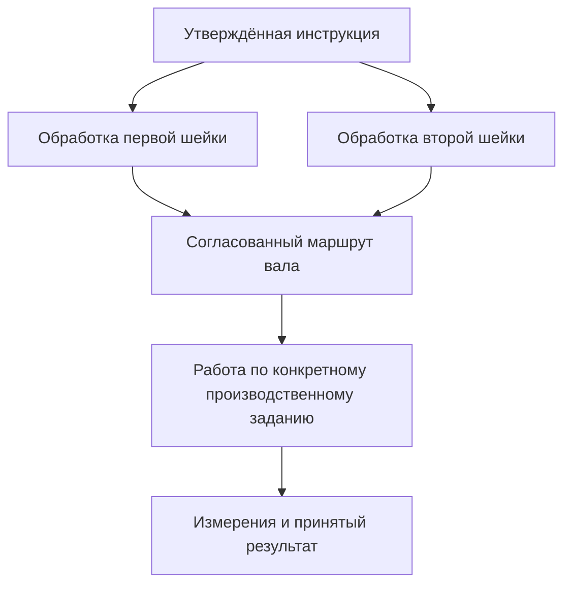
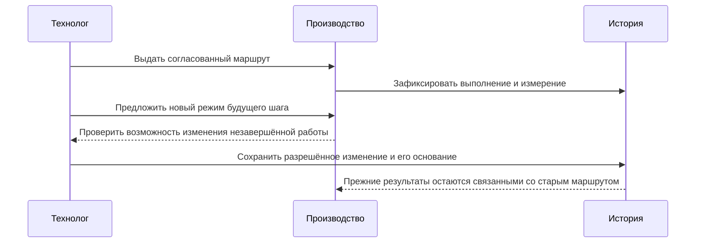

# Инструкция, её применение и фактическое выполнение

**Статус на 7 сентября 2026 года:** принятый целевой подход. Предстоит подтвердить его небольшими сквозными проверками, затем встроить в общие компоненты и предметные приложения. Полный редактор технологических процессов и готовый производственный исполнитель этим документом не объявляются.

## Какую путаницу устраняем

«Операция термообработки» может означать типовую инструкцию, место в маршруте партии или уже выполненную работу печи. Эти предметы связаны, но отвечают на разные вопросы. Инструкция говорит, как следует работать. Применение задаёт, где и с какими параметрами она нужна. Выполнение показывает, что произошло с конкретной заготовкой или партией. Результат сохраняет полученные сведения и основания их принятия.

Если хранить всё как одну изменяемую запись, новая температура в инструкции способна задним числом изменить объяснение старого режима. Если, наоборот, превращать каждое применение в самостоятельную инженерную версию, пользователю придётся управлять лишними карточками. Interlink должен дать выбор формы хранения по предметной ответственности и сохранить явные связи между ролями.

## От библиотеки до цеха

Технолог выпускает инструкцию «Чистовое точение посадочной шейки». В её объявленной форме указаны требования к инструменту, допустимым режимам и контролю. Это предметные данные. Новая инструкция такой же формы обычно не требует переустановки модели или изменения структуры базы.

В маршруте конкретного вала технолог применяет инструкцию дважды: к первой и ко второй шейке. Каждому применению принадлежат свои исходная поверхность, размер и параметры в разрешённых пределах. Инструкция не переписывается ради каждого применения. Самостоятельное применение не обязано иметь отдельную библиотечную карточку.

Перед выдачей в работу сохраняют требуемое точное основание: маршрут, нужные переходы, инструкции, входные параметры и ресурсы. Сведения, которые появляются только при фактическом выполнении, фиксируются по мере их появления с происхождением. Нельзя выдавать предварительно выбранный станок за доказательство того, на каком станке работа действительно выполнена.

Плановый переход, физический экземпляр и выполнение имеют разные идентичности. Один переход маршрута может исполняться для многих валов; один вал может пройти повторную обработку. Инструкция при этом остаётся повторно используемым описанием, а не журналом всех запусков.

## Изменение маршрута после начала работ

Допустим, после изготовления первых деталей уточнён режим второй шейки. Технолог готовит новую редакцию маршрута по разрешённому процессу. Завершённые выполнения продолжают ссылаться на прежний маршрут и использованные режимы. Для незавершённой работы нельзя незаметно открыть новую инструкцию вместо старой.

Если предприятие допускает перевод оставшихся шагов на новое основание, это отдельное согласуемое изменение. Пользователь должен видеть, какие шаги уже выполнены, какие будут изменены, кто разрешил перевод и почему. Такое изменение не объявляет старые результаты полученными по новым требованиям.

Оперативный статус исполнения может изменяться: задание ожидает, выполняется, приостановлено. Принятые измерения и завершения должны сохраняться по своим правилам неизменяемого свидетельства. Не требуется представлять весь процесс одной неизменяемой строкой или создавать инженерную версию на каждый шаг исполнения.

## Три подробных производственных сценария

### Два перехода по одной инструкции

Технолог проектирует маршрут приводного вала с посадочными шейками разных диаметров. Для каждой выбирает общую инструкцию и задаёт размер в собственном применении. После перестановки последовательности замечание к припуску второй шейки остаётся у неё, а не у строки с прежним порядковым номером.

Контролёр фиксирует измерение конкретной поверхности изготовленного вала. Оно связано с фактическим выполнением и нужным применением. Изменение параметров первой шейки не исправляет вторую; обновление библиотечной инструкции само по себе не перевыпускает маршрут.

### Доработка корпуса после контроля

После расточки отверстия контролёр обнаружил отклонение и зарегистрировал результат. Ответственный разрешил дополнительную обработку с собственным основанием. Это новое прохождение работы: у него должны быть отдельные фактические входы и результаты, а исходное измерение сохраняется.

Если же терминал мастера из-за сбоя связи повторно передал то же сообщение о завершении, второй обработки не было. Система должна распознать повтор доставки и не создать ещё одно завершение или списание материала. Пользователь явно различает команду «повторить работу» и восстановление отправки прежней команды.

### Изменение программы испытания насоса

Первая партия насосов прошла испытания по прежней программе. Для следующей партии добавлен длительный режим проверки герметичности. Инженер изменяет предметную программу в пределах установленной формы данных. Уже принятые протоколы не получают задним числом отсутствовавший этап.

Если для нового режима нужны сведения, которые действующая модель вообще не умеет выразить, сначала требуется согласованное расширение модели. Простая смена названия инструкции не добавит обязательную проверку. При рассмотрении рекламации специалист открывает именно использованные тогда программу, настройки и результаты, а не текущую карточку.

## За пределами машиностроения

В пищевом производстве одна инструкция добавления ингредиента может использоваться дважды в разных стадиях приготовления. Количества принадлежат применениям, а фактические навески — конкретной партии и её выполнению. Изменение рецептуры не переписывает происхождение выпущенной партии.

В логистике маршрут может дважды посещать один терминал. Это два плановых посещения, а не дубль, который следует удалить. Фактическое прибытие относится к нужному посещению. В агентской системе одна процедура также может запускаться многократно: процедура, агент, запуск и попытка не становятся одним предметом.

Эти примеры обосновывают расширяемость общей модели. Они не означают готовые отраслевые движки или право автоматически исполнять произвольную инструкцию.

## Что следует подтвердить до расширения реализации

На малом примере с настоящим хранением нужно доказать: два применения одной инструкции не сливаются; перестановка не теряет адрес; копия получает новое происхождение; параллельные изменения владельца дают явный конфликт; новая редакция не меняет прошлое; повтор передачи команды не создаёт повторного эффекта. Проверяются и отказы: недопустимая инструкция, недоступное основание, неполный адрес шага, попытка обойти права.

Затем подход должен работать в заказах, документах, классификации, заданиях и агентских действиях. Все обязательные семейства сценариев IPS сохраняются в плане отдельной предметной приёмки: небольшой пример нового механизма не заменяет их проверку.

Далее: [элементы и адресация](Elements-and-concepts), [понятия и классификация](Domain-concepts), [маршруты и нормы заказа](Order-routes-and-norms), [прослеживаемость агентов](Agents-and-traceability).
