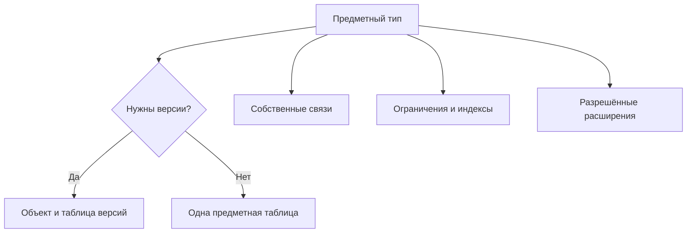

# Система объектов и данных

## Типы как язык предприятия

Interlink должен уметь описывать не абстрактные записи, а реальные предметные понятия: изделие, документ, требование, технологическую операцию, материал, заказ, позицию состава, связь соответствия и физический экземпляр.

Для каждого типа определяются:

- сохраняет ли объект историю версий;
- какие признаки обязательны;
- какие значения допустимы;
- с какими типами он может быть связан;
- кому принадлежит связь;
- какие ограничения должна гарантировать система;
- где предприятие может добавлять собственные признаки.

## Богатство предметной модели

Целевая система типов включает:

- версионные и неверсионные объекты;
- наследование общих свойств;
- самостоятельные типизированные связи;
- позиции состава с собственными данными;
- справочники и упорядоченные шкалы;
- ссылки на другие предметные объекты;
- многозначные признаки с порядком и уникальностью;
- составные значения, например «материал на конкретном заводе»;
- измеряемые величины с единицами;
- вычисляемые значения с известным происхождением;
- управляемые начальные данные и локальные расширения.

## Типы материализуются в реальные структуры хранения

Главное физическое отличие от исторической архитектуры IPS: известный предметный тип получает собственные типизированные структуры в PostgreSQL.

Для версионного типа отдельно хранятся устойчивый объект и его версии. Неверсионный тип получает одну предметную таблицу. Позиция состава и другая значимая связь имеют собственную таблицу. Многозначный признак получает таблицу значений, принадлежащую конкретному типу.

## Почему это важно для целостности

База знает, что обозначение обязательно, количество положительно, ссылка ведёт к допустимому типу, а основная версия единственна. Ошибка отсекается не только формой приложения, но и согласованными ограничениями хранения.

Это не устраняет предметные проверки приложения. Например, допустимость замены комплекта зависит от инженерного правила. Но простые структурные ошибки не должны проходить через обходной путь.

## Почему это важно для производительности

Для конкретного типа база видит распределение его значений и может использовать подходящие индексы. Поиск редуктора по обозначению не требует собирать значение из универсальной таблицы признаков. Обратная применяемость использует индекс направления позиции состава.

Ожидаемые преимущества:

- меньше универсальных соединений при чтении карточек;
- более точная статистика для планирования запросов;
- возможность оптимизировать горячий тип независимо от остальных;
- предсказуемая стоимость распространённых операций;
- отсутствие двух равноправных путей к одному массовому значению.

Конкретный выигрыш зависит от модели и должен быть подтверждён испытаниями.

## Как сохраняется гибкость

### Выпускаемая модель

Основные типы и ограничения проходят рецензирование и управляемый выпуск. Этот уровень предназначен для общепродуктовой и отраслевой семантики.

### Настройка предприятия

Поставщик модели заранее определяет, что предприятие может менять: например, значения справочника, допустимое дополнительное поле или локальную форму представления.

### Оперативное расширение

Редкий признак можно добавить в типизированный контейнер конкретного типа. Он не становится безымянным полем любого объекта. Если признак широко используется, участвует в поиске и отчётах, он переводится в основную структуру управляемой миграцией.

## Пример развития признака

Один заказчик насосных станций требует указывать собственный класс покрытия рамы. Сначала предприятие добавляет проверяемое расширение только для типа «Рама насосной станции». Через год класс используется почти во всех заказах и отчётах. Тогда он получает штатное поле, накопленные значения переносятся и сверяются, а прежний путь закрывается.

Так гибкость получает путь взросления вместо вечного параллельного хранения.

Далее: [[Расширяемость и миграция|Extensibility-and-migration]]. Полный набор материалов о системе типов, предметном языке, физическом хранении, нагрузке, миграции, отраслевых аналогах и цифровых двойниках собран в [[подробном путеводителе по данным|Data-guide]].
