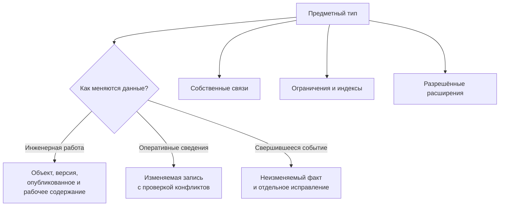

# Система объектов и данных

## Типы как язык предприятия

Interlink должен уметь описывать не абстрактные записи, а реальные предметные понятия: изделие, документ, требование, технологическую операцию, материал, заказ, позицию состава, связь соответствия и физический экземпляр.

Для каждого типа определяются:

- нужны ли инженерные версии, достаточно ли управляемой изменяемой записи или требуется неизменяемый факт;
- какие признаки обязательны;
- какие значения допустимы;
- с какими типами он может быть связан;
- кому принадлежит связь;
- какие ограничения должна гарантировать система;
- где предприятие может добавлять собственные признаки.

## Богатство предметной модели

Целевая система типов включает:

- версионные и неверсионные объекты;
- наследование общих свойств;
- самостоятельные типизированные связи;
- позиции состава с собственными данными;
- справочники и упорядоченные шкалы;
- ссылки на другие предметные объекты;
- многозначные признаки с порядком и уникальностью;
- контекстные данные, например свойства материала на конкретном заводе;
- измеряемые величины с единицами;
- вычисляемые значения с известным происхождением;
- управляемые начальные данные и локальные расширения.

## Типы материализуются в реальные структуры хранения

Главное физическое отличие от исторической архитектуры IPS: известный предметный тип получает собственные типизированные структуры в PostgreSQL. Средства формирования такой схемы уже присутствуют в развиваемом коде. Их наличие ещё не означает готовый пользовательский продукт или завершённую материализацию всех новых правил версий и отраслевых механизмов.

Для инженерного типа целевая модель различает устойчивый объект, инженерную версию, неизменяемое опубликованное содержание и рабочее содержание. Оперативная запись или факт получают свою подходящую форму хранения без обязательной инженерной версии. Позиция состава и другая значимая связь имеют собственные данные. Многозначные признаки хранятся типизированно и принадлежат конкретному владельцу.

Общие реестры нужны, чтобы находить объекты и проверять принадлежность ссылок. Они не превращают массу редуктора, адрес склада и результат измерения в строки общей таблицы «имя признака — значение». Предметные значения остаются в структурах своих типов.

Схема показывает выбор правил изменения, а не три независимых продукта. Во всех случаях сохраняются типы, связи, полномочия и происхождение. Инженерная версия нужна для развития конструкции; телефон склада и акт испытания не обязаны имитировать её жизненный цикл.

## Почему «версия Б» ещё не означает точное содержание

Конструктор корректирует шероховатость корпуса редуктора в инженерной версии «Б». Во время работы его сохранения меняют только рабочее содержание. После разрешённой публикации версия «Б» получает новое опубликованное содержание, а прежнее сохраняется неизменным.

Отсюда следуют два разных обещания. Жёсткая конкретизация требует использовать именно версию «Б», но сама по себе не замораживает все дальнейшие разрешённые исправления этой версии. Точный комплект заказа удерживает конкретное опубликованное содержание, с которым заказ согласовали. Он не начинает показывать исправленный чертёж только потому, что буква версии не изменилась. Подробности — [[подбор версий|Version-selection-guide]].

Для неверсионной карточки действует похожая потребность без искусственной версии: если решение перевозчика принято по прежнему адресу склада, сохраняется точное использованное значение и его происхождение. Сам адрес склада при этом может продолжать изменяться для новых операций.

## Почему это важно для целостности

В пределах объявленного предметного правила база знает, что обозначение обязательно и уникально в своей области, ссылка ведёт к допустимому типу, а назначенная основная версия единственна для данного режима назначения. Для количества нельзя навязать одно правило всем процессам: количество установленной детали обычно положительно, а действие «снять две детали» имеет иной смысл. Ошибка отсекается согласованными ограничениями хранения и предметной команды, а не только формой приложения.

Это не устраняет предметные проверки приложения. Например, допустимость замены комплекта зависит от инженерного правила. Но простые структурные ошибки не должны проходить через обходной путь.

## Почему это важно для производительности

Для конкретного типа база видит распределение его значений и может использовать подходящие индексы. Поиск редуктора по обозначению не требует собирать значение из универсальной таблицы признаков. Обратная применяемость использует индекс направления позиции состава.

Ожидаемые преимущества:

- меньше универсальных соединений при чтении карточек;
- более точная статистика для планирования запросов;
- возможность оптимизировать горячий тип независимо от остальных;
- предсказуемая стоимость распространённых операций;
- отсутствие двух равноправных путей к одному массовому значению.

Конкретный выигрыш зависит от модели и должен быть подтверждён испытаниями.

## Как сохраняется гибкость

### Выпускаемая модель

Основные типы и ограничения проходят рецензирование и управляемый выпуск. Этот уровень предназначен для общепродуктовой и отраслевой семантики.

### Настройка предприятия

Поставщик модели заранее определяет, что предприятие может менять: например, значения справочника, допустимое дополнительное поле или локальную форму представления.

### Оперативное расширение

Редкий признак можно добавить в типизированный контейнер конкретного типа. Он не становится безымянным полем любого объекта. Если признак широко используется, участвует в поиске и отчётах, он переводится в основную структуру управляемой миграцией.

## Пример развития признака

Один заказчик насосных станций требует указывать собственный класс покрытия рамы. Сначала предприятие добавляет проверяемое расширение только для типа «Рама насосной станции». Через год класс используется почти во всех заказах и отчётах. Тогда он получает штатное поле, накопленные значения переносятся и сверяются, а прежний путь закрывается.

Так гибкость получает путь взросления вместо вечного параллельного хранения.

## Как это работает для пользователя

В целевом контуре одно определение модели должно согласованно влиять на физическое хранение, ограничения, команды, запросы, описание карточки, интеграции и семантику для агента. Команды записи, физический исполнитель ограничений и полный путь через пакет изменения ещё не готовы.

Полная цепочка разобрана на странице [[Как модель превращается в работающую систему|Data-model-runtime]], а поиск, обратная применяемость и именованные выборки — на странице [[Поиск и запросы глазами пользователя|Data-search-and-queries]].

## От карточек — к таблицам, отношениям и другим отраслям

Для таблицы типоразмеров винтов важны быстрый поиск и устойчивые строки. Для испытаний материала при нескольких температурах и толщинах — полнота всех заявленных точек. Для выбора клапана по среде и давлению — только явно заданные соответствия. Эти формы используют типизированное хранение, но не обязаны создавать отдельную инженерную версию для каждой клетки. Они подробно описаны в [[пакете табличных данных|Tabular-data]].

Допустимая замена двигателя и проверка сочетания двигателя, преобразователя и кабеля — тоже не простые свободные ссылки. Нужно различить правило, выбранный для заказа вариант, результат проверки окончательного содержания и факт установки. [[Замены|Allowed-replacements]] и [[совместимость|Compatibility-matrices]] добавляют этот предметный смысл поверх общей модели.

За пределами машиностроения тот же фундамент позволяет моделировать поставки, коллекции одежды и рецептуры. Он не объявляет готовую отраслевую систему: правила резервирования склада, допуска пищевого продукта или согласования строительной выдачи принадлежат соответствующему модулю. См. [[объектный фундамент|Object-foundation]] и [[межотраслевые сценарии|Multidomain-scenarios]].

## Состояние реализации

На 6 сентября 2026 года компилятор, генерация средств приложений и развиваемые средства формирования физической схемы уже существуют. Полный промышленный установщик, предметные операции и чтение по обновлённым правилам ещё требуют завершения. Нейтральные записи, табличные наборы, замены и совместимость описаны как целевые договоры, а не готовые экраны. Ожидаемые преимущества целостности и нагрузки должны пройти сквозную проверку и сравнительные измерения.

Далее: [[Расширяемость и миграция|Extensibility-and-migration]]. Полный набор материалов о системе типов, предметном языке, физическом хранении, нагрузке, миграции, отраслевых аналогах и цифровых двойниках собран в [[подробном путеводителе по данным|Data-guide]].
