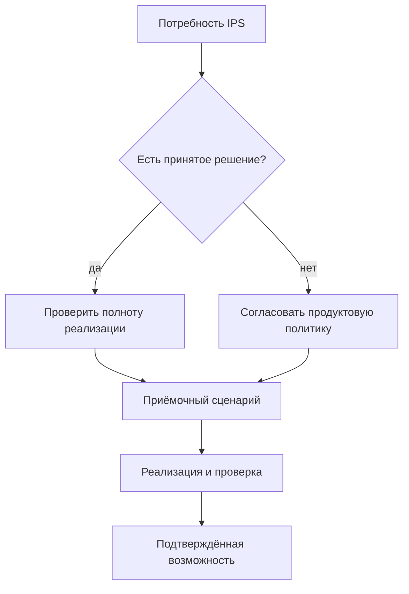

# Покрытие, открытые вопросы и состояние реализации

## Как пользоваться документом

Этот раздел отделяет подтверждённые потребности, принятые решения и ещё не закрытые вопросы. Он защищает продуктовую дискуссию от двух ошибок: считать целевую идею уже готовой функцией или, наоборот, повторно обсуждать уже принятое архитектурное решение.

Обозначения состояния:

- **принято** — продуктовый и архитектурный смысл зафиксирован;
- **частичная основа** — есть базовые понятия или контракты, но нет полного пользовательского сценария;
- **целевая возможность** — требуется последующая реализация;
- **нужно согласовать** — решение зависит от предприятия или ещё не принято.

## Матрица покрытия

| Область | Что требуется | Решение Interlink | Состояние на 31.08.2026 |
|---|---|---|---|
| Несколько изделий в заказе | Верхние изделия, ЗИП и отдельные комплекты | Версия заказа с несколькими позициями | Принято; предметный модуль впереди |
| Количество | На строке и по всему раскрытому пути | Локальное и накопленное количество без раннего создания экземпляров | Целевая возможность |
| Комплектация | Опции отдельно для каждой позиции | Явные параметры и условия присутствия | Частичная основа |
| Точное изделие | Выделить повторяемое заказное исполнение | Только явная операция с новой самостоятельной идентичностью | Принято; реализация впереди |
| Живой заказ | Учитывать развитие инженерных данных | Новые версии заказа и явный повторный расчёт | Принято; пользовательский процесс впереди |
| Точная передача | Не менять ранее отданный состав | Отдельный полный неизменяемый снимок на каждую передачу | Принято; запись и публикация впереди |
| Версии | Выбор по контексту, зрелости и рабочим предпочтениям | Единый объяснимый механизм | Частичная основа, этап 9 не принят |
| Аналоги и замены | Контролируемый выбор другой номенклатуры | Предметный выбор до выбора версии | Целевая возможность |
| Маршруты | Зависимость от версии, позиции и предприятия | Производственное наложение на точный состав | Целевая возможность |
| Нормы | Материалы и труд с объяснимым расчётом | Версионные основания, расчёт на единицу, ветвь и заказ | Целевая возможность |
| Способ обеспечения | Изготовить, купить, кооперировать | Отдельное производственное решение | Нужно согласовать и реализовать |
| ПВ | Самостоятельный документ с версиями и подписью | Предметный модуль поверх снимка | Принято как граница; реализация впереди |
| Отчёты и 1С | Материалы, труд и обмен | Воспроизводимое представление точного снимка | Целевая интеграция |
| Экземпляры и партии | Прослеживаемость физического результата | Отдельные сущности будущего производственного слоя | Принято как различие; реализация впереди |
| Как заказано / как изготовлено | Не смешивать нормативный и фактический состав | Снимок передачи плюс связанная фактическая родословная | Целевая возможность |
| Согласование и подпись | Утверждать точное содержание | Процесс принимающей PLM-системы | Нужно согласовать по установке |
| ERP/MES | Склад, задания, факты исполнения | Интеграция через точные передачи и связанные ответы | Целевая интеграция |

## Уже принятые продуктовые решения

1. Заказ — обычный версионируемый предметный объект, а не особый скрытый контейнер.
2. Состав заказа выражается позициями; отдельная строка становится самостоятельным объектом только при собственном жизненном цикле.
3. В ядре нет обязательных цен, сроков, оплаты, отгрузки и портфеля заказов.
4. Заказ остаётся живым, а точность каждой передачи обеспечивается отдельным снимком.
5. Снимок полон до конечных позиций, неизменяем и не урезается правами пользователя.
6. Публикация отклоняется целиком при отсутствии допустимого результата в обязательной ветви.
7. ПВ является самостоятельным версионным документом.
8. Точное изделие создаётся явно, а не автоматически при каждом заказе.
9. Количественная потребность, производственная позиция, экземпляр, партия и фактический состав различаются.
10. Полные MRP, ERP/MES, согласование и подпись не встраиваются в общее ядро.

## Главные открытые вопросы

### Смысл заказа на конкретном предприятии

- Совпадает ли изученная модель IPS с другими установками?
- Где хранятся заказчик, договор, цена, срок, этап поставки и состояние?
- Требуется ли отдельный портфель заказов и приоритетов?
- Как связаны коммерческий заказ, производственный заказ и ПВ?

### Версии и применимость

- Когда живой заказ следует за новой допустимой версией, а когда сохраняет прежний выбор?
- Связана ли дата поставки с датой применимости?
- Какие состояния зрелости допустимы для расчёта и для публикации?
- Какие ручные фиксации переживают выпуск новой версии?

### Комплектация

- Какие параметры распространяются по составу и где заканчивается их область действия?
- Как обрабатываются значения по умолчанию и явный отказ от опции?
- Кто создаёт переиспользуемую комплектацию?
- Как обнаруживать уже существующее точное изделие с теми же признаками?

### Производственное обеспечение

- Как именно IPS различает изготовление, закупку, кооперацию и исключение из планирования?
- Можно ли разделить количество одной позиции между маршрутами?
- Кто выбирает площадку и поставщика?
- Как рассчитываются наладка, отход, партия и округление нормы?

### Передачи и исправления

- Когда создаётся отдельный снимок: производство, 1С, архив, кооператор?
- Полная или добавочная передача используется при изменении количества?
- Как отменить уже принятую внешнюю передачу?
- Что требует новой версии заказа, а что только новой ПВ?

### Экземпляры и партии

- Где и когда присваивается серийный номер?
- Какие объекты учитываются поштучно?
- Может ли одна партия обслуживать несколько заказов?
- Кто владеет фактической родословной и сервисным состоянием?

### Права и регламент

- Какие роли и маршруты согласования используются в IPS?
- Какие изменения требуют повторной подписи?
- Как формируются ограниченные пакеты для кооператоров?
- Каковы требования к архиву и сроку хранения?

## Предлагаемая последовательность реализации

1. Завершить и принять базовый подбор одной позиции: контекст, применимость, зрелость, предпочтения и объяснение.
2. Добавить многоуровневое раскрытие с устойчивым путём и подсчётом количества.
3. Реализовать заказ как версионируемый состав нескольких верхних позиций.
4. Добавить конфигурацию, варианты, аналоги и явное устранение неоднозначности.
5. Реализовать атомарный неизменяемый снимок заказа и сравнение передач.
6. Подключить маршруты, нормы и способы обеспечения.
7. Построить ПВ, комплект документов и отчёты как отдельные предметные функции.
8. Подключить ERP/MES с защитой от дублей и возвратом фактов.
9. Добавить экземпляры, партии, родословную и сравнение «как заказано / как изготовлено».

Каждый этап должен завершаться сквозным примером, а не только проверкой отдельных технических операций.

## Минимальный набор приёмочных историй

### История А. Несколько комплектаций

Один заказ содержит северные и южные насосные станции, отдельный ЗИП и разные количества. Проверяются независимые опции, точные версии, документы и полный снимок.

### История Б. Замена после частичного запуска

Половина партии редукторов изготовлена, для остатка меняются подшипник и маршрут. Проверяются новая версия заказа, сравнение, второй снимок и неизменность первого.

### История В. Заказной станок и кооперация

Станок имеет сложную комплектацию, покупной аналог, собственные и кооперационные маршруты, ПВ, пакет поставщика и явное создание точного изделия.

### История Г. Фактическое отклонение экземпляра

В одном серийном изделии разрешена замена датчика. Проверяются область действия, разрешение, фактическая родословная и неизменность нормативного состава остальных единиц.

## Условия признания заказного контура готовым

Контур можно считать продуктово готовым только когда:

- все обязательные истории выполняются через пользовательский процесс;
- результат каждой передачи воспроизводим;
- ошибки и решения объясняются предметным языком;
- старые снимки сохраняются после изменения данных;
- роли и права не создают неполных публикаций;
- внешние повторы не дублируют заказы;
- фактические данные связаны с нормативным основанием;
- продуктовые специалисты IPS подтвердили эквивалентность критичных сценариев.

## Текущее ограничение

На 31 августа 2026 года документы описывают целевой контур и основание для реализации. Базовые понятия Interlink уже сформированы, но многоуровневый заказ, конфигуратор, ПВ, производственный слой и интеграции ещё не являются готовыми пользовательскими функциями. Локальная реализация фазы 2 дошла до этапа 8; итоговая приёмка этапа 9 не начата.

## Связанные документы

- [Матрица функционального покрытия](Current-state-and-roadmap)
- [Открытые вопросы и риски](Open-questions)
- [Сквозные сценарии](Order-end-to-end)

