# Сквозные машиностроительные сценарии

## Назначение

Ниже собраны три цельных истории. Они показывают не отдельную функцию, а весь путь: от потребности до точной передачи, перепланирования и фактического исполнения. Эти сценарии можно использовать на продуктовой встрече и затем превратить в приёмочные испытания.

```mermaid
flowchart LR
    A["Потребность"] --> B["Позиции и комплектации"]
    B --> C["Точный инженерный состав"]
    C --> D["Маршруты, нормы и документы"]
    D --> E["Согласование"]
    E --> V["ПВ и ПЗ — отдельные артефакты;<br/>их порядок задаёт предприятие"]
    V --> F["Выпущенная версия ПЗ"]
    F --> G["Опубликован снимок передачи"]
    G --> H["Доставка принимающим продуктом"]
    H --> J["Приём: полностью, частично,<br/>отказ или неизвестный исход"]
    J --> K["Экземпляры, партии и факты"]
    K --> I["Перепланирование или сервис"]
    I -.-> B
```

## Сценарий 1. Поставка экскаваторов и запасных комплектов

### Потребность

Горнодобывающее предприятие заказывает:

- три экскаватора в северном исполнении;
- два экскаватора в обычном исполнении;
- три ковша для скального грунта как отдельную поставку;
- пять комплектов запасных частей.

Все экскаваторы основаны на одном конфигурируемом семействе, но северная и обычная позиции имеют разные условия эксплуатации.

### Подготовка заказа

Автор создаёт четыре позиции, а не искусственную сборку «заказ целиком». На северной позиции выбираются предпусковой подогрев, арктические рукава, масло низкой температуры и закрытый аккумуляторный отсек. На обычной — стандартный комплект. Ковши и ЗИП остаются самостоятельными поставочными позициями и не считаются установленными во все машины.

Специалист видит локальное количество каждой строки и итоговые количества вложенных деталей. Три северных машины не создают три экземпляра на этом этапе: это одна количественная потребность.

### Формирование производственного состава

Условия комплектации исключают стандартные рукава из северной ветви и включают арктические. Для предпускового подогревателя найдены две допустимые версии, но одна ещё не выпущена. При обычной публикации выбирается выпущенная версия; будущую можно оценить только в рабочей области совместного изменения.

Для скального ковша выбирается отдельный маршрут наплавки. ЗИП раскрывается как поставочный комплект со своими количествами, но не входит в фактический состав каждой машины.

### Документы и согласование

Проверка требует сборочные чертежи, схемы гидравлики, перечень запасных частей и инструкции северного запуска. Инструкция стандартного запуска остаётся для обычных машин, а северная инструкция применяется только к первой позиции.

Конструктор подтверждает версии, технолог — маршруты и нормы, специалист по комплектации — отсутствие противоречий. После согласования выпускается версия заказа.

### Передача и исполнение

После согласования предприятие оформляет ПВ и ПЗ в принятом у него порядке, выпускает версию ПЗ, отдельно публикует снимок официальной передачи, затем доставляет его в систему планирования ресурсов предприятия (ERP) и фиксирует результат приёма. На этом предприятии пять серийных экземпляров экскаваторов создаются при запуске; в другом процессе они могли бы появиться до запуска или уже во время изготовления. Ковши могут получить отдельные номера, а ЗИП — номера комплектов или партий по правилам предприятия.

Через месяц поставщик меняет арктический рукав. До частичной передачи принимающий продукт создаёт отдельный корень для двух ещё не собранных северных машин либо явное распределение количества, не пересекающееся с уже изготовленной машиной. Новая версия заказа и новый снимок относятся только к этому оформленному корню; сам снимок не вычисляет остаток. Первый снимок и фактический состав изготовленной машины сохраняют прежний рукав.

### Почему требование IPS закрыто

Сохраняются несколько верхних изделий, количества, опции по каждой позиции, точные версии, трассировка причин и контролируемая замена после формирования. Дополнительно Interlink явно отделяет ЗИП, живой заказ, точную передачу и серийные экземпляры.

### Проверяемый результат

- четыре строки заказа формируют независимые ветви;
- северное решение не переносится на обычные машины;
- ковши и ЗИП не становятся установленным составом без основания;
- первая передача не меняется после замены рукава;
- фактические серийные машины связаны с правильной передачей.

## Сценарий 2. Заказной обрабатывающий центр с роботизированной загрузкой

### Потребность

Машиностроительный завод заказывает один обрабатывающий центр для крупногабаритных деталей. Требуются:

- поворотный стол;
- магазин на 120 инструментов;
- измерительный щуп;
- подготовка под робота заказчика;
- отдельный комплект кулачков и оснастки;
- комплект документов для последующей сертификации.

### Комплектация

Поворотный стол требует усиленной станины. Увеличенный магазин меняет ограждение и кабельные трассы. Подготовка под робота исключает стандартную дверь ручной загрузки и включает интерфейс безопасности.

Interlink объясняет зависимые решения. Если суммарная мощность приводов превышает предел стандартного шкафа, включается увеличенный шкаф. Пользователь видит причину, а не только изменившуюся строку состава.

Комплект кулачков оформляется отдельной позицией поставки. Он связан со станком по назначению, но не считается постоянно установленным узлом.

### Точные версии и замена покупного узла

Для поворотного стола основной поставщик не может выдержать срок. Предприятие выбирает разрешённый аналог. Аналог требует другого переходного фланца и новой схемы подключения.

Сначала фиксируется выбор другого изделия, затем подбирается его допустимая версия. Система пересчитывает затронутые ветви и помечает прежний фланец и схему как исключённые. Замена не маскируется обычным выбором «более новой версии».

### Технология и обеспечение

Рама изготавливается внутри предприятия, покрытие передаётся кооператору, поворотный стол закупается. Для переходного фланца рассматриваются два маршрута; технолог выбирает обработку на своей площадке.

Нормы показывают материал и труд на один фланец, наладку на партию и итог заказа. ERP позже учтёт остатки материала, но валовая потребность уже объяснима из точного состава.

### ПВ и документы

В данном примере предприятие готовит ПВ до снимка передачи. ПВ включает ссылочное представление точного состава, сборочные чертежи, электрические схемы, программу настройки приводов, инструкцию сопряжения с роботом и план испытаний. Проверка блокирует выпуск ПВ, пока схема безопасности находится в рабочем состоянии.

После выпуска документа создаются подписанная ПВ, производственный снимок и ограниченный пакет для кооператора. Кооператор получает только чертежи рамы и требования к покрытию, но внутренний снимок Interlink сохраняет всё дерево включённых позиций и точных версий. Ограниченный пакет кооператора не является этим снимком.

### Создание точного изделия

После успешного проекта предприятие решает включить это исполнение в каталог как повторяемое предложение. Уполномоченный специалист явно создаёт точное изделие с собственным обозначением и историей. Это отдельное решение, а не автоматический результат заказа.

### Почему требование IPS закрыто

Сценарий сохраняет комплектацию, варианты, аналоги, применимость документов, технологический маршрут, ПВ, согласование и отчётность. Interlink добавляет объяснимую последовательность выбора и различает разовое исполнение заказа от нового самостоятельного изделия.

### Проверяемый результат

- все зависимые изменения комплектации объяснены;
- аналог поворотного стола не смешан с новой версией исходного стола;
- кооператорский пакет не выдаётся за полный снимок;
- незрелая схема блокирует ПВ;
- точное изделие появляется только после явного решения.

## Сценарий 3. Партия насосных станций с перепланированием

### Потребность

Нефтехимическое предприятие заказывает десять насосных станций одной комплектации. Поставка разделена на две очереди по пять штук. Заказчик требует прослеживаемость двигателей, торцевых уплотнений и партий материалов корпуса.

### Первая очередь

Заказ содержит одну позицию с количеством десять и условием двух этапов поставки. Принимающий продукт заранее создаёт два корня передачи или явное распределение количества. Только после этого для первой очереди из пяти станций формируются точный состав, снимок, ПВ и задания системе управления производством (MES). Сам снимок количество не разделяет.

При запуске появляются пять серийных экземпляров. MES возвращает номера двигателей и партии отливок корпусов. Фактический состав связывается с первым снимком.

### Изменение поставщика

Перед второй очередью поставщик снимает уплотнение с производства. Разрешённый аналог требует другой втулки и небольшой корректировки операции сборки. Живой заказ обнаруживает изменение, но не затрагивает первые пять станций.

Специалист создаёт новую версию заказа для оставшегося количества. Выбор аналога приводит к замене втулки, новой версии инструкции и изменению трудовой нормы. Сравнение показывает все четыре последствия.

### Новый маршрут корпуса

Одновременно завод А временно недоступен. Обработку корпусов переносят на завод Б. Конструкторская версия корпуса сохраняется, но меняются маршрут, приспособление и контрольная карта.

Технолог и служба качества согласуют изменения. Новая ПВ и новый снимок относятся к отдельно оформленной второй очереди. В истории видно, что первая и вторая половины заказа изготовлены по разным производственным решениям.

### Передача в ERP и MES

ERP получает новую потребность только для оставшихся пяти станций и учитывает остатки старых уплотнений отдельно. MES получает точные новые документы. После сетевого сбоя принимающий продукт сначала сверяет исход по устойчивому номеру; повтор без риска второго производственного заказа допустим только при явной поддержке сверки и повторяемой обработки со стороны ERP/MES. Без такого договора слепой повтор запрещён.

### Фактическое отклонение

Во время сборки станции № 009 повреждён датчик. Служба качества разрешает другой эквивалентный датчик только для этого экземпляра. Разрешение и установленный номер попадают в фактическую родословную № 009, но не меняют нормативный состав остальных станций.

### Почему требование IPS закрыто

Сценарий поддерживает контролируемую замену изделия, версии и маршрута после формирования заказа, а также трассировку и производственные документы. Дополнительное разделение «как заказано» и «как изготовлено» позволяет точно объяснить судьбу каждой очереди и каждого экземпляра.

### Проверяемый результат

- две очереди имеют отдельные снимки и ПВ;
- изменение уплотнения не переписывает первую очередь;
- сравнение показывает зависимую втулку, документ и норму;
- маршрут завода Б применяется только ко второй очереди;
- отклонение датчика ограничено экземпляром № 009;
- ERP/MES связывают ответы с правильной передачей.

## Общие вопросы для продуктовой встречи

На каждом реальном примере необходимо уточнить:

1. Когда предприятие создаёт полную, а когда добавочную передачу?
2. Кто принимает неоднозначный вариант, аналог и маршрут?
3. Какие документы блокируют производство?
4. Где появляются экземпляры и партии?
5. Какая система владеет сроками, запасами и внешним номером заказа?
6. Какие изменения требуют повторной подписи?
7. Как ограничивается область замены: весь заказ, очередь, партия или экземпляр?

## Состояние реализации

Сценарии являются целевыми приёмочными историями. Они опираются на принятые архитектурные решения и подтверждённые потребности IPS, но полный сквозной заказно-производственный контур ещё не реализован. Детальная проверка должна выполняться поэтапно по матрице следующего документа.

## Связанные документы

- [Покрытие, вопросы и состояние](Order-coverage-and-status)
- [Формирование производственного заказа](Order-production-composition)
- [Перепланирование и отклонения](Order-replanning)
