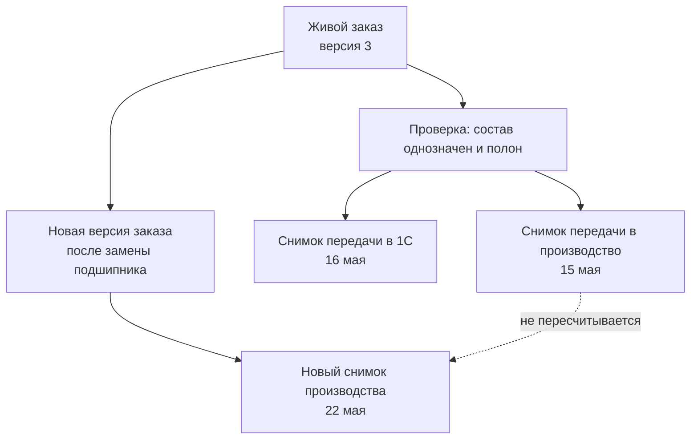

# Точный состав и публикации заказа

## Зачем нужен отдельный снимок передачи

Живой заказ отвечает на вопрос: «Что предприятие сейчас собирается изготовить или поставить?» Точный снимок отвечает на другой вопрос: «Что именно было передано этому получателю в этот момент?»

Эти ответы нельзя хранить только в одном изменяемом представлении. После выпуска новых версий изделия, правил комплектации или маршрутов сегодняшний результат может отличаться от вчерашнего. Производству, учётной системе и аудитору нужен воспроизводимый прежний результат.

Поэтому для каждой существенной передачи Interlink создаёт **неизменяемый снимок полного точного состава заказа**. Внутреннее обозначение `Snapshot` при первом упоминании означает именно такой снимок, а не изображение экрана.

## Что входит в снимок

Снимок должен быть достаточен, чтобы без повторного подбора понять переданный результат:

- версия заказа и назначение передачи;
- условия расчёта: дата применимости, серия, предприятие и иные значимые признаки;
- все позиции заказа и их количества;
- полный состав до требуемых конечных позиций;
- точные версии изделий и документов;
- принятые варианты, аналоги, замены и маршруты;
- объяснения решений и диагностические сведения;
- время создания, автор и получатель;
- связь с производственной ведомостью, отчётом или сообщением внешней системе.

Снимок не обязан копировать файлы в собственное хранилище, но обязан однозначно указывать на те версии и представления, которые были переданы. Политика долговременного хранения файлов определяется предприятием.

## Требования к точности

### Полнота до конечных позиций

Недостаточно закрепить только верхнее изделие. Если ниже останется ссылка «выбрать актуальную версию», прежний результат перестанет быть воспроизводимым. В снимке каждое существенное вхождение должно вести к точной версии.

### Отсутствие неоднозначности

Если для подшипника остаются два равноправных допустимых варианта, передача не является точной. Пользователь, правило предприятия или отдельная разрешённая операция должны выбрать один вариант до публикации.

### Целостность всей передачи

Если хотя бы в одной обязательной ветви нет допустимого результата, снимок не создаётся. Нельзя опубликовать «почти весь» заказ, а ошибочную ветвь незаметно пропустить.

### Неизменяемость

После создания снимок не редактируется. Исправление оформляется новой версией заказа и новым снимком. Связь между ними показывает, что именно было заменено.

### Полнота независимо от прав просмотра

Права определяют, кто может создать и кто может читать снимок, но не должны вырезать из его содержания недоступные создателю ветви. Если пользователь не имеет права сформировать полный результат, операция должна быть запрещена или выполнена специальной доверенной службой. Частичный снимок создаёт опасную иллюзию полноты.

## Чем снимок не является

| Понятие | Отличие от снимка передачи |
|---|---|
| Версия заказа | Хранит заказные позиции и решения, но не обязательно весь раскрытый состав до конечных деталей |
| Производственная ведомость | Имеет собственный номер, карточку, версии, проверку и подпись |
| Отчёт для 1С | Является представлением данных по форме получателя; может быть повторно построен из снимка |
| Архивный файл | Только один материальный носитель, не полная предметная фиксация |
| Точное изделие | Самостоятельная номенклатура с дальнейшей историей, а не свидетельство одной передачи |
| Фактический состав | Показывает, что реально изготовлено, включая разрешённые отклонения |

## Почему у заказа может быть несколько снимков

Одна версия заказа может передаваться разным получателям в разное время. Производству нужен точный состав и документы, 1С — нормы материалов и трудоёмкости, архиву — утверждённый комплект. Получатели и формы разные, но каждая передача должна иметь своё доказуемое основание.

Кроме того, новая версия заказа порождает новые передачи. Старые снимки сохраняются для разбора ранее начатого производства, рекламаций и повторного выпуска документов.

## Пример 1. Передача насосной станции в производство

Заказ включает три северные и две южные станции. Перед публикацией обнаружено, что для южной станции допустимы два материала уплотнения. Пока технолог не выбрал материал, снимок не создаётся.

После выбора система фиксирует обе комплектации, точные версии всех узлов, документов и маршрутов. Через месяц выпускается новая версия электродвигателя. Она может попасть в новый заказ, но не меняет майский снимок.

## Пример 2. Отдельная передача данных в 1С

Для партии из десяти редукторов сначала создан производственный снимок. На следующий день по тому же основанию сформирован отчёт для 1С с материалами и трудоёмкостью.

Передача в 1С получает собственную запись: какой снимок был источником, какая форма отчёта применялась и когда сообщение принято системой. Если формат отчёта позднее изменится, исторический производственный состав останется прежним.

## Пример 3. Замена подшипника после запуска пяти изделий

Из десяти редукторов пять уже запущены со старым подшипником. Для оставшихся разрешена замена из-за прекращения поставок.

Первая передача сохраняет исходную комплектацию. Специалист создаёт новую версию заказа, указывает область замены и выпускает новый снимок для оставшихся пяти. История показывает две разные производственные передачи, а не один переписанный заказ.

## Пример 4. Архив комплекта станка

При окончательной сдаче обрабатывающего центра предприятие создаёт архивную передачу: точный состав, утверждённые чертежи, эксплуатационные документы и связь с подписанной производственной ведомостью. Архивный снимок может иметь тот же состав изделия, что производственный, но другое назначение, время и набор представлений документов.

## Пользовательский результат

Карточка снимка должна простым языком отвечать:

- какой заказ и какая его версия переданы;
- кому и зачем;
- какой состав и какие количества вошли;
- какие условия и решения использованы;
- есть ли предшествующая передача;
- чем новая передача отличается от неё;
- какие документы и отчёты были получены.

## Открытые вопросы

- Какие события предприятия считаются существенной передачей?
- Требуется ли отдельная электронная подпись снимка или достаточно подписи связанного документа?
- Как долго хранятся файлы и представления, на которые он ссылается?
- Всегда ли повторная передача содержит полный результат или иногда только разницу?
- Как представлять частичную поставку и отмену части заказа?
- Может ли один снимок быть основанием нескольких производственных ведомостей?

## Критерии приёмки

1. Снимок содержит точные версии по всему обязательному дереву.
2. Неоднозначность или отсутствующий результат блокирует всю публикацию.
3. Права доступа не превращают снимок в неполный состав.
4. Изменение исходных данных не меняет созданный снимок.
5. У одной версии заказа может быть несколько явно различимых передач.
6. Исторический отчёт можно связать с точным исходным снимком.
7. Пользователь видит различия между двумя передачами без анализа внутренних идентификаторов.

## Состояние реализации

Неизменяемый снимок с видом `order` («заказ») закреплён архитектурным решением. Базовая модель снимков существует в контрактах Interlink, но полноценная запись, раскрытие многоуровневого состава, бизнес-публикация заказа и долговременное хранение представлений относятся к следующим этапам.

## Связанные документы

- [Жизненный цикл живого заказа](Order-lifecycle)
- [Производственные ведомости и отчёты](Order-production-documents)
- [Интеграция с ERP/MES](Order-integration)

