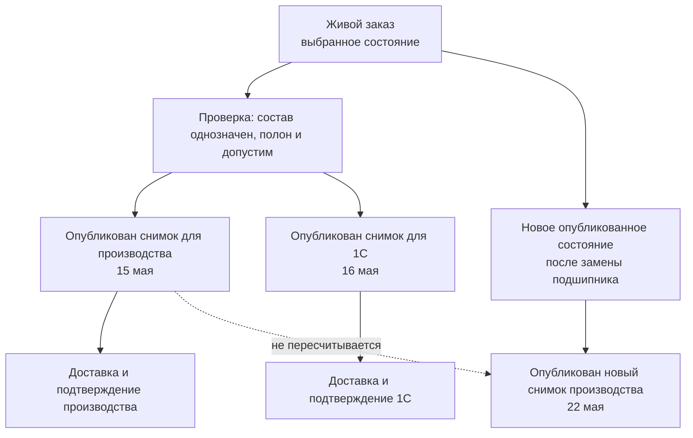

# Точный состав и публикации заказа

> Целевой контракт, уточнённый 6 сентября 2026 года. Публикация, доставка, приём и фактическое исполнение имеют самостоятельные основания и состояния.

## Зачем нужен отдельный снимок передачи

Живой заказ отвечает на вопрос: «Что предприятие сейчас собирается изготовить или поставить?» Опубликованный долговечный снимок заказа отвечает на другой вопрос: «Какой полный точный состав зафиксирован для этой официальной передачи?» Он публикуется **до** внешней доставки и становится её неизменяемым содержанием. Принимающий продукт, а не Interlink, отдельно ведёт состояние доставки: отправлен ли состав, принят полностью, принят частично, отклонён или имеет неизвестный исход.

Эти ответы нельзя хранить только в одном изменяемом представлении. После выпуска новых версий изделия, правил комплектации или маршрутов сегодняшний результат может отличаться от вчерашнего. Производству, учётной системе и аудитору нужен воспроизводимый прежний результат.

Поэтому для каждой самостоятельной официальной публикации Interlink по явной команде принимающего продукта создаёт **долговечный снимок полного точного состава выбранной области заказа**. Повтор доставки той же публикации не создаёт снимок заново. Снимок фиксирует то, что предназначено к отправке; отдельная запись принимающего продукта подтверждает, что именно произошло у получателя.

## Какие виды снимков существуют

| Вид | Назначение | Можно ли заменить или удалить |
|---|---|---|
| Базовый снимок состава | Утверждённая конфигурация выпуска или другого инженерного основания | Обычное изменение запрещено; исправление создаёт новый снимок, удержание определяется обязательствами |
| Снимок заказа | Долговечная точная передача одной официальной области заказа | Обычное изменение запрещено; новая деловая публикация получает новый снимок, повтор доставки использует прежний |
| Техническая проекция | Ускоряющее представление для чтения | Да; может устареть, перестраиваться и удаляться |

Отчёт, архивная выгрузка или пакет файлов, сформированные принимающим продуктом из снимка, не образуют четвёртый **вид** снимка Interlink. Каждая самостоятельная официальная публикация получает собственный снимок, даже если содержание совпадает с другой. Что считать новой деловой публикацией — другую очередь, цель, область количества или получателя — предприятие определяет явно. Нельзя установить это только по одинаковым файлам или новому номеру сетевой попытки. Прежний снимок используют для повторного формирования представления и повторной доставки того же намерения по подтверждённым правилам защиты от дублей.

## Что входит в снимок

Снимок и связанные данные публикации должны позволять без повторного подбора понять зафиксированный результат:

- точное опубликованное состояние заказа и назначение передачи;
- условия расчёта: дата применимости, серия, предприятие и иные значимые признаки;
- корень одной официальной передачи и её явно оформленное количество;
- всё дерево включённых позиций до требуемых конечных объектов;
- конкретные опубликованные состояния инженерных объектов, а не только номера их версий;
- существенные данные позиции: номер, количество и единица;
- принятые варианты, аналоги и замены;
- краткие причины выбора и предупреждения;
- время создания, автор и получатель;
- связь с производственной ведомостью, если она применима к этой передаче, а также с отчётом или сообщением внешней системе.

Снимок фиксирует точный граф, но не копирует все документы, файлы, маршруты и атрибуты выбранных объектов. Для производственной выдачи к нему добавляется **точный комплект оснований**: перечень использованных состояний маршрутов, редакций норм, правил совместимости, решений по заменам, документов, файлов, единиц и расчётных правил. Каждое обязательное основание либо уже входит в точный граф, либо удерживается как самостоятельная неизменяемая зависимость комплекта.

Поэтому ссылка «таблица норм на сетевом диске» недостаточна. Нужно сохранить именно прочитанное содержание и возможность его истолковать. Контрольный отпечаток помогает проверить файл, но не заменяет сами байты. При утрате обязательного материала система должна сообщить о неполном свидетельстве, а не подставить сегодняшний файл под старую дату.

Карточка может показывать эти сведения вместе, хотя получатель, ПЗ, ПВ, формат сообщения и состояние доставки принадлежат прикладному заказному модулю, а не самому дереву снимка. Для исторического воспроизведения будущая реализация также удерживает необходимые средства чтения прежней модели. Это обязательное целевое требование, а не уже готовая возможность.

## Требования к точности

### Полнота до конечных позиций

Недостаточно закрепить только верхнее изделие. Если ниже останется ссылка «выбрать актуальную версию», прежний результат перестанет быть воспроизводимым. Более того, жёсткое закрепление инженерной версии «05» само по себе не удерживает её содержание: у этой версии могут появляться новые опубликованные состояния. В снимке каждое обязательное вхождение ведёт к конкретному опубликованному состоянию. Рабочий материал можно сохранить для анализа, но он не заменяет требуемое выпущенное содержание официального заказа.

### Отсутствие неоднозначности

Если для подшипника остаются два равноправных допустимых варианта, передача не является точной. Пользователь, правило предприятия или отдельная разрешённая операция должны выбрать один вариант до публикации.

Это не запрещает сохранить рабочий ПЗ с двумя вариантами. Строгий барьер относится к выделенной области выдачи. После подбора содержания система дополнительно проверяет обязательную совместимость: разрешённые по отдельности детали, прошивки и маршруты должны работать вместе. «Версия найдена» ещё не означает «комплект разрешён к производству».

### Целостность всей передачи

Если хотя бы в одной обязательной ветви нет допустимого результата, снимок не создаётся. Нельзя опубликовать «почти весь» заказ, а ошибочную ветвь незаметно пропустить.

### Неизменяемость

После создания снимок не редактируется и не удаляется обычной операцией. Исправление инженерного содержания оформляется рабочим изменением, новым опубликованным состоянием и новой деловой публикацией. Новая инженерная версия создаётся только по отдельному предметному решению. Связь публикаций показывает, что именно было заменено или передано дополнительно.

Неизменяемость не означает бессрочное хранение любых копий. Сроки определяют назначение комплекта, требования предприятия, обязательства перед заказчиком и действующие запреты удаления. Управляемое завершение хранения не должно разрушать основания ещё действующих передач, расследований и гарантий. Пользователь должен отличать «содержание было изменено», что запрещено, от «срок удержания законно завершён», что требует отдельной процедуры.

### Полнота независимо от прав просмотра

Права определяют, кто может создать и кто может читать снимок, но не должны вырезать из его содержания недоступные создателю ветви. Если пользователь не имеет права сформировать полный результат, операция должна быть запрещена или выполнена специальной доверенной службой. Частичный снимок создаёт опасную иллюзию полноты.

Для поставщика может быть подготовлена отдельно разрешённая проекция раскрытия данных с собственным назначением и областью. Она не выдаётся за полный исходный заказ. Историческая подпись и доступ к снимку также не предоставляют автоматически право скачать все связанные секретные файлы сегодня.

## Что именно делает пользователь

Планировщик сначала сохраняет рабочие изменения и рассматривает результат расчёта. Затем выбирает, какую очередь и какое количество выдаёт, проверяет различия с прежней передачей и получает необходимые согласования. Одобрение относится к точному комплекту, а не к обещанию «использовать всё актуальное в момент нажатия».

Предприятие выбирает один из двух явных режимов. В первом публикуется уже одобренный точный комплект: появление новой, неиспользованной редакции нормы не меняет его само по себе. Во втором требуется дополнительно подтвердить, что выбранные живые основания всё ещё актуальны; их изменение возвращает результат на проверку. В обоих режимах сохраняются текущие обязательные запреты — например, отзыв материала или запрет производственной площадки. Старое одобрение не позволяет их обойти.

При официальном выпуске сохраняются согласованные предметные изменения, снимок, необходимые количественные назначения, подтверждение операции, обязательный журнал и задание доставки — как единое локальное действие в предусмотренной границе. Сбой обязательной части не оставляет половину выпуска. Сама отправка наружу выполняется после подтверждённой фиксации и может иметь отдельный сбой: тогда снимок уже существует, а доставка ещё требует сверки.

## Чем снимок не является

| Понятие | Отличие от снимка передачи |
|---|---|
| Версия заказа | Хранит заказные позиции и решения, но не обязательно весь раскрытый состав до конечных деталей |
| Производственная ведомость | Имеет собственный номер, карточку, версии, проверку и подпись |
| Отчёт для 1С | Является представлением данных по форме получателя; может быть повторно построен из снимка |
| Архивный файл | Только один материальный носитель, не полная предметная фиксация |
| Точное изделие | Самостоятельная номенклатура с дальнейшей историей, а не свидетельство одной передачи |
| Фактический состав | Показывает, что реально изготовлено, включая разрешённые отклонения |

## Почему у заказа может быть несколько снимков

Одно опубликованное состояние заказа может иметь несколько официальных публикаций для разных явно оформленных областей или деловых целей. Каждая самостоятельная публикация получает отдельный долговечный снимок заказа. Это всё тот же вид «снимок заказа», а не новый вид артефакта. Отчёт для 1С и архивный комплект принимающий продукт формирует из соответствующего снимка. ПВ остаётся самостоятельным документом: она может существовать до снимка или параллельно ему и связывается с конкретной передачей только при применимости.

Если меняется только форма отчёта, новый снимок не нужен. При повторной попытке доставки используется прежний неизменяемый снимок и отдельная запись попытки, но не новое заказное обязательство. Автоматический повтор разрешён только при доказанной защите от дублей либо достоверно установленном отсутствии прежнего эффекта. Новая цель или область количества требуют нового делового решения; смена адресата оценивается по принятому на предприятии определению самостоятельной передачи, а не по универсальному скрытому правилу.

Новое состояние заказа позволяет подготовить следующие передачи, но не рассылается автоматически при сохранении. Старые снимки сохраняются на предусмотренный срок для разбора ранее начатого производства, рекламаций и повторного выпуска документов.

## Пример 1. Передача насосной станции в производство

Заказ включает три северные и две южные станции. Перед публикацией обнаружено, что для южной станции допустимы два материала уплотнения. Пока технолог не выбрал материал, снимок не создаётся.

После выбора принимающий продукт оформляет точную область передачи, а Interlink фиксирует обе комплектации и точные версии всех узлов. Документы и маршруты входят в отдельный производственный комплект. Через месяц выпускается новая версия электродвигателя. Она может попасть в новый заказ, но не меняет майский снимок.

## Пример 2. Отдельная передача данных в 1С

Для партии из десяти редукторов сначала опубликован снимок производственной передачи. На следующий день предприятие оформляет самостоятельную официальную передачу в 1С, поэтому Interlink публикует для неё отдельный снимок заказа, даже если полный точный состав совпадает с производственным.

Передача в 1С получает собственный снимок заказа и запись принимающего продукта: какая форма отчёта применялась и когда сообщение принято системой. Это не новый **вид** снимка, а второй экземпляр того же заказного вида для другой официальной передачи. Если формат отчёта позднее изменится, повторно сформированный отчёт той же логической передачи использует её прежний снимок; производственный снимок также остаётся неизменным.

## Пример 3. Замена подшипника после запуска пяти изделий

Из десяти редукторов пять уже запущены со старым подшипником. Для оставшихся разрешена замена из-за прекращения поставок.

Первая передача сохраняет исходную комплектацию. Принимающий продукт создаёт отдельный корень дополнительной передачи либо явное распределение количества без пересечения с первой пятёркой. При изменении инженерного содержания специалист также подготавливает и публикует новое состояние заказа. Новый снимок фиксирует уже оформленный корень оставшихся пяти; сам снимок не делит строку заказа. История показывает две разные производственные передачи, а не один переписанный заказ.

## Пример 4. Архив комплекта станка

При окончательной сдаче обрабатывающего центра предприятие оформляет архивную передачу. Если это самостоятельная официальная передача, для неё публикуется собственный снимок заказа. Принимающий продукт добавляет утверждённые чертежи, эксплуатационные документы и подписанную производственную ведомость. Такая выгрузка является доказательной оболочкой, а не отдельным «архивным видом» снимка Interlink. Повторное построение той же выгрузки использует уже опубликованный снимок архивной передачи.

## Пользовательский результат

Карточка снимка должна простым языком отвечать:

- какой заказ и какая его версия зафиксированы для передачи;
- кому и зачем;
- какой состав и какие количества вошли;
- какие условия и решения использованы;
- есть ли предшествующая передача;
- чем новая передача отличается от неё;
- какие документы, нормы, разрешения замен и отчёты были использованы;
- каков отдельный результат доставки и приёма у получателя.

## Открытые вопросы

- Какие события предприятия считаются существенной передачей?
- Требуется ли отдельная электронная подпись снимка или достаточно подписи связанного документа?
- Как долго хранятся файлы и представления, на которые он ссылается?
- В каких случаях внешний договор принимает полный план, добавку, замену или отмену, и как эти команды связываются с полным снимком выбранной области?
- Как представлять частичную поставку и отмену части заказа?
- Может ли один снимок быть основанием нескольких производственных ведомостей?

## Критерии приёмки

1. Снимок содержит конкретные опубликованные состояния по всему обязательному дереву.
2. Неоднозначность или отсутствующий результат блокирует всю публикацию.
3. Права доступа не превращают снимок в неполный состав.
4. Изменение исходных данных не меняет созданный снимок.
5. У одной версии заказа может быть несколько явно различимых передач, и каждая самостоятельная официальная передача имеет собственный снимок.
6. Исторический отчёт можно связать с точным исходным снимком.
7. Пользователь видит различия между двумя передачами без анализа внутренних идентификаторов.
8. Повторное формирование использует прежний снимок; безопасная повторная доставка возможна только по доказанному договору внешней системы, а самостоятельная деловая публикация создаёт новый снимок по объявленным правилам предприятия.
9. Жёсткое закрепление инженерной версии не выдаётся за точное состояние; обязательные нормы, маршруты, правила и файлы удерживаются вместе с производственным основанием.
10. Сохранение рабочей правки не публикует заказ; отказ обязательной части официального выпуска не оставляет частичного локального результата.

## Состояние реализации

Неизменяемый снимок заказа закреплён архитектурным решением. Базовая модель снимков существует в контрактах Interlink, но полноценная запись, раскрытие многоуровневого состава, бизнес-публикация заказа, архивные модели и совместимые читатели относятся к следующим этапам. Внешние отчёты, архивные комплекты, состояние их доставки и сроки хранения принадлежат принимающему продукту.

## Связанные документы

- [[Жизненный цикл живого заказа|Order-lifecycle]]
- [[Производственные ведомости и отчёты|Order-production-documents]]
- [[MRP, ERP/MES и длительные операции|Order-integration]]
- [[Допустимые замены|Allowed-replacements]]
- [[Матрицы совместимости|Compatibility-matrices]]
- [[Справочные таблицы|Reference-tables]]
