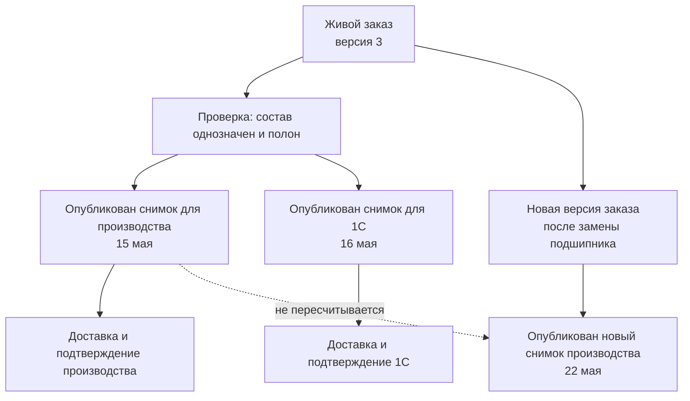

# Точный состав и публикации заказа

## Зачем нужен отдельный снимок передачи

Живой заказ отвечает на вопрос: «Что предприятие сейчас собирается изготовить или поставить?» Опубликованный долговечный снимок заказа отвечает на другой вопрос: «Какой полный точный состав зафиксирован для этой официальной передачи?» Он публикуется **до** внешней доставки и становится её неизменяемым содержанием. Принимающий продукт, а не Interlink, отдельно ведёт состояние доставки: отправлен ли состав, принят полностью, принят частично, отклонён или имеет неизвестный исход.

Эти ответы нельзя хранить только в одном изменяемом представлении. После выпуска новых версий изделия, правил комплектации или маршрутов сегодняшний результат может отличаться от вчерашнего. Производству, учётной системе и аудитору нужен воспроизводимый прежний результат.

Поэтому перед каждой существенной внешней передачей Interlink по явной команде принимающего продукта публикует **долговечный снимок полного точного состава заказа**. Снимок фиксирует то, что предназначено к отправке; отдельная запись принимающего продукта подтверждает, что именно произошло у получателя.

## Какие виды снимков существуют

| Вид | Назначение | Можно ли заменить или удалить |
|---|---|---|
| Базовый снимок состава | Утверждённая конфигурация выпуска или другого инженерного основания | Нет; новая публикация создаёт новый снимок |
| Снимок заказа | Долговечная точная передача одной официальной области заказа | Нет; повторная или исправленная передача создаёт новый снимок |
| Техническая проекция | Ускоряющее представление для чтения | Да; может устареть, перестраиваться и удаляться |

Отчёт, архивная выгрузка или пакет файлов, сформированные принимающим продуктом из снимка, не образуют четвёртый **вид** снимка Interlink. Однако каждая самостоятельная официальная передача — другому получателю, с новой деловой целью или по новому основанию — получает собственный экземпляр снимка заказа, даже если версия заказа и полный точный состав совпадают. Прежний снимок используют для повторного формирования представления; повторная внешняя доставка без риска дубля допустима только при явном договоре получателя о сверке и повторяемой обработке.

## Что входит в снимок

Снимок должен быть достаточен, чтобы без повторного подбора понять результат, зафиксированный для передачи:

- версия заказа и назначение передачи;
- условия расчёта: дата применимости, серия, предприятие и иные значимые признаки;
- корень одной официальной передачи и её явно оформленное количество;
- всё дерево включённых позиций до требуемых конечных объектов;
- точные версии инженерных объектов;
- существенные данные позиции: номер, количество и единица;
- принятые варианты, аналоги и замены;
- краткие причины выбора и предупреждения;
- время создания, автор и получатель;
- связь с производственной ведомостью, если она применима к этой передаче, а также с отчётом или сообщением внешней системе.

Снимок не копирует все документы, файлы, маршруты и атрибуты выбранных объектов. Их принимает отдельная доказательная оболочка или выгрузка принимающего продукта, связанная с номером снимка. Для исторического воспроизведения будущая реализация обязана сохранять совместимые архивные модели, правила и средства чтения рядом с неизменяемым предметным ядром и его контрольным отпечатком. Это обязательное целевое требование, а не уже готовая возможность.

## Требования к точности

### Полнота до конечных позиций

Недостаточно закрепить только верхнее изделие. Если ниже останется ссылка «выбрать актуальную версию», прежний результат перестанет быть воспроизводимым. В снимке каждое существенное вхождение должно вести к точной версии.

### Отсутствие неоднозначности

Если для подшипника остаются два равноправных допустимых варианта, передача не является точной. Пользователь, правило предприятия или отдельная разрешённая операция должны выбрать один вариант до публикации.

### Целостность всей передачи

Если хотя бы в одной обязательной ветви нет допустимого результата, снимок не создаётся. Нельзя опубликовать «почти весь» заказ, а ошибочную ветвь незаметно пропустить.

### Неизменяемость

После создания снимок не редактируется и не удаляется обычной операцией. Исправление инженерного содержания оформляется новой версией заказа и новым снимком. Дополнительная передача неизменившейся версии может иметь отдельный снимок. Связь между ними показывает, что именно было заменено или передано повторно.

### Полнота независимо от прав просмотра

Права определяют, кто может создать и кто может читать снимок, но не должны вырезать из его содержания недоступные создателю ветви. Если пользователь не имеет права сформировать полный результат, операция должна быть запрещена или выполнена специальной доверенной службой. Частичный снимок создаёт опасную иллюзию полноты.

## Чем снимок не является

| Понятие | Отличие от снимка передачи |
|---|---|
| Версия заказа | Хранит заказные позиции и решения, но не обязательно весь раскрытый состав до конечных деталей |
| Производственная ведомость | Имеет собственный номер, карточку, версии, проверку и подпись |
| Отчёт для 1С | Является представлением данных по форме получателя; может быть повторно построен из снимка |
| Архивный файл | Только один материальный носитель, не полная предметная фиксация |
| Точное изделие | Самостоятельная номенклатура с дальнейшей историей, а не свидетельство одной передачи |
| Фактический состав | Показывает, что реально изготовлено, включая разрешённые отклонения |

## Почему у заказа может быть несколько снимков

Одна версия заказа может иметь несколько официальных передач в разное время, разным получателям или для разных явно оформленных областей. Каждая самостоятельная передача получает отдельный долговечный снимок заказа. Это всё тот же вид «снимок заказа», а не новый вид артефакта. Отчёт для 1С и архивный комплект принимающий продукт формирует из снимка соответствующей передачи. ПВ остаётся самостоятельным документом: она может существовать до снимка или параллельно ему и связывается с конкретной передачей только при применимости.

Если меняется только форма отчёта, новый снимок не нужен. При повторной попытке доставки используется прежний неизменяемый снимок и новая запись принимающего продукта, но автоматический повтор разрешён только по явному договору с получателем; иначе сначала выполняется сверка и слепой повтор запрещён. Новый получатель, новая деловая цель или новое основание означают новую официальную передачу и требуют нового снимка, даже при совпадающем составе.

Кроме того, новая версия заказа порождает новые передачи. Старые снимки сохраняются для разбора ранее начатого производства, рекламаций и повторного выпуска документов.

## Пример 1. Передача насосной станции в производство

Заказ включает три северные и две южные станции. Перед публикацией обнаружено, что для южной станции допустимы два материала уплотнения. Пока технолог не выбрал материал, снимок не создаётся.

После выбора принимающий продукт оформляет точную область передачи, а Interlink фиксирует обе комплектации и точные версии всех узлов. Документы и маршруты входят в отдельный производственный комплект. Через месяц выпускается новая версия электродвигателя. Она может попасть в новый заказ, но не меняет майский снимок.

## Пример 2. Отдельная передача данных в 1С

Для партии из десяти редукторов сначала опубликован снимок производственной передачи. На следующий день предприятие оформляет самостоятельную официальную передачу в 1С, поэтому Interlink публикует для неё отдельный снимок заказа, даже если полный точный состав совпадает с производственным.

Передача в 1С получает собственный снимок заказа и запись принимающего продукта: какая форма отчёта применялась и когда сообщение принято системой. Это не новый **вид** снимка, а второй экземпляр того же заказного вида для другой официальной передачи. Если формат отчёта позднее изменится, повторно сформированный отчёт той же логической передачи использует её прежний снимок; производственный снимок также остаётся неизменным.

## Пример 3. Замена подшипника после запуска пяти изделий

Из десяти редукторов пять уже запущены со старым подшипником. Для оставшихся разрешена замена из-за прекращения поставок.

Первая передача сохраняет исходную комплектацию. Принимающий продукт создаёт отдельный корень дополнительной передачи либо явное распределение количества без пересечения с первой пятёркой. При изменении инженерного содержания специалист также создаёт новую версию заказа. Новый снимок фиксирует уже оформленный корень оставшихся пяти; сам снимок не делит строку заказа. История показывает две разные производственные передачи, а не один переписанный заказ.

## Пример 4. Архив комплекта станка

При окончательной сдаче обрабатывающего центра предприятие оформляет архивную передачу. Если это самостоятельная официальная передача, для неё публикуется собственный снимок заказа. Принимающий продукт добавляет утверждённые чертежи, эксплуатационные документы и подписанную производственную ведомость. Такая выгрузка является доказательной оболочкой, а не отдельным «архивным видом» снимка Interlink. Повторное построение той же выгрузки использует уже опубликованный снимок архивной передачи.

## Пользовательский результат

Карточка снимка должна простым языком отвечать:

- какой заказ и какая его версия зафиксированы для передачи;
- кому и зачем;
- какой состав и какие количества вошли;
- какие условия и решения использованы;
- есть ли предшествующая передача;
- чем новая передача отличается от неё;
- какие документы и отчёты были получены.
- каков отдельный результат доставки и приёма у получателя.

## Открытые вопросы

- Какие события предприятия считаются существенной передачей?
- Требуется ли отдельная электронная подпись снимка или достаточно подписи связанного документа?
- Как долго хранятся файлы и представления, на которые он ссылается?
- Всегда ли повторная передача содержит полный результат или иногда только разницу?
- Как представлять частичную поставку и отмену части заказа?
- Может ли один снимок быть основанием нескольких производственных ведомостей?

## Критерии приёмки

1. Снимок содержит точные версии по всему обязательному дереву.
2. Неоднозначность или отсутствующий результат блокирует всю публикацию.
3. Права доступа не превращают снимок в неполный состав.
4. Изменение исходных данных не меняет созданный снимок.
5. У одной версии заказа может быть несколько явно различимых передач, и каждая самостоятельная официальная передача имеет собственный снимок.
6. Исторический отчёт можно связать с точным исходным снимком.
7. Пользователь видит различия между двумя передачами без анализа внутренних идентификаторов.
8. Повторное формирование использует прежний снимок; безопасная повторная доставка возможна только по явному договору внешней системы, а новый получатель или деловое основание создают новый снимок.

## Состояние реализации

Неизменяемый снимок заказа закреплён архитектурным решением. Базовая модель снимков существует в контрактах Interlink, но полноценная запись, раскрытие многоуровневого состава, бизнес-публикация заказа, архивные модели и совместимые читатели относятся к следующим этапам. Внешние отчёты, архивные комплекты, состояние их доставки и сроки хранения принадлежат принимающему продукту.

## Связанные документы

- [Жизненный цикл живого заказа](Order-lifecycle)
- [Производственные ведомости и отчёты](Order-production-documents)
- [MRP, ERP/MES и длительные операции](Order-integration)
