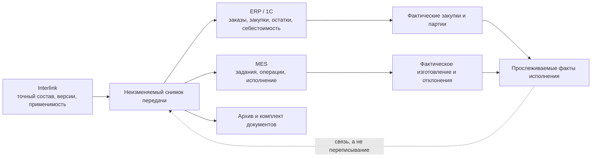

# MRP, ERP/MES и длительные операции

> Описан целевой интеграционный процесс по состоянию на 6 сентября 2026 года. Возможности конкретной ERP/MES и соединителя необходимо подтверждать испытаниями.

## Где заканчивается заказный контур Interlink

Interlink определяет точный, версионный и объяснимый состав заказа. Он не должен становиться второй ERP или MES.

- **MRP** — расчёт потребности в материалах и компонентах с учётом сроков, запасов и правил обеспечения.
- **ERP** — система планирования и учёта ресурсов предприятия, например 1С.
- **MES** — система управления исполнением производства в цехе.

Эти сокращения используются потому, что привычны специалистам отрасли. В продуктовой модели важно не название системы, а ответственность за данные.

## Валовая и обеспеченная потребность

Из точного состава Interlink может получить **валовую потребность**: сколько деталей и материалов требуется без учёта склада и уже размещённых закупок. Например, десять редукторов требуют двадцать подшипников определённого исполнения.

**Обеспеченная потребность** отвечает на следующий вопрос: сколько нужно заказать или изготовить после учёта остатков, резервов, незавершённого производства, сроков и других заказов. Обычно это ответственность ERP/MRP.

Документы не должны обещать, что Interlink самостоятельно выполнит полный складской взаимозачёт или календарное планирование. Он передаёт точную исходную потребность и принимает обратно связанные факты.

## Расчёт количества

Для внешней передачи количество должно объясняться по пути состава:

- количество на непосредственной позиции;
- накопленное количество внутри ветви;
- количество верхнего изделия в заказе;
- итоговая потребность всего заказа;
- единица измерения и правила округления.

Если один подшипниковый узел содержит два подшипника, редуктор содержит два узла, а заказ требует десять редукторов, валовая потребность равна 2 × 2 × 10 = 40 подшипников. Отчёт должен позволить восстановить этот расчёт.

## Передача наружу

Существенная интеграция начинается с точного снимка, а не с чтения «текущего заказа» во время каждого повторения. Передаваемое сообщение содержит:

- назначение и получателя;
- исходный снимок;
- позиции, количества и точные версии;
- требуемые маршруты, нормы и документы;
- устойчивый номер передачи для сверки результата и, если это предусмотрено договором интеграции, защиты от дублей;
- версию формата данных;
- время и автора запуска.

Если сеть оборвалась, принимающее приложение сохраняет прежнее намерение и устанавливает его исход. Повтор без риска дубля допустим при доказанной защите от повторного выполнения у получателя либо достоверно установленном отсутствии прежнего эффекта. Если договор получателя уже гарантирует повторяемую обработку одной команды, повтор может опираться на эту гарантию; отдельный предварительный поиск не является самоцелью. Сам по себе номер передачи ничего этого не гарантирует.

Нужно различать новую попытку отправить прежнее задание и новое деловое задание. «Второй раз отправить заказ на четыре насоса» не означает «изготовить ещё четыре». Полная передача, добавочная потребность, замена прежнего задания и его отмена имеют разные договорённости с получателем; их нельзя угадывать по знаку количества или имени файла.

## Как выпуск защищается от потери передачи

Когда официальное действие должно одновременно опубликовать комплект, назначить количество и поставить его на отправку, эти локальные результаты сохраняются вместе с подтверждением операции и обязательным журналом. Это требование действует независимо от того, кто управляет записью — Interlink или принимающий продукт. Нельзя сначала сообщить «заказ выпущен», а затем надеяться, что последующая отдельная запись задания доставки обязательно успеет выполниться.

После успешной локальной фиксации отдельный исполнитель передаёт уже определённое содержание наружу. Долгая отправка не удерживает редактирование всего заказа. Если ответ потерян, пользователь видит «результат передачи неизвестен», а не ложный откат опубликованного заказа. Истёкшее время ожидания или смена исполнителя не доказывают, что внешнего задания нет. Создать новое намерение с новым номером, чтобы обойти неопределённость, нельзя.

## Ответ внешней системы

ERP/MES может вернуть:

- номер внешнего заказа или задания;
- состояние приёма: принято полностью, принято частично, отклонено либо исход неизвестен;
- отклонённые записи и понятные причины;
- назначенные производственные партии;
- фактические количества и даты;
- серийные номера;
- применённые партии материалов;
- разрешённые отклонения и результаты операций.

Принимающий продукт связывает ответ с исходной передачей и ведёт состояние доставки и приёма; это отдельная предметная история, а не статус пакета изменения или снимка. Она может храниться в модели предприятия поверх Interlink. Ответ дополняет историю исполнения, но не редактирует снимок «как заказано». При частичном приёме пользователь видит принятые и отклонённые позиции, причину и следующее действие: исправить справочник, подготовить исправляющую передачу, согласовать отдельное распределение количества или выполнить сверку. Выбор действия определяется договором интеграции, а не скрытым автоматическим повтором.

Частичный ответ может различаться и внутри одной строки. Из четырёх насосов три приняты, а четвёртый окончательно отклонён, ожидает уточнения или имеет неизвестный исход. Это разные состояния. Ожидание и неизвестность не освобождают количество для другого завода. Повтор подтверждения «принято три» не становится приёмом шести; исправленный ответ «принято два» сохраняется как связанное исправление с причиной, не стирая прежнего сообщения.

Если достоверный ответ сообщает о пяти насосах для задания на четыре, факт нельзя потерять только потому, что он не укладывается в план. Система сохраняет свидетельство и показывает превышение, но не увеличивает разрешённый объём автоматически. Устранение такого несоответствия требует отдельного предметного решения.

## Длительные операции

Большой заказ может содержать сотни тысяч позиций и документов. Раскрытие состава, формирование комплекта файлов и передача во внешнюю систему не должны выглядеть как зависшее окно.

Если принимающее приложение реализует отдельное рабочее место длительных операций, в целевом варианте пользователю полезны:

- видимый этап: анализ состава, проверка документов, построение отчёта, передача;
- доступный показатель обработанного объёма, когда его можно достоверно рассчитать;
- промежуточные предупреждения;
- возможность прекратить локальное ожидание или отменить ещё не опубликованную работу с понятным последствием;
- итоговый протокол;
- сверка неизвестного исхода и повтор только по явно согласованному договору с внешней системой.

Отмена до завершения не должна оставлять наполовину опубликованный снимок. Если внешняя система уже приняла сообщение, отмена локального ожидания не означает отмену внешнего заказа: требуется отдельная согласованная операция.

## Пример 1. Отчёт для 1С на шкафы управления

Заказ содержит пять шкафов. Interlink раскрывает точный состав и рассчитывает валовую потребность: аппараты, клеммы, кабель и трудовые нормы. На основании снимка формируется сообщение для 1С.

1С учитывает складские остатки и размещённые закупки, создаёт внутренние заказы и возвращает их номера. После сбоя соединитель действует по проверенному договору: либо безопасно повторяет ту же команду с гарантированной защитой от дубля, либо сначала достоверно устанавливает её исход. Без таких оснований автоматический повтор запрещён, поскольку один номер сам по себе не исключает второй заказ.

## Пример 2. MES и фактическое изготовление редукторов

MES получает точный состав десяти редукторов, маршруты и версии документов. Во время сборки она назначает заводские номера и сообщает фактические партии подшипников.

Для одного экземпляра разрешена замена датчика. Само разрешение ещё не меняет родословную: после подтверждённой установки MES передаёт фактический датчик, место, время и результат проверки. Только принятый факт установки влияет на состав «как изготовлено». Исходный снимок заказа остаётся прежним.

## Пример 3. Крупная сборочная линия

Пакет линии включает несколько станций, ограждения, роботов, кабельные трассы и тысячи документов. Подготовка занимает десятки минут.

Принимающее приложение показывает текущую операцию и доступные промежуточные сведения; точный процент выводится только там, где общий объём действительно известен. Обнаруженная ошибка в обязательной схеме останавливает публикацию целиком. После исправления новая попытка создаёт снимок только по полностью согласованному результату; возможность повторно использовать промежуточные вычисления зависит от реализации и не является обещанием ядра.

## Пример 4. Частичный отказ внешней системы

ERP принимает изделие и материалы, но отклоняет одну позицию из-за неизвестной единицы измерения. Принимающий продукт сохраняет состояние «принято частично», а не помечает передачу полностью успешной. В протоколе видны принятые и отклонённые части, причина и требуемое действие.

Если справочник исправлен на стороне ERP и исходное сообщение не меняется, возможен предусмотренный договором повтор того же намерения. Если нужно изменить содержание сообщения, подготавливается отдельная исправляющая команда с явной связью с прежней передачей и её принятой областью. Старый номер нельзя использовать для незаметно изменённого задания. В обоих случаях уже принятые позиции не учитываются повторно; до решения пользователь видит состояние «принято частично» и конкретное следующее действие.

## Пример 5. Ответ потерян при уменьшении заказа

Заказ на десять насосов разделён так: шесть подтверждённо приняты заводом А, два направлены кооператору без достоверного ответа, два ещё не назначены. Заказчик уменьшает потребность до восьми. После согласования изменения свободный остаток равен нулю: неизвестные два продолжают занимать свою область. Новый опубликованный заказ не обнуляет историю передач. Только подтверждённый отказ или разрешённая отмена могут стать основанием перераспределения.

## Нормы и справочники при обмене

В состав сообщения входят не только итоговые числа. Для проверки расчёта сохраняется, какая редакция справочника сортамента, таблица норм, формула и правило округления использовались. Например, ERP получает расход трубы на двадцать рам, а технолог способен объяснить его по точной массе метра из справочника. Исправление справочника завтра не пересчитывает вчерашнюю передачу.

Сам файл обмена остаётся формой передачи. [[Справочные таблицы|Reference-tables]] и [[координатные карты|Coordinate-maps]] позволяют искать исходные данные внутри системы, но чтение новой строки не запускает автоматически обновление карточек или внешних заданий. Такая синхронизация оформляется отдельной проверяемой операцией.

## Владение данными

| Данные | Обычный владелец |
|---|---|
| Версии изделий, состав, применимость, точный снимок | Interlink и принимающая PLM-система |
| Коммерческий заказ, цена, платёж, отгрузка | ERP или сбытовая система |
| Остатки, резервы, закупки, календарная потребность | ERP/MRP |
| Цеховые задания, выполнение операций, простои | MES |
| Серийные номера и фактическая родословная | Совместный производственный контур; владелец согласуется |
| Подписи и маршруты согласования | Принимающая PLM-система или корпоративная служба |
| Очередь отправки, состояние доставки, приём и сверка | Принимающий продукт и его интеграционный модуль |

## Открытые вопросы

- Какая система является владельцем номера производственного заказа?
- Передаёт ли Interlink валовую потребность или уже агрегированный производственный состав?
- Где выполняются складской взаимозачёт и календарный расчёт?
- Какая система создаёт экземпляры и партии?
- Как обрабатывается частичный приём сообщения?
- Как отменяется уже принятый внешний заказ?
- Какие форматы 1С, ERP и MES обязательны для первой интеграции?

## Критерии приёмки

1. Внешняя передача всегда связана с точным снимком.
2. Если интеграция заявляет безопасный повтор, её договор явно определяет устойчивый номер, сверку неизвестного исхода и защиту от дубля у получателя.
3. Валовая потребность объясняется по пути и количеству заказа.
4. Остатки и календарное планирование не приписываются ядру без отдельного модуля.
5. Частичный отказ виден и не считается полным успехом.
6. Если для длительной операции предусмотрено рабочее место, оно показывает подтверждённые этапы, текущую операцию и известные причины задержки; публикация снимка остаётся целостной и не оставляет частичного результата.
7. Факты ERP/MES дополняют историю, не переписывая «как заказано».
8. Обязательное задание доставки, журнал и подтверждение локального выпуска сохраняются вместе; неизвестный исход не обходится новым номером команды.
9. Частичный приём учитывается по точной области и количеству; повтор ответа не удваивает результат, исправление сохраняет предыдущие свидетельства.
10. Неизвестный приём не освобождает количество, а разрешение замены не выдаётся за установку.

## Состояние реализации

Архитектура Interlink предусматривает размещение длительных операций и интеграционных процессов в принимающей системе. Полный расчёт потребностей, обмен с 1С, ERP и MES, надёжная доставка и возврат фактов не реализованы в текущем опытном образце и требуют отдельных договоров интеграции.

## Связанные документы

- [[Точный состав передачи|Order-exact-publication]]
- [[Производственные ведомости и отчёты|Order-production-documents]]
- [[Экземпляры и фактический состав|Order-units-lots-as-built]]
