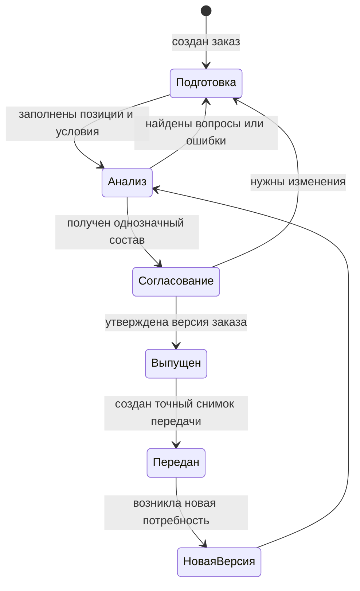

# Жизненный цикл живого заказа

## Главный принцип

Заказ в Interlink — не одноразовая печатная форма и не навсегда застывший набор ссылок. Это версионируемый предметный объект предприятия, который проходит уточнение, согласование, выпуск и последующие изменения.

Пока специалисты готовят следующую версию, заказ может учитывать актуальные разрешённые версии изделий и документов. После передачи результата создаётся отдельный неизменяемый снимок. Поэтому развитие заказа и доказательство прошлой передачи не конфликтуют.

Названия состояний на предприятии могут отличаться. Процесс согласования задаёт принимающая PLM-система, а Interlink хранит версии, состав, основания решений и связи со снимками.

## Этап 1. Создание и уточнение

Автор создаёт заказ, добавляет позиции, количества, комплектации и предметные примечания. Коммерческие данные — заказчик, договор, цена, срок отгрузки — могут находиться в корпоративном расширении или ERP. Ядро Interlink не требует их как обязательной части каждого заказа.

На этом этапе заказ ещё не обещает готовность производства. В нём могут оставаться незаполненные признаки, несколько допустимых версий или необходимость выбрать маршрут.

## Этап 2. Рабочее изменение

Изменения выполняются в рабочем пакете — ограниченной рабочей области, где собраны создаваемые и изменяемые версии. Он позволяет специалисту одновременно подготовить новую версию изделия, документа и заказа, а также временно предпочесть именно эти версии при проверке результата.

Для продуктового пользователя это означает: можно увидеть будущий состав до общего выпуска, не делая незавершённые версии видимыми остальным потребителям.

Рабочий пакет не является состоянием жизненного цикла изделия. «В работе», «на согласовании» и «выпущено» — состояния процесса предприятия. Рабочий пакет лишь определяет границу совместного изменения и предпочтения версий.

## Этап 3. Формирование и проверка состава

Система последовательно учитывает:

- позиции заказа и количества;
- выбранные комплектации и опции;
- применимость изделий и документов;
- допустимые варианты, аналоги и замены;
- предпочтения версий;
- маршрут и технологические данные, если они требуются для передачи.

Результат сопровождается объяснениями. Ошибка блокирует выпуск, предупреждение требует внимания, а несколько равноправных допустимых вариантов образуют вопрос, который должен решить пользователь или утверждённая политика предприятия.

## Этап 4. Выпуск версии заказа

После согласования создаётся выпущенная версия заказа. Она сохраняет состав позиций и принятые заказные решения. Выпуск не обязан автоматически создавать точное изделие и не превращает заказ в производственную ведомость.

Важно различать две фиксации:

- выпущенная версия подтверждает состояние самого заказа;
- снимок передачи подтверждает полный точный состав, отданный конкретному получателю с конкретной целью.

## Этап 5. Передача и дальнейшее развитие

Для производства, 1С, архива или другого существенного получателя формируется свой снимок. После этого заказ может получить новую версию: изменить количество, комплектацию, допустимую замену или состав поставки. Новый результат передаётся новым снимком, а прежний остаётся доступен без пересчёта.

## Что значит «живой» заказ

Живой заказ может читать актуальные инженерные данные в явно заданных условиях: на дату, для серии, предприятия или другого согласованного контекста. Однако это не означает бесконтрольную смену состава при каждом открытии.

Пользователь должен видеть:

- на основании каких условий построен результат;
- что изменилось после предыдущего расчёта;
- какие решения были сохранены явно;
- какие новые версии появились;
- требуется ли подтверждение перед повторной передачей.

Иными словами, актуальность служит планированию, а снимок — воспроизводимости.

## Дата поставки и дата применимости

Срок, обещанный заказчику, не равен автоматически дате применимости конструкторской версии. Первая дата относится к коммерческому или производственному плану. Вторая отвечает на вопрос, какая версия изделия допустима при заданных условиях.

Предприятие может установить правило, связывающее их, но связь должна быть явной. Иначе перенос срока поставки способен незаметно заменить состав изделия.

## Пример 1. Увеличение заказа на редукторы

Первая выпущенная версия содержит 10 редукторов и передана в производство. Через неделю заказчик увеличивает количество до 12.

Специалист создаёт новую версию заказа, меняет количество и повторно проверяет потребности. Первый снимок продолжает содержать 10 редукторов. Новый снимок содержит 12 либо только добавочную потребность в 2 штуки — выбор между полной и добавочной передачей должен быть установлен политикой предприятия.

## Пример 2. Новая версия покупного подшипника

Пока заказ на насосы планировался, служба снабжения разрешила новую версию подшипника с изменённым поставщиком. Живой заказ обнаруживает новый допустимый вариант и показывает отличие.

Если производству ещё ничего не передавали, специалист может принять новую версию в текущей подготовке. Если первая партия уже передана, старый снимок не меняется; для оставшейся части оформляется новая версия заказа и новый снимок.

## Пример 3. Совместное изменение изделия и заказа

Для обрабатывающего центра конструктор добавляет усиленный кронштейн, технолог меняет маршрут сварки, а менеджер уточняет количество комплектов оснастки. Все изменения готовятся в одной рабочей области.

До выпуска участники видят согласованный будущий результат. Если конструкторская версия не прошла согласование, заказ не должен ссылаться на неё как на общедоступную выпущенную версию. После совместного утверждения создаётся новая версия заказа и точный снимок передачи.

## Пример 4. Перенос срока без изменения изделия

Поставка двух станков перенесена с марта на май. Если дата поставки хранится в ERP и не участвует в применимости, инженерный состав не меняется. Если предприятие использует месяц изготовления для выбора версии узлов, система показывает возможное изменение и требует повторной проверки. Скрытый автоматический пересчёт недопустим.

## Открытые вопросы

- Какие состояния заказа обязательны для конкретной установки IPS?
- Где находятся заказчик, договор, сроки, цена, отгрузка и состояние оплаты?
- По какому событию создаётся новая версия заказа?
- Передаётся полный новый состав или только разница с предыдущей передачей?
- Какие изменения требуют повторного согласования и подписи?
- Когда живой заказ предпочитает актуальную версию, а когда сохраняет ранее выбранную?

## Критерии приёмки

1. Незавершённые изменения можно проверить вместе до выпуска.
2. Пользователь отличает рабочую область изменения от состояния согласования.
3. Новая инженерная версия не меняет молча ранее переданный состав.
4. Каждая существенная передача связана с конкретной версией заказа.
5. Повторный расчёт показывает отличия и причины.
6. Перенос срока не меняет инженерный состав без явного правила применимости.
7. Из истории понятно, кто, когда и почему выпустил новую версию.

## Состояние реализации

Версионируемый заказ, рабочий пакет изменения и отдельный снимок передачи закреплены в целевой архитектуре. Полный процесс выпуска заказа, сравнение пересчётов и связь с корпоративным маршрутом согласования относятся к последующим этапам и к принимающей PLM-системе.

## Связанные документы

- [Версии, изменения и снимки](Changes-and-evidence)
- [Точный состав и публикации заказа](Order-exact-publication)
- [Перепланирование и отклонения](Order-replanning)
