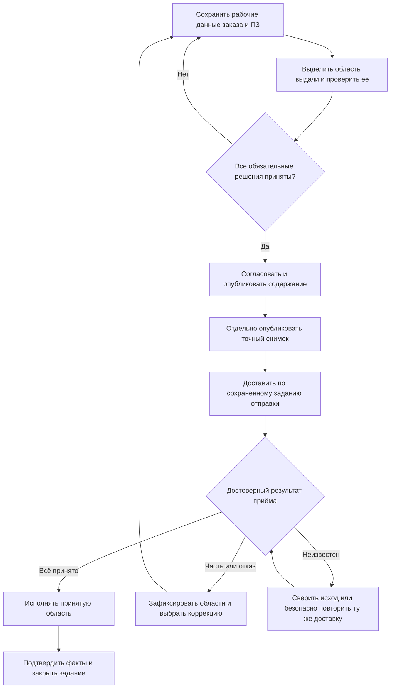

# Жизненный цикл живого заказа

## Главный принцип

Инженерное содержание заказа в Interlink — не одноразовая печатная форма и не навсегда застывший набор ссылок. Оно может быть версионируемым предметным объектом. Процессный жизненный цикл производственного заказа — подготовка, запуск, исполнение и закрытие — принадлежит принимающему продукту, обычно ERP/MES.

Пока специалисты готовят следующее содержание заказа, он может учитывать актуальные разрешённые версии изделий и документов. Рабочие правки сохраняются без публикации. Затем происходят четыре раздельных события: публикуется точное состояние инженерной версии заказа, отдельным решением публикуется неизменяемый снимок, снимок доставляется внешней системе, а получатель сообщает результат приёма. Поэтому развитие заказа, доказательство прошлой передачи и состояние внешней доставки не смешиваются.

Это путь пользователя между разными объектами, а не один список состояний одного заказа. Сначала сохраняется рабочая подготовка, затем проверяется область выдачи; публикация содержания, снимок, доставка и приём остаются разными событиями. Частичный приём допускает исполнение только подтверждённой области по правилам предприятия. При неизвестном исходе количество не освобождается. Перепланирование возвращает нужные правки в подготовку, не переписывая предыдущую передачу.

## Этап 1. Создание и уточнение

Автор создаёт заказ, добавляет позиции, количества, комплектации и предметные примечания. Коммерческие данные — заказчик, договор, цена, срок отгрузки — могут находиться в корпоративном расширении или ERP. Ядро Interlink не требует их как обязательной части каждого заказа.

На этом этапе заказ ещё не обещает готовность производства. В нём могут оставаться незаполненные признаки, несколько допустимых версий или необходимость выбрать маршрут.

## Этап 2. Рабочее изменение

Изменения сохраняются в рабочей области. Здесь можно многократно уточнять количество, структуру и документы, не публикуя каждое промежуточное исправление. Пакет изменения собирает именно те правки, которые решено проверить и опубликовать совместно: например, новое содержание кронштейна, инструкции и заказа. Пакет не является всей рабочей областью и не обязан включать каждую начатую в ней работу.

[[Контекст подбора|Selection-contexts]] отдельно задаёт, какие версии предпочитать при проверке будущего результата. Он может использоваться несколькими рабочими областями и переживать отдельный пакет. Постоянное мягкое предпочтение позиции также не исчезает только потому, что пакет завершён.

Для продуктового пользователя это означает: можно увидеть будущий состав до общего выпуска, не делая незавершённые версии видимыми остальным потребителям.

Пакет изменения не является состоянием жизненного цикла изделия. «В работе», «на согласовании» и «допущено в производство» — состояния процесса предприятия. Пакет определяет границу совместной публикации; контекст — условия подбора; рабочая область — место незавершённых правок.

## Этап 3. Формирование и проверка состава

Система последовательно учитывает:

- позиции заказа и количества;
- выбранные комплектации и опции;
- применимость изделий и документов;
- допустимые варианты, аналоги и замены;
- предпочтения версий;
- маршрут и технологические данные, если они требуются для передачи.

Результат сопровождается объяснениями. Ошибка блокирует выпуск, предупреждение требует внимания, а несколько равноправных допустимых вариантов образуют вопрос, который должен решить пользователь или утверждённая политика предприятия.

При этом рабочий ПЗ разрешено сформировать и сохранить с ещё не выбранными заменителями и маршрутами. Это не готовая выдача. Перед передачей выбирают конкретную область количества и требуют однозначности в ней. Проверяется не только список опций, но и совместимость окончательно выбранного содержания версий, маршрутов и ресурсов. Разрешение аналога, принадлежащее исходной версии, читают после установления этой версии, а не берут из произвольного общего списка.

## Этап 4. Выпуск версии заказа

После согласования публикуется неизменяемое состояние выбранной инженерной версии заказа. Если предприятие различает версии А и Б как самостоятельные ступени развития, переход к Б оформляется отдельным решением. Для исправления содержания версии А не обязательно заводить Б: может быть опубликовано следующее состояние А. Выпуск не создаёт точное изделие автоматически и не превращает заказ в производственную ведомость.

Важно различать две фиксации:

- опубликованное состояние подтверждает точное содержание самого заказа;
- снимок передачи подтверждает полный точный состав, отданный конкретному получателю с конкретной целью.

## Этап 5. Передача и дальнейшее развитие

Для производства, ERP, архива или другого существенного получателя отдельным решением публикуется снимок одной точной передачи. Только после подтверждённой публикации начинается внешняя доставка. Её состояние ведёт принимающий продукт: он сохраняет получателя, задание отправки и ответ внешней системы. Если задание отправки является обязательной частью выдачи, оно, предметный результат и подтверждение операции сохраняются согласованно — всё целиком либо ничего. Это требование действует независимо от того, какой участник управляет локальной фиксацией. Откладывать обязательную запись отправки «на потом» нельзя: сбой в этом промежутке потерял бы передачу.

Одно точное состояние инженерного заказа может иметь несколько снимков самостоятельных передач. Повтор отправки той же передачи использует прежний снимок и не создаёт новый только из-за потери ответа.

Результат приёма не сводится к одному признаку успеха:

| Исход | Действие принимающего продукта |
|---|---|
| Принято полностью | Сохранить внешний номер и перейти к исполнению |
| Принято частично | Зафиксировать принятые и отклонённые позиции, причину и предусмотренное договором действие: исправляющую передачу, отдельное распределение количества, отмену либо сверку |
| Отклонено | Не продолжать исполнение; исправить данные или полномочия и оформить новую либо исправляющую передачу |
| Исход неизвестен | Сверить результат по устойчивому номеру либо повторить ту же операцию по доказанному договору защиты от дублей; не создавать новое задание вслепую |

Повтор без риска дубля допустим только при явном договоре ERP/MES о повторяемой обработке. Сам устойчивый номер такой гарантии не даёт. Неизвестный исход не означает откат и не освобождает назначенное количество: ERP могла уже принять его, даже если ответ потерян.

Изменение количества, комплектации, допустимой замены или состава поставки проходит рабочую правку и публикацию нового состояния либо отдельное деловое распределение принимающего продукта. Новая инженерная версия нужна лишь по принятому предметному правилу. Новый передаваемый результат получает новый снимок, а прежний доступен без пересчёта в пределах установленного срока хранения и обязательств архива. Закрытие или отмена задания не является командой удаления его истории.

## Что значит «живой» заказ

Живой заказ может читать актуальные инженерные данные в явно заданных условиях: на дату, для серии, предприятия или другого согласованного контекста. Однако это не означает бесконтрольную смену состава при каждом открытии.

Пользователь должен видеть:

- на основании каких условий построен результат;
- что изменилось после предыдущего расчёта;
- какие решения были сохранены явно;
- какие новые версии появились;
- требуется ли подтверждение перед повторной передачей.

Иными словами, актуальность служит планированию, а снимок — воспроизводимости.

## Дата поставки и дата применимости

Срок, обещанный заказчику, не равен автоматически дате применимости конструкторской версии. Первая дата относится к коммерческому или производственному плану. Вторая отвечает на вопрос, какая версия изделия допустима при заданных условиях.

Предприятие может установить правило, связывающее их, но связь должна быть явной. Иначе перенос срока поставки способен незаметно заменить состав изделия.

## Пример 1. Увеличение заказа на редукторы

Первая выпущенная версия содержит 10 редукторов и передана в производство. Через неделю заказчик увеличивает количество до 12.

Специалист открывает рабочее содержание заказа, меняет количество и повторно проверяет потребности. После согласования публикуется новое состояние; нужна ли также новая инженерная версия, определяет правило предприятия. Первый снимок остаётся свидетельством передачи десяти редукторов. Передача полного плана на двенадцать должна явно заменять прежний план, а не добавлять двенадцать к десяти. Добавочная передача двух штук возможна только после того, как принимающий продукт оформил отдельную область и количественное основание; снимок сам не вычисляет «остаток» заказа.

## Пример 2. Новая версия покупного подшипника

Пока заказ на насосы планировался, служба снабжения разрешила новую версию подшипника с изменённым поставщиком. Живой заказ обнаруживает новый допустимый вариант и показывает отличие.

Если производству ещё ничего не передавали, специалист может принять новую версию подшипника в текущей подготовке. Если первая партия уже передана, старый снимок не меняется; для оставшейся части сначала оформляются новое опубликованное состояние заказа или отдельное распределение принимающего продукта, затем отдельным решением создаётся новый снимок. Новая инженерная версия заказа не обязательна при каждой такой правке.

## Пример 3. Совместное изменение изделия и заказа

Для обрабатывающего центра конструктор добавляет усиленный кронштейн, технолог меняет маршрут сварки, а менеджер уточняет количество комплектов оснастки. Все изменения готовятся в одной рабочей области.

До выпуска участники видят согласованный будущий результат. Если конструкторское содержание не прошло нужный допуск, заказ не должен выдавать его за разрешённое производственное основание. После совместного утверждения публикуются выбранные состояния участников. Отдельная явно разрешённая операция создаёт точный снимок передачи; обе фиксации могут быть объединены в одно пользовательское действие без смешения их смысла.

## Пример 4. Перенос срока без изменения изделия

Поставка двух станков перенесена с марта на май. Если дата поставки хранится в ERP и не участвует в применимости, инженерный состав не меняется. Если предприятие использует месяц изготовления для выбора версии узлов, система показывает возможное изменение и требует повторной проверки. Скрытый автоматический пересчёт недопустим.

## Открытые вопросы

- Какие состояния заказа обязательны для конкретной установки IPS?
- Где находятся заказчик, договор, сроки, цена, отгрузка и состояние оплаты?
- По какому событию создаётся новая версия заказа?
- Передаётся полный новый состав или только разница с предыдущей передачей?
- Какие изменения требуют повторного согласования и подписи?
- Когда живой заказ предпочитает актуальную версию, а когда сохраняет ранее выбранную?

## Критерии приёмки

1. Незавершённые изменения можно проверить вместе до выпуска.
2. Пользователь отличает рабочую область изменения от состояния согласования.
3. Новая инженерная версия не меняет молча ранее переданный состав.
4. Каждая существенная передача связана с конкретной версией заказа.
5. Повторный расчёт показывает отличия и причины.
6. Перенос срока не меняет инженерный состав без явного правила применимости.
7. Из истории понятно, кто, когда и почему выпустил новую версию.
8. Полный, частичный, отклонённый и неизвестный исходы внешнего приёма имеют разные видимые действия.
9. Состояние внешней доставки принадлежит принимающему продукту, а безопасный повтор допускается только по явному договору интеграции.

## Состояние реализации

Версионируемый заказ, независимые рабочие области и контексты, совместная публикация и отдельный снимок передачи закреплены в целевой архитектуре. Полный процесс выпуска заказа, сравнение пересчётов и связь с корпоративным маршрутом согласования относятся к последующим этапам и к принимающей PLM-системе.

## Связанные документы

- [[Версии, изменения и снимки|Changes-and-evidence]]
- [[Точный состав и публикации заказа|Order-exact-publication]]
- [[Перепланирование и отклонения|Order-replanning]]
